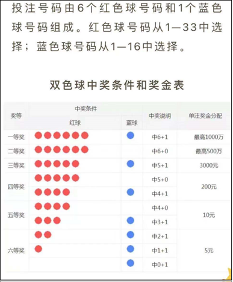

# Java基本语法
<!-- more -->

## 1 JAVA发展和JDK

### 1.1 Java语言背景了解

::: tip
Java语言是美国Sun公司（Stanford University Network）在1995年推出的计算机语言

Java之父：[詹姆斯·高斯林](https://www.maigoo.com/mingren/24155.html)（James Gosling）

2009年，Sun公司被[甲骨文公司](https://www.oracle.com/)收购
:::

### 1.2 Java的主要特性

* 面向对象
* 安全性
* 多线程
* 简单易用
* 开源
* 跨平台

### 1.3 常见的CMD命令如下

| 操作               | 说明                              |
| ------------------ | --------------------------------- |
| 盘符名称:          | 盘符切换。**E:回车**，表示切换到E盘。 |
| **dir**                | 查看当前路径下的内容。            |
| cd 目录            | 进入单级目录。cd javajdk          |
| cd ..              | 回退到上一级目录。                |
| cd 目录1\目录2\\... | 进入多级目录。cd javajdk\jdk11   |
| cd \               | 回退到盘符目录。                  |
| **cls**               | 清屏。                            |
| **exit**             | 退出命令提示符窗口。              |

### 1.4 JDK的目录介绍

| 目录名称 | 说明                                                         |
| -------- | ------------------------------------------------------------ |
| bin      | 该路径下存放了JDK的各种工具命令。javac和java就放在这个目录。 |
| conf     | 该路径下存放了JDK的相关配置文件。                            |
| include  | 该路径下存放了一些平台特定的头文件。                         |
| jmods    | 该路径下存放了JDK的各种模块。                                |
| legal    | 该路径下存放了JDK各模块的授权文档。                          |
| lib      | 该路径下存放了JDK工具的一些补充JAR包。                       |

### 1.5 JDK、JRE和JVM

::: tip  
JVM（Java Virtual Machine），Java虚拟机

JRE（Java Runtime Environment），Java运行环境，包含了JVM和Java的核心类库（Java API）

JDK（Java Development Kit）称为Java开发工具，包含了JRE和开发工具

:::

## 2 JAVA基础语法

### 2.1 Java语言数据类型的分类

* 基本数据类型
* 引用数据类型（面向对象）

### 2.2 基本数据类型的四类八种

| 数据类型 | 关键字  | 内存占用 |                 取值范围                  |
| :------: | :-----: | :------: | :---------------------------------------: |
|   整数   |  byte   |    1     |    -128~127   |
|          |  short  |    2     | -32768~32767 |
|          |   int   |    4     |        -2147483648~2147483647        |
|          |  long   |    8     |        -9223372036854775808~9223372036854775807        |
|  浮点数  |  float  |    4     |        1.401298e-45 ~ 3.402823e+38        |
|          | double  |    8     |      4.9000000e-324 ~ 1.797693e+308       |
|   字符   |  char   |    2     |                  0-65535                  |
|   布尔   | boolean |    1     |                true，false                |

**注意点**：

  如果要定义一个**long**类型的变量，那么在数据值的后面需要加上**L**后缀。（建议大写）

  如果要定义一个**float**类型的变量，那么在数据值的后面需要加上**F**后缀。

### 2.3 标识符

#### 2.3.1 硬性要求

 必须要这么做，否则代码会报错。

* 必须由 **数字、字母、下划线_、美元符号$** 组成。
* 数字不能开头
* 不能是关键字
* 区分大小写的。

#### 2.3.2 软件建议

​   如果不这么做，代码不会报错，但是会让代码显得比较low。

**小驼峰命名法**：

适用于 **变量名和方法名**

* 如果是一个单词，那么全部小写，比如：name

* 如果是多个单词，那么从第二个单词开始，首字母大写，比如：firstName、maxAge

**大驼峰命名法**：

适用于 **类名**

* 如果是一个单词，那么首字母大写。比如：Demo、Test。

* 如果是多个单词，那么每一个单词首字母都需要大写。比如：HelloWorld

不管起什么名字，都要做到**见名知意**。

## 3 运算符和表达式

### 3.1 两种提升规则

* 取值范围小的，和取值范围大的进行运算，小的会先提升为大的，再进行运算。
* **byte、short、char三种类型的数据在运算的时候，都会直接先提升为int，然后再进行运算。**

### 3.2 取值范围从小到大的关系

byte < short < int < long < float < double

### 3.3 强制转换

> 目标数据类型 变量名 = （目标数据类型）被强转的数据；
>
> double sum = (int) 100.99;

强制转换有可能会导致数据发生错误。**（数据的精度丢失）**

### 3.4 扩展赋值运算符

**注意点:** 扩展的赋值运算符中隐层还包含了一个强制转换。

a += b; 实际上相当于 a = (byte)(a + b);

```java
public class OperatorDemo8 {
    public static void main(String[] args) {
        byte a = 10;
        byte b = 20;
        //a += b;
        a = (byte)(a + b);
        System.out.println(a);//30
    }
}
```

## 4 流程控制语句

### 4.1 switch的扩展知识

1. default的位置和省略情况

    * default可以放在任意位置，也可以省略

2. case穿透

    * 不写break会引发case穿透现象

**switch在JDK12的新特性**：

```java
int number = 10;
switch (number) {
    case 1 -> System.out.println("一");
    case 2 -> System.out.println("二");
    case 3 -> System.out.println("三");
    default -> System.out.println("其他");
}
```

**switch和if的使用场景**：

当我们需要对一个范围进行判断的时候，用if

当我们把有限个数据列举出来，选择其中一个执行的时候，用switch语句

**比如：**

> 小明的考试成绩，如果用switch，那么需要写100个case，太麻烦了，所以用if简单。
>
> 如果是星期，月份，客服电话中0~9的功能选择就可以用switch

代码示例：

```java
//1.键盘录入星期数
Scanner sc = new Scanner(System.in);
System.out.println("请输入星期");
int week = sc.nextInt();//3
//2.利用switch进行匹配
----------------------------------------------------
利用case穿透简化代码
switch (week){
    case 1:
    case 2:
    case 3:
    case 4:
    case 5:
        System.out.println("工作日");
        break;
    case 6:
    case 7:
        System.out.println("休息日");
        break;
    default:
        System.out.println("没有这个星期");
        break;
}
----------------------------------------------------
利用JDK12简化代码书写
switch (week) {
    case 1, 2, 3, 4, 5 -> System.out.println("工作日");
    case 6, 7 -> System.out.println("休息日");
    default -> System.out.println("没有这个星期");
}
```

### 4.2 三种循环结构的区别

for和while循环，是**先判断，再执行**。

​do...while是**先执行，再判断**。

​当知道循环次数或者循环范围的时候，用for循环。

​当不知道循环次数，也不知道循环范围，但是知道循环的结束条件时，用while循环

## 5 数组

***数组一旦创建之后，长度不能发生变化。***

### 5.1 完整格式

数据类型[ ] 数组名 = new 数据类型[ ]{元素1，元素2，元素3，元素4...};

int[ ] arr = new int[ ]{11,22,33};

double[ ] arr = new double[ ]{1.1,1.2,1.3};

string[ ] arr = new String[ ]{"aaa","bbb","ccc"};

### 5.2 数组的动态初始化

**格式**：

数据类型[] 数组名 = new 数据类型[数组的长度];

**举例**：

```java
//1.定义一个数组，存3个人的年龄，年龄未知
int[] agesArr = new int[3];

//2.定义一个数组，存班级10名学生的考试成绩，考试成绩暂时未知，考完才知道。
int[] scoresArr = new int[10];
```

**数组的默认初始化值**：

* 整数类型：0
* 小数类型：0.0
* 布尔类型：false
* 字符类型：'\u0000'
* 引用类型：null

## 6 方法

***方法（method）是程序中最小的执行单元***

### 6.1 方法重载

* 概念：

  指同一个类中定义的多个方法之间的关系，满足下列条件的多个方法相互构成重载

  * 多个方法在**同一个类中**
  * 多个方法具有**相同的方法名**
  * 多个方法的参数不相同，**类型不同或者数量不同**

* 注意：

  * 重载仅对应方法的定义，与方法的调用无关，调用方式参照标准格式
  * 重载仅针对同一个类中方法的名称与参数进行识别，与返回值无关，换句话说不能通过返回值来判定两个方法是否相互构成重载

* 正确范例：

```java
  public class MethodDemo {
    public static void fn(int a) {
        //方法体
    }
    public static int fn(double a) {
        //方法体
    }
  }
  
  public class MethodDemo {
    public static float fn(int a) {
        //方法体
    }
    public static int fn(int a , int b) {
        //方法体
    }
  }
```

* 错误范例：

```java
  public class MethodDemo {
    public static void fn(int a) {
        //方法体
    }
    public static int fn(int a) { /*错误原因：重载与返回值无关*/
        //方法体
    }
  }
  
  public class MethodDemo01 {
    public static void fn(int a) {
        //方法体
    }
  } 
  public class MethodDemo02 {
    public static int fn(double a) { /*错误原因：这是两个类的两个fn方法*/
        //方法体
    }
  }
```

## 7 综合练习

### 练习一：双色球

 

代码示例:

```java
package com.demo.test;

import java.util.Random;
import java.util.Scanner;

public class Test1 {
    public static void main(String[] args) {
        //1.生成中奖号码
        int[] arr = createNumber(); // 123456 7

        System.out.println("=======================");
        for (int i = 0; i < arr.length; i++) {
            System.out.print(arr[i] + " ");
        }
        System.out.println("=======================");

        //2.用户输入彩票号码（红球 + 蓝球）//654321
        int[] userInputArr = userInputNumber();

        //3.判断用户的中奖情况
        //红球 蓝球
        int redCount = 0;
        int blueCount = 0;

        //判断红球
        for (int i = 0; i < userInputArr.length - 1; i++) {
            int redNumber = userInputArr[i];
            for (int j = 0; j < arr.length - 1; j++) {
                if(redNumber == arr[j]){
                    redCount++;
                    //如果找到了，那么后面的数字就没有必要继续比较了
                    //跳出内循环，继续判断下一个红球号码是否中奖
                    break;
                }
            }
        }

        //判断蓝球
        int blueNumber = userInputArr[userInputArr.length-1];
        if(blueNumber == arr[arr.length - 1]){
            blueCount++;
        }

        //根据红球的个数以及蓝球的个数来判断中奖情况
        if(redCount == 6 && blueCount == 1){
            System.out.println("恭喜你，中奖1000万");
        }else if(redCount == 6 && blueCount == 0){
            System.out.println("恭喜你，中奖500万");
        }else if(redCount == 5 && blueCount == 1){
            System.out.println("恭喜你，中奖3000");
        }else if((redCount == 5 && blueCount == 0) ||  (redCount == 4 && blueCount == 1)){
            System.out.println("恭喜你，中奖200");
        }else if((redCount == 4 && blueCount == 0) ||  (redCount == 3 && blueCount == 1)){
            System.out.println("恭喜你，中奖10");
        }else if((redCount == 2 && blueCount == 1) ||  (redCount == 1 && blueCount == 1)|| (redCount == 0 && blueCount == 1)){
            System.out.println("恭喜你，中奖5");
        }else{
            System.out.println("谢谢参与，谢谢惠顾");
        }

    }

    public static int[] userInputNumber() {
        //1.创建数组用于添加用户购买的彩票号码
        //6个红球 1个蓝球 数组长度：7
        int[] arr = new int[7];

        //2.利用键盘录入让用户输入
        Scanner sc = new Scanner(System.in);
        //让用户输入红球号码
        for (int i = 0; i < 6; ) {
            System.out.println("请输入第" + (i + 1) + "个红球号码");
            int redNumber = sc.nextInt();
            //redNumber  在1~33  唯一不重复
            if (redNumber >= 1 && redNumber <= 33) {
                boolean flag = contains(arr, redNumber);
                if (!flag) {
                    //不存在
                    //有效的，可以添加到数组当中
                    arr[i] = redNumber;
                    i++;
                } else {
                    //存在
                    System.out.println("当前红球号码已经存在，请重新输入");
                }
            } else {
                System.out.println("当前红球号码超出范围");
            }
        }

        //让用户输入篮球号码
        System.out.println("请输入篮球号码");
        //1~16
        while (true) {
            int blueNumber = sc.nextInt();
            if (blueNumber >= 1 && blueNumber <= 16) {
                arr[arr.length - 1] = blueNumber;
                break;
            } else {
                System.out.println("当前篮球号码超出范围");
            }
        }
        return arr;
    }

    public static int[] createNumber() {
        //1.创建数组用于添加中奖号码
        //6个红球 1个蓝球 数组长度：7
        int[] arr = new int[7];

        //2.随机生成号码并添加到数组当中
        //红球：不能重复的  1 2 3 4 5 6
        //蓝球：可以跟红球号码重复 7

        //生成红球号码并添加到数组当中
        Random r = new Random();
        for (int i = 0; i < 6; ) {
            //获取红球号码
            int redNumber = r.nextInt(33) + 1;
            boolean flag = contains(arr, redNumber);
            if (!flag) {
                //把红球号码添加到数组当中
                arr[i] = redNumber;
                i++;
            }
        }

        //生成蓝球号码并添加到数组当中
        int blueNumber = r.nextInt(16) + 1;
        arr[arr.length - 1] = blueNumber;
        return arr;
    }

    //用于判断数组在数组中是否存在
    public static boolean contains(int[] arr, int number) {
        for (int i = 0; i < arr.length; i++) {
            if (arr[i] == number) {
                return true;
            }
        }
        return false;
    }
}
```

### 练习二：整数存数组

```java
package com.demo.test;

public class Test2 {
    public static void main(String[] args) {
        //需求：
        //把整数上的每一位都添加到数组当中
        //反向推导

        //1.计算出数组的长度
        int number = 12345;
        //定义一个变量临时记录number的值，就是为了第三步的时候再次使用
        int temp = number;
        //定义一个变量进行统计
        int count = 0;
        while(number != 0){
            //每一次循环就去掉右边的一个数字
            number = number / 10;
            //去掉一位计数器就自增一次。
            count++;
        }
        //2.定义数组
        //动态初始化
        int[] arr = new int[count];
        //3.把整数上的每一位都添加到数组当中
        int index = arr.length -1;
        while(temp != 0){//12345
            //获取temp里面的每一位数组
            int ge = temp % 10;
            //再去掉右边的那位数字
            temp = temp / 10;
            //把当前获取到的个位添加到数组当中
            arr[index] = ge;
            index--;
        }
        //验证结果  1  2  3  4 5
        for (int i = 0; i < arr.length; i++) {
            System.out.print(arr[i] + " ");
        }
    }
}
```

### 练习三：验证码

```java
package com.demo.test;

import java.util.Random;

public class Test3 {
    public static void main(String[] args) {
        /*  需求：定义方法实现随机产生一个5位的验证码
            验证码格式：
                长度为5
                前四位是大写字母或者小写字母
                最后一位是数字
        */

        //1.大写字母和小写字母都放到数组当中
        char[] chs = new char[52];
        for (int i = 0; i < chs.length; i++) {
            if(i <= 25){
                chs[i] = (char)(97 + i);
            }else{
                chs[i] = (char)(65 + i - 26);
            }
        }

        String result = "";

        //2.随机抽取4次
        Random r = new Random();
        for (int i = 0; i < 4; i++) {
            int randomIndex = r.nextInt(chs.length);
            result = result + chs[randomIndex];
        }

        //3.随机抽取一个数字0~9
        int number = r.nextInt(10);
        result = result + number;
        System.out.println(result);
    }
}
```
