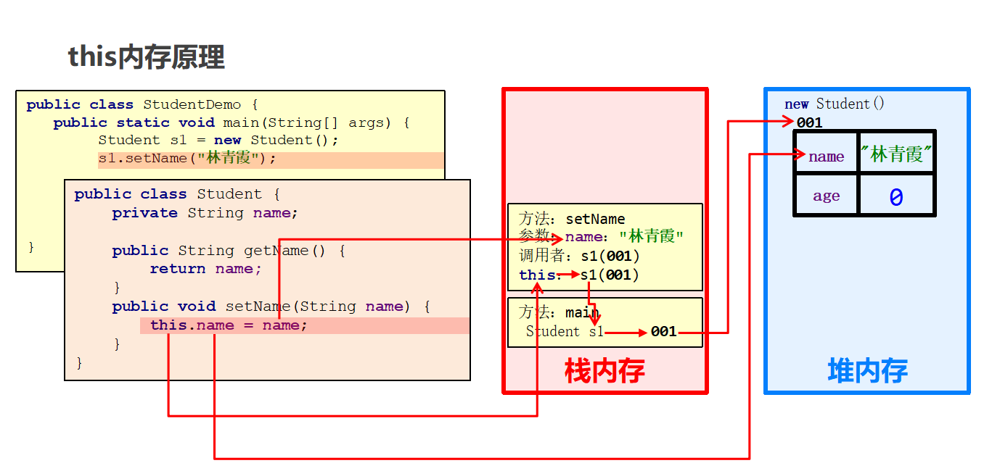

# Java面向对象
<!-- more -->

## 8 类和对象

### 8.1 类和对象的理解

类：类是对现实生活中一类具有共同属性和行为的事物的抽象

对象：客观存在的事物皆为对象 ，所以我们也常常说万物皆对象。

简单理解：**类是对事物的一种描述，对象则为具体存在的事物**

### 8.2 类的定义

类的组成是由**属性**和**行为**两部分组成

* 属性：在类中通过**成员变量**来体现（类中方法外的变量）
* 行为：在类中通过**成员方法**来体现（和方法相比去掉static关键字即可）

### 8.3 对象内存图

#### 单个对象内存图


#### 多个对象内存图


**总结：**

  多个对象在堆内存中，都有不同的内存划分，成员变量存储在各自的内存区域中，成员方法多个对象共用一份。

### 8.4 this内存原理

**注意 :** this代表当前调用方法的引用，哪个对象调用的方法，this就代表哪一个对象

**图解 ：**




### 8.5 封装思想

:::tip 封装概述
是面向对象编程语言对客观世界的模拟，客观世界里成员变量都是隐藏在对象内部的，外界是无法直接操作的  
**对象代表什么，就得封装对应的数据，并提供数据对应的行为**
:::

:::tip 封装原则
将类的某些信息隐藏在类内部，不允许外部程序直接访问，而是通过该类提供的方法来实现对隐藏信息的操作和访问  
成员变量private，提供对应的getXxx()/setXxx()方法
:::

:::tip 封装好处
通过方法来控制成员变量的操作，提高了代码的安全性  
把代码用方法进行封装，提高了代码的复用性
:::

## 9 面对对象综合练习

### 练习一：文字版格斗游戏

需求:
格斗游戏，每个游戏角色的姓名，血量，都不相同，在选定人物的时候（new对象的时候），这些信息就应该被确定下来。

举例：
> 程序运行之后结果为：
>
> 姓名为:乔峰 血量为:100
>
> 姓名为:鸠摩智   血量为:100
>
> 乔峰举起拳头打了鸠摩智一下，造成了XX点伤害，鸠摩智还剩下XXX点血。
>
> 鸠摩智举起拳头打了鸠摩智一下，造成了XX点伤害，乔峰还剩下XXX点血。
>
> 乔峰举起拳头打了鸠摩智一下，造成了XX点伤害，鸠摩智还剩下XXX点血。
>
> 鸠摩智举起拳头打了鸠摩智一下，造成了XX点伤害，乔峰还剩下XXX点血。
>
> 乔峰K.O.了鸠摩智

代码示例：

```java
public class GameTest {
    public static void main(String[] args) {
        Role r1 = new Role("乔峰",100);
        Role r2 = new Role("鸠摩智",100);

        while(true){
            r1.attack(r2);
            if(r2.getBlood() == 0){
                System.out.println(r1.getName() + " K.O了" + r2.getName());
                break;
            }

            r2.attack(r1);
            if(r1.getBlood() == 0){
                System.out.println(r2.getName() + " K.O了" + r1.getName());
                break;
            }

        }
    }
}

public class Role {
    private String name;
    private int blood;

    public Role() {
    }

    public Role(String name, int blood) {
        this.name = name;
        this.blood = blood;
    }

    public String getName() {
        return name;
    }

    public void setName(String name) {
        this.name = name;
    }

    public int getBlood() {
        return blood;
    }

    public void setBlood(int blood) {
        this.blood = blood;
    }

    public void attack(Role role) {
        Random r = new Random();
        int hurt = r.nextInt(20) + 1;

        int remainBoold = role.getBlood() - hurt;
        remainBoold = remainBoold < 0 ? 0 : remainBoold;
        role.setBlood(remainBoold);

        System.out.println(this.getName() + "举起拳头，打了" + role.getName() + "一下，" +
                "造成了" + hurt + "点伤害，" + role.getName() + "还剩下了" + remainBoold + "点血");
    }

}
```

### 练习二：复杂的对象数组操作

> 定义一个长度为3的数组，数组存储1~3名学生对象作为初始数据，学生对象的学号，姓名各不相同。
>
> 学生的属性：学号，姓名，年龄。
>
> 要求1：再次添加一个学生对象，并在添加的时候进行学号的唯一性判断。
>
> 要求2：添加完毕之后，遍历所有学生信息。
>
> 要求3：通过id删除学生信息
>
> >如果存在，则删除，如果不存在，则提示删除失败。
>
> 要求4：删除完毕之后，遍历所有学生信息。
>
>要求5：查询数组id为“Student002”的学生，如果存在，则将他的年龄+1岁

代码示例：

```java

public class Student {
    private int id;
    private String name;
    private int age;

    public Student() {
    }

    public Student(int id, String name, int age) {
        this.id = id;
        this.name = name;
        this.age = age;
    }

    public int getId() {
        return id;
    }

    public void setId(int id) {
        this.id = id;
    }

    public String getName() {
        return name;
    }

    public void setName(String name) {
        this.name = name;
    }

    public int getAge() {
        return age;
    }

    public void setAge(int age) {
        this.age = age;
    }
}
```

```java
public class Test {
    public static void main(String[] args) {
        /*定义一个长度为3的数组，数组存储1~3名学生对象作为初始数据，学生对象的学号，姓名各不相同。
        学生的属性：学号，姓名，年龄。
        要求1：再次添加一个学生对象，并在添加的时候进行学号的唯一性判断。
        要求2：添加完毕之后，遍历所有学生信息。
        */

        Student[] arr = new Student[3];
        Student stu1 = new Student(1, "zhangsan", 23);
        Student stu2 = new Student(2, "lisi", 24);

        arr[0] = stu1;
        arr[1] = stu2;

        Student stu4 = new Student(1, "zhaoliu", 26);

        boolean flag = contains(arr, stu4.getId());
        if(flag){
            System.out.println("当前id重复，请修改id后再进行添加");
        }else{
            int count = getCount(arr);
            if(count == arr.length){
                Student[] newArr = creatNewArr(arr);
                newArr[count] = stu4;
                printArr(newArr);
            }else{
                arr[count] = stu4;
                printArr(arr);

            }
        }
    }

    public static void printArr(Student[] arr){
        for (int i = 0; i < arr.length; i++) {
            Student stu = arr[i];
            if(stu != null){
                System.out.println(stu.getId() + ", " + stu.getName() + ", " + stu.getAge());
            }
        }
    }

    public static Student[] creatNewArr(Student[] arr){
        Student[] newArr = new Student[arr.length + 1];
        for (int i = 0; i < arr.length; i++) {
            newArr[i] = arr[i];
        }
        return newArr;
    }

    public static int getCount(Student[] arr){
        int count = 0;
        for (int i = 0; i < arr.length; i++) {
            if(arr[i] != null){
                count++;
            }
        }
        return count;
    }


    public static boolean contains(Student[] arr, int id) {
        for (int i = 0; i < arr.length; i++) {
            Student stu = arr[i];
            if(stu != null){
                int sid = stu.getId();
                //比较
                if(sid == id){
                    return true;
                }
            }
        }
        return false;
    }

}

```

```java
public class Test3 {
    public static void main(String[] args) {
        /*定义一个长度为3的数组，数组存储1~3名学生对象作为初始数据，学生对象的学号，姓名各不相同。
        学生的属性：学号，姓名，年龄。

        要求3：通过id删除学生信息
            如果存在，则删除，如果不存在，则提示删除失败。
        要求4：删除完毕之后，遍历所有学生信息。
       */

        Student[] arr = new Student[3];
        Student stu1 = new Student(1, "zhangsan", 23);
        Student stu2 = new Student(2, "lisi", 24);
        Student stu3 = new Student(3, "wangwu", 25);

        arr[0] = stu1;
        arr[1] = stu2;
        arr[2] = stu3;

        int index = getIndex(arr, 2);
        if (index >= 0){
            arr[index] = null;
            printArr(arr);
        }else{
            System.out.println("当前id不存在，删除失败");
        }
    }

    public static int getIndex(Student[] arr , int id){
        for (int i = 0; i < arr.length; i++) {
            Student stu = arr[i];
            if(stu != null){
                int sid = stu.getId();
                if(sid == id){
                    return i;
                }
            }
        }
        return -1;
    }

    public static void printArr(Student[] arr){
        for (int i = 0; i < arr.length; i++) {
            Student stu = arr[i];
            if(stu != null){
                System.out.println(stu.getId() + ", " + stu.getName() + ", " + stu.getAge());
            }
        }
    }


}

```

```java

public class Test4 {
    public static void main(String[] args) {
        /*定义一个长度为3的数组，数组存储1~3名学生对象作为初始数据，学生对象的学号，姓名各不相同。
        学生的属性：学号，姓名，年龄。

        要求5：查询数组id为“2”的学生，如果存在，则将他的年龄+1岁*/

        Student[] arr = new Student[3];
        Student stu1 = new Student(1, "zhangsan", 23);
        Student stu2 = new Student(2, "lisi", 24);
        Student stu3 = new Student(3, "wangwu", 25);

        arr[0] = stu1;
        arr[1] = stu2;
        arr[2] = stu3;

        int index = getIndex(arr, 2);

        if(index >= 0){
            Student stu = arr[index];
            int newAge = stu.getAge() + 1;
            stu.setAge(newAge);
            printArr(arr);
        }else{
            System.out.println("当前id不存在，修改失败");
        }


    }

    public static int getIndex(Student[] arr , int id){
        for (int i = 0; i < arr.length; i++) {
            Student stu = arr[i];
            if(stu != null){
                int sid = stu.getId();
                if(sid == id){
                    return i;
                }
            }
        }
        return -1;
    }

    public static void printArr(Student[] arr){
        for (int i = 0; i < arr.length; i++) {
            Student stu = arr[i];
            if(stu != null){
                System.out.println(stu.getId() + ", " + stu.getName() + ", " + stu.getAge());
            }
        }
    }


}
```

## 10 static关键字、继承

### 10.1 static关键字

Java中成员（**变量和方法**）等是存在所属性的，Java是通过static关键字来区分的。**static关键字在Java开发非常的重要，对于理解面向对象非常关键。**

关于 `static` 关键字的使用，它可以用来修饰的成员变量和成员方法，被static修饰的成员是**属于类**的，放在静态区中，没有static修饰的成员变量和方法则是**属于对象**的。

#### 10.1.1 定义格式和使用

static是静态的意思。 static可以修成员变量或者修饰方法。

##### 静态变量及其访问

```java
public class Student {
    public static String schoolName = "贵州大学"； // 属于类，只有一份。
    // .....
}
```

##### 格式：类名.静态变量

```java
public static void  main(String[] args){
    System.out.println(Student.schoolName); // 贵州大学
    Student.schoolName = "湖南大学";
    System.out.println(Student.schoolName); // 湖南大学
}
```

##### 静态方法及其访问

```java
public class Student{
    public static String schoolName = "贵州大学"； // 属于类，只有一份。
    // .....
    public static void study(){
        System.out.println("我们都在学习");   
    }
}
```

##### 格式：类名.静态方法

```java
public static void  main(String[] args){
    Student.study();
}
```

#### 10.1.2 总结

1. 当 `static` 修饰成员变量或者成员方法时，该变量称为**静态变量**，该方法称为**静态方法**。该类的每个对象都**共享**同一个类的静态变量和静态方法。

2. 无static修饰的成员变量或者成员方法，称为**实例变量，实例方法**，实例变量和实例方法必须创建类的对象，然后通过对象来访问。

3. static修饰的成员属于类，会存储在静态区，是随着类的加载而加载的，且只加载一次，所以只有一份，节省内存。存储于一块固定的内存区域（静态区），所以，可以直接被类名调用。它优先于对象存在，所以，可以被所有对象共享。

4. 无static修饰的成员，是属于对象，对象有多少个，他们就会出现多少份。所以必须由对象调用。

### 10.2 继承

**继承**：就是子类继承父类的**属性**和**行为**，使得子类对象可以直接具有与父类相同的属性、相同的行为。子类可以直接访问父类中的**非私有**的属性和行为。

**继承的好处**：

1. 提高**代码的复用性**（减少代码冗余，相同代码重复利用）。
2. 使类与类之间产生了关系。

**继承的格式**：

通过 `extends` 关键字，可以声明一个子类继承另外一个父类

```java
class 父类 {
    ...
}

class 子类 extends 父类 {
    ...
}
```

**注意：Java是单继承的，一个类只能继承一个直接父类，跟现实世界很像，但是Java中的子类是更加强大的。**

  > 顶层父类是Object类。

#### 10.2.1 子类不能继承的内容

子类不能继承父类的构造方法。
**值得注意的是子类可以继承父类的私有成员（成员变量，方法），只是子类无法直接访问而已，可以通过getter/setter方法访问父类的private成员变量。**

#### 10.2.2 super访问父类成员变量

子父类中出现了同名的成员变量时，在子类中需要访问父类中非私有成员变量时，需要使用 `super` 关键字，修饰父类成员变量，类似于之前学过的 `this` 。

需要注意的是：**super代表的是父类对象的引用，this代表的是当前对象的引用。**

#### 10.2.3 方法重写

子类中出现与父类一模一样的方法时（返回值类型，方法名和参数列表都相同），会出现覆盖效果，也称为重写或者复写。**声明不变，重新实现**。

##### @Override重写注解

* @Override: 注解，重写注解校验！

* 这个注解标记的方法，就说明这个方法必须是重写父类的方法，否则编译阶段报错。

* 注意：子类方法覆盖父类方法，必须要保证权限**大于等于**父类权限。

#### 10.2.4 super(...)案例图解

**父类空间优先于子类对象产生**：

在每次创建子类对象时，先初始化父类空间，再创建其子类对象本身。目的在于子类对象中包含了其对应的父类空间，便可以包含其父类的成员，如果父类成员非private修饰，则子类可以随意使用父类成员。代码体现在子类的构造调用时，一定先调用父类的构造方法。理解图解如下：


#### 10.2.5 小结

* **子类的每个构造方法中均有默认的super()，调用父类的空参构造。手动调用父类构造会覆盖默认的super()。**

* **super() 和 this() 都必须是在构造方法的第一行，所以不能同时出现。**

* **super(..)和this(...)是根据参数去确定调用父类哪个构造方法的。**
* super(..)可以调用父类构造方法初始化继承自父类的成员变量的数据。
* this(..)可以调用本类中的其他构造方法。

## 11 多态、包、final、权限修饰符、代码块

### 11.1 多态

多态是出现在继承或者实现关系中的。

:::tip 多态体现的格式
父类类型 变量名 = new 子类/实现类构造器;
变量名.方法名();
:::

**多态的前提**：有继承关系，子类对象是可以赋值给父类类型的变量。  
例如Animal是一个动物类型，而Cat是一个猫类型。Cat继承了Animal，Cat对象也是Animal类型，自然可以赋值给父类类型的变量。

:::tip 值得注意的是:

 当一个方法的形参是一个类，我们可以传递这个类所有的子类对象。
 当一个方法的形参是一个接口，我们可以传递这个接口所有的实现类对象
 而且多态还可以根据传递的不同对象来调用不同类中的方法
:::

#### 11.1.1 多态的定义、运行特点

**多态**： 是指同一行为，具有多个不同表现形式。

调用成员变量时：编译看左边，运行看左边  
调用成员方法时：编译看左边，运行看右边

代码示例：

```java
    Fu f = new Zi()；
        //编译看左边的父类中有没有name这个属性，没有就报错
        //在实际运行的时候，把父类name属性的值打印出来
    System.out.println(f.name);
        //编译看左边的父类中有没有show这个方法，没有就报错
        //在实际运行的时候，运行的是子类中的show方法
    f.show();
```

#### 11.1.2 多态的弊端、引用类型转换

多态编译阶段是看左边父类类型的，如果子类有些独有的功能，此时**多态的写法就无法访问子类独有功能了**。

**向下转型**：父类类型向子类类型向下转换的过程，这个过程是强制的。
  一个已经向上转型的子类对象，将父类引用转为子类引用，可以使用强制类型转换的格式，便是向下转型。

使用格式：

```java
子类类型 变量名 = (子类类型) 父类变量名;
如: Aniaml a = new Cat();
    Cat c = (Cat) a;  
```

**instanceof 关键字**:

为了避免ClassCastException的发生，Java提供了 `instanceof` 关键字，给引用变量做类型的校验，格式如下：

```java
变量名 instanceof 数据类型 
如果变量属于该数据类型或者其子类类型，返回true。
如果变量不属于该数据类型或者其子类类型，返回false。
```

所以，转换前，最好先做一个判断，代码如下：

```java
public class Test {
    public static void main(String[] args) {
        // 向上转型  
        Animal a = new Cat();  
        a.eat();    // 调用的是 Cat 的 eat

        // 向下转型  
        if (a instanceof Cat){
            Cat c = (Cat)a;       
            c.catchMouse();     // 调用的是 Cat 的 catchMouse
        } else if (a instanceof Dog){
            Dog d = (Dog)a;       
            d.watchHouse();     // 调用的是 Dog 的 watchHouse
        }
    }  
}
```

JDK14的时候提出了新特性，把判断和强转合并成了一行

```java
//先判断a是否为Dog类型，如果是，则强转成Dog类型，转换之后变量名为d
if(a instanceof Dog d){
    d.lookHome();
}else if(a instanceof Cat c){
    c.catchMouse();
}else{
    System.out.println("没有这个类型，无法转换");
}
```

### 11.2 包

包在操作系统中其实就是一个文件夹。**包是用来分门别类的管理技术，不同的技术类放在不同的包下**，方便管理和维护。

* 包名一般是公司域名的倒写。例如：百度是 www.baidu.com ,包名就可以定义成com.baidu.技术名称。
* 包名必须用”.“连接。
* 包名的每个路径名必须是一个合法的标识符，而且不能是Java的关键字。

### 11.3 权限修饰符

* public：公共的，所有地方都可以访问。

* protected：本类 ，本包，其他包中的子类都可以访问。

* 默认（没有修饰符）：本类 ，本包可以访问。

* private：私有的，当前类可以访问。

**不同权限的访问能力**:

|                  | public | protected | 默认 | private |
| ---------------- | ------ | --------- | ---- | ------- |
| 同一类中         | √      | √         | √    | √       |
| 同一包中的类     | √      | √         | √    |         |
| 不同包的子类     | √      | √         |      |         |
| 不同包中的无关类 | √      |           |      |         |

编写代码时，如果没有特殊的考虑，建议这样使用权限：

* 成员变量使用 `private` ，隐藏细节。
* 构造方法使用 `public` ，方便创建对象。
* 成员方法使用 `public` ，方便调用方法。

### 11.4 final关键字

Java提供了 `final` 关键字，表示修饰的内容不可变。

**final**：  不可改变，最终的含义。可以用于修饰类、方法和变量。

* 类：被修饰的类，不能被继承。
* 方法：被修饰的方法，不能被重写。
* 变量：被修饰的变量，有且仅能被赋值一次。

> 被final修饰的常量名称，一般都有书写规范，所有字母都**大写**。

## 12 抽象类、接口

### 12.1 抽象类

abstract是抽象的意思，用于修饰方法方法和类，修饰的方法是抽象方法，修饰的类是抽象类。

#### 12.1.1 抽象类的使用

**要求**：继承抽象类的子类**必须重写父类所有的抽象方法**。否则，该子类也必须声明为抽象类。

代码举例：

```java
// 父类,抽象类
abstract class Employee {
    private String id;
    private String name;
    private double salary;

    public Employee() {
    }

    public Employee(String id, String name, double salary) {
        this.id = id;
        this.name = name;
        this.salary = salary;
    }

    // 抽象方法
    // 抽象方法必须要放在抽象类中
    abstract public void work();
}

// 定义一个子类继承抽象类
class Manager extends Employee {
    public Manager() {
    }
    public Manager(String id, String name, double salary) {
        super(id, name, salary);
    }
    
    @Override
    public void work() {
        System.out.println("管理其他人");
    }
}

// 定义一个子类继承抽象类
class Cook extends Employee {
    public Cook() {
    }
    public Cook(String id, String name, double salary) {
        super(id, name, salary);
    }

    @Override
    public void work() {
        System.out.println("厨师炒菜多加点盐...");
    }
}

// 测试类
public class Demo10 {
    public static void main(String[] args) {
        // 创建抽象类,抽象类不能创建对象
        // 假设抽象类让我们创建对象,里面的抽象方法没有方法体
//      Employee e = new Employee();
//      e.work();
    
        Manager m = new Manager();
        m.work();

        Cook c = new Cook("ap002", "库克", 1);
        c.work();
}
```

此时的方法重写，是子类对父类抽象方法的完成实现，我们将这种方法重写的操作，也叫做**实现方法**。

#### 12.1.2 抽象类的特征

抽象类的特征总结起来可以说是 **有得有失**

**有得：抽象类得到了拥有抽象方法的能力。**

**有失：抽象类失去了创建对象的能力。**

其他成员（构造方法，实例方法，静态方法等）抽象类都是具备的。

#### 12.1.3 抽象类的细节

1. 抽象类**不能创建对象**，如果创建，编译无法通过而报错。只能创建其非抽象子类的对象。

   > 理解：假设创建了抽象类的对象，调用抽象的方法，而抽象方法没有具体的方法体，没有意义。

2. 抽象类中，可以有构造方法，是供子类创建对象时，初始化父类成员使用的。

   > 理解：子类的构造方法中，有默认的super()，需要访问父类构造方法。

3. 抽象类中，不一定包含抽象方法，但是有抽象方法的类必定是抽象类。

   > 理解：未包含抽象方法的抽象类，目的就是不想让调用者创建该类对象，通常用于某些特殊的类结构设计。

4. 抽象类的子类，必须重写抽象父类中**所有的**抽象方法，否则子类也必须定义成抽象类，编译无法通过而报错。

   > 理解：假设不重写所有抽象方法，则类中可能包含抽象方法。那么创建对象后，调用抽象的方法，没有意义。

5. 抽象类存在的意义是为了被子类继承。

   > 理解：抽象类中已经实现的是模板中确定的成员，抽象类不确定如何实现的定义成抽象方法，交给具体的子类去实现。

### 12.2 接口

**接口是更加彻底的抽象，JDK7之前，包括JDK7，接口中全部是抽象方法。接口同样是不能创建对象的**。

定义格式：

```java
interface 接口名称{
    // 抽象方法
}
```

接口中的抽象方法默认会自动加上 `public abstract` 修饰。
接口中定义的成员变量默认会加上 `public static final` 修饰。

案例演示：

```java
public interface InterF {
    // public abstract void run();
    void run();

    // public abstract String getName();
    String getName();

    // public abstract int add(int a , int b);
    int add(int a , int b);

    // public static final int AGE = 12 ;
    int AGE = 12; //常量
    String SCHOOL_NAME = "黑马程序员";

}
```

#### 12.2.1 基本的实现

类与接口的关系为实现关系，即**类实现接口**，该类可以称为接口的实现类，也可以称为接口的子类。实现的动作类似继承，格式相仿，只是关键字不同，实现使用 `implements` 关键字。

```java
class 类名 implements 接口1,接口2,接口3...{

}
```

#### 12.2.2 类实现接口的要求和意义

1. 必须重写实现的全部接口中所有抽象方法。
2. 如果一个类实现了接口，但是没有重写完全部接口的全部抽象方法，这个类也必须定义成抽象类。
3. **意义：接口体现的是一种规范，接口对实现类是一种强制性的约束，要么全部完成接口申明的功能，要么自己也定义成抽象类。这正是一种强制性的规范。**

#### 12.2.3 类与接口的多实现案例

**类与接口之间的关系是多实现的，一个类可以同时实现多个接口。**

首先我们先定义两个接口，代码如下：

```java
/** 法律规范：接口*/
public interface Law {
    void rule();
}

/** 这一个运动员的规范：接口*/
public interface SportMan {
    void run();
}

```

然后定义一个实现类：

```java
public class JumpMan implements Law ,SportMan {
    @Override
    public void rule() {
        System.out.println("尊长守法");
    }

    @Override
    public void run() {
        System.out.println("训练跑步！");
    }
}
```

从上面可以看出类与接口之间是可以多实现的，我们可以理解成实现多个规范，这是合理的。

#### 12.2.4 接口与接口的多继承

Java中，接口与接口之间是可以多继承的：也就是一个接口可以同时继承多个接口。

值得注意的是：

* **类与接口是实现关系**

* **接口与接口是继承关系**

接口继承接口就是把其他接口的抽象方法与本接口进行了合并。

案例演示：

```java
public interface Abc {
    void go();
    void test();
}

/* 法律规范：接口*/
public interface Law {
    void rule();
    void test();
}

/*
 *  总结：
 *     接口与类之间是多实现的。
 *     接口与接口之间是多继承的。
 * */
public interface SportMan extends Law , Abc {
    void run();
}
```

#### 12.2.5 扩展：接口的细节

1. 当两个接口中存在相同抽象方法的时候，该怎么办？

    > 只要重写一次即可。此时重写的方法，既表示重写1接口的，也表示重写2接口的。

2. 实现类能不能继承A类的时候，同时实现其他接口呢？

    > 继承的父类，就好比是亲爸爸一样
    > 实现的接口，就好比是干爹一样
    > 可以继承一个类的同时，再实现多个接口，只不过，要把接口里面所有的抽象方法，全部实现。

3. 实现类能不能继承一个抽象类的时候，同时实现其他接口呢？

    > 实现类可以继承一个抽象类的同时，再实现其他多个接口，只不过要把里面所有的抽象方法全部重写。

4. 实现类Zi，实现了一个接口，还继承了一个Fu类。假设在接口中有一个方法，父类中也有一个相同的方法。子类如何操作呢？

    > 处理办法一：如果父类中的方法体，能满足当前业务的需求，在子类中可以不用重写。
    > 处理办法二：如果父类中的方法体，不能满足当前业务的需求，需要在子类中重写。

5. 如果一个接口中，有10个抽象方法，但是我在实现类中，只需要用其中一个，该怎么办?

    > 可以在接口跟实现类中间，新建一个中间类（适配器类）
    > 让这个适配器类去实现接口，对接口里面的所有的方法做空重写。
    > 让子类继承这个适配器类，想要用到哪个方法，就重写哪个方法。
    > 因为中间类没有什么实际的意义，所以一般会把中间类定义为抽象的，不让外界创建对象
