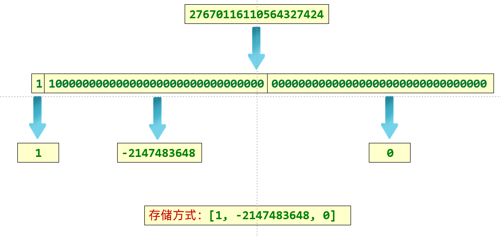

# Java常用API
<!-- more -->

## 16 常见API、对象克隆

### 16.1 常见API

#### 16.1.1 System类

System类所在包为java.lang包，因此在使用的时候不需要进行导包。并且System类被final修饰了，因此该类是不能被继承的。

System包含了系统操作的一些常用的方法。比如获取当前时间所对应的毫秒值，再比如终止当前JVM等等。

##### **常见方法**

```java
// 获取当前时间所对应的毫秒值（当前时间为0时区所对应的时间即就是英国格林尼治天文台旧址所在位置）
public static long currentTimeMillis()  

// 终止当前正在运行的Java虚拟机，0表示正常退出，非零表示异常退出
public static void exit(int status) 

// 进行数值元素copy
public static native void arraycopy(Object src,  int  srcPos, Object dest, int destPos, int length); 
// src:      源数组
// srcPos：  源数值的开始位置
// dest：    目标数组
// destPos： 目标数组开始位置
// length:   要复制的元素个数
```

**arraycopy方法底层细节：**

1. 如果数据源数组和目的地数组都是基本数据类型，那么两者的类型必须保持一致，否则会报错
2. 在拷贝的时候需要考虑数组的长度，如果超出范围也会报错
3. 如果数据源数组和目的地数组都是引用数据类型，那么子类类型可以赋值给父类类型

#### 16.1.2 Runtime

Runtime表示Java中运行时对象，可以获取到程序运行时涉及到的一些信息

**常见方法**：

```java
//当前系统的运行环境对象
public static Runtime getRuntime()

//停止虚拟机
public void exit(int status)

//获得CPU的线程数
public int availableProcessors()

//JVM能从系统中获取总内存大小（单位byte）
public long maxMemory()

//JVM已经从系统中获取总内存大小（单位byte）
public long totalMemory()

//JVM剩余内存大小（单位byte）
public long freeMemory()

//运行cmd命令
public Process exec(String command)
```

代码示例：

```java
public class RunTimeDemo1 {
    public static void main(String[] args) throws IOException {
        //1.获取Runtime的对象
        //Runtime r1 =Runtime.getRuntime();

        //2.exit 停止虚拟机
        //Runtime.getRuntime().exit(0);
        //System.out.println("看看我执行了吗?");

        //3.获得CPU的线程数
        System.out.println(Runtime.getRuntime().availableProcessors());//8
        //4.总内存大小,单位byte字节
        System.out.println(Runtime.getRuntime().maxMemory() / 1024 / 1024);//4064
        //5.已经获取的总内存大小,单位byte字节
        System.out.println(Runtime.getRuntime().totalMemory() / 1024 / 1024);//254
        //6.剩余内存大小
        System.out.println(Runtime.getRuntime().freeMemory() / 1024 / 1024);//251

        //7.运行cmd命令
        //shutdown :关机
        //加上参数才能执行
        //-s :默认在1分钟之后关机
        //-s -t 指定时间 : 指定关机时间
        //-a :取消关机操作
        //-r: 关机并重启
        Runtime.getRuntime().exec("shutdown -s -t 3600");
    }
}

```

#### 16.1.3 Object类

**常用方法**：

```java
//返回该对象的字符串表示形式(可以看做是对象的内存地址值)
public String toString()

//比较两个对象地址值是否相等；true表示相同，false表示不相同
public boolean equals(Object obj)

//对象克隆
protected Object clone()
```

**对象克隆的分类：**

深克隆和浅克隆

**浅克隆：**

不管对象内部的属性是基本数据类型还是引用数据类型，都完全拷贝过来

基本数据类型拷贝过来的是具体的数据，引用数据类型拷贝过来的是地址值。

Object类默认的是浅克隆


**深克隆：**

基本数据类型拷贝过来，字符串复用，引用数据类型会重新创建新的


代码实现：

```java
package com.demo.a04objectdemo;

public class ObjectDemo4 {
    public static void main(String[] args) throws CloneNotSupportedException {
        // protected object clone(int a) 对象克隆 

        //1.先创建一个对象
        int[] data = {1, 2, 3, 4, 5, 6, 7, 8, 9, 10, 11, 12, 13, 14, 15, 0};
        User u1 = new User(1, "zhangsan", "1234qwer", "girl11", data);

        //2.克隆对象
        //细节:
        //方法在底层会帮我们创建一个对象,并把原对象中的数据拷贝过去。
        //书写细节:
        //1.重写Object中的clone方法
        //2.让javabean类实现Cloneable接口
        //3.创建原对象并调用clone就可以了
        //User u2 =(User)u1.clone();

        //验证一件事情：Object中的克隆是浅克隆
        //想要进行深克隆，就需要重写clone方法并修改里面的方法体
        //int[] arr = u1.getData();
        //arr[0] = 100;

        //System.out.println(u1);
        //System.out.println(u2);


        //以后一般会用第三方工具进行克隆
        //1.第三方写的代码导入到项目中
        //2.编写代码
        //Gson gson =new Gson();
        //把对象变成一个字符串
        //String s=gson.toJson(u1);
        //再把字符串变回对象就可以了
        //User user =gson.fromJson(s, User.class);

        //int[] arr=u1.getData();
        //arr[0] = 100;

        //打印对象
        //System.out.println(user);

    }
}

package com.demo.a04objectdemo;

import java.util.StringJoiner;

//Cloneable
//如果一个接口里面没有抽象方法
//表示当前的接口是一个标记性接口
//现在Cloneable表示一旦实现了，那么当前类的对象就可以被克降
//如果没有实现，当前类的对象就不能克隆
public class User implements Cloneable {
    private int id;
    private String username;
    private String password;
    private String path;
    private int[] data;

    public User() {
    }

    public User(int id, String username, String password, String path, int[] data) {
        this.id = id;
        this.username = username;
        this.password = password;
        this.path = path;
        this.data = data;
    }

    public int getId() {
        return id;
    }

    public void setId(int id) {
        this.id = id;
    }

    public String getUsername() {
        return username;
    }

    public void setUsername(String username) {
        this.username = username;
    }

    public String getPassword() {
        return password;
    }

    public void setPassword(String password) {
        this.password = password;
    }

    public String getPath() {
        return path;
    }

    public void setPath(String path) {
        this.path = path;
    }

    public int[] getData() {
        return data;
    }

    public void setData(int[] data) {
        this.data = data;
    }

    public String toString() {
        return "角色编号为：" + id + "，用户名为：" + username + "密码为：" + password + ", 游戏图片为:" + path + ", 进度:" + arrToString();
    }


    public String arrToString() {
        StringJoiner sj = new StringJoiner(", ", "[", "]");

        for (int i = 0; i < data.length; i++) {
            sj.add(data[i] + "");
        }
        return sj.toString();
    }

    @Override
    protected Object clone() throws CloneNotSupportedException {
        //调用父类中的clone方法
        //相当于让Java帮我们克隆一个对象，并把克隆之后的对象返回出去。

        //先把被克隆对象中的数组获取出来
        int[] data = this.data;
        //创建新的数组
        int[] newData =new int[data.length];
        //拷贝数组中的数据
        for (int i = 0; i < data.length; i++) {
            newData[i] = data[i];
        }
        //调用父类中的方法克隆对象
            User u=(User)super.clone();
        //因为父类中的克隆方法是浅克隆，替换克隆出来对象中的数组地址值
        u.data =newData;
        return u;
    }
}

```

### 16.2 BigInteger类

**常见方法**:

```java
//获取随机大整数，范围：[0 ~ 2的num次方-1]
public BigInteger(int num, Random rnd)

//获取指定的大整数
public BigInteger(String val)

//获取指定进制的大整数
public BigInteger(String val, int radix)
    
//下面这个不是构造，而是一个静态方法获取BigInteger对象
//静态方法获取BigInteger的对象，内部有优化
public static BigInteger valueOf(long val)
```

**构造方法小结：**

* 如果BigInteger表示的数字没有超出long的范围，可以用静态方法获取。
* 如果BigInteger表示的超出long的范围，可以用构造方法获取。
* 对象一旦创建，BigInteger内部记录的值不能发生改变。
* 只要进行计算都会产生一个新的BigInteger对象

**常见成员方法**:

BigDecimal类中使用最多的还是提供的进行四则运算的方法，如下：

```java
public BigInteger add(BigInteger val)
public BigInteger subtract(BigInteger val)
public BigInteger multiply(BigInteger val)
public BigInteger divide(BigInteger val)
//除法，获取商和余数
public BigInteger[] divideAndRemainder(BigInteger val)
public  boolean equals(Object x)
public  BigInteger pow(int exponent)
public  BigInteger max/min(BigInteger val)

//转为int类型整数，超出范围数据有误
public  int intValue(BigInteger val)
```

#### 16.2.1 底层存储方式

对于计算机而言，其实是没有数据类型的概念的，都是0101010101，数据类型是编程语言自己规定的，所以在实际存储的时候，先把具体的数字变成二进制，每32个bit为一组，存储在数组中。

数组中最多能存储元素个数：21亿多

数组中每一位能表示的数字：42亿多

理论上，BigInteger能表示的最大数字为：42亿的21亿次方。

但是还没到这个数字，电脑的内存就会撑爆，所以一般认为BigInteger是无限的。

存储方式如图所示：



### 16.3 BigDecimal类

**常见成员方法**:

BigDecimal类中使用最多的还是提供的进行四则运算的方法，如下：

```java
// 加法运算
public BigDecimal add(BigDecimal value)
// 减法运算
public BigDecimal subtract(BigDecimal value)
// 乘法运算
public BigDecimal multiply(BigDecimal value)
// 触发运算
public BigDecimal divide(BigDecimal value)
```

**演示除法的特殊情况**:

如果使用BigDecimal类型的数据进行除法运算的时候，得到的结果是一个无限循环小数，那么就会报错：ArithmeticException。 如下代码所示：

```java
public class BigDecimalDemo02 {
    public static void main(String[] args) {
        // 创建两个BigDecimal对象
        BigDecimal b1 = new BigDecimal("1") ;
        BigDecimal b2 = new BigDecimal("3") ;
        // 调用方法进行b1和b2的除法运算，并且将计算结果在控制台进行输出
        System.out.println(b1.divide(b2));
    }
}
```

运行程序进行测试，控制台输出结果如下所示：

```java
Exception in thread "main" java.lang.ArithmeticException: Non-terminating decimal expansion; no exact representable decimal result.
    at java.base/java.math.BigDecimal.divide(BigDecimal java:1716)
    at com.demo.api.bigdecimal.demo02.BigDecimalDemo02.main(BigDecimalDemo02.java:14)
```

针对这个问题怎么解决，此时我们就需要使用到BigDecimal类中另外一个divide方法，如下所示：

```java
BigDecimal divide(BigDecimal divisor, int scale, int roundingMode)
```

上述divide方法参数说明：

```java
divisor:        除数对应的BigDecimal对象；
scale:          精确的位数；
roundingMode:   取舍模式；
```

取舍模式被封装到了RoundingMode这个枚举类中，在这个枚举类中定义了很多种取舍方式。最常见的取舍方式有如下几个：
UP(直接进1) ， FLOOR(直接删除) ， HALF_UP(4舍五入)，我们可以通过如下格式直接访问这些取舍模式：枚举类名.变量名

接下来我们就来演示一下这些取舍模式，代码如下所示：

```java
public class BigDecimalDemo02 {

    public static void main(String[] args) {

        // 调用方法
        method_03() ;

    }

    // 演示取舍模式HALF_UP
    public static void method_03() {

        // 创建两个BigDecimal对象
        BigDecimal b1 = new BigDecimal("0.3") ;
        BigDecimal b2 = new BigDecimal("4") ;

        // 调用方法进行b1和b2的除法运算，并且将计算结果在控制台进行输出
        System.out.println(b1.divide(b2 , 2 , RoundingMode.HALF_UP));

    }

    // 演示取舍模式FLOOR
    public static void method_02() {

        // 创建两个BigDecimal对象
        BigDecimal b1 = new BigDecimal("1") ;
        BigDecimal b2 = new BigDecimal("3") ;

        // 调用方法进行b1和b2的除法运算，并且将计算结果在控制台进行输出
        System.out.println(b1.divide(b2 , 2 , RoundingMode.FLOOR));

    }

    // 演示取舍模式UP
    public static void method_01() {

        // 创建两个BigDecimal对象
        BigDecimal b1 = new BigDecimal("1") ;
        BigDecimal b2 = new BigDecimal("3") ;

        // 调用方法进行b1和b2的除法运算，并且将计算结果在控制台进行输出
        System.out.println(b1.divide(b2 , 2 , RoundingMode.UP));

    }

}
```

小结：后期在进行两个数的除法运算的时候，我们常常使用的是可以设置取舍模式的divide方法。

**底层存储方式**:

把数据看成字符串，遍历得到里面的每一个字符，把这些字符在ASCII码表上的值，都存储到数组中。

 

## 17 正则表达式

### 17.1 字符类

* [abc]：代表a或者b，或者c字符中的一个。
* [^abc]：代表除a,b,c以外的任何字符。
* [a-z]：代表a-z的所有小写字符中的一个。
* [A-Z]：代表A-Z的所有大写字符中的一个。
* [0-9]：代表0-9之间的某一个数字字符。
* [a-zA-Z0-9]：代表a-z或者A-Z或者0-9之间的任意一个字符。
* [a-dm-p]：a 到 d 或 m 到 p之间的任意一个字符。

### 17.2 逻辑运算符

* &&：并且
* | ：或者
* \ ：转义字符

### 17.3 预定义字符

* "." ： 匹配任何字符。
* "\d"：任何数字[0-9]的简写；
* "\D"：任何非数字[^0-9]的简写；
* "\s"： 空白字符：[ \t\n\x0B\f\r] 的简写
* "\S"： 非空白字符：[^s] 的简写
* "\w"：单词字符：[a-zA-Z_0-9]的简写
* "\W"：非单词字符：[^w]

### 17.4 数量词

* X? : 0次或1次
* X* : 0次到多次
* X+ : 1次或多次
* X{n} : 恰好n次
* X{n,} : 至少n次
* X{n,m}: n到m次(n和m都是包含的)

### 17.5 Pattern、Matcher

Pattern：表示正则表达式  
Matcher：文本匹配器，作用按照正则表达式的规则去读取字符串，从头开始读取。

代码示例：

```java
package com.demo.a08regexdemo;

import java.util.regex.Matcher;
import java.util.regex.Pattern;

public class RegexDemo6 {
    public static void main(String[] args) {
        String str = "Java自从95年问世以来，经历了很多版本，目前企业中用的最多的是Java8和Java11，" +
                "因为这两个是长期支持版本，下一个长期支持版本是Java17，相信在未来不久Java17也会逐渐登上历史舞台";

        //1.获取正则表达式的对象
        Pattern p = Pattern.compile("Java\\d{0,2}");
        //2.获取文本匹配器的对象
        //拿着m去读取str，找符合p规则的子串
        Matcher m = p.matcher(str);

        //3.利用循环获取
        while (m.find()) {
            String s = m.group();
            System.out.println(s);
        }
    }

    private static void method1(String str) {
        //Pattern:表示正则表达式
        //Matcher: 文本匹配器，作用按照正则表达式的规则去读取字符串，从头开始读取。
        //          在大串中去找符合匹配规则的子串。

        //获取正则表达式的对象
        Pattern p = Pattern.compile("Java\\d{0,2}");
        //获取文本匹配器的对象
        //m:文本匹配器的对象
        //str:大串
        //p:规则
        //m要在str中找符合p规则的小串
        Matcher m = p.matcher(str);

        //拿着文本匹配器从头开始读取，寻找是否有满足规则的子串
        //如果没有，方法返回false
        //如果有，返回true。在底层记录子串的起始索引和结束索引+1
        // 0,4
        boolean b = m.find();

        //方法底层会根据find方法记录的索引进行字符串的截取
        // substring(起始索引，结束索引);包头不包尾
        // (0,4)但是不包含4索引
        // 会把截取的小串进行返回。
        String s1 = m.group();
        System.out.println(s1);


        //第二次在调用find的时候，会继续读取后面的内容
        //读取到第二个满足要求的子串，方法会继续返回true
        //并把第二个子串的起始索引和结束索引+1，进行记录
        b = m.find();

        //第二次调用group方法的时候，会根据find方法记录的索引再次截取子串
        String s2 = m.group();
        System.out.println(s2);
    }
}
```

## 18 时间、包装类

### 18.1 时间

#### 18.1.1 Date类

java.util.Date类 表示特定的瞬间，精确到毫秒。

Date拥有多个构造函数，只是部分已经过时

* `public Date()`：从运行程序的此时此刻到时间原点经历的毫秒值,转换成Date对象，分配Date对象并初始化此对象
* `public Date(long date)`：将指定参数的毫秒值date，转换成Date对象，分配Date对象并初始化此对象，以表示自从标准基准时间（称为“历元（epoch）”，即1970年1月1日00:00:00 GMT）以来的指定毫秒数。

> tips:  由于中国处于东八区（GMT+08:00）是比世界协调时间/格林尼治时间（GMT）快8小时的时区  
> 当格林尼治标准时间为0:00时，东八区的标准时间为08:00。

例如：

```java
import java.util.Date;

public class Demo01Date {
    public static void main(String[] args) {
        // 创建日期对象，把当前的时间
        System.out.println(new Date()); // Tue Jan 16 14:37:35 CST 2020
        // 创建日期对象，把当前的毫秒值转成日期对象
        System.out.println(new Date(0L)); // Thu Jan 01 08:00:00 CST 1970
    }
}
```

> tips: 在使用println方法时，会自动调用Date类中的toString方法。Date类对Object类中的toString方法进行了覆盖重写，所以结果为指定格式的字符串

#### 18.1.2 Date常用方法

Date类中的多数方法已经过时，常用的方法有：

* `public long getTime()` 把日期对象转换成对应的时间毫秒值。
* `public void setTime(long time)` 把方法参数给定的毫秒值设置给日期对象

示例代码

```java
public class DateDemo02 {
    public static void main(String[] args) {
        //创建日期对象
        Date d = new Date();
        
        //public long getTime():获取的是日期对象从1970年1月1日 00:00:00到现在的毫秒值
        System.out.println(d.getTime());
        System.out.println(d.getTime() * 1.0 / 1000 / 60 / 60 / 24 / 365 + "年");

        //public void setTime(long time):设置时间，给的是毫秒值
        //long time = 1000*60*60;
        long time = System.currentTimeMillis();
        d.setTime(time);

        System.out.println(d);
    }
}
```

> 小结： Date表示特定的时间瞬间，我们可以使用Date对象对时间进行操作。

#### 18.1.3 SimpleDateFormat类

`java.text.SimpleDateFormat` 是日期/时间格式化类，可以在Date对象与String对象之间进行来回转换

* **格式化**：按照指定的格式，把Date对象转换为String对象。
* **解析**：按照指定的格式，把String对象转换为Date对象。

##### 构造方法

由于DateFormat为抽象类，不能直接使用，所以需要常用的子类`java.text.SimpleDateFormat`。

* `public SimpleDateFormat(String pattern)`：用给定的模式和默认语言环境的日期格式符号构造SimpleDateFormat。参数pattern是一个字符串，代表日期时间的自定义格式。

##### 格式规则

| 标识字母（区分大小写） | 含义 |
| :----------------------: | :----: |
| y                      | 年   |
| M                      | 月   |
| d                      | 日   |
| H                      | 时   |
| m                      | 分   |
| s                      | 秒   |

##### 常用方法

DateFormat类的常用方法有：

* `public String format(Date date)`：将Date对象格式化为字符串。

* `public Date parse(String source)`：将字符串解析为Date对象。

  ```java
  package com.demo.a01jdk7datedemo;
  
  import java.text.ParseException;
  import java.text.SimpleDateFormat;
  import java.util.Date;
  
  public class A03_SimpleDateFormatDemo1 {
      public static void main(String[] args) throws ParseException {
          //1.定义一个字符串表示时间
          String str = "2023-11-11 11:11:11";
          //2.利用空参构造创建simpleDateFormat对象
          //创建对象的格式要跟字符串的格式完全一致
          SimpleDateFormat sdf = new SimpleDateFormat("yyyy-MM-dd HH:mm:ss");
          Date date = sdf.parse(str);
          //3.打印结果
          System.out.println(date.getTime());//1699672271000
      }
  
      private static void method1() {
          //1.利用空参构造创建simpleDateFormat对象，默认格式
          SimpleDateFormat sdf1 = new SimpleDateFormat();
          Date d1 = new Date(0L);
          String str1 = sdf1.format(d1);
          System.out.println(str1);//1970/1/1 上午8:00
  
          //2.利用带参构造创建simpleDateFormat对象，指定格式
          SimpleDateFormat sdf2 = new SimpleDateFormat("yyyy年MM月dd日HH:mm:ss");
          String str2 = sdf2.format(d1);
          System.out.println(str2);//1970年01月01日 08:00:00
      }
  }
  ```

> 小结：DateFormat可以将Date对象和字符串相互转换。

##### 练习1(初恋女友的出生日期)

```java
/*
     假设，你初恋的出生年月日为:2000-11-11
     请用字符串表示这个数据，并将其转换为:2000年11月11日

     创建一个Date对象表示2000年11月11日
     创建一个SimpleDateFormat对象，并定义格式为年月日把时间变成:2000年11月11日
*/

//1.可以通过2000-11-11进行解析，解析成一个Date对象
String str = "2000-11-11";
//2.解析
SimpleDateFormat sdf1 = new SimpleDateFormat("yyyy-MM-dd");
Date date = sdf1.parse(str);
//3.格式化
SimpleDateFormat sdf2 = new SimpleDateFormat("yyyy年MM月dd日");
String result = sdf2.format(date);
System.out.println(result);
```

##### 练习2(秒杀活动)

```java
/* 需求:
            秒杀活动开始时间:2023年11月11日 0:0:0(毫秒值)
            秒杀活动结束时间:2023年11月11日 0:10:0(毫秒值)

            小贾下单并付款的时间为:2023年11月11日 0:01:0
            小皮下单并付款的时间为:2023年11月11日 0:11:0
            用代码说明这两位同学有没有参加上秒杀活动?
*/

//1.定义字符串表示三个时间
String startstr = "2023年11月11日 0:0:0";
String endstr = "2023年11月11日 0:10:0";
String orderstr = "2023年11月11日 0:01:00";
//2.解析上面的三个时间，得到Date对象
SimpleDateFormat sdf = new SimpleDateFormat("yyyy年MM月dd日HH:mm:ss");
Date startDate = sdf.parse(startstr);
Date endDate = sdf.parse(endstr);
Date orderDate = sdf.parse(orderstr);

//3.得到三个时间的毫秒值
long startTime = startDate.getTime();
long endTime = endDate.getTime();
long orderTime = orderDate.getTime();

//4.判断
if (orderTime >= startTime && orderTime <= endTime) {
    System.out.println("参加秒杀活动成功");
} else {
    System.out.println("参加秒杀活动失败");
}
```

#### 18.1.3 Calendar类

* java.util.Calendar类表示一个“日历类”，可以进行日期运算。它是一个抽象类，不能创建对象，我们可以使用它的子类：java.util.GregorianCalendar类。
* 有两种方式可以获取GregorianCalendar对象：
  * 直接创建GregorianCalendar对象；
  * 通过Calendar的静态方法getInstance()方法获取GregorianCalendar对象

**常用方法**：

| 方法名                                | 说明                                                         |
| ------------------------------------- | ------------------------------------------------------------ |
| public static Calendar getInstance()  | 获取一个它的子类GregorianCalendar对象。                      |
| public int get(int field)             | 获取某个字段的值。field参数表示获取哪个字段的值，可以使用Calender中定义的常量来表示：<br />Calendar.YEAR : 年<br />Calendar.MONTH ：月<br />Calendar.DAY_OF_MONTH：月中的日期<br />Calendar.HOUR：小时<br />Calendar.MINUTE：分钟<br />Calendar.SECOND：秒<br />Calendar.DAY_OF_WEEK：星期 |
| public void set(int field,int value)  | 设置某个字段的值                                             |
| public void add(int field,int amount) | 为某个字段增加/减少指定的值                                  |

#### 18.1.4 JDK8时间相关类

| JDK8时间类类名    | 作用                   |
| ----------------- | ---------------------- |
| ZoneId            | 时区                   |
| Instant           | 时间戳                 |
| ZoneDateTime      | 带时区的时间           |
| DateTimeFormatter | 用于时间的格式化和解析 |
| LocalDate         | 年、月、日             |
| LocalTime         | 时、分、秒             |
| LocalDateTime     | 年、月、日、时、分、秒 |
| Duration          | 时间间隔（秒，纳，秒） |
| Period            | 时间间隔（年，月，日） |
| ChronoUnit        | 时间间隔（所有单位）   |

##### ZoneId 时区

```java
/*
        static Set<string> getAvailableZoneIds() 获取Java中支持的所有时区
        static ZoneId systemDefault() 获取系统默认时区
        static Zoneld of(string zoneld) 获取一个指定时区
*/

//1.获取所有的时区名称
Set<String> zoneIds = ZoneId.getAvailableZoneIds();
System.out.println(zoneIds.size());//600
System.out.println(zoneIds);// Asia/Shanghai

//2.获取当前系统的默认时区
ZoneId zoneId = ZoneId.systemDefault();
System.out.println(zoneId);//Asia/Shanghai

//3.获取指定的时区
ZoneId zoneId1 = ZoneId.of("Asia/Pontianak");
System.out.println(zoneId1);//Asia/Pontianak
```

##### Instant 时间戳

```java
/*
            static Instant now() 获取当前时间的Instant对象(标准时间)
            static Instant ofXxxx(long epochMilli) 根据(秒/毫秒/纳秒)获取Instant对象
            ZonedDateTime atZone(ZoneIdzone) 指定时区
            boolean isxxx(Instant otherInstant) 判断系列的方法
            Instant minusXxx(long millisToSubtract) 减少时间系列的方法
            Instant plusXxx(long millisToSubtract) 增加时间系列的方法
*/
//1.获取当前时间的Instant对象(标准时间)
Instant now = Instant.now();
System.out.println(now);

//2.根据(秒/毫秒/纳秒)获取Instant对象
Instant instant1 = Instant.ofEpochMilli(0L);
System.out.println(instant1);//1970-01-01T00:00:00z

Instant instant2 = Instant.ofEpochSecond(1L);
System.out.println(instant2);//1970-01-01T00:00:01Z

Instant instant3 = Instant.ofEpochSecond(1L, 1000000000L);
System.out.println(instant3);//1970-01-01T00:00:027

//3. 指定时区
ZonedDateTime time = Instant.now().atZone(ZoneId.of("Asia/Shanghai"));
System.out.println(time);

//4.isXxx 判断
Instant instant4=Instant.ofEpochMilli(0L);
Instant instant5 =Instant.ofEpochMilli(1000L);

//5.用于时间的判断
//isBefore:判断调用者代表的时间是否在参数表示时间的前面
boolean result1=instant4.isBefore(instant5);
System.out.println(result1);//true

//isAfter:判断调用者代表的时间是否在参数表示时间的后面
boolean result2 = instant4.isAfter(instant5);
System.out.println(result2);//false

//6.Instant minusXxx(long millisToSubtract) 减少时间系列的方法
Instant instant6 =Instant.ofEpochMilli(3000L);
System.out.println(instant6);//1970-01-01T00:00:03Z

Instant instant7 =instant6.minusSeconds(1);
System.out.println(instant7);//1970-01-01T00:00:02Z

```

##### ZoneDateTime  带时区的时间

```java
/*
            static ZonedDateTime now() 获取当前时间的ZonedDateTime对象
            static ZonedDateTime ofXxxx(。。。) 获取指定时间的ZonedDateTime对象
            ZonedDateTime withXxx(时间) 修改时间系列的方法
            ZonedDateTime minusXxx(时间) 减少时间系列的方法
            ZonedDateTime plusXxx(时间) 增加时间系列的方法
*/
//1.获取当前时间对象(带时区)
ZonedDateTime now = ZonedDateTime.now();
System.out.println(now);

//2.获取指定的时间对象(带时区)1/年月日时分秒纳秒方式指定
ZonedDateTime time1 = ZonedDateTime.of(2023, 10, 1,
                                       11, 12, 12, 0, ZoneId.of("Asia/Shanghai"));
System.out.println(time1);

//通过Instant + 时区的方式指定获取时间对象
Instant instant = Instant.ofEpochMilli(0L);
ZoneId zoneId = ZoneId.of("Asia/Shanghai");
ZonedDateTime time2 = ZonedDateTime.ofInstant(instant, zoneId);
System.out.println(time2);


//3.withXxx 修改时间系列的方法
ZonedDateTime time3 = time2.withYear(2000);
System.out.println(time3);

//4. 减少时间
ZonedDateTime time4 = time3.minusYears(1);
System.out.println(time4);

//5.增加时间
ZonedDateTime time5 = time4.plusYears(1);
System.out.println(time5);
```

##### DateTimeFormatter   用于时间的格式化和解析

```java
/*
            static DateTimeFormatter ofPattern(格式) 获取格式对象
            String format(时间对象) 按照指定方式格式化
*/
//获取时间对象
ZonedDateTime time = Instant.now().atZone(ZoneId.of("Asia/Shanghai"));

// 解析/格式化器
DateTimeFormatter dtf1=DateTimeFormatter.ofPattern("yyyy-MM-dd HH:mm;ss EE a");
// 格式化
System.out.println(dtf1.format(time));
```

##### LocalDate  年、月、日

```java
//1.获取当前时间的日历对象(包含 年月日)
LocalDate nowDate = LocalDate.now();
//System.out.println("今天的日期:" + nowDate);
//2.获取指定的时间的日历对象
LocalDate ldDate = LocalDate.of(2023, 1, 1);
System.out.println("指定日期:" + ldDate);

System.out.println("=============================");

//3.get系列方法获取日历中的每一个属性值//获取年
int year = ldDate.getYear();
System.out.println("year: " + year);
//获取月//方式一:
Month m = ldDate.getMonth();
System.out.println(m);
System.out.println(m.getValue());

//方式二:
int month = ldDate.getMonthValue();
System.out.println("month: " + month);

//获取日
int day = ldDate.getDayOfMonth();
System.out.println("day:" + day);

//获取一年的第几天
int dayofYear = ldDate.getDayOfYear();
System.out.println("dayOfYear:" + dayofYear);

//获取星期
DayOfWeek dayOfWeek = ldDate.getDayOfWeek();
System.out.println(dayOfWeek);
System.out.println(dayOfWeek.getValue());

//is开头的方法表示判断
System.out.println(ldDate.isBefore(ldDate));
System.out.println(ldDate.isAfter(ldDate));

//with开头的方法表示修改，只能修改年月日
LocalDate withLocalDate = ldDate.withYear(2000);
System.out.println(withLocalDate);

//minus开头的方法表示减少，只能减少年月日
LocalDate minusLocalDate = ldDate.minusYears(1);
System.out.println(minusLocalDate);


//plus开头的方法表示增加，只能增加年月日
LocalDate plusLocalDate = ldDate.plusDays(1);
System.out.println(plusLocalDate);

//-------------
// 判断今天是否是你的生日
LocalDate birDate = LocalDate.of(2000, 1, 1);
LocalDate nowDate1 = LocalDate.now();

MonthDay birMd = MonthDay.of(birDate.getMonthValue(), birDate.getDayOfMonth());
MonthDay nowMd = MonthDay.from(nowDate1);

System.out.println("今天是你的生日吗? " + birMd.equals(nowMd));//今天是你的生日吗?
```

##### LocalTime  时、分、秒

```java
// 获取本地时间的日历对象。(包含 时分秒)
LocalTime nowTime = LocalTime.now();
System.out.println("今天的时间:" + nowTime);

int hour = nowTime.getHour();//时
System.out.println("hour: " + hour);

int minute = nowTime.getMinute();//分
System.out.println("minute: " + minute);

int second = nowTime.getSecond();//秒
System.out.println("second:" + second);

int nano = nowTime.getNano();//纳秒
System.out.println("nano:" + nano);
System.out.println("------------------------------------");
System.out.println(LocalTime.of(8, 20));//时分
System.out.println(LocalTime.of(8, 20, 30));//时分秒
System.out.println(LocalTime.of(8, 20, 30, 150));//时分秒纳秒
LocalTime mTime = LocalTime.of(8, 20, 30, 150);

//is系列的方法
System.out.println(nowTime.isBefore(mTime));
System.out.println(nowTime.isAfter(mTime));

//with系列的方法，只能修改时、分、秒
System.out.println(nowTime.withHour(10));

//plus系列的方法，只能修改时、分、秒
System.out.println(nowTime.plusHours(10));
```

##### LocalDateTime  年、月、日、时、分、秒

```java
// 当前时间的的日历对象(包含年月日时分秒)
LocalDateTime nowDateTime = LocalDateTime.now();

System.out.println("今天是:" + nowDateTime);//今天是：
System.out.println(nowDateTime.getYear());//年
System.out.println(nowDateTime.getMonthValue());//月
System.out.println(nowDateTime.getDayOfMonth());//日
System.out.println(nowDateTime.getHour());//时
System.out.println(nowDateTime.getMinute());//分
System.out.println(nowDateTime.getSecond());//秒
System.out.println(nowDateTime.getNano());//纳秒
// 日:当年的第几天
System.out.println("dayofYear:" + nowDateTime.getDayOfYear());
//星期
System.out.println(nowDateTime.getDayOfWeek());
System.out.println(nowDateTime.getDayOfWeek().getValue());
//月份
System.out.println(nowDateTime.getMonth());
System.out.println(nowDateTime.getMonth().getValue());

LocalDate ld = nowDateTime.toLocalDate();
System.out.println(ld);

LocalTime lt = nowDateTime.toLocalTime();
System.out.println(lt.getHour());
System.out.println(lt.getMinute());
System.out.println(lt.getSecond());
```

##### Duration  时间间隔（秒，纳，秒）

```java
// 本地日期时间对象。
LocalDateTime today = LocalDateTime.now();
System.out.println(today);

// 出生的日期时间对象
LocalDateTime birthDate = LocalDateTime.of(2000, 1, 1, 0, 0, 0);
System.out.println(birthDate);

Duration duration = Duration.between(birthDate, today);//第二个参数减第一个参数
System.out.println("相差的时间间隔对象:" + duration);

System.out.println("============================================");
System.out.println(duration.toDays());//两个时间差的天数
System.out.println(duration.toHours());//两个时间差的小时数
System.out.println(duration.toMinutes());//两个时间差的分钟数
System.out.println(duration.toMillis());//两个时间差的毫秒数
System.out.println(duration.toNanos());//两个时间差的纳秒数
```

##### Period  时间间隔（年，月，日）

```java
// 当前本地 年月日
LocalDate today = LocalDate.now();
System.out.println(today);

// 生日的 年月日
LocalDate birthDate = LocalDate.of(2000, 1, 1);
System.out.println(birthDate);

Period period = Period.between(birthDate, today);//第二个参数减第一个参数

System.out.println("相差的时间间隔对象:" + period);
System.out.println(period.getYears());
System.out.println(period.getMonths());
System.out.println(period.getDays());

System.out.println(period.toTotalMonths());
```

##### ChronoUnit  时间间隔（所有单位）

```java
// 当前时间
LocalDateTime today = LocalDateTime.now();
System.out.println(today);
// 生日时间
LocalDateTime birthDate = LocalDateTime.of(2000, 1, 1,0, 0, 0);
System.out.println(birthDate);

System.out.println("相差的年数:" + ChronoUnit.YEARS.between(birthDate, today));
System.out.println("相差的月数:" + ChronoUnit.MONTHS.between(birthDate, today));
System.out.println("相差的周数:" + ChronoUnit.WEEKS.between(birthDate, today));
System.out.println("相差的天数:" + ChronoUnit.DAYS.between(birthDate, today));
System.out.println("相差的时数:" + ChronoUnit.HOURS.between(birthDate, today));
System.out.println("相差的分数:" + ChronoUnit.MINUTES.between(birthDate, today));
System.out.println("相差的秒数:" + ChronoUnit.SECONDS.between(birthDate, today));
System.out.println("相差的毫秒数:" + ChronoUnit.MILLIS.between(birthDate, today));
System.out.println("相差的微秒数:" + ChronoUnit.MICROS.between(birthDate, today));
System.out.println("相差的纳秒数:" + ChronoUnit.NANOS.between(birthDate, today));
System.out.println("相差的半天数:" + ChronoUnit.HALF_DAYS.between(birthDate, today));
System.out.println("相差的十年数:" + ChronoUnit.DECADES.between(birthDate, today));
System.out.println("相差的世纪(百年)数:" + ChronoUnit.CENTURIES.between(birthDate, today));
System.out.println("相差的千年数:" + ChronoUnit.MILLENNIA.between(birthDate, today));
System.out.println("相差的纪元数:" + ChronoUnit.ERAS.between(birthDate, today));
```

### 18.2 包装类

Java提供了两个类型，基本类型与引用类型，使用基本类型在于效率，然而很多情况，会创建对象使用，因为对象可以做更多的功能，如果想要我们的基本类型像对象一样操作，就可以使用基本类型对应的包装类，如下：

| 基本类型 | 对应的包装类（位于java.lang包中） |
| -------- | --------------------------------- |
| byte     | Byte                              |
| short    | Short                             |
| int      | **Integer**                       |
| long     | Long                              |
| float    | Float                             |
| double   | Double                            |
| char     | **Character**                     |
| boolean  | Boolean                           |

#### 18.2.1 Integer类

* Integer类概述

  包装一个对象中的原始类型 int 的值

* Integer类构造方法及静态方法

| 方法名                                  | 说明                                   |
| --------------------------------------- | -------------------------------------- |
| public Integer(int   value)             | 根据 int 值创建 Integer 对象(过时)     |
| public Integer(String s)                | 根据 String 值创建 Integer 对象(过时)  |
| public static Integer valueOf(int i)    | 返回表示指定的 int 值的 Integer   实例 |
| public static Integer valueOf(String s) | 返回保存指定String值的 Integer 对象    |
| static string tobinarystring(int i)     | 得到二进制                             |
| static string tooctalstring(int i)      | 得到八进制                             |
| static string toHexstring(int i)        | 得到十六进制                           |
| static int parseInt(string s)           | 将字符串类型的整数转成int类型的整数    |

示例代码

```java
//public Integer(int value)：根据 int 值创建 Integer 对象(过时)
Integer i1 = new Integer(100);
System.out.println(i1);

//public Integer(String s)：根据 String 值创建 Integer 对象(过时)
Integer i2 = new Integer("100");
//Integer i2 = new Integer("abc"); //NumberFormatException
System.out.println(i2);
System.out.println("--------");

//public static Integer valueOf(int i)：返回表示指定的 int 值的 Integer 实例
Integer i3 = Integer.valueOf(100);
System.out.println(i3);

//public static Integer valueOf(String s)：返回保存指定String值的Integer对象 
Integer i4 = Integer.valueOf("100");
System.out.println(i4);
```

#### 18.2.2 装箱与拆箱

基本类型与对应的包装类对象之间，来回转换的过程称为”装箱“与”拆箱“：

* **装箱**：从基本类型转换为对应的包装类对象。
* **拆箱**：从包装类对象转换为对应的基本类型。

基本数值---->包装对象

```java
Integer i = new Integer(4);//使用构造函数函数
Integer iii = Integer.valueOf(4);//使用包装类中的valueOf方法
```

包装对象---->基本数值

```java
int num = i.intValue();
```

#### 18.2.3 自动装箱与自动拆箱

由于我们经常要做基本类型与包装类之间的转换，从Java 5（JDK 1.5）开始，基本类型与包装类的装箱、拆箱动作可以自动完成。例如：

```java
Integer i = 4;//自动装箱。相当于Integer i = Integer.valueOf(4);
i = i + 5;//等号右边：将i对象转成基本数值(自动拆箱) i.intValue() + 5;
//加法运算完成后，再次装箱，把基本数值转成对象。
```

#### 18.2.4 基本类型与字符串之间的转换

##### 基本类型转换为String

* 方式一：直接在数字后加一个空字符串
* 方式二：通过String类静态方法valueOf()

示例代码

```java
public class IntegerDemo {
    public static void main(String[] args) {
        //int --- String
        int number = 100;
        //方式1
        String s1 = number + "";
        System.out.println(s1);
        //方式2
        //public static String valueOf(int i)
        String s2 = String.valueOf(number);
        System.out.println(s2);
    }
}
```

##### String转换成基本类型

* 方式一：先将字符串数字转成Integer，再调用valueOf()方法  
* 方式二：通过Integer静态方法parseInt()进行转换

除了Character类之外，其他所有包装类都具有parseXxx静态方法可以将字符串参数转换为对应的基本类型：

* `public static byte parseByte(String s)`：将字符串参数转换为对应的byte基本类型。
* `public static short parseShort(String s)`：将字符串参数转换为对应的short基本类型。
* **`public static int parseInt(String s)`：将字符串参数转换为对应的int基本类型。**
* **`public static long parseLong(String s)`：将字符串参数转换为对应的long基本类型。**
* `public static float parseFloat(String s)`：将字符串参数转换为对应的float基本类型。
* `public static double parseDouble(String s)`：将字符串参数转换为对应的double基本类型。
* `public static boolean parseBoolean(String s)`：将字符串参数转换为对应的boolean基本类型。
 

* 示例代码

```java
public class IntegerDemo {
    public static void main(String[] args) {
        //String --- int
        String s = "100";
        //方式1：String --- Integer --- int
        Integer i = Integer.valueOf(s);
        //public int intValue()
        int x = i.intValue();
        System.out.println(x);
        //方式2
        //public static int parseInt(String s)
        int y = Integer.parseInt(s);
        System.out.println(y);
    }
}
```

#### 18.2.5 底层原理

建议：获取Integer对象的时候不要自己new，而是采取直接赋值或者静态方法valueOf的方式

因为在实际开发中，-128~127之间的数据，用的比较多。如果每次使用都是new对象，那么太浪费内存了。

所以，提前把这个范围之内的每一个数据都创建好对象，如果要用到了不会创建新的，而是返回已经创建好的对象。

```java
//1.利用构造方法获取Integer的对象(JDK5以前的方式)
/*Integer i1 = new Integer(1);
        Integer i2 = new Integer("1");
        System.out.println(i1);
        System.out.println(i2);*/

//2.利用静态方法获取Integer的对象(JDK5以前的方式)
Integer i3 = Integer.valueOf(123);
Integer i4 = Integer.valueOf("123");
Integer i5 = Integer.valueOf("123", 8);

System.out.println(i3);
System.out.println(i4);
System.out.println(i5);

//3.这两种方式获取对象的区别(掌握)
//底层原理：
//因为在实际开发中，-128~127之间的数据，用的比较多。
//如果每次使用都是new对象，那么太浪费内存了
//所以，提前把这个范围之内的每一个数据都创建好对象
//如果要用到了不会创建新的，而是返回已经创建好的对象。
Integer i6 = Integer.valueOf(127);
Integer i7 = Integer.valueOf(127);
System.out.println(i6 == i7);//true

Integer i8 = Integer.valueOf(128);
Integer i9 = Integer.valueOf(128);
System.out.println(i8 == i9);//false

//因为看到了new关键字，在Java中，每一次new都是创建了一个新的对象
//所以下面的两个对象都是new出来，地址值不一样。
/*Integer i10 = new Integer(127);
        Integer i11 = new Integer(127);
        System.out.println(i10 == i11);

        Integer i12 = new Integer(128);
        Integer i13 = new Integer(128);
        System.out.println(i12 == i13);*/
```
