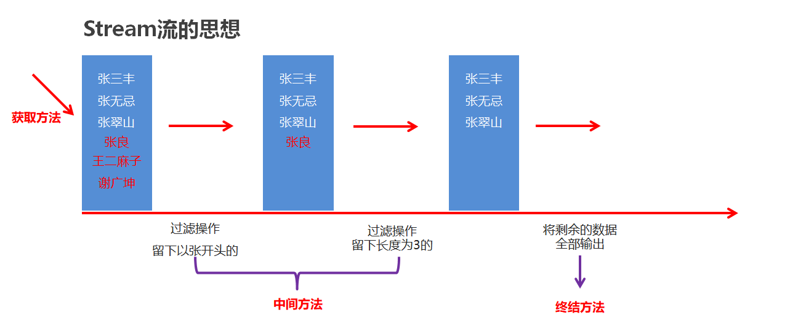

# JDK8新特性
<!-- more -->

## 19 内部类

将一个类A定义在另一个类B里面，里面的那个类A就称为**内部类**，B则称为**外部类**。可以把内部类理解成寄生，外部类理解成宿主。

### 19.1 内部类分类

1. **成员内部内**，类定义在了成员位置 (类中方法外称为成员位置，无static修饰的内部类)
2. **静态内部类**，类定义在了成员位置 (类中方法外称为成员位置，有static修饰的内部类)
3. **局部内部类**，类定义在方法内
4. **匿名内部类**，没有名字的内部类，可以在方法中，也可以在类中方法外。

### 19.2 成员内部类

**成员内部类特点**：

* 无static修饰的内部类，属于外部类对象的。
* 宿主：外部类对象。

**内部类的使用格式**：

```java
 外部类.内部类。 // 访问内部类的类型都是用 外部类.内部类
```

**获取成员内部类对象的两种方式**：

方式一：外部直接创建成员内部类的对象

```java
外部类.内部类 变量 = new 外部类（）.new 内部类（）;
```

方式二：在外部类中定义一个方法提供内部类的对象

**案例演示**:

```java
方式一：
public class Test {
    public static void main(String[] args) {
        //  宿主：外部类对象。
       // Outer out = new Outer();
        // 创建内部类对象。
        Outer.Inner oi = new Outer().new Inner();
        oi.method();
    }
}

class Outer {
    // 成员内部类，属于外部类对象的。
    // 拓展：成员内部类不能定义静态成员。
    public class Inner{
        // 这里面的东西与类是完全一样的。
        public void method(){
            System.out.println("内部类中的方法被调用了");
        }
    }
}

方式二：
public class Outer {
    String name;
    private class Inner{
        static int a = 10;
    }
    public Inner getInstance(){
        return new Inner();
    }
}

public class Test {
    public static void main(String[] args) {
        Outer o = new Outer();
        System.out.println(o.getInstance());
    }
}
```

### 19.3 静态内部类

**静态内部类特点**：静态内部类是一种特殊的成员内部类。

* 有static修饰，属于外部类本身的。
* 总结：静态内部类与其他类的用法完全一样。只是访问的时候需要加上外部类.内部类。
* **拓展1**:静态内部类可以直接访问外部类的静态成员。
* **拓展2**:静态内部类不可以直接访问外部类的非静态成员，如果要访问需要创建外部类的对象。
* **拓展3**:静态内部类中没有银行的Outer.this。

**静态内部类对象的创建格式**：

```java
外部类.内部类  变量 = new  外部类.内部类构造器;
```

**调用方法的格式：**

* 调用非静态方法的格式：先创建对象，用对象调用
* 调用静态方法的格式：外部类名.内部类名.方法名();

**案例演示**：

```java
// 外部类：Outer01
class Outer01{
    private static  String sc_name = "黑马程序";
    // 内部类: Inner01
    public static class Inner01{
        // 这里面的东西与类是完全一样的。
        private String name;
        public Inner01(String name) {
            this.name = name;
        }
        public void showName(){
            System.out.println(this.name);
            // 拓展:静态内部类可以直接访问外部类的静态成员。
            System.out.println(sc_name);
        }
    }
}

public class InnerClassDemo01 {
    public static void main(String[] args) {
        // 创建静态内部类对象。
        // 外部类.内部类  变量 = new  外部类.内部类构造器;
        Outer01.Inner01 in  = new Outer01.Inner01("张三");
        in.showName();
    }
}
```

### 19.4 局部内部类

* **局部内部类** ：定义在**方法中**的类。

定义格式:

```java
class 外部类名 {
    数据类型 变量名;

    修饰符 返回值类型 方法名(参数列表) {
        // …
        class 内部类 {
        // 成员变量
        // 成员方法
        }
    }
}
```

### 19.5 匿名内部类

**匿名内部类** ：是内部类的简化写法。他是一个隐含了名字的内部类。==开发中，最常用到的内部类就是匿名内部类了。==

**格式**

```java
new 类名或者接口名() {
     重写方法;
};
```

**包含了：**

* 继承或者实现关系
* 方法重写
* 创建对象

所以从语法上来讲，这个整体其实是匿名内部类对象

##### **什么时候用到匿名内部类**

实际上，如果我们希望定义一个只要使用一次的类，就可考虑使用匿名内部类。匿名内部类的本质作用是为了简化代码。

匿名内部类必须**继承一个父类**或者**实现一个父接口**。

**匿名内部类格式**：

```java
new 父类名或者接口名(){
    // 方法重写
    @Override 
    public void method() {
        // 执行语句
    }
};
```

##### **匿名内部类的特点**

1. 定义一个没有名字的内部类
2. 这个类实现了父类，或者父类接口
3. 匿名内部类会创建这个没有名字的类的对象

##### **匿名内部类的使用场景**

```java
interface Swim {
    public abstract void swimming();
}

public class Demo07 {
    public static void main(String[] args) {
        // 普通方式传入对象
        // 创建实现类对象
        Student s = new Student();
        
        goSwimming(s);
        // 匿名内部类使用场景:作为方法参数传递
        Swim s3 = new Swim() {
            @Override
            public void swimming() {
                System.out.println("蝶泳...");
            }
        };
        // 传入匿名内部类
        goSwimming(s3);

        // 完美方案: 一步到位
        goSwimming(new Swim() {
            public void swimming() {
                System.out.println("大学生, 蛙泳...");
            }
        });

        goSwimming(new Swim() {
            public void swimming() {
                System.out.println("小学生, 自由泳...");
            }
        });
    }

    // 定义一个方法,模拟请一些人去游泳
    public static void goSwimming(Swim s) {
        s.swimming();
    }
}
```

## 20 lambda

### 20.1 lambda

#### 20.1.1 Lambda表达式标准格式

**匿名内部类中重写show()方法的代码分析**：

* 方法形式参数为空，说明调用方法时不需要传递参数
* 方法返回值类型为void，说明方法执行没有结果返回
* 方法体中的内容，是我们具体要做的事情


**Lambda表达式的代码分析**：

* ()：里面没有内容，可以看成是方法形式参数为空
* ->：用箭头指向后面要做的事情
* { }：包含一段代码，我们称之为代码块，可以看成是方法体中的内容


组成Lambda表达式的三要素：**形式参数**，**箭头**，**代码块**

**Lambda表达式的格式**:

* 格式：**(形式参数) -> {代码块}**
* 形式参数：如果有多个参数，参数之间用逗号隔开；如果没有参数，留空即可
* ->：由英文中划线和大于符号组成，固定写法。代表指向动作
* 代码块：是我们具体要做的事情，也就是以前我们写的方法体内容

总结起来就是一句话：**拿着形式参数去做代码块中的事情**

**Lambda表达式的使用前提：**:

* 有一个接口
* 接口中只能有一个抽象方法

**练习1**:

* 定义一个接口(Eatable)，里面定义一个抽象方法：void eat();
* 定义一个测试类(EatableDemo)，在测试类中提供两个方法
  * 一个方法是：useEatable(Eatable e)
  * 一个方法是主方法，在主方法中调用useEatable方法

```java
public interface Eatable {
    void eat();
}
```

```java
/*
    Lambda表达式的格式：(形式参数) -> {代码块}
 */
public class EatableDemo {
    public static void main(String[] args) {
        //在主方法中调用useEatable方法
        //匿名内部类
        useEatable(new Eatable() {
            @Override
            public void eat() {
                System.out.println("一天一苹果，医生远离我");
            }
        });

        //Lambda表达式
        useEatable(() -> {
            System.out.println("一天一苹果，医生远离我");
        });
    }

    private static void useEatable(Eatable e) {
        e.eat();
    }
}
```

**练习2(带参无返回值)**:

* 定义一个接口(Flyable)，里面定义一个抽象方法：void fly(String s);
* 定义一个测试类(FlyableDemo)，在测试类中提供两个方法
* 一个方法是：useFlyable(Flyable f)
* 一个方法是主方法，在主方法中调用useFlyable方法

知道了要做什么之后，下面我们到IDEA中去演示一下：

```java
public interface Flyable {
    void fly(String s);
}

/*
    Lambda表达式的格式：(形式参数) -> {代码块}
 */
public class FlyableDemo {
    public static void main(String[] args) {
        //在主方法中调用useFlyable方法
        //匿名内部类
        useFlyable(new Flyable() {
            @Override
            public void fly(String s) {
                System.out.println(s);
                System.out.println("飞机自驾游");
            }
        });
        System.out.println("--------");

        //Lambda
        useFlyable((String s) -> {
            System.out.println(s);
            System.out.println("飞机自驾游");
        });

    }

    private static void useFlyable(Flyable f) {
        f.fly("风和日丽，晴空万里");
    }
}
```

**练习3(带参带返回值)**:

* 定义一个接口(Addable)，里面定义一个抽象方法：int add(int x,int y);
* 定义一个测试类(AddableDemo)，在测试类中提供两个方法
* 一个方法是：useAddable(Addable a)
* 一个方法是主方法，在主方法中调用useAddable方法

```java
public interface Addable {
    int add(int x,int y);
}
```

```java
/*
    Lambda表达式的格式：(形式参数) -> {代码块}
 */
public class AddableDemo {
    public static void main(String[] args) {
        //在主方法中调用useAddable方法
        useAddable((int x,int y) -> {
            return x + y;
//            return  x - y;
        });

    }

    private static void useAddable(Addable a) {
        int sum = a.add(10, 20);
        System.out.println(sum);
    }
}
```

#### 20.1.2 Lambda的省略模式

```java
public interface Addable {
    int add(int x, int y);
}
```

```java
public interface Flyable {
    void fly(String s);
}
```

```java
/*
    Lambda表达式的省略模式
 */
public class LambdaDemo {
    public static void main(String[] args) {
//        useAddable((int x,int y) -> {
//            return x + y;
//        });
        //参数的类型可以省略
        useAddable((x, y) -> {
            return x + y;
        });
        //但是有多个参数的情况下，不能只省略一个
//        useAddable((x,int y) -> {
//            return x + y;
//        });

//        useFlyable((String s) -> {
//            System.out.println(s);
//        });
//        useFlyable((s) -> {
//            System.out.println(s);
//        });
        //如果参数有且仅有一个，那么小括号可以省略
//        useFlyable(s -> {
//            System.out.println(s);
//        });

        //如果代码块的语句只有一条，可以省略大括号和分号
        useFlyable(s -> System.out.println(s));

        //如果代码块的语句只有一条，可以省略大括号和分号，如果有return，return也要省略掉
        useAddable((x, y) -> x + y);
    }

    private static void useFlyable(Flyable f) {
        f.fly("风和日丽，晴空万里");
    }

    private static void useAddable(Addable a) {
        int sum = a.add(10, 20);
        System.out.println(sum);
    }
}
```

**省略规则：**

* 参数类型可以省略。但是有多个参数的情况下，不能只省略一个
* 如果参数有且仅有一个，那么小括号可以省略
* 如果代码块的语句只有一条，可以省略大括号和分号，甚至是return

#### 20.1.3 Lambda和匿名内部类的区别

```java
public interface Inter {
    void show();
//    void show2();
}
```

```java
public abstract class Animal {
    public abstract void method();
}
```

```java
public class Student {
    public void study() {
        System.out.println("爱生活，爱Java");
    }
}
```

```java
/*
    Lambda表达式和匿名内部类的区别
 */
public class LambdaDemo {
    public static void main(String[] args) {
        //匿名内部类
        /*
        useInter(new Inter() {
            @Override
            public void show() {
                System.out.println("接口");
            }
        });

        useAnimal(new Animal() {
            @Override
            public void method() {
                System.out.println("抽象类");
            }
        });

        useStudent(new Student(){
            @Override
            public void study() {
                System.out.println("具体类");
            }
        });
        */

        useInter(new Inter() {
            @Override
            public void show() {
                System.out.println("接口");
            }
        });

        //Lambda
//        useInter(() -> System.out.println("接口"));
//        useAnimal(() -> System.out.println("抽象类"));
//        useStudent(() -> System.out.println("具体类"));

//        useInter(() -> System.out.println("接口"));

//        useInter(new Inter() {
//            @Override
//            public void show() {
//                System.out.println("show");
//            }
//
//            @Override
//            public void show2() {
//                System.out.println("show2");
//            }
//        });

    }

    private static void useStudent(Student s) {
        s.study();
    }

    private static void useAnimal(Animal a) {
        a.method();
    }

    private static void useInter(Inter i) {
        i.show();
    }
}
```

* **所需类型不同**
  * 匿名内部类：可以是接口，也可以是抽象类，还可以是具体类
  * Lambda表达式：只能是接口
* **使用限制不同**
  * 如果接口中仅有一个抽象方法，可以使用Lambda表达式，也可以使用匿名内部类
  * 如果接口中多于一个抽象方法，只能使用匿名内部类，而不能使用Lambda表达式
* **实现原理不同**
  * 匿名内部类：编译之后，产生一个单独的.class字节码文件
  * Lambda表达式：编译之后，你没有看到一个单独的.class字节码文件。对应的字节码会在运行的时候动态生成

## 21 Stream流、方法引用

### 21.1 Stream流

* Stream流的好处

  * 直接阅读代码的字面意思即可完美展示无关逻辑方式的语义：获取流、过滤、逐一打印
  * Stream流把真正的函数式编程风格引入到Java中
  * 代码简洁

#### 21.1.1 Stream流的常见生成方式



* Stream流的三类方法

  * 获取Stream流
    * 创建一条流水线,并把数据放到流水线上准备进行操作
  * 中间方法
    * 流水线上的操作
    * 一次操作完毕之后,还可以继续进行其他操作
  * 终结方法
    * 一个Stream流只能有一个终结方法
    * 是流水线上的最后一个操作

##### 生成Stream流的方式

 ```java
 public class StreamDemo {
     public static void main(String[] args) {
         //Collection体系的集合可以使用默认方法stream()生成流
         List<String> list = new ArrayList<String>();
         Stream<String> listStream = list.stream();
 
         Set<String> set = new HashSet<String>();
         Stream<String> setStream = set.stream();
 
         //Map体系的集合间接的生成流
         Map<String,Integer> map = new HashMap<String, Integer>();
         Stream<String> keyStream = map.keySet().stream();
         Stream<Integer> valueStream = map.values().stream();
         Stream<Map.Entry<String, Integer>> entryStream = map.entrySet().stream();
 
         //数组可以通过Arrays中的静态方法stream生成流
         String[] strArray = {"hello","world","java"};
         Stream<String> strArrayStream = Arrays.stream(strArray);
       
         //同种数据类型的多个数据可以通过Stream接口的静态方法of(T... values)生成流
         Stream<String> strArrayStream2 = Stream.of("hello", "world", "java");
         Stream<Integer> intStream = Stream.of(10, 20, 30);
     }
 }
 ```

##### Stream流中间操作方法

filter代码演示

  ```java
  public class MyStream3 {
      public static void main(String[] args) {
  //        Stream<T> filter(Predicate predicate)：过滤
  //        Predicate接口中的方法boolean test(T t)：对给定的参数进行判断，返回一个布尔值

          ArrayList<String> list = new ArrayList<>();
          list.add("张三丰");
          list.add("张无忌");
          list.add("张翠山");
          list.add("王二麻子");
          list.add("张良");
          list.add("谢广坤");

          //filter方法获取流中的 每一个数据.
          //而test方法中的s,就依次表示流中的每一个数据.
          //我们只要在test方法中对s进行判断就可以了.
          //如果判断的结果为true,则当前的数据留下
          //如果判断的结果为false,则当前数据就不要.
  //        list.stream().filter(
  //                new Predicate<String>() {
  //                    @Override
  //                    public boolean test(String s) {
  //                        boolean result = s.startsWith("张");
  //                        return result;
  //                    }
  //                }
  //        ).forEach(s-> System.out.println(s));

          //因为Predicate接口中只有一个抽象方法test
          //所以我们可以使用lambda表达式来简化
  //        list.stream().filter(
  //                (String s)->{
  //                    boolean result = s.startsWith("张");
  //                        return result;
  //                }
  //        ).forEach(s-> System.out.println(s));

          list.stream().filter(s ->s.startsWith("张")).forEach(s-> System.out.println(s));

      }
  }
  ```

limit&skip代码演示

  ```java
  public class StreamDemo02 {
      public static void main(String[] args) {
          //创建一个集合，存储多个字符串元素
          ArrayList<String> list = new ArrayList<String>();

          list.add("林青霞");
          list.add("张曼玉");
          list.add("王祖贤");
          list.add("柳岩");
          list.add("张敏");
          list.add("张无忌");

          //需求1：取前3个数据在控制台输出
          list.stream().limit(3).forEach(s-> System.out.println(s));
          System.out.println("--------");

          //需求2：跳过3个元素，把剩下的元素在控制台输出
          list.stream().skip(3).forEach(s-> System.out.println(s));
          System.out.println("--------");

          //需求3：跳过2个元素，把剩下的元素中前2个在控制台输出
          list.stream().skip(2).limit(2).forEach(s-> System.out.println(s));
      }
  }
  ```

concat&distinct代码演示

  ```java
  public class StreamDemo03 {
      public static void main(String[] args) {
          //创建一个集合，存储多个字符串元素
          ArrayList<String> list = new ArrayList<String>();
  
          list.add("林青霞");
          list.add("张曼玉");
          list.add("王祖贤");
          list.add("柳岩");
          list.add("张敏");
          list.add("张无忌");
  
          //需求1：取前4个数据组成一个流
          Stream<String> s1 = list.stream().limit(4);
  
          //需求2：跳过2个数据组成一个流
          Stream<String> s2 = list.stream().skip(2);
  
          //需求3：合并需求1和需求2得到的流，并把结果在控制台输出
  //        Stream.concat(s1,s2).forEach(s-> System.out.println(s));
  
          //需求4：合并需求1和需求2得到的流，并把结果在控制台输出，要求字符串元素不能重复
          Stream.concat(s1,s2).distinct().forEach(s-> System.out.println(s));
      }
  }
  ```

##### Stream流终结操作方法

* 概念

  终结操作的意思是,执行完此方法之后,Stream流将不能再执行其他操作

* 常见方法

  | 方法名                           | 说明           |
  | ----------------------------- | ------------ |
  | void forEach(Consumer action) | 对此流的每个元素执行操作 |
  | long count()                  | 返回此流中的元素数    |

代码演示

 ```java
 public class MyStream5 {
     public static void main(String[] args) {
         ArrayList<String> list = new ArrayList<>();
         list.add("张三丰");
         list.add("张无忌");
         list.add("张翠山");
         list.add("王二麻子");
         list.add("张良");
         list.add("谢广坤");
 
         //method1(list);
         
 //        long count()：返回此流中的元素数
         long count = list.stream().count();
         System.out.println(count);
     }
 
     private static void method1(ArrayList<String> list) {
         //  void forEach(Consumer action)：对此流的每个元素执行操作
         //  Consumer接口中的方法void accept(T t)：对给定的参数执行此操作
         //在forEach方法的底层,会循环获取到流中的每一个数据.
         //并循环调用accept方法,并把每一个数据传递给accept方法
         //s就依次表示了流中的每一个数据.
         //所以,我们只要在accept方法中,写上处理的业务逻辑就可以了.
         list.stream().forEach(
                 new Consumer<String>() {
                     @Override
                     public void accept(String s) {
                         System.out.println(s);
                     }
                 }
         );
       
         System.out.println("====================");
         //lambda表达式的简化格式
         //是因为Consumer接口中,只有一个accept方法
         list.stream().forEach(
                 (String s)->{
                     System.out.println(s);
                 }
         );
         System.out.println("====================");
         //lambda表达式还是可以进一步简化的.
         list.stream().forEach(s->System.out.println(s));
     }
 }
 ```

##### Stream流的收集操作

* 概念

  对数据使用Stream流的方式操作完毕后,可以把流中的数据收集到集合中

* 常用方法

  | 方法名                            | 说明        |
  | ------------------------------ | --------- |
  | R collect(Collector collector) | 把结果收集到集合中 |

* 工具类Collectors提供了具体的收集方式

  | 方法名  | 说明                   |
  | ------------------------------------------------------------ | ---------------------- |
  | public static \<T> Collector toList()                         | 把元素收集到List集合中 |
  | public static \<T> Collector toSet()                          | 把元素收集到Set集合中  |
  | public static  Collector toMap(Function keyMapper,Function valueMapper) | 把元素收集到Map集合中  |

代码演示

  ```java
  // toList和toSet方法演示 
  public class MyStream7 {
      public static void main(String[] args) {
          ArrayList<Integer> list1 = new ArrayList<>();
          for (int i = 1; i <= 10; i++) {
              list1.add(i);
          }
  
          list1.add(10);
          list1.add(10);
          list1.add(10);
          list1.add(10);
          list1.add(10);
  
          //filter负责过滤数据的.
          //collect负责收集数据.
                  //获取流中剩余的数据,但是他不负责创建容器,也不负责把数据添加到容器中.
          //Collectors.toList() : 在底层会创建一个List集合.并把所有的数据添加到List集合中.
          List<Integer> list = list1.stream().filter(number -> number % 2 == 0)
                  .collect(Collectors.toList());
  
          System.out.println(list);
  
      Set<Integer> set = list1.stream().filter(number -> number % 2 == 0)
              .collect(Collectors.toSet());
      System.out.println(set);
  }
  }
  /**
  Stream流的收集方法 toMap方法演示
  创建一个ArrayList集合，并添加以下字符串。字符串中前面是姓名，后面是年龄
  "zhangsan,23"
  "lisi,24"
  "wangwu,25"
  保留年龄大于等于24岁的人，并将结果收集到Map集合中，姓名为键，年龄为值
  */
  public class MyStream8 {
    public static void main(String[] args) {
            ArrayList<String> list = new ArrayList<>();
          list.add("zhangsan,23");
          list.add("lisi,24");
          list.add("wangwu,25");
  
          Map<String, Integer> map = list.stream().filter(
                  s -> {
                      String[] split = s.split(",");
                      int age = Integer.parseInt(split[1]);
                      return age >= 24;
                  }
  
           //   collect方法只能获取到流中剩余的每一个数据.
           //在底层不能创建容器,也不能把数据添加到容器当中
  
           //Collectors.toMap 创建一个map集合并将数据添加到集合当中
  
            // s 依次表示流中的每一个数据
  
            //第一个lambda表达式就是如何获取到Map中的键
            //第二个lambda表达式就是如何获取Map中的值
          ).collect(Collectors.toMap(
                  s -> s.split(",")[0],
                  s -> Integer.parseInt(s.split(",")[1]) ));
  
          System.out.println(map);
    }
  }
  ```

##### Stream流综合练习

* 案例需求

  现在有两个ArrayList集合，分别存储6名男演员名称和6名女演员名称，要求完成如下的操作

  * 男演员只要名字为3个字的前三人
  * 女演员只要姓林的，并且不要第一个
  * 把过滤后的男演员姓名和女演员姓名合并到一起
  * 把上一步操作后的元素作为构造方法的参数创建演员对象,遍历数据

  演员类Actor已经提供，里面有一个成员变量，一个带参构造方法，以及成员变量对应的get/set方法

代码实现

演员类

```java
public class Actor {
    private String name;

    public Actor(String name) {
        this.name = name;
    }

    public String getName() {
        return name;
    }

    public void setName(String name) {
        this.name = name;
    }
}
```

测试类

```java
public class StreamTest {
    public static void main(String[] args) {
        //创建集合
        ArrayList<String> manList = new ArrayList<String>();
        manList.add("周润发");
        manList.add("成龙");
        manList.add("刘德华");
        manList.add("吴京");
        manList.add("周星驰");
        manList.add("李连杰");
  
        ArrayList<String> womanList = new ArrayList<String>();
        womanList.add("林心如");
        womanList.add("张曼玉");
        womanList.add("林青霞");
        womanList.add("柳岩");
        womanList.add("林志玲");
        womanList.add("王祖贤");
  
        //男演员只要名字为3个字的前三人
        Stream<String> manStream = manList.stream().filter(s -> s.length() == 3).limit(3);
  
        //女演员只要姓林的，并且不要第一个
        Stream<String> womanStream = womanList.stream().filter(s -> s.startsWith("林")).skip(1);
  
        //把过滤后的男演员姓名和女演员姓名合并到一起
        Stream<String> stream = Stream.concat(manStream, womanStream);
  
        // 将流中的数据封装成Actor对象之后打印
        stream.forEach(name -> {
            Actor actor = new Actor(name);
            System.out.println(actor);
        }); 
    }
}
```

### 21.2 方法引用

#### 21.2.1 体验方法引用

* 方法引用的出现原因

  在使用Lambda表达式的时候，我们实际上传递进去的代码就是一种解决方案：拿参数做操作

  那么考虑一种情况：如果我们在Lambda中所指定的操作方案，已经有地方存在相同方案，那是否还有必要再写重复逻辑呢？答案肯定是没有必要

  那我们又是如何使用已经存在的方案的呢？

  这就是我们要讲解的方法引用，我们是通过方法引用来使用已经存在的方案

代码演示

 ```java
  public interface Printable {
      void printString(String s);
  }
  
  public class PrintableDemo {
      public static void main(String[] args) {
          //在主方法中调用usePrintable方法
  //        usePrintable((String s) -> {
  //            System.out.println(s);
  //        });
        //Lambda简化写法
          usePrintable(s -> System.out.println(s));
  
          //方法引用
          usePrintable(System.out::println);
  
      }
  
      private static void usePrintable(Printable p) {
          p.printString("爱生活爱Java");
      }
  }
  
  ```

#### 21.2.2 方法引用符

* 方法引用符

  ::  该符号为引用运算符，而它所在的表达式被称为方法引用

* 推导与省略

  * 如果使用Lambda，那么根据“可推导就是可省略”的原则，无需指定参数类型，也无需指定的重载形式，它们都将被自动推导
  * 如果使用方法引用，也是同样可以根据上下文进行推导
  * 方法引用是Lambda的孪生兄弟
