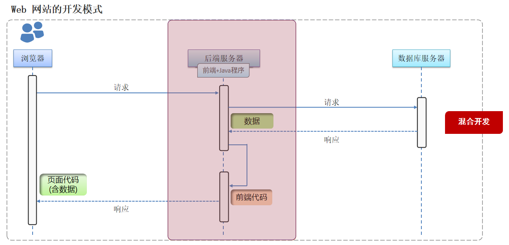

# JavaWeb
<!-- more -->

## 什么是 web 开发

**Web**：全球广域网，也称为**万维网** ( www **W**orld **W**ide **W**eb ) ，能够通过浏览器访问的**网站**。

## 网站的工作流程

1. 首先我们需要通过**浏览器**访问发布到**前端服务器**中的**前端程序**，这时候前端程序会将前端代码返回给浏览器

    

2. 浏览器得到前端代码，此时浏览器会将前端代码进行解析，展示到浏览器的窗口中，这时候我们就看到了**网站**的**页面**

    

3. 但是此时页面是没有数据的，因为数据在数据库中，所以浏览器需要根据**前端代码中指定的后台服务器的地址**向**后台服务器**（内部有java程序）发起**请求**，后台服务器再去从**数据库**中获取数据，随后返回给浏览器。

    

4. 浏览器拿到后台返回的数据后，将数据展示在前端资源也就是**网页**上

    

**整个流程如下：**

1. 浏览器先向前端服务器请求**前端资源**，也就是我们所说的**网页**

2. 浏览器再向**后台服务器**发起请求，获取**数据**

3. 浏览器将得到的后台**数据**填充到**网页**上，展示给用户去看

## 网站的开发模式

主要有2种：前后端分离和混合开发

**前后端分离**： **目前企业开发的主流**

::: note 特点

- 前端人员开发前端程序，前端程序单独部署到前端服务器上

- 后端人员开发后端程序，后端程序单独部署到后端服务器上

:::

**混合开发**：**早期开发技术**

::: note 特点

前端人员开发的代码和后端人员开发的代码在同一个项目中，一起打包部署。

:::

## 网站的开发技术

**前端web开发**：

| 技术       | 描述                                          |
| ---------- | --------------------------------------------- |
| HTML       | 用于构建网站的基础结构                      |
| CSS        | 用于美化页面    |
| JavaScript | 实现网页和用户的交互                          |
| Vue        | 将数据填充到html页面上的              |
| Element    | 提供一些美观的组件                  |
| Nginx      | 一款web服务器软件，用于部署前端工程 |

**后端web开发**：

| 技术       | 描述                                           |
| ---------- | ---------------------------------------------- |
| Maven      | 管理项目的软件                   |
| Mysql      | 数据库软件之一                     |
| SpringBoot | spring家族的产品，当前最为主流的项目开发技术。 |
| Mybatis    | 操作数据库的框架                           |
