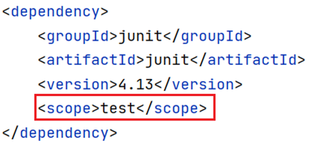
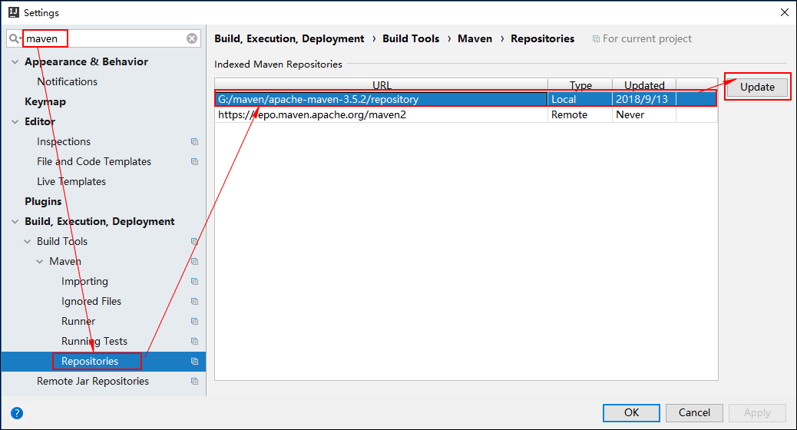

# Maven
<!-- more -->

Maven是专门用于**构建**和**管理**Java项目的工具

:::note 主要功能：

提供了一套标准化的 **项目结构**  
提供了一套标准化的 **构建流程** （编译，测试，打包，发布……）  
提供了一套 **依赖管理** 机制  

:::


Maven使用标准的 `坐标` 配置来管理各种依赖


## 1 Maven简介

Apache Maven 是一个项目管理和构建的工具，它基于项目对象模型 ( POM ) 的概念，通过一小段描述信息来管理项目的构建、报告和文档。

### 1.1 Maven模型

* 项目对象模型 (Project Object Model)
* 依赖管理模型(Dependency)
* 插件(Plugin)


上图就是Maven的模型，紫色部分，是用来完成 `标准化构建流程` 。如我们需要编译，Maven提供了一个编译插件，我们需要打包，Maven就提供了一个打包插件。


上图紫色部分，**项目对象模型**就是将自己抽象成一个对象模型，有自己专属的坐标，如下图所示


**依赖管理模型**则是使用坐标来描述当前项目依赖哪些第三方 jar 包


### 1.2 仓库分类

* 本地仓库：自己计算机上的一个目录
* [中央仓库](https://repo1.maven.org/maven2/)：由Maven团队维护的全球唯一的仓库
* 远程仓库(私服)：一般由公司团队搭建的私有仓库

## 2 Maven安装配置

**目录结构**：


* bin目录 ： 可执行命令。mvn 命令（重点关注）。
* conf目录 ： Maven的配置文件。`settings.xml` 
* lib目录 ： Maven依赖的jar包。Maven也是使用java开发的，所以它也依赖其他的jar包。

**配置本地仓库**：

  修改 conf/settings.xml 中的 \<localRepository> 为一个指定目录作为本地仓库，用来存储jar包。

  

  

**配置阿里云私服**：
  修改 conf/settings.xml 中的 \<mirrors> 标签，添加子标签：

  ```xml
  <mirror>  
      <id>alimaven</id>  
      <name>aliyun maven</name>  
      <url>http://maven.aliyun.com/nexus/content/groups/public/</url>
      <mirrorOf>central</mirrorOf>          
  </mirror>
  ```

## 3 Maven基本使用

### 3.1 Maven 常用命令

::: tip 5个常用命令
compile ：编译 （ 编译项目源代码 ）  
clean：清理（ 移除上一次构建生成的文件 ）  
test：测试  （ 使用合适的单元测试框架运行测试(junit) ）  
package：打包  （ 将编译后的文件打包，如：jar、war等 ）  
install：安装 （ 安装项目到本地仓库 ）

:::


**安装命令演示：**

```html
mvn install
```

该命令会将当前项目打成jar包，并安装到本地仓库。


### 3.2 Maven 生命周期

Maven对项目构建的生命周期划分为3套（相互独立）：


* clean ：清理工作。
* default ：核心工作，例如编译、测试、打包、安装、部署等。
* site ： 产生报告，发布站点等。这套声明周期一般不会使用。

**同一套生命周期内，执行后边的命令，前面的所有命令会自动执行**。例如默认（default）生命周期如下：


当我们执行 `install`（安装）命令时，它会先执行 `compile`命令，再执行 `test` 命令，再执行 `package` 命令，最后执行 `install` 命令。

**三套生命周期又包含哪些具体的阶段呢**？


## 4 IDEA使用Maven

**什么是坐标？**

* Maven 中的坐标是**资源的唯一标识**
* 使用坐标来**定义项目**或**引入项目**中需要的依赖

**Maven 坐标主要组成**:

* groupId：定义当前Maven项目隶属组织名称（通常是域名反写，例如：com.baidu）
* artifactId：定义当前Maven项目名称（通常是模块名称，例如 order-service、goods-service）
* version：定义当前项目版本号


::: note 注意

上面所说的资源可以是插件、依赖、当前项目。  
项目如果被其他的项目依赖时，也是需要坐标来引入的。

:::

## 5  依赖管理

[Maven坐标网站](https://mvnrepository.com/)

### 5.1 添加依赖的几种方式

1. 利用中央仓库搜索的依赖坐标

   

2. 利用IDEA工具搜索依赖坐标

   

3. 快速导入依赖坐标

   

### 5.2 依赖范围

设置坐标的依赖范围(scope)，可以设置对应jar包的作用范围：编译环境、测试环境、运行环境。

下图给 `junit` 依赖通过 `scope` 标签指定依赖的作用范围。 那么这个依赖就只能作用在测试环境，其他环境下不能使用。



那么 `scope` 都可以有哪些取值呢？

| **依赖范围** | 编译classpath | 测试classpath | 运行classpath | 例子              |
| ------------ | ------------- | ------------- | ------------- | ----------------- |
| **compile**  | Y             | Y             | Y             | logback           |
| **test**     | -             | Y             | -             | Junit             |
| **provided** | Y             | Y             | -             | servlet-api       |
| **runtime**  | -             | Y             | Y             | jdbc驱动          |
| **system**   | Y             | Y             | -             | 存储在本地的jar包 |

* compile ：作用于编译环境、测试环境、运行环境。
* test ： 作用于测试环境。典型的就是Junit坐标，以后使用Junit时，都会将scope指定为该值
* provided ：作用于编译环境、测试环境。`servlet-api` ，在使用它时，必须将 `scope` 设置为该值，不然运行时就会报错
* runtime  ： 作用于测试环境、运行环境。jdbc驱动一般将 `scope` 设置为该值，当然不设置也没有任何问题

### 5.3 更新依赖索引

有时候idea配置完maven仓库信息后，在idea中依然搜索不到仓库中的jar包。这是因为仓库中的jar包索引尚未更新到idea中，这个时候要更新idea中maven的索引。

具体做法：打开设置----> 搜索maven----> Repositories----> 选中本地仓库-----> 点击Update


