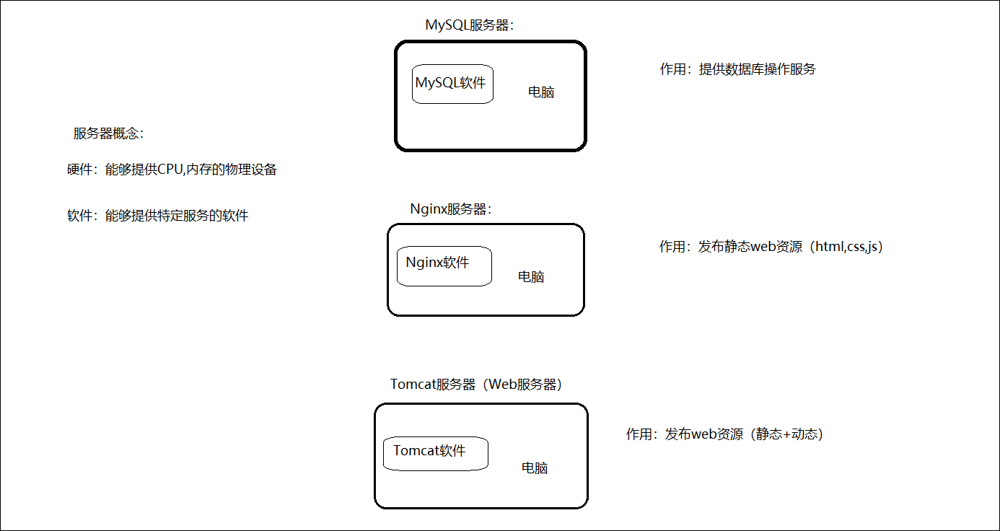

# HTTP协议
<!-- more -->

SpringFramework中提供很多实用功能  
如：依赖注入、事务管理、web开发支持、数据访问、消息服务等等。

## 1. Web分析

## 2. HTTP协议

### 2.1 HTTP-概述

**介绍**:

HTTP：Hyper Text Transfer Protocol（ 超文本传输协议 ），规定了浏览器与服务器之间数据传输的规则。

浏览器向服务器进行请求时：

服务器向浏览器进行响应时：

::: note 特点

**基于TCP协议:** 面向连接，安全

**基于请求-响应模型:**   一次请求对应一次响应（先请求后响应）

**HTTP协议是无状态协议:**  对于数据没有记忆能力。每次请求-响应都是独立的
:::

### 2.2 HTTP-请求协议

**浏览器**和**服务器**是按照HTTP协议进行数据通信的。

HTTP协议又分为：请求协议和响应协议

- 请求协议：浏览器将数据以请求格式发送到服务器
  - 包括：**请求行**、**请求头** 、**请求体**
- 响应协议：服务器将数据以响应格式返回给浏览器
  - 包括：**响应行** 、**响应头** 、**响应体**

GET请求和POST请求的区别：

| 区别方式     | GET请求                                                      | POST请求             |
| ------------ | ------------------------------------------------------------ | -------------------- |
| 请求参数     | 请求参数在请求行中。 例：/brand/findAll?name=OPPO&status=1 | 请求参数在请求体中   |
| 请求参数长度 | 请求参数长度有限制(浏览器不同限制也不同)                     | 请求参数长度没有限制 |
| 安全性       | 安全性低。原因：请求参数暴露在浏览器地址栏中。               | 安全性相对高         |

### 2.3 HTTP-响应协议

与HTTP的请求一样，HTTP响应的数据也分为3部分：**响应行**、**响应头** 、**响应体**

响应行由`协议及版本`、`响应状态码`、`状态码描述`组成

#### [响应状态码](https://cloud.tencent.com/developer/chapter/13553)

| 状态码分类 | 说明                                                         |
| ---------- | ------------------------------------------------------------ |
| 1xx        | **响应中** --- 临时状态码。表示请求已经接受，告诉客户端应该继续请求或者如果已经完成则忽略 |
| 2xx        | **成功** --- 表示请求已经被成功接收，处理已完成              |
| 3xx        | **重定向** --- 重定向到其它地方，让客户端再发起一个请求以完成整个处理 |
| 4xx        | **客户端错误** --- 处理发生错误，责任在客户端，如：客户端的请求一个不存在的资源，客户端未被授权，禁止访问等 |
| 5xx        | **服务器端错误** --- 处理发生错误，责任在服务端，如：服务端抛出异常，路由出错，HTTP版本不支持等 |

## 3. WEB服务器-Tomcat

### 3.1 服务器概述

**服务器硬件**:

服务器是提供计算服务的设备。

服务器的构成包括处理器、硬盘、内存、系统总线等，和通用的计算机架构类似，但是由于需要提供高可靠的服务，因此在处理能力、稳定性、可靠性、安全性、可扩展性、可管理性等方面要求较高。

在网络环境下，根据服务器提供的服务类型不同，可分为：文件服务器，数据库服务器，应用程序服务器，WEB服务器等。

**服务器软件**:

基于ServerSocket编写的程序

- 服务器软件本质是一个运行在服务器设备上的应用程序
- 能够接收客户端请求，并根据请求给客户端响应数据

#### Web服务器

Web服务器是一个应用程序(软件)，对HTTP协议的操作进行封装。主要功能是"提供网上信息浏览服务"。

#### [Tomcat](https://tomcat.apache.org/)

Tomcat服务器软件是一个免费的开源的web应用服务器

因为Tomcat支持Servlet/JSP规范，所以Tomcat也被称为Web容器、Servlet容器。JavaWeb程序需要依赖Tomcat才能运行。
