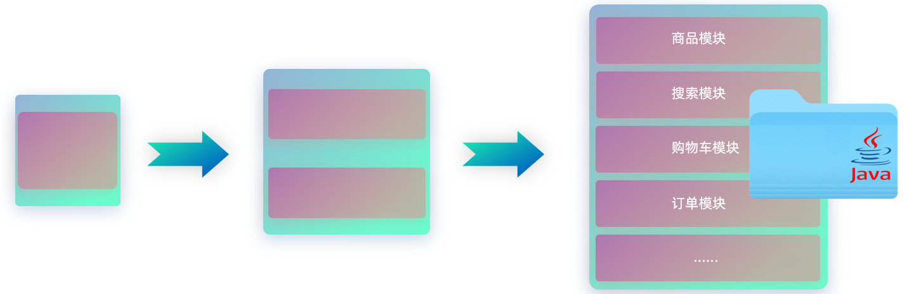
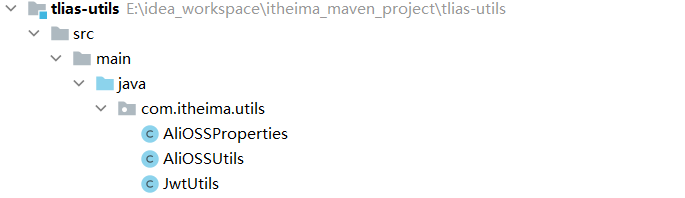
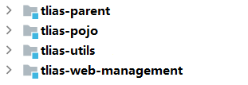
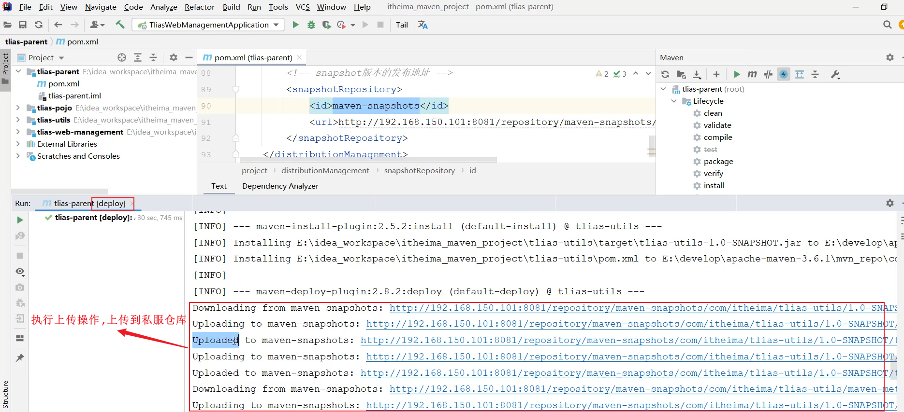

# Maven高级
<!-- more -->

Maven 是一款 **构建和管理** Java 项目的工具

## 1. 分模块设计与开发

### 1.1 介绍

在设计一个 Java 项目的时候，将一个 Java 项目拆分成多个模块进行开发。

**1. 未分模块设计的问题**:



**总结，两点问题：不方便项目的维护和管理、项目中的通用组件难以复用。**

**2. 分模块设计**:

项目设计阶段，将一个大的项目拆分成若干个模块，每一个模块都是独立的


**分模块设计就是将项目按照功能/结构拆分成若干个子模块，方便项目的管理维护、拓展，也方便模块键的相互调用、资源共享。**

### 1.2 实践

#### 1.2.1 分析

在这个项目当中，除了开发的部门管理以及员工管理、登录认证等相关业务功能以外，也定义了一些实体类，也就是pojo包下存放的一些类，像分页结果的封装类PageBean、 统一响应结果Result，还定义了一些通用的工具类，像Jwts、阿里云OSS操作的工具类等等。

如果在当前公司的其他项目组当中，也想使用封装的公共的组件，该怎么办？

- 方案一：直接依赖当前项目 tlias-web-management ，但是存在两大缺点：

  - 这个项目当中包含所有的业务功能代码，而想共享的资源，仅仅是pojo下的实体类，以及 utils 下的工具类。如果全部都依赖进来，项目在启动时将会把所有的类都加载进来，会**影响性能**。
  - 如果直接把这个项目都依赖进来了，那也就意味着所有的业务代码都对外公开了，是非常**不安全**的。

- 方案二：分模块设计

  - 将pojo包下的实体类，抽取到一个maven模块中 tlias-pojo
  - 将utils包下的工具类，抽取到一个maven模块中 tlias-utils
  - 其他的业务代码，放在tlias-web-management这个模块中，在该模块中需要用到实体类pojo、工具类utils，直接引入对应的依赖即可。

  

> **注意：分模块开发需要先针对模块功能进行设计，再进行编码。不会先将工程开发完毕，然后进行拆分。**

#### 1.2.2 实现

**1. 创建maven模块 tlias-pojo，存放实体类**:

A. 创建一个正常的Maven模块，模块名tlias-pojo


B. 然后在tlias-pojo中创建一个包 com.itheima.pojo (和原来案例项目中的pojo包名一致)


C. 将原来案例项目 tlias-web-management 中的pojo包下的实体类，复制到tlias-pojo模块中


D. 在 tlias-pojo 模块的pom.xml文件中引入依赖

```xml
<dependencies>
    <dependency>
        <groupId>org.projectlombok</groupId>
        <artifactId>lombok</artifactId>
        <version>1.18.24</version>
    </dependency>
</dependencies>
```

E. 删除原有案例项目tlias-web-management的pojo包【直接删除不要犹豫，已经将该模块拆分出去了】，然后在pom.xml中引入 tlias-pojo的依赖

```xml
<dependency>
    <groupId>com.itheima</groupId>
    <artifactId>tlias-pojo</artifactId>
    <version>1.0-SNAPSHOT</version>
</dependency>
```

**2. 创建Maven模块 tlias-utils，存放相关工具类**:

A. 创建一个正常的Maven模块，模块名tlias-utils


B. 然后在 tlias-utils 中创建一个包 com.itheima.utils (和原来案例项目中的utils包名一致)


C. 将原来案例项目 tlias-web-management 中的utils包下的实体类，复制到tlias-utils模块中



D. 在 tlias-utils 模块的pom.xml文件中引入依赖

```xml
<dependencies>
    <!--JWT令牌-->
    <dependency>
        <groupId>io.jsonwebtoken</groupId>
        <artifactId>jjwt</artifactId>
        <version>0.9.1</version>
    </dependency>

    <!--阿里云OSS-->
    <dependency>
        <groupId>com.aliyun.oss</groupId>
        <artifactId>aliyun-sdk-oss</artifactId>
        <version>3.15.1</version>
    </dependency>
    <dependency>
        <groupId>javax.xml.bind</groupId>
        <artifactId>jaxb-api</artifactId>
        <version>2.3.1</version>
    </dependency>
    <dependency>
        <groupId>javax.activation</groupId>
        <artifactId>activation</artifactId>
        <version>1.1.1</version>
    </dependency>
    <!-- no more than 2.3.3-->
    <dependency>
        <groupId>org.glassfish.jaxb</groupId>
        <artifactId>jaxb-runtime</artifactId>
        <version>2.3.3</version>
    </dependency>

    <!--WEB开发-->
    <dependency>
        <groupId>org.springframework.boot</groupId>
        <artifactId>spring-boot-starter-web</artifactId>
        <version>2.7.5</version>
    </dependency>

    <dependency>
        <groupId>org.projectlombok</groupId>
        <artifactId>lombok</artifactId>
        <version>1.18.24</version>
    </dependency>
</dependencies>
```

E. 删除原有案例项目tlias-web-management的utils包【直接删除不要犹豫，已经将该模块拆分出去了】，然后在pom.xml中引入 tlias-utils的依赖

```xml
<dependency>
    <groupId>com.itheima</groupId>
    <artifactId>tlias-utils</artifactId>
    <version>1.0-SNAPSHOT</version>
</dependency>
```

**拆分出了 tlias-pojo、tlias-utils、tlias-web-management ，如果其他项目中需要用到 pojo，或者 utils工具类，就可以直接引入依赖。**

### 1.3 总结

> 1. 什么是分模块设计：将项目按照功能拆分成若干个子模块
> 2. 为什么要分模块设计：方便项目的管理维护、扩展，也方便模块间的相互调用，资源共享
> 3. 注意事项：分模块设计需要先针对模块功能进行设计，再进行编码。不会先将工程开发完毕，然后进行拆分

## 2. 继承与聚合

tlias-pojo、tlias-utils、tlias-web-management中都引入了一个依赖 lombok 的依赖


### 2.1 继承

创建一个父工程tlias-parent，让上述的三个模块tlias-pojo、tlias-utils、tlias-web-management继承父工程。再将各个模块中都共有的依赖，都提取到父工程 tlias-parent 中进行配置


- 概念：继承描述的是两个工程间的关系，与java中的继承相似，子工程可以继承父工程中的配置信息，常见于依赖关系的继承。

- 作用：简化依赖配置、统一管理依赖

- 实现：

  ```xml
  <parent>
      <groupId>...</groupId>
      <artifactId>...</artifactId>
      <version>...</version>
      <relativePath>....</relativePath>
  </parent>
  ```

#### 2.1.1 继承关系

思路分析：

项目 tlias-web-management，稍微有一点特殊，因为是一个springboot项目，而所有的springboot项目都有一个统一的父工程，就是spring-boot-starter-parent。

创建的三个模块，都继承tlias-parent，而tlias-parent 再继承 spring-boot-starter-parent


实现：

1. 创建maven模块 tlias-parent ，该工程为父工程，设置打包方式pom(默认jar)。

    

    

    工程结构如下：

    

    父工程tlias-parent的pom.xml文件配置如下：

    ```xml
    <parent>
        <groupId>org.springframework.boot</groupId>
        <artifactId>spring-boot-starter-parent</artifactId>
        <version>2.7.5</version>
        <relativePath/> <!-- lookup parent from repository -->
    </parent>

    <groupId>com.itheima</groupId>
    <artifactId>tlias-parent</artifactId>
    <version>1.0-SNAPSHOT</version>
    <packaging>pom</packaging>
    ```

    > Maven打包方式：
    >
    > - jar：普通模块打包，springboot项目基本都是jar包（内嵌tomcat运行）
    > - war：普通web程序打包，需要部署在外部的tomcat服务器中运行
    > - pom：父工程或聚合工程，该模块不写代码，仅进行依赖管理

2. 在子工程的pom.xml文件中，配置继承关系。

    ```xml
    <parent>
        <groupId>com.itheima</groupId>
        <artifactId>tlias-parent</artifactId>
        <version>1.0-SNAPSHOT</version>
        <relativePath>../tlias-parent/pom.xml</relativePath>
    </parent>

    <artifactId>tlias-utils</artifactId>
    <version>1.0-SNAPSHOT</version>
    ```

    这里是以 tlias-utils 为例，指定了其父工程。其他的模块，都是相同的配置方式。

    > 注意：
    >
    > - 在子工程中，配置了继承关系之后，坐标中的groupId是可以省略的，因为会自动继承父工程的 。
    > - relativePath指定父工程的pom文件的相对位置（如果不指定，将从本地仓库/远程仓库查找该工程）。

3. 在父工程中配置各个工程共有的依赖（子工程会自动继承父工程的依赖）。

    ```xml
    <dependencies>
        <dependency>
            <groupId>org.projectlombok</groupId>
            <artifactId>lombok</artifactId>
            <version>1.18.24</version>
        </dependency>
    </dependencies>
    ```


> **工程结构说明：**
>
>
>
> 项目开发完毕之后，基于现有项目拆分的各个模块，tlias-web-management已经存在了，然后再创建各个模块与父工程，所以父工程与模块之间是平级的。
>
> - 而实际项目中，可能还会见到下面的工程结构：
>
>   
>
>   而在真实的企业开发中，都是先设计好模块之后，再开始创建模块，开发项目。 此时呢，一般都会先创建父工程 tlias-parent，然后将创建的各个子模块，都放在父工程parent下面。 这样层级结构会更加清晰一些。
>
>   **PS：上面两种工程结构，都是可以正常使用的。 只不过第二种结构，父子工程结构更加清晰、更加直观。**

#### 2.1.2 版本锁定

场景：

要使用的同一个依赖的版本要一致，这样便于项目依赖的统一管理。比如：这个jwt依赖，使用的是 0.9.1


项目要升级，需要将依赖的版本升级到0.9.2，该怎么做呢 ？

第一步：去找当前项目中所有的模块的pom.xml配置文件，看哪些模块用到了jwt的依赖。

第二步：找到这个依赖之后，将其版本version，更换为 0.9.2。

**问题：如果项目拆分的模块比较多，每一次更换版本，都得找到这个项目中的每一个模块，一个一个的更改。 很容易就会出现，遗漏掉一个模块，忘记更换版本的情况。**

如何来统一管理各个依赖的版本呢？

答案：Maven的版本锁定功能。

**介绍**：

在maven中，可以在父工程的pom文件中通过 `<dependencyManagement>` 来统一管理依赖版本。

父工程：

```xml
<!--统一管理依赖版本-->
<dependencyManagement>
    <dependencies>
        <!--JWT令牌-->
        <dependency>
            <groupId>io.jsonwebtoken</groupId>
            <artifactId>jjwt</artifactId>
            <version>0.9.1</version>
        </dependency>
    </dependencies>
</dependencyManagement>
```

子工程：

```xml
<dependencies>
    <!--JWT令牌-->
    <dependency>
        <groupId>io.jsonwebtoken</groupId>
        <artifactId>jjwt</artifactId>
    </dependency>
</dependencies>
```

> 注意：
>
> - 在父工程中所配置的 `<dependencyManagement>` 只能统一管理依赖版本，并不会将这个依赖直接引入进来。 这点和 `<dependencies>` 是不同的。
>
> - 子工程要使用这个依赖，还是需要引入的，只是此时就无需指定 `<version>` 版本号了，父工程统一管理。变更依赖版本，只需在父工程中统一变更。

**实现**：

将tlias-utils模块中单独配置的依赖，将其版本统一交给 tlias-parent 进行统一管理。

具体步骤如下：

1. tlias-parent 中的配置

    ```xml
    <!--统一管理依赖版本-->
    <dependencyManagement>
        <dependencies>
            <!--JWT令牌-->
            <dependency>
                <groupId>io.jsonwebtoken</groupId>
                <artifactId>jjwt</artifactId>
                <version>0.9.1</version>
            </dependency>

            <!--阿里云OSS-->
            <dependency>
                <groupId>com.aliyun.oss</groupId>
                <artifactId>aliyun-sdk-oss</artifactId>
                <version>3.15.1</version>
            </dependency>
            <dependency>
                <groupId>javax.xml.bind</groupId>
                <artifactId>jaxb-api</artifactId>
                <version>2.3.1</version>
            </dependency>
            <dependency>
                <groupId>javax.activation</groupId>
                <artifactId>activation</artifactId>
                <version>1.1.1</version>
            </dependency>
            <!-- no more than 2.3.3-->
            <dependency>
                <groupId>org.glassfish.jaxb</groupId>
                <artifactId>jaxb-runtime</artifactId>
                <version>2.3.3</version>
            </dependency>
        </dependencies>
    </dependencyManagement>
    ```

2. tlias-utils中的pom.xml配置

    如果依赖的版本已经在父工程进行了统一管理，在子工程中就无需再配置依赖的版本了。

    ```xml
    <dependencies>
        <!--JWT令牌-->
        <dependency>
            <groupId>io.jsonwebtoken</groupId>
            <artifactId>jjwt</artifactId>
        </dependency>

        <!--阿里云OSS-->
        <dependency>
            <groupId>com.aliyun.oss</groupId>
            <artifactId>aliyun-sdk-oss</artifactId>
        </dependency>
        <dependency>
            <groupId>javax.xml.bind</groupId>
            <artifactId>jaxb-api</artifactId>
        </dependency>
        <dependency>
            <groupId>javax.activation</groupId>
            <artifactId>activation</artifactId>
        </dependency>
        <!-- no more than 2.3.3-->
        <dependency>
            <groupId>org.glassfish.jaxb</groupId>
            <artifactId>jaxb-runtime</artifactId>
        </dependency>

        <!--WEB开发-->
        <dependency>
            <groupId>org.springframework.boot</groupId>
            <artifactId>spring-boot-starter-web</artifactId>
        </dependency>
    </dependencies>
    ```

> 之所以在springboot项目中很多时候，引入依赖坐标，都不需要指定依赖的版本 `<version>` ，是因为在父工程 spring-boot-starter-parent中已经通过 `<dependencyManagement>`对依赖的版本进行了统一的管理维护。

**属性配置**：

也可以通过自定义属性及属性引用的形式，在父工程中将依赖的版本号进行集中管理维护。 具体语法为：

1. 自定义属性

    ```xml
    <properties>
        <lombok.version>1.18.24</lombok.version>
    </properties>
    ```

2. 引用属性

    ```xml
    <dependency>
        <groupId>org.projectlombok</groupId>
        <artifactId>lombok</artifactId>
        <version>${lombok.version}</version>
    </dependency>
    ```

在父工程中，将所有的版本号，都集中管理维护起来。

```xml
<properties>
    <maven.compiler.source>11</maven.compiler.source>
    <maven.compiler.target>11</maven.compiler.target>

    <lombok.version>1.18.24</lombok.version>
    <jjwt.version>0.9.1</jjwt.version>
    <aliyun.oss.version>3.15.1</aliyun.oss.version>
    <jaxb.version>2.3.1</jaxb.version>
    <activation.version>1.1.1</activation.version>
    <jaxb.runtime.version>2.3.3</jaxb.runtime.version>
</properties>


<dependencies>
    <dependency>
        <groupId>org.projectlombok</groupId>
        <artifactId>lombok</artifactId>
        <version>${lombok.version}</version>
    </dependency>
</dependencies>

<!--统一管理依赖版本-->
<dependencyManagement>
    <dependencies>
        <!--JWT令牌-->
        <dependency>
            <groupId>io.jsonwebtoken</groupId>
            <artifactId>jjwt</artifactId>
            <version>${jjwt.version}</version>
        </dependency>

        <!--阿里云OSS-->
        <dependency>
            <groupId>com.aliyun.oss</groupId>
            <artifactId>aliyun-sdk-oss</artifactId>
            <version>${aliyun.oss.version}</version>
        </dependency>
        <dependency>
            <groupId>javax.xml.bind</groupId>
            <artifactId>jaxb-api</artifactId>
            <version>${jaxb.version}</version>
        </dependency>
        <dependency>
            <groupId>javax.activation</groupId>
            <artifactId>activation</artifactId>
            <version>${activation.version}</version>
        </dependency>
        <!-- no more than 2.3.3-->
        <dependency>
            <groupId>org.glassfish.jaxb</groupId>
            <artifactId>jaxb-runtime</artifactId>
            <version>${jaxb.runtime.version}</version>
        </dependency>
    </dependencies>
</dependencyManagement>
```

版本集中管理之后，修改依赖的版本，就只需要在父工程中自定义属性的位置，修改对应的属性值即可。

> **面试题：`<dependencyManagement>` 与 `<dependencies>` 的区别是什么?**
>
> - `<dependencies>` 是直接依赖，在父工程配置了依赖，子工程会直接继承下来。
> - `<dependencyManagement>` 是统一管理依赖版本，不会直接依赖，还需要在子工程中引入所需依赖(无需指定版本)

### 2.2 聚合

分模块设计与开发之后项目被拆分为多个模块，而模块之间的关系，可能错综复杂


通过maven的聚合可以轻松实现项目的一键构建（清理、编译、测试、打包、安装等）。

#### 2.2.1 介绍


- **聚合：** 将多个模块组织成一个整体，同时进行项目的构建。
- **聚合工程：** 一个不具有业务功能的“空”工程（有且仅有一个pom文件） 【PS：一般来说，继承关系中的父工程与聚合关系中的聚合工程是同一个】
- **作用：** 快速构建项目（无需根据依赖关系手动构建，直接在聚合工程上构建即可）

#### 2.2.2 实现

在maven中，聚合工程中通过 `<moudules>` 设置当前聚合工程所包含的子模块的名称。在 tlias-parent中，添加如下配置，来指定当前聚合工程，需要聚合的模块：

```java
<!--聚合其他模块-->
<modules>
    <module>../tlias-pojo</module>
    <module>../tlias-utils</module>
    <module>../tlias-web-management</module>
</modules>
```

此时只需要在聚合工程上，统一进行操作就可以了。

**测试：** 执行在聚合工程 tlias-parent 中执行 package 打包指令


通过聚合实现项目的一键构建（一键清理clean、一键编译compile、一键测试test、一键打包package、一键安装install等）。

### 2.3 继承与聚合对比

- **作用**

  - 聚合用于快速构建项目

  - 继承用于简化依赖配置、统一管理依赖

- **相同点：**

  - 聚合与继承的pom.xml文件打包方式均为pom，通常将两种关系制作到同一个pom文件中

  - 聚合与继承均属于设计型模块，并无实际的模块内容

- **不同点：**

  - 聚合是在聚合工程中配置关系，聚合可以感知到参与聚合的模块有哪些

  - 继承是在子模块中配置关系，父模块无法感知哪些子模块继承了自己

## 3. 私服

### 3.1 场景

同一个公司，两个项目组之间如何基于私服进行资源的共享。

假设现在有两个团队，A 和 B。 A 开发了一个模块 tlias-utils，模块开发完毕之后，将模块打成jar包，并安装到了A的本地仓库。


那此时，该公司的B团队开发项目时，要想使用 tlias-utils 中提供的工具类，该怎么办呢？


当B团队在maven项目的pom.xml配置文件中引入了依赖的坐标之后，maven是如何查找这个依赖的？ 查找顺序为：

1. 本地仓库：本地仓库中是没有这个依赖jar包的。

2. 远程中央仓库：由于该模块时自己公司开发的，远程仓库中也没有这个依赖。

因为目前tlias-utils这个依赖，还在A的本地仓库中的。 B电脑上的maven项目，是不可能找得到A电脑上maven本地仓库的jar包的。


私服其实就是架设在公司局域网内部的一台服务器，就是一种特殊的远程仓库。


### 3.2 介绍

- **私服：** 是一种特殊的远程仓库，它是架设在局域网内的仓库服务，用来代理位于外部的中央仓库，用于解决团队内部的资源共享与资源同步问题。
- **依赖查找顺序：**
  - 本地仓库
  - 私服仓库
  - 中央仓库
- **注意事项：** 私服在企业项目开发中，一个项目/公司，只需要一台即可（无需我们自己搭建，会使用即可）。


### 3.3 资源上传与下载

#### 3.3.1 步骤分析


资源上传与下载，需要做三步配置，执行一条指令。

第一步配置：在maven的配置文件中配置访问私服的用户名、密码。

第二步配置：在maven的配置文件中配置连接私服的地址(url地址)。

第三步配置：在项目的pom.xml文件中配置上传资源的位置(url地址)。

要上传资源到私服仓库，执行maven生命周期：deploy。

> 私服仓库说明：
>
> - RELEASE：存储自己开发的RELEASE发布版本的资源。
> - SNAPSHOT：存储自己开发的SNAPSHOT发布版本的资源。
> - Central：存储的是从中央仓库下载下来的依赖。
> 项目版本说明：
>
> - RELEASE(发布版本)：功能趋于稳定、当前更新停止，可以用于发行的版本，存储在私服中的RELEASE仓库中。
> - SNAPSHOT(快照版本)：功能不稳定、尚处于开发中的版本，即快照版本，存储在私服的SNAPSHOT仓库中。

#### 3.3.2 具体操作

模拟企业开发，用一台服务器将私服搭建好，访问私服测试：[http://192.168.150.101:8081]


**1.设置私服的访问用户名/密码（在自己maven安装目录下的conf/settings.xml中的servers中配置）**:

```xml
<server>
    <id>maven-releases</id>
    <username>admin</username>
    <password>admin</password>
</server>
    
<server>
    <id>maven-snapshots</id>
    <username>admin</username>
    <password>admin</password>
</server>
```

**2.设置私服依赖下载的仓库组地址（在自己maven安装目录下的conf/settings.xml中的mirrors、profiles中配置）**:

```xml
<mirror>
    <id>maven-public</id>
    <mirrorOf>*</mirrorOf>
    <url>http://192.168.150.101:8081/repository/maven-public/</url>
</mirror>
```

```xml
<profile>
    <id>allow-snapshots</id>
        <activation>
            <activeByDefault>true</activeByDefault>
        </activation>
    <repositories>
        <repository>
            <id>maven-public</id>
            <url>http://192.168.150.101:8081/repository/maven-public/</url>
            <releases>
                <enabled>true</enabled>
            </releases>
            <snapshots>
                <enabled>true</enabled>
            </snapshots>
        </repository>
    </repositories>
</profile>
```

**3.IDEA的maven工程的pom文件中配置上传（发布）地址(直接在tlias-parent中配置发布地址)**:

```xml
<distributionManagement>
    <!-- release版本的发布地址 -->
    <repository>
        <id>maven-releases</id>
        <url>http://192.168.150.101:8081/repository/maven-releases/</url>
    </repository>

    <!-- snapshot版本的发布地址 -->
    <snapshotRepository>
        <id>maven-snapshots</id>
        <url>http://192.168.150.101:8081/repository/maven-snapshots/</url>
    </snapshotRepository>
</distributionManagement>
```

配置完成之后，在tlias-parent中执行**deploy**生命周期，将项目发布到私服仓库中。



jar包上传到了私服仓库中（由于当前的项目是SNAPSHOT版本，所以jar包是上传到了snapshot仓库中）。


> 备注说明：
>
> - 演示的时候使用了一台服务器192.168.150.101，并在服务器上安装了maven的私服。 这台服务器并不能直接访问。
>
> - 如果要测试使用私服进行资源的上传和下载。可以参照如下步骤，启动给大家准备的本地私服操作：
>   - 解压： 提供的压缩包  apache-maven-nexus.zip
>   - 进入目录： apache-maven-nexus\nexus-3.39.0-01\bin
>
>   - 启动服务：双击 start.bat
>   - 访问服务：localhost:8081
>   - 私服配置说明：将上述配置私服信息的 192.168.150.101 改为 localhost
