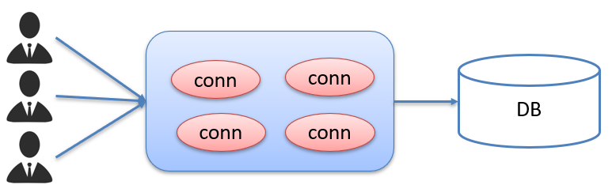

# JDBC
<!-- more -->

## 1 JDBC概述

> Java DataBase Connectivity ： Java 数据库连接

JDBC 就是使用Java语言操作关系型数据库的一套API


::: note 本质

官方（sun公司）定义的一套操作所有关系型数据库的规则，即接口  
各个数据库厂商去实现这套接口，提供数据库驱动jar包  
使用的接口（JDBC）编程，真正执行的代码是驱动jar包中的实现类

:::

::: tip 好处

各数据库厂商使用相同的接口，Java代码不需要针对不同数据库分别开发  
可随时替换底层数据库，访问数据库的Java代码基本不变

:::

## 2 JDBC快速入门

### 2.1  编写代码步骤

注册驱动

```sql
Class.forName("com.mysql.jdbc.Driver");
```

获取连接

```sql
Connection conn = DriverManager.getConnection(url, username, password);
```

**Java代码需要发送SQL给MySQL服务端，就需要先建立连接**:

---

定义SQL语句

```sql
String sql =  “update…” ;
```

**执行SQL语句需要SQL执行对象，而这个执行对象就是Statement对象**:

---

获取执行SQL对象

```sql
Statement stmt = conn.createStatement();
```

执行SQL

```sql
stmt.executeUpdate(sql);  
```

处理返回结果  
释放资源

### 2.2  具体操作

```java
public class JDBCDemo {

    public static void main(String[] args) throws Exception {
        //1. 注册驱动
        //Class.forName("com.mysql.jdbc.Driver");
        //2. 获取连接
        String url = "jdbc:mysql://127.0.0.1:3306/db1";
        String username = "root";
        String password = "123456";
        Connection conn = DriverManager.getConnection(url, username, password);
        //3. 定义sql
        String sql = "update account set money = 2000 where id = 1";
        //4. 获取执行sql的对象 Statement
        Statement stmt = conn.createStatement();
        //5. 执行sql
        int count = stmt.executeUpdate(sql);//受影响的行数
        //6. 处理结果
        System.out.println(count);
        //7. 释放资源
        stmt.close();
        conn.close();
    }
}
```

## 3 JDBC API详解

### 3.1  DriverManager

DriverManager（驱动管理类）作用：

* 注册驱动

  

* 获取数据库连接

  

**参数说明**：

url ： 连接路径

> 语法：jdbc:mysql://ip地址(域名):端口号/数据库名称?参数键值对1&参数键对2…
>
> 示例：jdbc:mysql://127.0.0.1:3306/db1

::: note

配置 useSSL=false 参数，禁用安全连接方式，解决警告提示

:::

### 3.2  Connection

Connection（数据库连接对象）作用：

1. 获取执行 SQL 的对象
2. 管理事务

#### 3.2.1  获取执行对象

* 普通执行SQL对象

  ```sql
  Statement createStatement()
  ```

* 预编译SQL的执行SQL对象：防止SQL注入

  ```sql
  PreparedStatement  prepareStatement(sql)
  ```

* 执行存储过程的对象（不常用）

  ```sql
  CallableStatement prepareCall(sql)
  ```

#### 3.2.2  事务管理

**MySQL事务管理的操作**：

* 开启事务 ： BEGIN; 或者 START TRANSACTION;
* 提交事务 ： COMMIT;
* 回滚事务 ： ROLLBACK;

**JDBC事务管理的方法**：

Connection接口中定义了3个对应的方法：

* 开启事务

  

  参与autoCommit 表示是否自动提交事务，true表示自动提交事务，false表示手动提交事务。而开启事务需要将该参数设为false。

* 提交事务

  

* 回滚事务

  

具体代码实现如下：

```sql
public class JDBCDemo3_Connection {

    public static void main(String[] args) throws Exception {
        //1. 注册驱动
        //Class.forName("com.mysql.jdbc.Driver");
        //2. 获取连接：如果连接的是本机mysql并且端口是默认的 3306 可以简化书写
        String url = "jdbc:mysql:///db1?useSSL=false";
        String username = "root";
        String password = "1234";
        Connection conn = DriverManager.getConnection(url, username, password);
        //3. 定义sql
        String sql1 = "update account set money = 3000 where id = 1";
        String sql2 = "update account set money = 3000 where id = 2";
        //4. 获取执行sql的对象 Statement
        Statement stmt = conn.createStatement();

        try {
            // ============开启事务==========
            conn.setAutoCommit(false);
            //5. 执行sql
            int count1 = stmt.executeUpdate(sql1);//受影响的行数
            //6. 处理结果
            System.out.println(count1);
            int i = 3/0;
            //5. 执行sql
            int count2 = stmt.executeUpdate(sql2);//受影响的行数
            //6. 处理结果
            System.out.println(count2);

            // ============提交事务==========
            //程序运行到此处，说明没有出现任何问题，则需求提交事务
            conn.commit();
        } catch (Exception e) {
            // ============回滚事务==========
            //程序在出现异常时会执行到这个地方，此时就需要回滚事务
            conn.rollback();
            e.printStackTrace();
        }

        //7. 释放资源
        stmt.close();
        conn.close();
    }
}
```

### 3.3  Statement

Statement对象的作用就是用来执行SQL语句。而针对不同类型的SQL语句使用的方法也不一样。

* 执行DDL、DML语句

  

* 执行DQL语句

  

**代码实现**:

执行DML语句

  ```java
  @Test
  public void testDML() throws  Exception {
      //1. 注册驱动
      //Class.forName("com.mysql.jdbc.Driver");
      //2. 获取连接：如果连接的是本机mysql并且端口是默认的 3306 可以简化书写
      String url = "jdbc:mysql:///db1?useSSL=false";
      String username = "root";
      String password = "123456";
      Connection conn = DriverManager.getConnection(url, username, password);
      //3. 定义sql
      String sql = "update account set money = 3000 where id = 1";
      //4. 获取执行sql的对象 Statement
      Statement stmt = conn.createStatement();
      //5. 执行sql
      int count = stmt.executeUpdate(sql);//执行完DML语句，受影响的行数
      //6. 处理结果
      //System.out.println(count);
      if(count > 0){
          System.out.println("修改成功~");
      }else{
          System.out.println("修改失败~");
      }
      //7. 释放资源
      stmt.close();
      conn.close();
  }
  ```

执行DDL语句

  ```java
  @Test
  public void testDDL() throws  Exception {
      //1. 注册驱动
      //Class.forName("com.mysql.jdbc.Driver");
      //2. 获取连接：如果连接的是本机mysql并且端口是默认的 3306 可以简化书写
      String url = "jdbc:mysql:///db1?useSSL=false";
      String username = "root";
      String password = "1234";
      Connection conn = DriverManager.getConnection(url, username, password);
      //3. 定义sql
      String sql = "drop database db2";
      //4. 获取执行sql的对象 Statement
      Statement stmt = conn.createStatement();
      //5. 执行sql
      int count = stmt.executeUpdate(sql);//执行完DDL语句，可能是0
      //6. 处理结果
      System.out.println(count);
  
      //7. 释放资源
      stmt.close();
      conn.close();
  }
  ```

### 3.4  ResultSet

ResultSet（结果集对象）的作用：**封装SQL查询语句的结果**

执行了DQL语句后就会返回该对象

```sql
ResultSet executeQuery(sql)
--执行DQL 语句，返回 ResultSet 对象
```

下图为执行SQL语句后的结果


> boolean  next()
>
> * 将光标从当前位置向前移动一行
> * 判断当前行是否为有效行

一开始光标指定于第一行前，如图所示红色箭头指向于表头行。当我们调用了 `next()` 方法后，光标就下移到第一行数据，并且方法返回true，此时就可以通过 `getInt("id")` 获取当前行id字段的值，也可以通过 `getString("name")` 获取当前行name字段的值。如果想获取下一行的数据，继续调用 `next()`  方法，以此类推。

**代码实现**:

```java
@Test
public void testResultSet() throws  Exception {
    //1. 注册驱动
    //Class.forName("com.mysql.jdbc.Driver");
    //2. 获取连接：如果连接的是本机mysql并且端口是默认的 3306 可以简化书写
    String url = "jdbc:mysql:///db1?useSSL=false";
    String username = "root";
    String password = "1234";
    Connection conn = DriverManager.getConnection(url, username, password);
    //3. 定义sql
    String sql = "select * from account";
    //4. 获取statement对象
    Statement stmt = conn.createStatement();
    //5. 执行sql
    ResultSet rs = stmt.executeQuery(sql);
    //6. 处理结果， 遍历rs中的所有数据

    // 6.1 光标向下移动一行，并且判断当前行是否有数据
    while (rs.next()){
        //6.2 获取数据  getXxx()
        int id = rs.getInt("id");
        String name = rs.getString("name");
        double money = rs.getDouble("money");

        System.out.println(id);
        System.out.println(name);
        System.out.println(money);

        System.out.println("--------------");
    }

    //7. 释放资源
    rs.close();
    stmt.close();
    conn.close();
}
```

### 3.5  案例

需求：查询account账户表数据，封装为Account对象中，并且存储到ArrayList集合中


代码实现

  ```java
  /**
    * 查询account账户表数据，封装为Account对象中，并且存储到ArrayList集合中
    * 1. 定义实体类Account
    * 2. 查询数据，封装到Account对象中
    * 3. 将Account对象存入ArrayList集合中
    */
  @Test
  public void testResultSet2() throws  Exception {
      //1. 注册驱动
      //Class.forName("com.mysql.jdbc.Driver");
      //2. 获取连接：如果连接的是本机mysql并且端口是默认的 3306 可以简化书写
      String url = "jdbc:mysql:///db1?useSSL=false";
      String username = "root";
      String password = "1234";
      Connection conn = DriverManager.getConnection(url, username, password);
  
      //3. 定义sql
      String sql = "select * from account";
  
      //4. 获取statement对象
      Statement stmt = conn.createStatement();
  
      //5. 执行sql
      ResultSet rs = stmt.executeQuery(sql);
  
      // 创建集合
      List<Account> list = new ArrayList<>();
     
      // 6.1 光标向下移动一行，并且判断当前行是否有数据
      while (rs.next()){
          Account account = new Account();
  
          //6.2 获取数据  getXxx()
          int id = rs.getInt("id");
          String name = rs.getString("name");
          double money = rs.getDouble("money");
  
          //赋值
          account.setId(id);
          account.setName(name);
          account.setMoney(money);
  
          // 存入集合
          list.add(account);
      }
  
      System.out.println(list);
  
      //7. 释放资源
      rs.close();
      stmt.close();
      conn.close();
  }
  ```

### 3.6  PreparedStatement

#### 3.6.1  SQL注入

> SQL注入是通过操作输入来修改事先定义好的SQL语句，用以达到执行代码对服务器进行攻击的方法。

#### 3.6.2  代码模拟SQL注入问题

```java
@Test
public void testLogin() throws  Exception {
    //2. 获取连接：如果连接的是本机mysql并且端口是默认的 3306 可以简化书写
    String url = "jdbc:mysql:///db1?useSSL=false";
    String username = "root";
    String password = "1234";
    Connection conn = DriverManager.getConnection(url, username, password);

    // 接收用户输入 用户名和密码
    String name = "sjdljfld";
    String pwd = "' or '1' = '1";
    String sql = "select * from tb_user where username = '"+name+"' and password = '"+pwd+"'";
    // 获取stmt对象
    Statement stmt = conn.createStatement();
    // 执行sql
    ResultSet rs = stmt.executeQuery(sql);
    // 判断登录是否成功
    if(rs.next()){
        System.out.println("登录成功~");
    }else{
        System.out.println("登录失败~");
    }

    //7. 释放资源
    rs.close();
    stmt.close();
    conn.close();
}
```

拼接后的sql语句如下

```sql
select * 
from tb_user 
where username = 'sjdljfld' and password = '' or '1' = '1'
```

#### 3.6.3  PreparedStatement概述

> 预编译SQL语句并执行：预防SQL注入问题

获取 PreparedStatement 对象

  ```java
  // SQL语句中的参数值，使用？占位符替代
  String sql = 
  "select * from user where username = ? and password = ?";

  // 通过Connection对象获取，并传入对应的sql语句
  PreparedStatement pstmt = conn.prepareStatement(sql);
  ```

设置参数值

  > PreparedStatement对象：setXxx(参数1，参数2)：给 ? 赋值
  >
  > Xxx：数据类型 ； 如 setInt (参数1，参数2)
  >
  > 参数：
  >
  > * 参数1： ？的位置编号，从1 开始
  >
  > * 参数2： ？的值

执行SQL语句

  > executeUpdate();  执行DDL语句和DML语句
  >
  > executeQuery();  执行DQL语句  
  >  
  > 注意:
  > 调用这两个方法时不需要传递SQL语句，因为获取SQL语句执行对象时已经对SQL语句进行预编译了。

#### 3.6.4  使用PreparedStatement改进

```java
 @Test
public void testPreparedStatement() throws  Exception {
    //2. 获取连接：如果连接的是本机mysql并且端口是默认的 3306 可以简化书写
    String url = "jdbc:mysql:///db1?useSSL=false";
    String username = "root";
    String password = "1234";
    Connection conn = DriverManager.getConnection(url, username, password);

    // 接收用户输入 用户名和密码
    String name = "zhangsan";
    String pwd = "' or '1' = '1";

    // 定义sql
    String sql = "select * from tb_user where username = ? and password = ?";
    // 获取pstmt对象
    PreparedStatement pstmt = conn.prepareStatement(sql);
    // 设置？的值
    pstmt.setString(1,name);
    pstmt.setString(2,pwd);
    // 执行sql
    ResultSet rs = pstmt.executeQuery();
    // 判断登录是否成功
    if(rs.next()){
        System.out.println("登录成功~");
    }else{
        System.out.println("登录失败~");
    }
    //7. 释放资源
    rs.close();
    pstmt.close();
    conn.close();
}
```

PreparedStatement又是如何解决的呢？它是将特殊字符进行了转义，转义的SQL如下：

```sql
select * from tb_user 
where username = 'sjdljfld' and password = '\'or \'1\' = \'1'
```

#### 3.6.5  PreparedStatement原理

> 预编译SQL，性能更高  
> 防止SQL注入：**将敏感字符进行转义**


检查SQL和编译SQL花费的时间比执行SQL的时间还要长。如果我们只是重新设置参数，那么检查SQL语句和编译SQL语句将不需要重复执行，这样就提高了性能。

## 4 数据库连接池

### 4.1  简介

> * 数据库连接池是个容器，负责分配、管理数据库连接(Connection)
> * 它允许应用程序重复使用一个现有的数据库连接，而不是再重新建立一个
> * 释放空闲时间超过最大空闲时间的数据库连接来避免因为没有释放数据库连接而引起的数据库连接遗漏

好处

* 资源重用
  
* 提升系统响应速度

* 避免数据库连接遗漏



连接池是在一开始就创建好了一些连接（Connection）对象存储起来。用户需要连接数据库时，不需要自己创建连接，而只需要从连接池中获取一个连接进行使用，使用完毕后再将连接对象归还给连接池

### 4.2  数据库连接池实现

标准接口：DataSource

  ```java
  Connection getConnection()
  ```

  以后就不需要通过 `DriverManager` 对象获取 `Connection` 对象，而是通过连接池（DataSource）获取 `Connection` 对象。

::: note 常见的数据库连接池
 DBCP  
 C3P0  
 Druid  
:::

Druid（德鲁伊）

* Druid连接池是阿里巴巴开源的数据库连接池项目

* 功能强大，性能优秀，是Java语言最好的数据库连接池之一

### 4.3  Driud使用

项目结构如下：


编写配置文件如下：

```properties
driverClassName=com.mysql.jdbc.Driver
url=jdbc:mysql:///db1?useSSL=false&useServerPrepStmts=true
username=root
password=1234
# 初始化连接数量
initialSize=5
# 最大连接数
maxActive=10
# 最大等待时间
maxWait=3000
```

使用druid的代码如下：

```java
/**
 * Druid数据库连接池演示
 */
public class DruidDemo {

    public static void main(String[] args) throws Exception {
        //1. 导入jar包
        //2. 定义配置文件
        //3. 加载配置文件
        Properties prop = new Properties();
        prop.load(new FileInputStream("jdbc-demo/src/druid.properties"));
        //4. 获取连接池对象
        DataSource dataSource = DruidDataSourceFactory.createDataSource(prop);

        //5. 获取数据库连接 Connection
        Connection connection = dataSource.getConnection();
        System.out.println(connection); //获取到了连接后就可以继续做其他操作了
        
    }
}
```

## 5 JDBC练习

### 5.1  需求

完成商品品牌数据的增删改查操作

* 查询：查询所有数据
* 添加：添加品牌
* 修改：根据id修改
* 删除：根据id删除

### 5.2  案例实现

**环境准备**：

数据库表 `tb_brand`

  ```sql
  -- 删除tb_brand表
  drop table if exists tb_brand;
  -- 创建tb_brand表
  create table tb_brand (
      -- id 主键
      id int primary key auto_increment,
      -- 品牌名称
      brand_name varchar(20),
      -- 企业名称
      company_name varchar(20),
      -- 排序字段
      ordered int,
      -- 描述信息
      description varchar(100),
      -- 状态：0：禁用  1：启用
      status int
  );
  -- 添加数据
  insert into tb_brand (brand_name, company_name, ordered, description, status)
  values ('三只松鼠', '三只松鼠股份有限公司', 5, '好吃不上火', 0),
         ('华为', '华为技术有限公司', 100, '华为致力于把数字世界带入每个人、每个家庭、每个组织，构建万物互联的智能世界', 1),
         ('小米', '小米科技有限公司', 50, 'are you ok', 1);
  ```

在pojo包下实体类 Brand

  ```java
  /**
   * 品牌
   * alt + 鼠标左键：整列编辑
   * 在实体类中，基本数据类型建议使用其对应的包装类型
   */
  public class Brand {
      // id 主键
      private Integer id;
      // 品牌名称
      private String brandName;
      // 企业名称
      private String companyName;
      // 排序字段
      private Integer ordered;
      // 描述信息
      private String description;
      // 状态：0：禁用  1：启用
      private Integer status;
  
      //get set方法
      //toString方法
  }
  ```

**查询所有**：

```java
 /**
   * 查询所有
   * 1. SQL：select * from tb_brand;
   * 2. 参数：不需要
   * 3. 结果：List<Brand>
   */

@Test
public void testSelectAll() throws Exception {
    //1. 获取Connection
    //3. 加载配置文件
    Properties prop = new Properties();
    prop.load(new FileInputStream("jdbc-demo/src/druid.properties"));
    //4. 获取连接池对象
    DataSource dataSource = DruidDataSourceFactory.createDataSource(prop);

    //5. 获取数据库连接 Connection
    Connection conn = dataSource.getConnection();
    //2. 定义SQL
    String sql = "select * from tb_brand;";
    //3. 获取pstmt对象
    PreparedStatement pstmt = conn.prepareStatement(sql);
    //4. 设置参数
    //5. 执行SQL
    ResultSet rs = pstmt.executeQuery();
    //6. 处理结果 List<Brand> 封装Brand对象，装载List集合
    Brand brand = null;
    List<Brand> brands = new ArrayList<>();
    while (rs.next()){
        //获取数据
        int id = rs.getInt("id");
        String brandName = rs.getString("brand_name");
        String companyName = rs.getString("company_name");
        int ordered = rs.getInt("ordered");
        String description = rs.getString("description");
        int status = rs.getInt("status");
        //封装Brand对象
        brand = new Brand();
        brand.setId(id);
        brand.setBrandName(brandName);
        brand.setCompanyName(companyName);
        brand.setOrdered(ordered);
        brand.setDescription(description);
        brand.setStatus(status);

        //装载集合
        brands.add(brand);
    }
    System.out.println(brands);
    //7. 释放资源
    rs.close();
    pstmt.close();
    conn.close();
}
```

**添加数据**：

```java
/**
  * 添加
  * 1. SQL：insert into tb_brand(brand_name, company_name, ordered, description, status) values(?,?,?,?,?);
  * 2. 参数：需要，除了id之外的所有参数信息
  * 3. 结果：boolean
  */
@Test
public void testAdd() throws Exception {
    // 接收页面提交的参数
    String brandName = "香飘飘";
    String companyName = "香飘飘";
    int ordered = 1;
    String description = "绕地球一圈";
    int status = 1;

    //1. 获取Connection
    //3. 加载配置文件
    Properties prop = new Properties();
    prop.load(new FileInputStream("jdbc-demo/src/druid.properties"));
    //4. 获取连接池对象
    DataSource dataSource = DruidDataSourceFactory.createDataSource(prop);
    //5. 获取数据库连接 Connection
    Connection conn = dataSource.getConnection();
    //2. 定义SQL
    String sql = "insert into tb_brand(brand_name, company_name, ordered, description, status) values(?,?,?,?,?);";
    //3. 获取pstmt对象
    PreparedStatement pstmt = conn.prepareStatement(sql);
    //4. 设置参数
    pstmt.setString(1,brandName);
    pstmt.setString(2,companyName);
    pstmt.setInt(3,ordered);
    pstmt.setString(4,description);
    pstmt.setInt(5,status);

    //5. 执行SQL
    int count = pstmt.executeUpdate(); // 影响的行数
    //6. 处理结果
    System.out.println(count > 0);

    //7. 释放资源
    pstmt.close();
    conn.close();
}
```

**修改数据**：

```java
/**
  * 修改
  * 1. SQL：

     update tb_brand
         set brand_name  = ?,
         company_name= ?,
         ordered     = ?,
         description = ?,
         status      = ?
     where id = ?

   * 2. 参数：需要，所有数据
   * 3. 结果：boolean
   */

@Test
public void testUpdate() throws Exception {
    // 接收页面提交的参数
    String brandName = "香飘飘";
    String companyName = "香飘飘";
    int ordered = 1000;
    String description = "绕地球三圈";
    int status = 1;
    int id = 4;

    //1. 获取Connection
    //3. 加载配置文件
    Properties prop = new Properties();
    prop.load(new FileInputStream("jdbc-demo/src/druid.properties"));
    //4. 获取连接池对象
    DataSource dataSource = DruidDataSourceFactory.createDataSource(prop);
    //5. 获取数据库连接 Connection
    Connection conn = dataSource.getConnection();
    //2. 定义SQL
    String sql = " update tb_brand\n" +
        "         set brand_name  = ?,\n" +
        "         company_name= ?,\n" +
        "         ordered     = ?,\n" +
        "         description = ?,\n" +
        "         status      = ?\n" +
        "     where id = ?";

    //3. 获取pstmt对象
    PreparedStatement pstmt = conn.prepareStatement(sql);

    //4. 设置参数
    pstmt.setString(1,brandName);
    pstmt.setString(2,companyName);
    pstmt.setInt(3,ordered);
    pstmt.setString(4,description);
    pstmt.setInt(5,status);
    pstmt.setInt(6,id);

    //5. 执行SQL
    int count = pstmt.executeUpdate(); // 影响的行数
    //6. 处理结果
    System.out.println(count > 0);

    //7. 释放资源
    pstmt.close();
    conn.close();
}
```

**删除数据**：

```java
/**
  * 删除
  * 1. SQL：
            delete from tb_brand where id = ?
  * 2. 参数：需要，id
  * 3. 结果：boolean
  */
@Test
public void testDeleteById() throws Exception {
    // 接收页面提交的参数
    int id = 4;
    //1. 获取Connection
    //3. 加载配置文件
    Properties prop = new Properties();
    prop.load(new FileInputStream("jdbc-demo/src/druid.properties"));
    //4. 获取连接池对象
    DataSource dataSource = DruidDataSourceFactory.createDataSource(prop);
    //5. 获取数据库连接 Connection
    Connection conn = dataSource.getConnection();
    //2. 定义SQL
    String sql = " delete from tb_brand where id = ?";
    //3. 获取pstmt对象
    PreparedStatement pstmt = conn.prepareStatement(sql);
    //4. 设置参数
    pstmt.setInt(1,id);
    //5. 执行SQL
    int count = pstmt.executeUpdate(); // 影响的行数
    //6. 处理结果
    System.out.println(count > 0);

    //7. 释放资源
    pstmt.close();
    conn.close();
}
```
