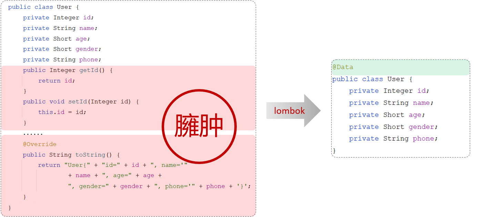

# lombok

## 1 介绍

Lombok是一个实用的Java类库，可以通过简单的注解来简化和消除一些必须但又显得很臃肿的Java代码。



| **注解**            | **作用**                                                     |
| ------------------- | ------------------------------------------------------------ |
| @Getter/@Setter     | 为所有的属性提供get/set方法                                  |
| @ToString           | 会给类自动生成易阅读的  toString 方法                        |
| @EqualsAndHashCode  | 根据类所拥有的非静态字段自动重写 equals 方法和  hashCode 方法 |
| @Data               | 提供了更综合的生成代码功能（@Getter  + @Setter + @ToString + @EqualsAndHashCode） |
| @NoArgsConstructor  | 为实体类生成无参的构造器方法                                 |
| @AllArgsConstructor | 为实体类生成除了static修饰的字段之外带有各参数的构造器方法。 |

## 2 使用

第1步：在pom.xml文件中引入依赖

```xml
<!-- 在springboot的父工程中，已经集成了lombok并指定了版本号-->
<dependency>
    <groupId>org.projectlombok</groupId>
    <artifactId>lombok</artifactId>
</dependency>
```

第2步：在实体类上添加注解

```java
import lombok.Data;

@Data
public class User {
    private Integer id;
    private String name;
    private Short age;
    private Short gender;
    private String phone;
}
```

## 3 说明

@Data注解中不包含全参构造方法，通常在实体类上，还会添加上：全参构造、无参构造

```java
import lombok.Data;

@Data //getter方法、setter方法、toString方法、hashCode方法、equals方法
@NoArgsConstructor //无参构造
@AllArgsConstructor//全参构造
public class User {
    private Integer id;
    private String name;
    private Short age;
    private Short gender;
    private String phone;
}
```

## 4 注意事项

::: warning Lombok的注意事项：

Lombok会在编译时，会自动生成对应的java代码  

在使用lombok时，还需要安装一个lombok的插件（新版本的IDEA中自带）

:::


> 在实体类上添加了@Data注解，那么这个类在编译时期，就会生成 getter/setter、equals、hashcode、toString 等方法。
>
> 


