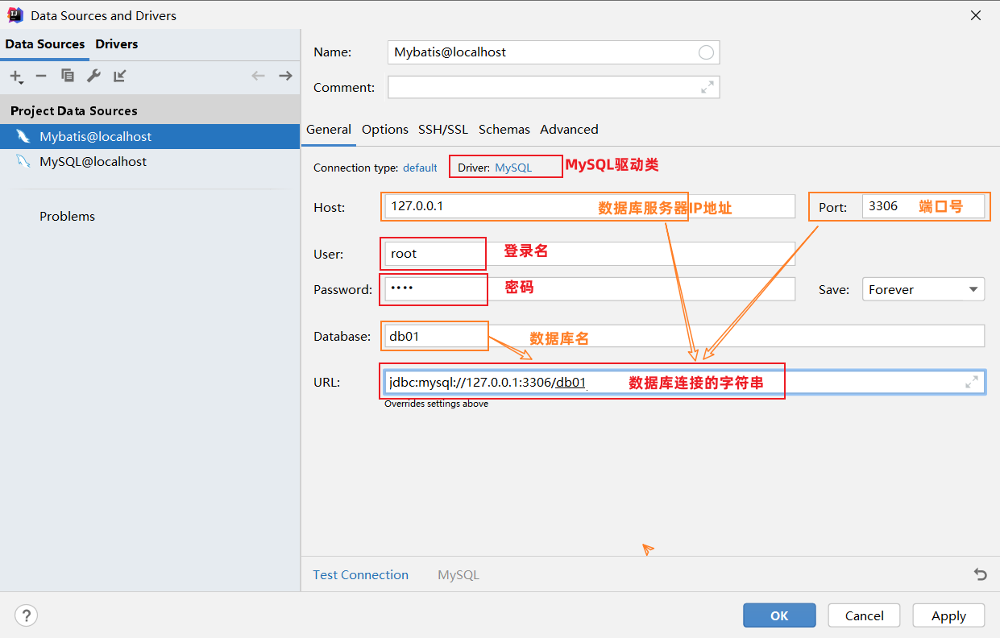

# Mybatis快速入门

## 1. 入门程序分析

Mybatis操作数据库步骤：

1. 准备工作 ( 创建springboot工程、数据库表user、实体类User )

2. 引入Mybatis的相关依赖，配置Mybatis ( 数据库连接信息 )

3. 编写SQL语句 ( 注解/XML )

## 2 入门程序实现

### 2.1 项目创建

创建springboot工程，并导入 mybatis 的起步依赖、 mysql 的驱动包。


```xml
<dependencies>
        <!-- mybatis起步依赖 -->
        <dependency>
            <groupId>org.mybatis.spring.boot</groupId>
            <artifactId>mybatis-spring-boot-starter</artifactId>
            <version>2.3.0</version>
        </dependency>

        <!-- mysql驱动包依赖 -->
        <dependency>
            <groupId>com.mysql</groupId>
            <artifactId>mysql-connector-j</artifactId>
            <scope>runtime</scope>
        </dependency>
        
        <!-- spring单元测试 (集成了junit) -->
        <dependency>
            <groupId>org.springframework.boot</groupId>
            <artifactId>spring-boot-starter-test</artifactId>
            <scope>test</scope>
        </dependency>
</dependencies>
```

### 2.2 数据准备

创建用户表user，并创建对应的实体类User。

- 用户表：

```sql
-- 用户表
create table user(
    id int unsigned primary key auto_increment comment 'ID',
    name varchar(100) comment '姓名',
    age tinyint unsigned comment '年龄',
    gender tinyint unsigned comment '性别, 1:男, 2:女',
    phone varchar(11) comment '手机号'
) comment '用户表';

-- 测试数据
insert into user(id, name, age, gender, phone) VALUES (null,'白眉鹰王',55,'1','18800000000');
insert into user(id, name, age, gender, phone) VALUES (null,'金毛狮王',45,'1','18800000001');
insert into user(id, name, age, gender, phone) VALUES (null,'青翼蝠王',38,'1','18800000002');
insert into user(id, name, age, gender, phone) VALUES (null,'紫衫龙王',42,'2','18800000003');
insert into user(id, name, age, gender, phone) VALUES (null,'光明左使',37,'1','18800000004');
insert into user(id, name, age, gender, phone) VALUES (null,'光明右使',48,'1','18800000005');
```


- 实体类

实体类的属性名与表中的字段名一一对应。

```java
public class User {
    private Integer id;   //id（主键）
    private String name;  //姓名
    private Short age;    //年龄
    private Short gender; //性别
    private String phone; //手机号
    
    //省略GET, SET方法
}
```


### 2.3 配置Mybatis

连接MySQL数据库时，需要配置：



::: note 连接数据库的四大参数

MySQL驱动类  
登录名  
密码  
数据库连接字符串  

:::

基于上述分析，在Mybatis中要连接数据库，同样也需要以上4个参数配置。

application.properties:

```properties
#驱动类名称
spring.datasource.driver-class-name=com.mysql.cj.jdbc.Driver
#数据库连接的url
spring.datasource.url=jdbc:mysql://localhost:3306/mybatis
#连接数据库的用户名
spring.datasource.username=root
#连接数据库的密码
spring.datasource.password=1234
```

### 2.4 编写SQL语句

在springboot工程中，引导类所在包下，再创建一个包mapper。在mapper包下创建一个接口UserMapper，这是一个持久层接口（Mybatis的持久层接口规范一般都叫 XxxMapper）。


UserMapper：

```java
import com.itheima.pojo.User;
import org.apache.ibatis.annotations.Mapper;
import org.apache.ibatis.annotations.Select;
import java.util.List;

@Mapper
public interface UserMapper {
    
    //查询所有用户数据
    @Select("select id, name, age, gender, phone from user")
    public List<User> list();
    
}
```

> @Mapper注解：表示是mybatis中的Mapper接口
>
> - 程序运行时：框架会自动生成接口的实现类对象(代理对象)，并给交Spring的IOC容器管理
>
> @Select注解：代表的就是select查询，用于书写select查询语句

### 2.5 单元测试

在SpringBoot工程中，在src下的test目录下，已经自动帮我们创建好了测试类 ，并且在测试类上已经添加了注解 @SpringBootTest，代表该测试类已经与SpringBoot整合。

该测试类在运行时，会自动通过引导类加载Spring的环境（IOC容器）。 **要测试哪个bean对象，直接通过 @Autowired 注解直接将其注入就行，然后就可以测试了。**

测试类代码如下

```java
@SpringBootTest
public class MybatisQuickstartApplicationTests {

    @Autowired
    private UserMapper userMapper;

    @Test
    public void testList(){
        List<User> userList = userMapper.list();
        for (User user : userList) {
            System.out.println(user);
        }
    }

}
```

运行结果：

```java
User{id=1, name='白眉鹰王', age=55, gender=1, phone='18800000000'}
User{id=2, name='金毛狮王', age=45, gender=1, phone='18800000001'}
User{id=3, name='青翼蝠王', age=38, gender=1, phone='18800000002'}
User{id=4, name='紫衫龙王', age=42, gender=2, phone='18800000003'}
User{id=5, name='光明左使', age=37, gender=1, phone='18800000004'}
User{id=6, name='光明右使', age=48, gender=1, phone='18800000005'}
```

## 3 解决SQL警告与提示

默认在UserMapper接口上加的 @Select 注解中编写SQL语句是没有提示的。 如果想让idea提示对应的SQL语句，需要在IDEA中配置与MySQL数据库的链接。


配置完成之后，发现SQL语句中的关键字有提示了，但还存在不识别表名(列名)的情况


