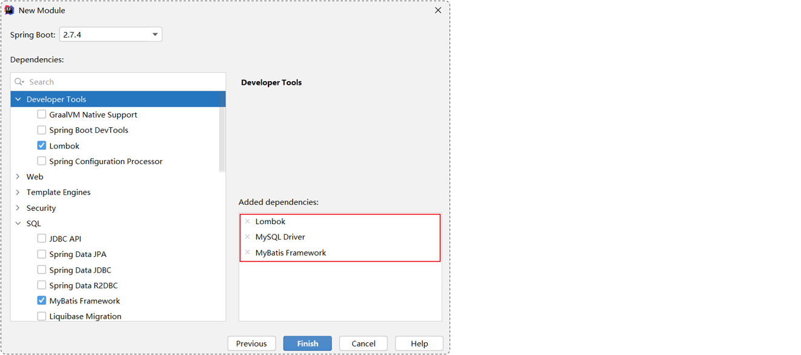
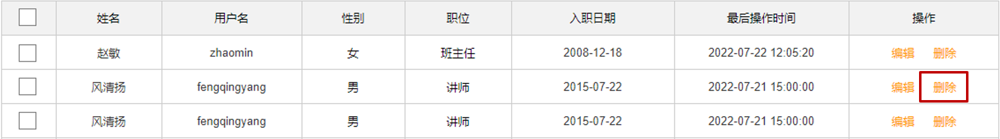
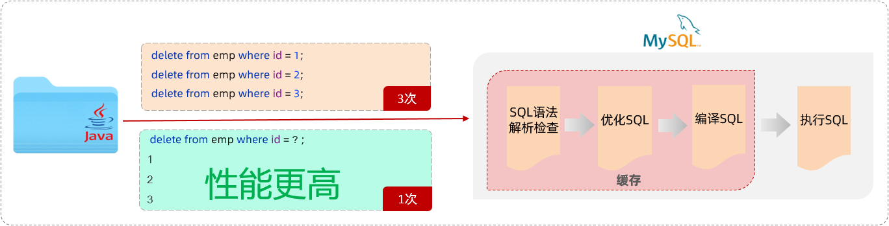
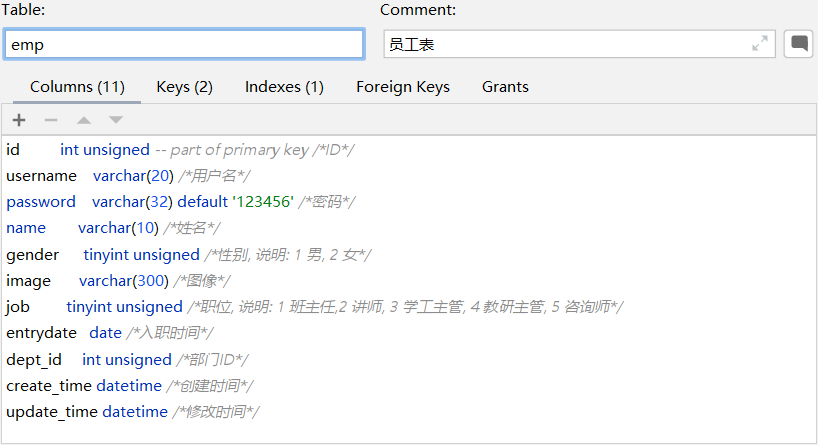
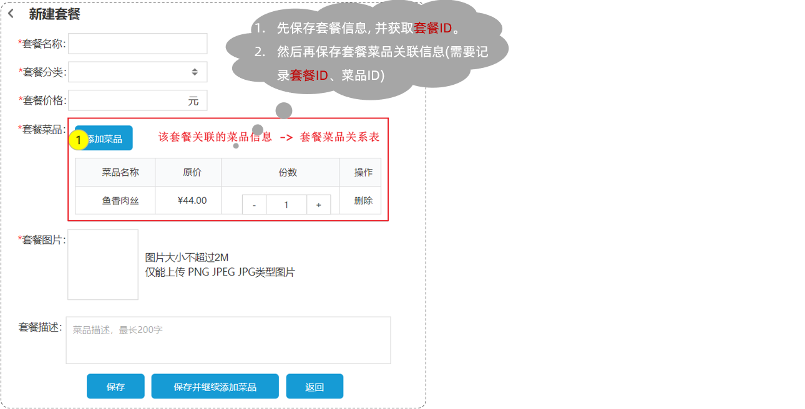
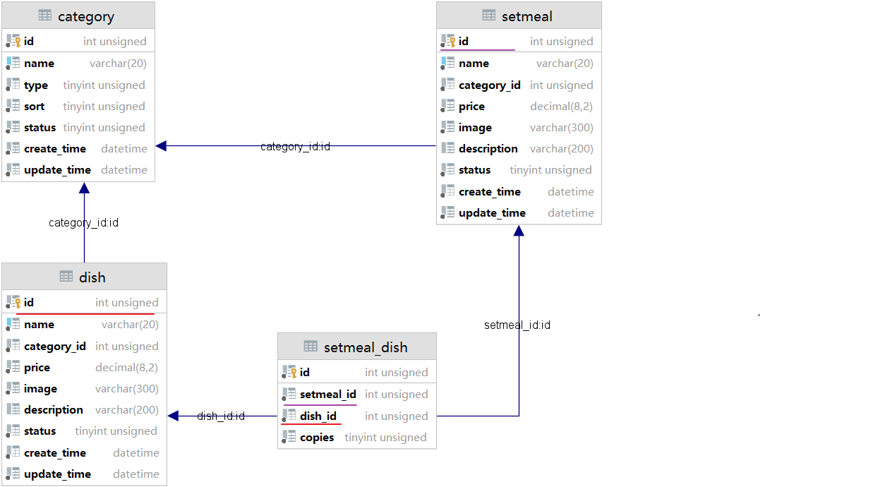
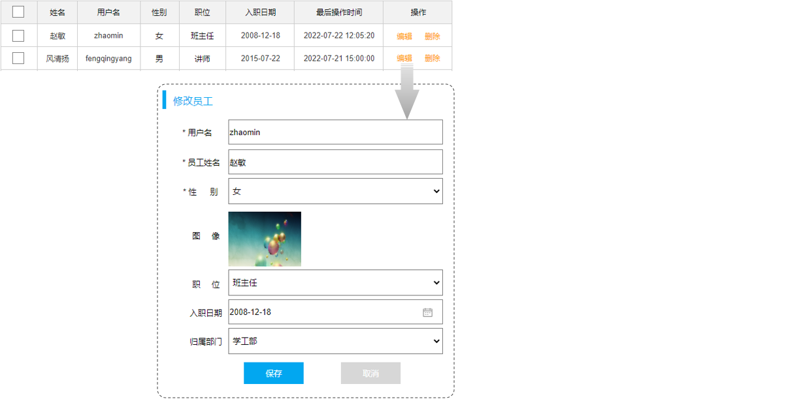

# Mybatis基础操作

## 1 需求

需求说明：

根据资料中提供的《tlias智能学习辅助系统》页面原型及需求，完成员工管理的需求开发。


通过分析以上的页面原型和需求，确定功能列表：

1. 查询
   - 根据主键ID查询
   - 条件查询

2. 新增
3. 更新
4. 删除
   - 根据主键ID删除
   - 根据主键ID批量删除

## 2 准备

实施前的准备工作：

1. 准备数据库表
2. 创建一个新的springboot工程，选择引入对应的起步依赖（mybatis、mysql驱动、lombok）
3. application.properties中引入数据库连接信息
4. 创建对应的实体类 Emp（实体类属性采用驼峰命名）
5. 准备Mapper接口 EmpMapper

### 2.1 准备数据库表

```sql
-- 部门管理
create table dept
(
    id          int unsigned primary key auto_increment comment '主键ID',
    name        varchar(10) not null unique comment '部门名称',
    create_time datetime    not null comment '创建时间',
    update_time datetime    not null comment '修改时间'
) comment '部门表';

-- 部门表测试数据
insert into dept (id, name, create_time, update_time)
values (1, '学工部', now(), now()),
       (2, '教研部', now(), now()),
       (3, '咨询部', now(), now()),
       (4, '就业部', now(), now()),
       (5, '人事部', now(), now());

-- 员工管理
create table emp
(
    id          int unsigned primary key auto_increment comment 'ID',
    username    varchar(20)      not null unique comment '用户名',
    password    varchar(32) default '123456' comment '密码',
    name        varchar(10)      not null comment '姓名',
    gender      tinyint unsigned not null comment '性别, 说明: 1 男, 2 女',
    image       varchar(300) comment '图像',
    job         tinyint unsigned comment '职位, 说明: 1 班主任,2 讲师, 3 学工主管, 4 教研主管, 5 咨询师',
    entrydate   date comment '入职时间',
    dept_id     int unsigned comment '部门ID',
    create_time datetime         not null comment '创建时间',
    update_time datetime         not null comment '修改时间'
) comment '员工表';

-- 员工表测试数据
INSERT INTO emp (id, username, password, name, gender, image, job, entrydate, dept_id, create_time, update_time)
VALUES 
(1, 'jinyong', '123456', '金庸', 1, '1.jpg', 4, '2000-01-01', 2, now(), now()),
(2, 'zhangwuji', '123456', '张无忌', 1, '2.jpg', 2, '2015-01-01', 2, now(), now()),
(3, 'yangxiao', '123456', '杨逍', 1, '3.jpg', 2, '2008-05-01', 2, now(), now()),
(4, 'weiyixiao', '123456', '韦一笑', 1, '4.jpg', 2, '2007-01-01', 2, now(), now()),
(5, 'changyuchun', '123456', '常遇春', 1, '5.jpg', 2, '2012-12-05', 2, now(), now()),
(6, 'xiaozhao', '123456', '小昭', 2, '6.jpg', 3, '2013-09-05', 1, now(), now()),
(7, 'jixiaofu', '123456', '纪晓芙', 2, '7.jpg', 1, '2005-08-01', 1, now(), now()),
(8, 'zhouzhiruo', '123456', '周芷若', 2, '8.jpg', 1, '2014-11-09', 1, now(), now()),
(9, 'dingminjun', '123456', '丁敏君', 2, '9.jpg', 1, '2011-03-11', 1, now(), now()),
(10, 'zhaomin', '123456', '赵敏', 2, '10.jpg', 1, '2013-09-05', 1, now(), now()),
(11, 'luzhangke', '123456', '鹿杖客', 1, '11.jpg', 5, '2007-02-01', 3, now(), now()),
(12, 'hebiweng', '123456', '鹤笔翁', 1, '12.jpg', 5, '2008-08-18', 3, now(), now()),
(13, 'fangdongbai', '123456', '方东白', 1, '13.jpg', 5, '2012-11-01', 3, now(), now()),
(14, 'zhangsanfeng', '123456', '张三丰', 1, '14.jpg', 2, '2002-08-01', 2, now(), now()),
(15, 'yulianzhou', '123456', '俞莲舟', 1, '15.jpg', 2, '2011-05-01', 2, now(), now()),
(16, 'songyuanqiao', '123456', '宋远桥', 1, '16.jpg', 2, '2010-01-01', 2, now(), now()),
(17, 'chenyouliang', '123456', '陈友谅', 1, '17.jpg', NULL, '2015-03-21', NULL, now(), now());
```

### 2.2 创建工程

**创建一个新的springboot工程，选择引入对应的起步依赖（mybatis、mysql驱动、lombok）**：



### 2.3 application.properties

**application.properties中引入数据库连接信息**：

```properties
#驱动类名称
spring.datasource.driver-class-name=com.mysql.cj.jdbc.Driver
#数据库连接的url
spring.datasource.url=jdbc:mysql://localhost:3306/mybatis
#连接数据库的用户名
spring.datasource.username=root
#连接数据库的密码
spring.datasource.password=1234
```

### 2.4 实体类Emp

**创建对应的实体类Emp（实体类属性采用驼峰命名）**：

```java
@Data
@NoArgsConstructor
@AllArgsConstructor
public class Emp {
    private Integer id;
    private String username;
    private String password;
    private String name;
    private Short gender;
    private String image;
    private Short job;
    //LocalDate类型对应数据表中的date类型
    private LocalDate entrydate; 
    private Integer deptId;
    //LocalDateTime类型对应数据表中的datetime类型
    private LocalDateTime createTime; 
    private LocalDateTime updateTime;
}
```

### 2.5 准备Mapper接口

**准备Mapper接口：EmpMapper**：

```java
/* @Mapper注解：表示当前接口为mybatis中的Mapper接口
  程序运行时会自动创建接口的实现类对象(代理对象)，并交给Spring的IOC容器管理
*/
@Mapper
public interface EmpMapper {

}
```

完成以上操作后，项目工程结构目录如下：


## 3 删除

### 3.1 功能实现

页面原型：



> 当我们点击后面的"删除"按钮时，前端页面会给服务端传递一个参数，也就是该行数据的ID。 我们接收到ID后，根据ID删除数据即可。

**功能**：根据主键删除数据

```sql
-- 删除id=17的数据
delete from emp where id = 17;
```

接口方法

```java
@Mapper
public interface EmpMapper {

    /**
     * 根据id删除数据
     * @param id    用户id
     */
    //使用#{key}方式获取方法中的参数值
    @Delete("delete from emp where id = #{id}")
    public void delete(Integer id);
    
}
```

测试

- 在单元测试类中通过@Autowired注解注入EmpMapper类型对象

```java
@SpringBootTest
class SpringbootMybatisCrudApplicationTests {
    @Autowired 
    //从Spring的IOC容器中，获取类型是EmpMapper的对象并注入
    private EmpMapper empMapper;

    @Test
    public void testDel(){
        //调用删除方法
        empMapper.delete(16);
    }

}
```

### 3.2 日志输入

在Mybatis当中可以借助日志，查看到sql语句的执行、执行传递的参数以及执行结果。  

具体操作如下：

1. 打开application.properties文件

2. 开启mybatis的日志，并指定输出到控制台

```properties
#指定mybatis输出日志的位置, 输出控制台
mybatis.configuration.log-impl=org.apache.ibatis.logging.stdout.StdOutImpl
```

再次运行单元测试，输出了以下的SQL语句信息：


但是输出的SQL语句：delete from emp where id = ?，输入的参数16并没有在后面拼接，id的值是使用`?`进行占位。这种SQL语句我们称为预编译SQL。

### 3.3 预编译SQL

::: tip 预编译SQL的两个优势

1. 性能更高：预编译SQL，编译一次之后会将编译后的SQL语句缓存起来，后面再次执行这条语句时，不会再次编译。（只是输入的参数不同）
2. 更安全(防止SQL注入)：将敏感字进行转义，保障SQL的安全性。

:::



### 3.4 参数占位符

在Mybatis中提供的参数占位符有两种：**\#\{…\}**、**\$\{...\}**

::: tip

- 执行SQL时，会将\#\{…\}替换为 ? ，生成预编译SQL，会自动设置参数值
- 使用时机：参数传递，都使用 \#\{…\}

:::

:::warning

- 拼接SQL。直接将参数拼接在SQL语句中，存在SQL注入问题
- 使用时机：如果对表名、列表进行动态设置时使用

:::

## 4 新增

功能：新增员工信息


### 4.1 基本新增

员工表结构：



SQL语句：

```sql
insert into emp(username, name, gender, image, job, entrydate, dept_id, create_time, update_time) 
values ('songyuanqiao','宋远桥',1,'1.jpg',2,'2012-10-09',2,'2022-10-01 10:00:00','2022-10-01 10:00:00');
```

接口方法：

```java
@Mapper
public interface EmpMapper {

    @Insert("insert into emp(username, name, gender, image, job, entrydate, dept_id, create_time, update_time) values (#{username}, #{name}, #{gender}, #{image}, #{job}, #{entrydate}, #{deptId}, #{createTime}, #{updateTime})")
    public void insert(Emp emp);

}
```

测试类：

```java
import com.itheima.mapper.EmpMapper;
import com.itheima.pojo.Emp;
import org.junit.jupiter.api.Test;
import org.springframework.beans.factory.annotation.Autowired;
import org.springframework.boot.test.context.SpringBootTest;
import java.time.LocalDate;
import java.time.LocalDateTime;

@SpringBootTest
class SpringbootMybatisCrudApplicationTests {
    @Autowired
    private EmpMapper empMapper;

    @Test
    public void testInsert(){
        //创建员工对象
        Emp emp = new Emp();
        emp.setUsername("tom");
        emp.setName("汤姆");
        emp.setImage("1.jpg");
        emp.setGender((short)1);
        emp.setJob((short)1);
        emp.setEntrydate(LocalDate.of(2000,1,1));
        emp.setCreateTime(LocalDateTime.now());
        emp.setUpdateTime(LocalDateTime.now());
        emp.setDeptId(1);
        //调用添加方法
        empMapper.insert(emp);
    }
}

```

### 4.2 主键返回

概念：在数据添加成功后，需要获取插入数据库数据的主键。

如：添加套餐数据时，还需要维护套餐菜品关系表数据。



业务场景：苍穹外卖菜品与套餐模块的表结构，菜品与套餐是多对多的关系，一个套餐对应多个菜品。既然是多对多的关系，是不是有一张套餐菜品中间表来维护它们之间的关系。



在添加套餐的时候，我们需要在界面当中来录入套餐的基本信息，还需要来录入套餐与菜品的关联信息。这些信息录入完毕之后，我们一点保存，就需要将套餐的信息以及套餐与菜品的关联信息都需要保存到数据库当中。  
其实具体的过程包括两步，首先第一步先需要将套餐的基本信息保存了，接下来第二步再来保存套餐与菜品的关联信息。套餐与菜品的关联信息就是往中间表当中来插入数据，来维护它们之间的关系。而中间表当中有两个外键字段，一个是菜品的ID，就是当前菜品的ID，还有一个就是套餐的ID，而这个套餐的 ID 指的就是此次我所添加的套餐的ID，所以我们在第一步保存完套餐的基本信息之后，就需要将套餐的主键值返回来供第二步进行使用。这个时候就需要用到主键返回功能。

那要如何实现在插入数据之后返回所插入行的主键值呢？

- 默认情况下，执行插入操作时，是不会主键值返回的。如果想要拿到主键值，需要在Mapper接口中的方法上添加一个Options注解，并在注解中指定属性useGeneratedKeys=true和keyProperty="实体类属性名"

主键返回代码实现：

```java
@Mapper
public interface EmpMapper {
    
    //会自动将生成的主键值，赋值给emp对象的id属性
    @Options(useGeneratedKeys = true,keyProperty = "id")
    @Insert("insert into emp(username, name, gender, image, job, entrydate, dept_id, create_time, update_time) values (#{username}, #{name}, #{gender}, #{image}, #{job}, #{entrydate}, #{deptId}, #{createTime}, #{updateTime})")
    public void insert(Emp emp);

}
```

测试：

```java
@SpringBootTest
class SpringbootMybatisCrudApplicationTests {
    @Autowired
    private EmpMapper empMapper;

    @Test
    public void testInsert(){
        //创建员工对象
        Emp emp = new Emp();
        emp.setUsername("jack");
        emp.setName("杰克");
        emp.setImage("1.jpg");
        emp.setGender((short)1);
        emp.setJob((short)1);
        emp.setEntrydate(LocalDate.of(2000,1,1));
        emp.setCreateTime(LocalDateTime.now());
        emp.setUpdateTime(LocalDateTime.now());
        emp.setDeptId(1);
        //调用添加方法
        empMapper.insert(emp);

        System.out.println(emp.getDeptId());
    }
}
```


## 5 更新

功能：修改员工信息


SQL语句：

```sql
update emp set username = 'linghushaoxia', name = '令狐少侠', gender = 1 , image = '1.jpg' , job = 2, entrydate = '2012-01-01', dept_id = 2, update_time = '2022-10-01 12:12:12' where id = 18;
```

接口方法：

```java
@Mapper
public interface EmpMapper {
    /**
     * 根据id修改员工信息
     * @param emp
     */
    @Update("update emp set username=#{username}, name=#{name}, gender=#{gender}, image=#{image}, job=#{job}, entrydate=#{entrydate}, dept_id=#{deptId}, update_time=#{updateTime} where id=#{id}")
    public void update(Emp emp);
    
}
```

测试类：

```java
@SpringBootTest
class SpringbootMybatisCrudApplicationTests {
    @Autowired
    private EmpMapper empMapper;

    @Test
    public void testUpdate(){
        //要修改的员工信息
        Emp emp = new Emp();
        emp.setId(23);
        emp.setUsername("songdaxia");
        emp.setPassword(null);
        emp.setName("老宋");
        emp.setImage("2.jpg");
        emp.setGender((short)1);
        emp.setJob((short)2);
        emp.setEntrydate(LocalDate.of(2012,1,1));
        emp.setCreateTime(null);
        emp.setUpdateTime(LocalDateTime.now());
        emp.setDeptId(2);
        //调用方法，修改员工数据
        empMapper.update(emp);
    }
}
```

## 6 查询

### 6.1 根据ID查询

在员工管理的页面中，当我们进行更新数据时，会点击 “编辑” 按钮，然后此时会发送一个请求到服务端，会根据Id查询该员工信息，并将员工数据回显在页面上。



SQL语句：

```sql
select id, username, password, name, gender, image, job, entrydate, dept_id, create_time, update_time from emp;
```

接口方法：

```java
@Mapper
public interface EmpMapper {
    @Select("select id, username, password, name, gender, image, job, entrydate, dept_id, create_time, update_time from emp where id=#{id}")
    public Emp getById(Integer id);
}
```

测试类：

```java
@SpringBootTest
class SpringbootMybatisCrudApplicationTests {
    @Autowired
    private EmpMapper empMapper;

    @Test
    public void testGetById(){
        Emp emp = empMapper.getById(1);
        System.out.println(emp);
    }
}
```

### 6.2 数据封装

查询返回的结果中大部分字段是有值的，但是deptId，createTime，updateTime这几个字段是没有值的


原因如下：

- 实体类属性名和数据库表查询返回的字段名一致，mybatis会自动封装。
- 如果实体类属性名和数据库表查询返回的字段名不一致，不能自动封装。

::: note 解决方案

1. 起别名
2. 结果映射
3. 开启驼峰命名

:::

**起别名**：在SQL语句中，对不一样的列名起别名，别名和实体类属性名一样

```java
@Select("select id, username, password, name, gender, image, job, entrydate, " +
        "dept_id AS deptId, create_time AS createTime, update_time AS updateTime " +
        "from emp " +
        "where id=#{id}")
public Emp getById(Integer id);
```

**手动结果映射**：通过 @Results及@Result 进行手动结果映射

```java
@Results({@Result(column = "dept_id", property = "deptId"),
          @Result(column = "create_time", property = "createTime"),
          @Result(column = "update_time", property = "updateTime")})
@Select("select id, username, password, name, gender, image, job, entrydate, dept_id, create_time, update_time from emp where id=#{id}")
public Emp getById(Integer id);
```

**开启驼峰命名(推荐)**：如果字段名与属性名符合驼峰命名规则，mybatis会自动通过驼峰命名规则映射

> 驼峰命名规则：   abc_xyz    =>   abcXyz
>
> - 表中字段名：abc_xyz
> - 类中属性名：abcXyz

```properties
# 在application.properties中添加：
mybatis.configuration.map-underscore-to-camel-case=true
```

::: warning

要使用驼峰命名前提是 实体类的属性 与 数据库表 中的字段名严格遵守驼峰命名。

:::

### 6.3 条件查询

在员工管理的列表页面中，我们需要根据条件查询员工信息，查询条件包括：姓名、性别、入职时间。


通过页面原型以及需求描述我们要实现的查询：

- 姓名：要求支持模糊匹配
- 性别：要求精确匹配
- 入职时间：要求进行范围查询
- 根据最后修改时间进行降序排序

SQL语句：

```sql
select id, username, password, name, gender, image, job, entrydate, dept_id, create_time, update_time 
from emp 
where name like '%张%' 
      and gender = 1 
      and entrydate between '2010-01-01' and '2020-01-01 ' 
order by update_time desc;
```

接口方法：

使用MySQL提供的字符串拼接函数：concat('%' , '关键字' , '%'),解决SQL注入风险

```java
@Mapper
public interface EmpMapper {

    @Select("select * from emp " +
            "where name like concat('%',#{name},'%') " +
            "and gender = #{gender} " +
            "and entrydate between #{begin} and #{end} " +
            "order by update_time desc")
    public List<Emp> list(String name, Short gender, LocalDate begin, LocalDate end);

}

```
