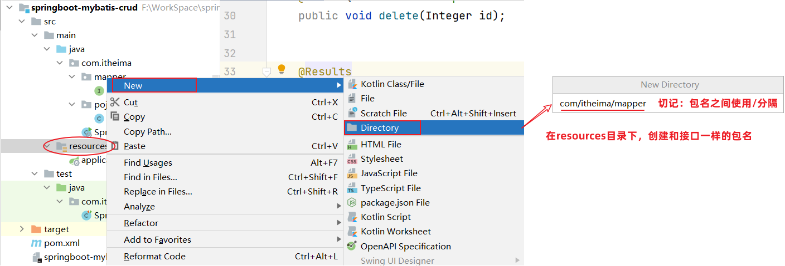
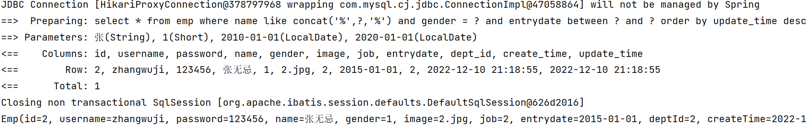

# Mybatis的XML配置文件

::: note Mybatis的开发有两种方式

1. 注解
2. XML

:::

## 1 XML配置文件规范

使用Mybatis的注解方式，主要是来完成一些简单的增删改查功能。如果需要实现复杂的SQL功能，建议使用XML来配置映射语句

::: info Mybatis中使用XML映射文件规范

1. XML映射文件的名称与Mapper接口名称一致，并且将XML映射文件和Mapper接口放置在相同包下（同包同名）

2. XML映射文件的namespace属性为Mapper接口全限定名一致

3. XML映射文件中sql语句的id与Mapper接口中的方法名一致，并保持返回类型一致。

:::


\<select>标签：就是用于编写select查询语句的。

- resultType属性，指的是查询返回的单条记录所封装的类型。

## 2 XML配置文件实现

第1步：创建XML映射文件




第2步：编写XML映射文件

> xml映射文件中的dtd约束，直接从[mybatis官网](https://mybatis.org/mybatis-3/)复制即可

```xml
<?xml version="1.0" encoding="UTF-8" ?>
<!DOCTYPE mapper
  PUBLIC "-//mybatis.org//DTD Mapper 3.0//EN"
  "https://mybatis.org/dtd/mybatis-3-mapper.dtd">
<mapper namespace="">
 
</mapper>
```

配置：XML映射文件的namespace属性为Mapper接口全限定名


```xml
<?xml version="1.0" encoding="UTF-8" ?>
<!DOCTYPE mapper
        PUBLIC "-//mybatis.org//DTD Mapper 3.0//EN"
        "https://mybatis.org/dtd/mybatis-3-mapper.dtd">
<mapper namespace="com.itheima.mapper.EmpMapper">

</mapper>
```

配置：XML映射文件中sql语句的id与Mapper接口中的方法名一致，并保持返回类型一致


```xml
<?xml version="1.0" encoding="UTF-8" ?>
<!DOCTYPE mapper
        PUBLIC "-//mybatis.org//DTD Mapper 3.0//EN"
        "https://mybatis.org/dtd/mybatis-3-mapper.dtd">
<mapper namespace="com.itheima.mapper.EmpMapper">

    <!--查询操作-->
    <select id="list" resultType="com.itheima.pojo.Emp">
        select * from emp
        where name like concat('%',#{name},'%')
              and gender = #{gender}
              and entrydate between #{begin} and #{end}
        order by update_time desc
    </select>
</mapper>
```

运行测试类，执行结果：


