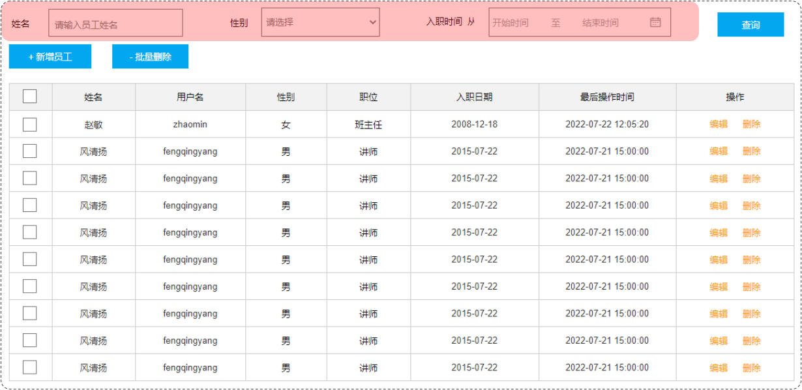

# Mybatis动态SQL

## 1 什么是动态SQL

在页面原型中，列表上方的条件是动态的，是可以不传递的，也可以只传递其中的1个或者2个或者全部。




而在刚才编写的SQL语句中，如果页面只传递了参数姓名 name 字段，其他两个字段 性别 和 入职时间 没有传递，那么这两个参数的值就是null。

此时，执行的SQL语句为：


这个查询结果是不正确的。正确的做法应该是：传递了参数，再组装这个查询条件；如果没有传递参数，就不应该组装这个查询条件。

比如：如果姓名输入了"张", 对应的SQL为:

```sql
select *  from emp where name like '%张%' order by update_time desc;
```

如果姓名输入了"张"，性别选择了"男"，则对应的SQL为:

```sql
select *  from emp where name like '%张%' and gender = 1 order by update_time desc;
```

SQL语句会随着用户的输入或外部条件的变化而变化，我们称为：**动态SQL**。


## 2 动态SQL-if

`<if>`：用于判断条件是否成立。使用test属性进行条件判断，如果条件为true，则拼接SQL。

```xml
<if test="条件表达式">
   要拼接的sql语句
</if>
```

### 2.1 条件查询

- 原有的SQL语句

```xml
<select id="list" resultType="com.itheima.pojo.Emp">
        select * from emp
        where name like concat('%',#{name},'%')
              and gender = #{gender}
              and entrydate between #{begin} and #{end}
        order by update_time desc
</select>
```

- 动态SQL语句

```xml
<select id="list" resultType="com.itheima.pojo.Emp">
        select * from emp
        where
    
             <if test="name != null">
                 name like concat('%',#{name},'%')
             </if>
             <if test="gender != null">
                 and gender = #{gender}
             </if>
             <if test="begin != null and end != null">
                 and entrydate between #{begin} and #{end}
             </if>
    
        order by update_time desc
</select>
```

测试方法：

```java
@Test
public void testList(){
    //性别数据为null、开始时间和结束时间也为null
    List<Emp> list = empMapper.list("张", null, null, null);
    for(Emp emp : list){
        System.out.println(emp);
    }
}
```

> 执行的SQL语句：
>
> 

修改测试方法中的代码，再次进行测试：

```java
@Test
public void testList(){
    //姓名为null
    List<Emp> list = empMapper.list(null, (short)1, null, null);
    for(Emp emp : list){
        System.out.println(emp);
    }
}
```

执行结果：


再次修改测试方法中的代码，再次进行测试：

```java
@Test
public void testList(){
    //传递的数据全部为null
    List<Emp> list = empMapper.list(null, null, null, null);
    for(Emp emp : list){
        System.out.println(emp);
    }
}
```

执行的SQL语句：


以上问题的解决方案：使用`<where>`标签代替SQL语句中的where关键字

- `<where>`只会在子元素有内容的情况下才插入where子句，而且会自动去除子句的开头的AND或OR

```xml
<select id="list" resultType="com.itheima.pojo.Emp">
        select * from emp
        <where>
             <!-- if做为where标签的子元素 -->
             <if test="name != null">
                 and name like concat('%',#{name},'%')
             </if>
             <if test="gender != null">
                 and gender = #{gender}
             </if>
             <if test="begin != null and end != null">
                 and entrydate between #{begin} and #{end}
             </if>
        </where>
        order by update_time desc
</select>
```

测试方法：

```java
@Test
public void testList(){
    //只有性别
    List<Emp> list = empMapper.list(null, (short)1, null, null);
    for(Emp emp : list){
        System.out.println(emp);
    }
}
```

> 执行的SQL语句：
>
> 

### 2.2 更新员工

案例：完善更新员工功能，修改为动态更新员工数据信息

- 动态更新员工信息，如果更新时传递有值，则更新；如果更新时没有传递值，则不更新
- 解决方案：动态SQL

修改Mapper接口：

```java
@Mapper
public interface EmpMapper {
    //删除@Update注解编写的SQL语句
    //update操作的SQL语句编写在Mapper映射文件中
    public void update(Emp emp);
}
```

修改Mapper映射文件：

```xml
<?xml version="1.0" encoding="UTF-8" ?>
<!DOCTYPE mapper
        PUBLIC "-//mybatis.org//DTD Mapper 3.0//EN"
        "https://mybatis.org/dtd/mybatis-3-mapper.dtd">
<mapper namespace="com.itheima.mapper.EmpMapper">

    <!--更新操作-->
    <update id="update">
        update emp
        set
            <if test="username != null">
                username=#{username},
            </if>
            <if test="name != null">
                name=#{name},
            </if>
            <if test="gender != null">
                gender=#{gender},
            </if>
            <if test="image != null">
                image=#{image},
            </if>
            <if test="job != null">
                job=#{job},
            </if>
            <if test="entrydate != null">
                entrydate=#{entrydate},
            </if>
            <if test="deptId != null">
                dept_id=#{deptId},
            </if>
            <if test="updateTime != null">
                update_time=#{updateTime}
            </if>
        where id=#{id}
    </update>

</mapper>
```

测试方法：

```java
@Test
public void testUpdate2(){
        //要修改的员工信息
        Emp emp = new Emp();
        emp.setId(20);
        emp.setUsername("Tom111");
        emp.setName("汤姆111");

        emp.setUpdateTime(LocalDateTime.now());

        //调用方法，修改员工数据
        empMapper.update(emp);
}
```

> 执行的SQL语句：
>
> 

再次修改测试方法，观察SQL语句执行情况：

```java
@Test
public void testUpdate2(){
        //要修改的员工信息
        Emp emp = new Emp();
        emp.setId(20);
        emp.setUsername("Tom222");
      
        //调用方法，修改员工数据
        empMapper.update(emp);
}
```

> 执行的SQL语句：
>
> 

以上问题的解决方案：使用`<set>`标签代替SQL语句中的set关键字

- `<set>`：动态的在SQL语句中插入set关键字，并会删掉额外的逗号。（用于update语句中）

```xml
<?xml version="1.0" encoding="UTF-8" ?>
<!DOCTYPE mapper
        PUBLIC "-//mybatis.org//DTD Mapper 3.0//EN"
        "https://mybatis.org/dtd/mybatis-3-mapper.dtd">
<mapper namespace="com.itheima.mapper.EmpMapper">

    <!--更新操作-->
    <update id="update">
        update emp
        <!-- 使用set标签，代替update语句中的set关键字 -->
        <set>
            <if test="username != null">
                username=#{username},
            </if>
            <if test="name != null">
                name=#{name},
            </if>
            <if test="gender != null">
                gender=#{gender},
            </if>
            <if test="image != null">
                image=#{image},
            </if>
            <if test="job != null">
                job=#{job},
            </if>
            <if test="entrydate != null">
                entrydate=#{entrydate},
            </if>
            <if test="deptId != null">
                dept_id=#{deptId},
            </if>
            <if test="updateTime != null">
                update_time=#{updateTime}
            </if>
        </set>
        where id=#{id}
    </update>
</mapper>
```

> 再次执行测试方法，执行的SQL语句：
>
> 

**小结**:

- `<if>`

  - 用于判断条件是否成立，如果条件为true，则拼接SQL

  - 形式：

    ```xml
    <if test="name != null"> … </if>
    ```

- `<where>`

  - where元素只会在子元素有内容的情况下才插入where子句，而且会自动去除子句的开头的AND或OR

- `<set>`

  - 动态地在行首插入 SET 关键字，并会删掉额外的逗号。（用在update语句中）

## 3 动态SQL-foreach

案例：员工删除功能（既支持删除单条记录，又支持批量删除）


SQL语句：

```mysql
delete from emp where id in (1,2,3);
```

Mapper接口：

```java
@Mapper
public interface EmpMapper {
    //批量删除
    public void deleteByIds(List<Integer> ids);
}
```

XML映射文件：

- 使用`<foreach>`遍历deleteByIds方法中传递的参数ids集合

```xml
<foreach collection="集合名称" item="集合遍历出来的元素/项" 
         separator="每一次遍历使用的分隔符" 
         open="遍历开始前拼接的片段" close="遍历结束后拼接的片段">
</foreach>
```

```xml
<?xml version="1.0" encoding="UTF-8" ?>
<!DOCTYPE mapper
        PUBLIC "-//mybatis.org//DTD Mapper 3.0//EN"
        "https://mybatis.org/dtd/mybatis-3-mapper.dtd">
<mapper namespace="com.itheima.mapper.EmpMapper">
    <!--删除操作-->
    <delete id="deleteByIds">
        delete from emp where id in
        <foreach collection="ids" item="id" separator="," open="(" close=")">
            #{id}
        </foreach>
    </delete>
</mapper> 
```

> 
> 执行的SQL语句：
>
> 

## 4 动态SQL-sql & include

问题分析：

在xml映射文件中配置的SQL，有时可能会存在很多重复的片段，此时就会存在很多冗余的代码


对重复的代码片段进行抽取，将其通过`<sql>`标签封装到一个SQL片段，然后再通过`<include>`标签进行引用。

- `<sql>`：定义可重用的SQL片段

- `<include>`：通过属性refid，指定包含的SQL片段


SQL片段： 抽取重复的代码

```xml
<sql id="commonSelect">
    select id, username, password, name, gender, image, job, entrydate, dept_id, create_time, update_time from emp
</sql>
```

然后通过`<include>` 标签在原来抽取的地方进行引用。操作如下：

```xml
<select id="list" resultType="com.itheima.pojo.Emp">
    <include refid="commonSelect"/>
    <where>
        <if test="name != null">
            name like concat('%',#{name},'%')
        </if>
        <if test="gender != null">
            and gender = #{gender}
        </if>
        <if test="begin != null and end != null">
            and entrydate between #{begin} and #{end}
        </if>
    </where>
    order by update_time desc
</select>
```
