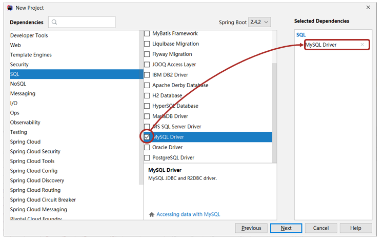
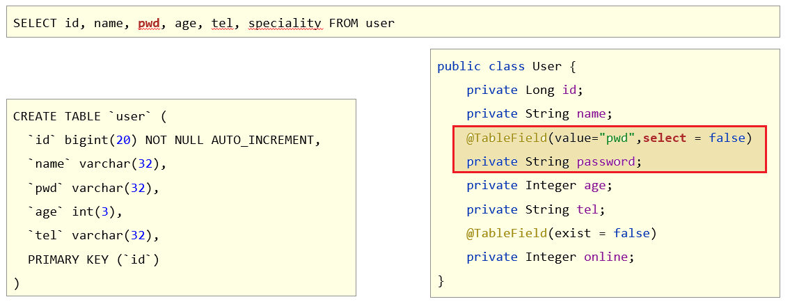

# MybatisPlus入门

> 1. 能够基于 MyBatisPlus 完成标准Dao开发
> 1. 能够掌握 MyBatisPlus 的条件查询
> 1. 能够掌握 MyBatisPlus 的字段映射与表名映射
> 1. 能够掌握 id 生成策略控制
> 1. 能够理解代码生成器的相关配置

## 1 MyBatisPlus简介

### 1.1 入门案例

MyBatisPlus环境搭建的步骤？

#### SpringBoot整合MyBatisPlus入门程序

##### ①：创建新模块，选择Spring初始化，并配置模块相关基础信息


##### ②：选择当前模块需要使用的技术集（仅保留JDBC）



##### ③：手动添加MyBatisPlus起步依赖

```xml
<dependency>
    <groupId>com.baomidou</groupId>
    <artifactId>mybatis-plus-boot-starter</artifactId>
    <version>3.4.1</version>
</dependency>
<dependency>
    <groupId>com.alibaba</groupId>
    <artifactId>druid</artifactId>
    <version>1.1.16</version>
</dependency>
```

> 注意事项1：**由于mp并未被收录到idea的系统内置配置，无法直接选择加入**
>
> 注意事项2：**如果使用Druid数据源，需要导入对应坐标**

##### ④：制作实体类与表结构

（类名与表名对应，属性名与字段名对应）

```sql
create database if not exists mybatisplus_db character set utf8;
use mybatisplus_db;
CREATE TABLE user (
            id bigint(20) primary key auto_increment,
            name varchar(32) not null,
            password  varchar(32) not null,
            age int(3) not null ,
            tel varchar(32) not null
);
insert into user values(null,'tom','123456',12,'12345678910');
insert into user values(null,'jack','123456',8,'12345678910');
insert into user values(null,'jerry','123456',15,'12345678910');
insert into user values(null,'tom','123456',9,'12345678910');
insert into user values(null,'snake','123456',28,'12345678910');
insert into user values(null,'张益达','123456',22,'12345678910');
insert into user values(null,'张大炮','123456',16,'12345678910');
```

```java
public class User {
    private Long id;
    private String name;
    private String password;
    private Integer age;
    private String tel;
    //自行添加getter、setter、toString()等方法
}
```

##### ⑤：设置Jdbc参数（**application.yml**）

```yml
spring:
  datasource:
    type: com.alibaba.druid.pool.DruidDataSource
    driver-class-name: com.mysql.cj.jdbc.Driver
    url: jdbc:mysql://localhost:3306/mybatisplus_db?serverTimezone=UTC
    username: root
    password: root
```

##### ⑥：定义数据接口，继承**BaseMapper**

```java
package com.itheima.dao;

import com.baomidou.mybatisplus.core.mapper.BaseMapper;
import com.itheima.domain.User;
import org.apache.ibatis.annotations.Mapper;

@Mapper
public interface UserDao extends BaseMapper<User> {
}

```

##### ⑦：测试类中注入dao接口，测试功能

```java
package com.itheima;

import com.itheima.dao.UserDao;
import com.itheima.domain.User;
import org.junit.jupiter.api.Test;
import org.springframework.beans.factory.annotation.Autowired;
import org.springframework.boot.test.context.SpringBootTest;

import java.util.List;

@SpringBootTest
public class Mybatisplus01QuickstartApplicationTests {

    @Autowired
    private UserDao userDao;

    @Test
    void testGetAll() {
        List<User> userList = userDao.selectList(null);
        System.out.println(userList);
    }
}
```

## 2 标准数据层开发

### 2.1 MyBatisPlus的CRUD操作


```java
package com.itheima;

import com.itheima.dao.UserDao;
import com.itheima.domain.User;
import org.junit.jupiter.api.Test;
import org.springframework.beans.factory.annotation.Autowired;
import org.springframework.boot.test.context.SpringBootTest;

import java.util.List;

@SpringBootTest
class Mybatisplus01QuickstartApplicationTests {

    @Autowired
    private UserDao userDao;

    @Test
    void testSave() {
        User user = new User();
        user.setName("黑马程序员");
        user.setPassword("itheima");
        user.setAge(12);
        user.setTel("4006184000");
        userDao.insert(user);
    }

    @Test
    void testDelete() {
        userDao.deleteById(1401856123725713409L);
    }

    @Test
    void testUpdate() {
        User user = new User();
        user.setId(1L);
        user.setName("Tom888");
        user.setPassword("tom888");
        userDao.updateById(user);
    }

    @Test
    void testGetById() {
        User user = userDao.selectById(2L);
        System.out.println(user);
    }


    @Test
    void testGetAll() {
        List<User> userList = userDao.selectList(null);
        System.out.println(userList);
    }
}

```

### 2.2 MyBatisPlus分页功能

思考一下Mybatis分页插件是如何用的？

#### 2.2.1 分页功能接口


#### 2.2.2 MyBatisPlus分页使用

①：**设置分页拦截器作为Spring管理的bean**

```java
package com.itheima.config;

import com.baomidou.mybatisplus.extension.plugins.MybatisPlusInterceptor;
import com.baomidou.mybatisplus.extension.plugins.inner.PaginationInnerInterceptor;
import org.springframework.context.annotation.Bean;
import org.springframework.context.annotation.Configuration;

@Configuration
public class MybatisPlusConfig {
    
    @Bean
    public MybatisPlusInterceptor mybatisPlusInterceptor(){
        //1 创建MybatisPlusInterceptor拦截器对象
        MybatisPlusInterceptor mpInterceptor=new MybatisPlusInterceptor();
        //2 添加分页拦截器
        mpInterceptor.addInnerInterceptor(new PaginationInnerInterceptor());
        return mpInterceptor;
    }
}
```

②：**执行分页查询**

```java
//分页查询
@Test
void testSelectPage(){
    //1 创建IPage分页对象,设置分页参数
    IPage<User> page=new Page<>(1,3);
    //2 执行分页查询
    userDao.selectPage(page,null);
    //3 获取分页结果
    System.out.println("当前页码值："+page.getCurrent());
    System.out.println("每页显示数："+page.getSize());
    System.out.println("总页数："+page.getPages());
    System.out.println("总条数："+page.getTotal());
    System.out.println("当前页数据："+page.getRecords());
}
```

#### 2.2.3 开启MyBatisPlus日志

```yml
spring:
  datasource:
    type: com.alibaba.druid.pool.DruidDataSource
    driver-class-name: com.mysql.cj.jdbc.Driver
    url: jdbc:mysql://localhost:3306/mybatisplus_db?serverTimezone=UTC
    username: root
    password: root
# 开启mp的日志（输出到控制台）
mybatis-plus:
  configuration:
    log-impl: org.apache.ibatis.logging.stdout.StdOutImpl
```

#### 2.2.4 解决日志打印过多问题

##### 2.2.4.1 取消初始化spring日志打印


做法：在resources下新建一个logback.xml文件，名称固定，内容如下：

```xml
<?xml version="1.0" encoding="UTF-8"?>
<configuration>

</configuration>
```

关于logback参考播客：[https://www.jianshu.com/p/75f9d11ae011](https://www.jianshu.com/p/75f9d11ae011)

##### 2.2.4.2 取消SpringBoot启动banner图标


```yaml
spring:
  main:
    banner-mode: off # 关闭SpringBoot启动图标(banner)
```

##### 2.2.4.3 取消MybatisPlus启动banner图标


```yaml
# mybatis-plus日志控制台输出
mybatis-plus:
  configuration:
    log-impl: org.apache.ibatis.logging.stdout.StdOutImpl
  global-config:
    banner: off # 关闭mybatisplus启动图标
```

## 3 DQL编程控制

### 3.1 条件查询方式

- MyBatisPlus将书写复杂的SQL查询条件进行了封装，使用编程的形式完成查询条件的组合


#### 3.1.1 条件查询

##### 3.1.1.1 方式一：按条件查询

```java
//方式一：按条件查询
QueryWrapper<User> qw=new QueryWrapper<>();
qw.lt("age", 18);
List<User> userList = userDao.selectList(qw);
System.out.println(userList);
```

##### 3.1.1.2 方式二：lambda格式按条件查询

```java
//方式二：lambda格式按条件查询
QueryWrapper<User> qw = new QueryWrapper<User>();
qw.lambda().lt(User::getAge, 10);
List<User> userList = userDao.selectList(qw);
System.out.println(userList);
```

##### 3.1.1.3 方式三：lambda格式按条件查询（推荐）

```java
//方式三：lambda格式按条件查询
LambdaQueryWrapper<User> lqw = new LambdaQueryWrapper<User>();
lqw.lt(User::getAge, 10);
List<User> userList = userDao.selectList(lqw);
System.out.println(userList);
```

#### 3.1.2 组合条件

##### 3.1.2.1 并且关系（and）

```java
//并且关系
LambdaQueryWrapper<User> lqw = new LambdaQueryWrapper<User>();
//并且关系：10到30岁之间
lqw.lt(User::getAge, 30).gt(User::getAge, 10);
List<User> userList = userDao.selectList(lqw);
System.out.println(userList);
```

##### 3.1.2.2 或者关系（or）

```java
//或者关系
LambdaQueryWrapper<User> lqw = new LambdaQueryWrapper<User>();
//或者关系：小于10岁或者大于30岁
lqw.lt(User::getAge, 10).or().gt(User::getAge, 30);
List<User> userList = userDao.selectList(lqw);
System.out.println(userList);
```

#### 3.1.3 NULL值处理

如下搜索场景，在多条件查询中，有条件的值为空应该怎么解决？


##### 3.1.3.1 if语句控制条件追加

```java
Integer minAge=10;  //将来有用户传递进来,此处简化成直接定义变量了
Integer maxAge=null;  //将来有用户传递进来,此处简化成直接定义变量了
LambdaQueryWrapper<User> lqw = new LambdaQueryWrapper<User>();
if(minAge!=null){
    lqw.gt(User::getAge, minAge);
}
if(maxAge!=null){
    lqw.lt(User::getAge, maxAge);
}
List<User> userList = userDao.selectList(lqw);
userList.forEach(System.out::println);
```

##### 3.1.3.2 条件参数控制

```java
Integer minAge=10;  //将来有用户传递进来,此处简化成直接定义变量了
Integer maxAge=null;  //将来有用户传递进来,此处简化成直接定义变量了
LambdaQueryWrapper<User> lqw = new LambdaQueryWrapper<User>();
//参数1：如果表达式为true，那么查询才使用该条件
lqw.gt(minAge!=null,User::getAge, minAge);
lqw.lt(maxAge!=null,User::getAge, maxAge);
List<User> userList = userDao.selectList(lqw);
userList.forEach(System.out::println);
```

##### 3.1.3.3 条件参数控制（链式编程）

```java
Integer minAge=10;  //将来有用户传递进来,此处简化成直接定义变量了
Integer maxAge=null;  //将来有用户传递进来,此处简化成直接定义变量了
LambdaQueryWrapper<User> lqw = new LambdaQueryWrapper<User>();
//参数1：如果表达式为true，那么查询才使用该条件
lqw.gt(minAge!=null,User::getAge, minAge)
   .lt(maxAge!=null,User::getAge, maxAge);
List<User> userList = userDao.selectList(lqw);
userList.forEach(System.out::println);
```

### 3.2 查询投影-设置【查询字段、分组、分页】

#### 3.2.1 查询结果包含模型类中部分属性

```java
/*LambdaQueryWrapper<User> lqw = new LambdaQueryWrapper<User>();
lqw.select(User::getId, User::getName, User::getAge);*/
//或者
QueryWrapper<User> lqw = new QueryWrapper<User>();
lqw.select("id", "name", "age", "tel");
List<User> userList = userDao.selectList(lqw);
System.out.println(userList);
```

#### 3.2.2 查询结果包含模型类中未定义的属性

```java
QueryWrapper<User> lqw = new QueryWrapper<User>();
lqw.select("count(*) as count, tel");
lqw.groupBy("tel");
List<Map<String, Object>> userList = userDao.selectMaps(lqw);
System.out.println(userList);
```

### 3.3 查询条件设定

::: tip 多条件查询有哪些组合？

- 范围匹配（> 、 = 、between）
- 模糊匹配（like）
- 空判定（null）
- 包含性匹配（in）
- 分组（group）
- 排序（order）
- ……

:::

#### 3.3.1 查询条件

- 用户登录（eq匹配）

```java
LambdaQueryWrapper<User> lqw = new LambdaQueryWrapper<User>();
//等同于=
lqw.eq(User::getName, "Jerry").eq(User::getPassword, "jerry");
User loginUser = userDao.selectOne(lqw);
System.out.println(loginUser);
```

- 购物设定价格区间、户籍设定年龄区间（lt gt匹配 或 between匹配）

```java
LambdaQueryWrapper<User> lqw = new LambdaQueryWrapper<User>();
//范围查询 lt le gt ge eq between
lqw.between(User::getAge, 10, 30);
List<User> userList = userDao.selectList(lqw);
System.out.println(userList);
```

- 查信息，搜索新闻（非全文检索版：like匹配）

```java
LambdaQueryWrapper<User> lqw = new LambdaQueryWrapper<User>();
//模糊匹配 like
lqw.likeLeft(User::getName, "J");
List<User> userList = userDao.selectList(lqw);
System.out.println(userList);
```

- 统计报表（分组查询聚合函数）

```java
QueryWrapper<User> qw = new QueryWrapper<User>();
qw.select("gender","count(*) as nums");
qw.groupBy("gender");
List<Map<String, Object>> maps = userDao.selectMaps(qw);
System.out.println(maps);
```

#### 3.3.2 MyBatisPlus练习

题目：基于MyBatisPlus_Ex1模块，完成Top5功能的开发。

- 说明：

    ①：Top5指根据销售量排序（提示：对销售量进行降序排序）

    ②：Top5是仅获取前5条数据（提示：使用分页功能控制数据显示数量）

### 3.4 字段映射与表名映射

思考表的字段和实体类的属性不对应，查询会怎么样？

#### 3.4.1 问题一：表字段与编码属性设计不同步

- 在模型类属性上方，使用 **@TableField** 属性注解，通过 **value** 属性，设置当前属性对应的数据库表中的字段关系。


#### 3.4.2 问题二：编码中添加了数据库中未定义的属性

- 在模型类属性上方，使用 **@TableField** 注解，通过 **exist**属性，设置属性在数据库表字段中是否存在，默认为true。此属性无法与value合并使用。


#### 3.4.3 问题三：采用默认查询开放了更多的字段查看权限

- 在模型类属性上方，使用 **@TableField** 注解，通过 **select** 属性：设置该属性是否参与查询。此属性与select()映射配置不冲突。



#### 3.4.4 问题四：表名与编码开发设计不同步

- 在 **模型类** 上方，使用 **@TableName** 注解，通过 **value** 属性，设置当前类对应的数据库表名称


```java
@Data
@TableName("tbl_user")
public class User {
    /*
        id为Long类型，因为数据库中id为bigint类型，
        并且mybatis有自己的一套id生成方案，生成出来的id必须是Long类型
     */
    private Long id;
    private String name;
    @TableField(value = "pwd",select = false)
    private String password;
    private Integer age;
    private String tel;
    @TableField(exist = false) //表示online字段不参与CRUD操作
    private Boolean online;
}
```

## 4 DML编程控制

### 4.1 id生成策略控制（Insert）

::: tip 主键生成的策略有哪几种方式？

不同的表应用不同的id生成策略

- 日志：自增（1,2,3,4，……）
- 购物订单：特殊规则（FQ23948AK3843）
- 外卖单：关联地区日期等信息（10 04 20200314 34 91）
- 关系表：可省略id
- ……

:::

#### 4.1.1 id生成策略控制（@TableId注解）

- 名称：@TableId

- 类型：**属性注解**

- 位置：模型类中用于表示主键的属性定义上方

- 作用：设置当前类中主键属性的生成策略

- 相关属性

    **type**：设置主键属性的生成策略，值参照IdType枚举值

    

#### 4.1.2 全局策略配置

```yml
mybatis-plus:
  global-config:
    db-config:
      id-type: assign_id
      table-prefix: tbl_
```

##### id生成策略全局配置


##### 表名前缀全局配置


### 4.2 多记录操作（批量Delete/Select）

MyBatisPlus是否支持批量操作？


#### 4.2.1 按照主键删除多条记录

```java
//删除指定多条数据
List<Long> list = new ArrayList<>();
list.add(1402551342481838081L);
list.add(1402553134049501186L);
list.add(1402553619611430913L);

userDao.deleteBatchIds(list);
```

#### 4.2.2 根据主键查询多条记录

```java
//查询指定多条数据
List<Long> list = new ArrayList<>();
list.add(1L);
list.add(3L);
list.add(4L);
userDao.selectBatchIds(list);
```

### 4.3 逻辑删除（Delete/Update）

在实际环境中，如果想删除一条数据，是否会真的从数据库中删除该条数据？

- 删除操作业务问题：业务数据从数据库中丢弃

- 逻辑删除：为数据设置是否可用状态字段，删除时设置状态字段为不可用状态，数据保留在数据库中


#### 4.3.1 逻辑删除案例

##### ①：数据库表中添加逻辑删除标记字段


##### ②：实体类中添加对应字段，并设定当前字段为逻辑删除标记字段

```java
package com.itheima.domain;

import com.baomidou.mybatisplus.annotation.*;

import lombok.Data;

@Data
public class User {

    private Long id;
    
    //逻辑删除字段，标记当前记录是否被删除
    @TableLogic
    private Integer deleted;
    
}
```

##### ③：配置逻辑删除字面值

```yml
mybatis-plus:
  global-config:
    db-config:
      table-prefix: tbl_
      # 逻辑删除字段名
      logic-delete-field: deleted
      # 逻辑删除字面值：未删除为0
      logic-not-delete-value: 0
      # 逻辑删除字面值：删除为1
      logic-delete-value: 1
```

**逻辑删除本质：逻辑删除的本质其实是修改操作。如果加了逻辑删除字段，查询数据时也会自动带上逻辑删除字段。**


### 4.4 乐观锁（Update）

乐观锁主张的思想是什么？

- 业务并发现象带来的问题：秒杀


#### 4.4.1 乐观锁案例

##### ①：数据库表中添加锁标记字段


##### ②： 实体类中添加对应字段，并设定当前字段为逻辑删除标记字段

```java
package com.itheima.domain;

import com.baomidou.mybatisplus.annotation.TableField;
import com.baomidou.mybatisplus.annotation.TableLogic;
import com.baomidou.mybatisplus.annotation.Version;
import lombok.Data;

@Data
public class User {

    private Long id;
        
    @Version
    private Integer version;
}

```

##### ③：配置乐观锁拦截器实现锁机制对应的动态SQL语句拼装

```java
package com.itheima.config;

import com.baomidou.mybatisplus.extension.plugins.MybatisPlusInterceptor;
import com.baomidou.mybatisplus.extension.plugins.inner.OptimisticLockerInnerInterceptor;
import com.baomidou.mybatisplus.extension.plugins.inner.PaginationInnerInterceptor;
import org.springframework.context.annotation.Bean;
import org.springframework.context.annotation.Configuration;

@Configuration
public class MpConfig {
    @Bean
    public MybatisPlusInterceptor mpInterceptor() {
        //1.定义Mp拦截器
        MybatisPlusInterceptor mpInterceptor = new MybatisPlusInterceptor();

        //2.添加乐观锁拦截器
        mpInterceptor.addInnerInterceptor(new OptimisticLockerInnerInterceptor());
        
        return mpInterceptor;
    }
}

```

##### ④：使用乐观锁机制在修改前必须先获取到对应数据的verion方可正常进行

```java
@Test
public void testUpdate() {
    /*User user = new User();
    user.setId(3L);
    user.setName("Jock666");
    user.setVersion(1);
    userDao.updateById(user);*/
    
    //1.先通过要修改的数据id将当前数据查询出来
    //User user = userDao.selectById(3L);
    //2.将要修改的属性逐一设置进去
    //user.setName("Jock888");
    //userDao.updateById(user);
    
    //1.先通过要修改的数据id将当前数据查询出来
    User user = userDao.selectById(3L);     //version=3
    User user2 = userDao.selectById(3L);    //version=3
    user2.setName("Jock aaa");
    userDao.updateById(user2);              //version=>4
    user.setName("Jock bbb");
    userDao.updateById(user);               //verion=3?条件还成立吗？
}
```


