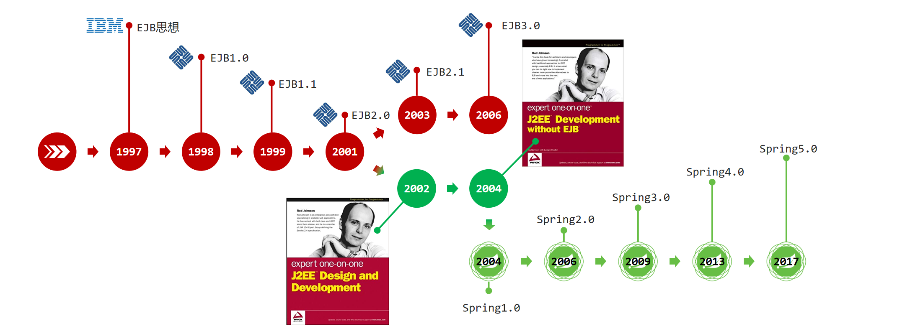
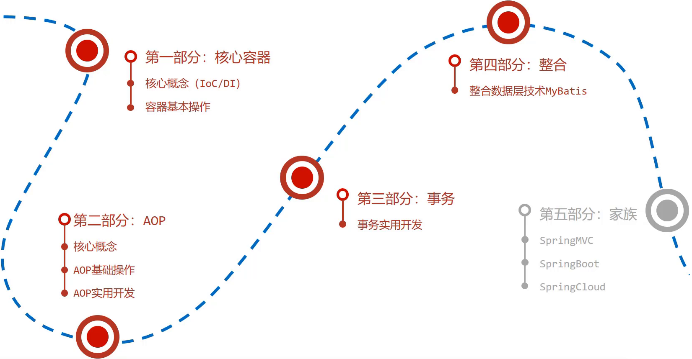

# Spring
<!-- more -->

## 简化开发

Spring框架中提供了两个大的核心技术，分别是: IOC、AOP（事务处理）

::: tip IOC AOP

1. Spring的简化操作都是基于这两块内容

2. 事务处理属于Spring中AOP的具体应用，可以简化项目中的事务管理

:::

## 框架整合

Spring在框架整合这块已经做到了极致，它可以整合市面上几乎所有主流框架，比如:

* **MyBatis**
* MyBatis-plus
* Struts
* Struts2
* Hibernate
* ……

::: info 综上所述，对于Spring的学习，主要学习四块内容:
(1) IOC  

(2) 整合Mybatis(IOC的具体应用)  

(3) AOP  

(4) 声明式事务(AOP的具体应用)  

:::

## Spring家族

Spring开发生态圈提供了若干个项目，每个项目用于完成特定的功能，可以根据需要自行选择，把这些个项目组合起来

**常用框架:**

* Spring Framework: Spring框架，是Spring中最早最核心的技术，也是所有其他技术的基础  

* SpringBoot: Spring是来简化开发，而SpringBoot是来帮助Spring在简化的基础上快速开发  

* SpringCloud: 用来做分布式微服务架构的相关开发  

> 除了上面的这三个技术外，还有很多其他的技术，也比较流行，如SpringData、SpringSecurity等
  
### Spring发展史

IBM(IT公司-国际商业机器公司)在1997年提出了EJB思想，早期的JAVAEE开发大都基于该思想的。  

Rod Johnson(Java和J2EE开发领域的专家)在2002年出版的`Expert One-on-One J2EE Design and Development`，书中有阐述在开发中使用EJB该如何做。  

Rod Johnson在2004年出版的`Expert One-on-One J2EE Development without EJB`，书中提出了比EJB思想更高效的实现方案，并且在同年将方案进行了具体的落地实现，这个实现就是Spring1.0。  

随着时间推移，版本不断更新维护  

* Spring1.0是纯配置文件开发
* Spring2.0为了简化开发引入了注解开发，此时为配置文件加注解的开发方式
* Spring3.0已经可以进行纯注解开发，使开发效率大幅提升
* Spring4.0根据JDK的版本升级对个别API进行了调整
* Spring5.0已经全面支持JDK8

### Spring系统架构

* Spring Framework是Spring生态圈中最基础的项目，是其他项目的根基。

* Spring Framework的发展也经历了很多版本的变更，每个版本都有相应的调整

  

  

  (1) 核心层

  * Core Container: 核心容器，这个模块是Spring最核心的模块，其他的都需要依赖该模块

  (2) AOP层

  * AOP:面向切面编程，它依赖核心层容器，目的是**在不改变原有代码的前提下对其进行功能增强**
  * Aspects:AOP是思想，Aspects是对AOP思想的具体实现

  (3 )数据层

  * Data Access: 数据访问，Spring全家桶中有对数据访问的具体实现技术
  * Data Integration: 数据集成，Spring支持整合其他的数据层解决方案，比如Mybatis
  * Transactions: 事务，Spring中事务管理是Spring AOP的一个具体实现

  (4) Web层

  * SpringMVC框架

  (5) Test层

  * Spring主要整合了Junit来完成单元测试和集成测试

**学习路线图**：

