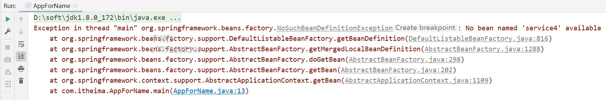
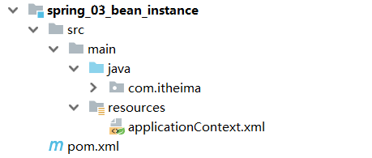
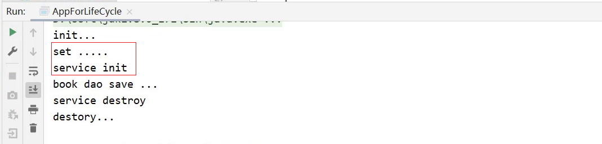
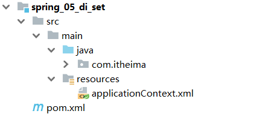
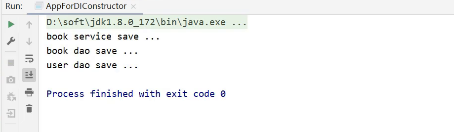
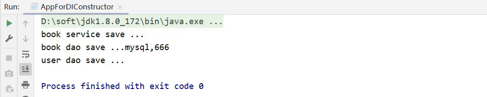

# Spring IOC DI

> 1. 掌握 Spring 相关概念
> 2. 完成 IOC/DI 的入门案例编写
> 3. 掌握 IOC 的相关配置与使用
> 4. 掌握 DI 的相关配置与使用

## 1 Spring核心概念


::: warning 代码在编写过程中遇到的问题:

1. 业务层需要调用数据层的方法，就需要在业务层new数据层的对象 <Badge text="耦合度偏高" color="#242378" />

2. 如果数据层的实现类发生变化，那么业务层的代码也需要跟着改变 <Badge text="耦合度偏高" color="#242378" /> 

3. 发生变更后，都需要进行编译打包和重新部署

:::


针对这个问题，Spring提出了一个解决方案:

* 使用对象时，在程序中不要主动使用new产生对象，转换为由**外部**提供对象

### 1.1 IOC、IOC容器、Bean、DI

**IOC（Inversion of Control）控制反转**:

(1) 什么是控制反转？

* 使用对象时，由主动new产生对象转换为由**外部**提供对象，此过程中对象创建控制权由程序转移到外部，此思想称为控制反转

::: tip

业务层要用数据层的类对象，以前是自己`new`的

现在自己不new了，交给`别人[外部]`来创建对象

`别人[外部]`就反转控制了数据层对象的创建权

:::

(2) Spring和IOC之间的关系是什么?

* Spring技术对IOC思想进行了实现
* Spring提供了一个容器，称为**IOC容器**，用来充当IOC思想中的"外部"

(3) IOC容器的作用以及内部存放的是什么?

* IOC容器负责对象的创建、初始化等一系列工作，其中包含了数据层和业务层的类对象
* 被创建或被管理的对象在IOC容器中统称为**Bean**
* IOC容器中放的就是一个个的Bean对象

(4) 当IOC容器中创建好service和dao对象后，程序能正确执行么?

::: danger 不行

* 因为service运行需要依赖dao对象
* IOC容器中虽然有service和dao对象
* service对象和dao对象没有任何关系
* 需要把dao对象交给service，也就是说要绑定service和dao对象之间的关系

:::

像这种在容器中建立对象与对象之间的绑定关系就要用到Spring的另一个核心概念:

**DI（Dependency Injection）依赖注入**：


(1) 什么是依赖注入?

在容器中建立bean与bean之间的依赖关系的整个过程，称为依赖注入

(2) IOC容器中哪些bean之间要建立依赖关系呢?

需要根据业务需求提前建立好关系，如业务层需要依赖数据层，service就要和dao建立依赖关系

::: info 这两个概念的最终目标就是 充分解耦

具体实现靠:

* 使用IoC容器管理bean（IOC）
* 在IoC容器内将有依赖关系的bean进行关系绑定（DI）
* 最终结果为:  使用对象时不仅可以直接从IOC容器中获取，并且获取到的bean已经绑定了所有的依赖关系

:::

::: tip 小结

`什么是IOC/DI思想`、`什么是IOC容器`和`什么是Bean`<Badge text="重点理解" color="#242378" />

(1) 什么IOC/DI思想?

* IOC: 控制反转，控制反转的是对象的创建权
* DI: 依赖注入，绑定对象与对象之间的依赖关系

(2) 什么是IOC容器?

Spring创建了一个容器用来存放所创建的对象，这个容器就叫IOC容器

(3) 什么是Bean?

容器中所存放的一个个对象就叫Bean或Bean对象

:::

## 2 入门案例

> Spring到底是如何来实现IOC和DI的？

### 2.1 IOC入门案例

先`分析思路`再`代码实现`

#### 2.1.1 入门案例思路分析

1. Spring是使用容器来管理bean对象的，那么管什么?

   * 主要管理项目中所使用到的类对象，比如(Service和Dao)

2. 如何将被管理的对象告知IOC容器?

   * 使用配置文件

3. 被管理的对象交给IOC容器，要想从容器中获取对象，就先得思考如何获取到IOC容器?

   * Spring框架提供相应的接口

4. IOC容器得到后，如何从容器中获取bean?

   * 调用Spring框架提供对应接口中的方法

5. 使用Spring导入哪些坐标?

   * 在pom.xml添加对应的依赖

#### 2.1.2 入门案例代码实现

> 需求分析: 将BookServiceImpl和BookDaoImpl交给Spring管理，并从容器中获取对应的bean对象进行方法调用
>
> 1. 创建Maven的java项目
>
> 2. pom.xml添加Spring的依赖jar包
>
> 3. 创建BookService，BookServiceImpl，BookDao和BookDaoImpl四个类
>
> 4. resources下添加spring配置文件，并完成bean的配置
>
> 5. 使用Spring提供的接口完成IOC容器的创建
>
> 6. 从容器中获取对象进行方法调用

##### 步骤1:创建Maven项目


##### 步骤2:添加Spring的依赖jar包

pom.xml

```xml
<dependencies>
    <dependency>
        <groupId>org.springframework</groupId>
        <artifactId>spring-context</artifactId>
        <version>5.2.10.RELEASE</version>
    </dependency>
    <dependency>
        <groupId>junit</groupId>
        <artifactId>junit</artifactId>
        <version>4.12</version>
        <scope>test</scope>
    </dependency>
</dependencies>
```

##### 步骤3:添加案例中需要的类

创建BookService，BookServiceImpl，BookDao和BookDaoImpl四个类

```java
public interface BookDao {
    public void save();
}
public class BookDaoImpl implements BookDao {
    public void save() {
        System.out.println("book dao save ...");
    }
}
public interface BookService {
    public void save();
}
public class BookServiceImpl implements BookService {
    private BookDao bookDao = new BookDaoImpl();
    public void save() {
        System.out.println("book service save ...");
        bookDao.save();
    }
}
```

##### 步骤4:添加spring配置文件

resources下添加spring配置文件applicationContext.xml，并完成bean的配置


##### 步骤5:在配置文件中完成bean的配置

```xml
<?xml version="1.0" encoding="UTF-8"?>
<beans xmlns="http://www.springframework.org/schema/beans"
       xmlns:xsi="http://www.w3.org/2001/XMLSchema-instance"
       xsi:schemaLocation="http://www.springframework.org/schema/beans http://www.springframework.org/schema/beans/spring-beans.xsd">
 
    <!--bean标签标示配置bean
    	id属性标示给bean起名字
    	class属性表示给bean定义类型
	-->
    <bean id="bookDao" class="com.itheima.dao.impl.BookDaoImpl"/>
    <bean id="bookService" class="com.itheima.service.impl.BookServiceImpl"/>

</beans>
```

> 注意事项：bean定义时id属性在同一个上下文中(配置文件)不能重复

##### 步骤6:获取IOC容器

使用Spring提供的接口完成IOC容器的创建，创建App类，编写main方法

```java
public class App {
    public static void main(String[] args) {
        //获取IOC容器
        ApplicationContext ctx = new ClassPathXmlApplicationContext("applicationContext.xml"); 
    }
}
```

##### 步骤7:从容器中获取对象进行方法调用

```java
public class App {
    public static void main(String[] args) {
        //获取IOC容器
        ApplicationContext ctx = new ClassPathXmlApplicationContext("applicationContext.xml"); 
//        BookDao bookDao = (BookDao) ctx.getBean("bookDao");
//        bookDao.save();
        BookService bookService = (BookService) ctx.getBean("bookService");
        bookService.save();
    }
}
```

##### 步骤8:运行程序


Spring的IOC入门案例已经完成，但是在`BookServiceImpl`的类中依然存在`BookDaoImpl`对象的new操作，它们之间的耦合度还是比较高，需要用到下面的`DI:依赖注入`。

### 2.2 DI入门案例

#### 2.2.1 入门案例思路分析

(1) 要想实现依赖注入，必须要基于IOC管理Bean

(2) Service中使用new形式创建的Dao对象是否保留?

* 需要删除掉，最终要使用IOC容器中的bean对象

(3) Service中需要的Dao对象如何进入到Service中?

* 在Service中提供方法，让Spring的IOC容器可以通过该方法传入bean对象

(4) Service与Dao间的关系如何描述?

* 使用配置文件

#### 2.2.2 入门案例代码实现

> 需求: 基于IOC入门案例，在BookServiceImpl类中删除new对象的方式，使用Spring的DI完成Dao层的注入
>
> 1. 删除业务层中使用new的方式创建的dao对象
>
> 2. 在业务层提供BookDao的setter方法
>
> 3. pom.xml添加Spring的依赖jar包
>
> 4. 在spring的配置文件applicationContext.xml添加依赖注入的配置
>
> 5. resources下添加spring配置文件，并完成bean的配置
>
> 6. 使用Spring提供的接口完成IOC容器的创建
>
> 7. 从容器中获取对象进行方法调用

##### 步骤1: 去除代码中的new

在BookServiceImpl类中，删除业务层中使用new的方式创建的dao对象

```java
public class BookServiceImpl implements BookService {
    //删除业务层中使用new的方式创建的dao对象
    private BookDao bookDao;

    public void save() {
        System.out.println("book service save ...");
        bookDao.save();
    }
}
```

##### 步骤2:为属性提供setter方法

在BookServiceImpl类中，为BookDao提供setter方法

```java
public class BookServiceImpl implements BookService {
    //删除业务层中使用new的方式创建的dao对象
    private BookDao bookDao;

    public void save() {
        System.out.println("book service save ...");
        bookDao.save();
    }
    //提供对应的set方法
    public void setBookDao(BookDao bookDao) {
        this.bookDao = bookDao;
    }
}

```

##### 步骤3:修改配置完成注入

在spring的配置文件applicationContext.xml添加依赖注入的配置

```xml
<?xml version="1.0" encoding="UTF-8"?>
<beans xmlns="http://www.springframework.org/schema/beans"
       xmlns:xsi="http://www.w3.org/2001/XMLSchema-instance"
       xsi:schemaLocation="http://www.springframework.org/schema/beans http://www.springframework.org/schema/beans/spring-beans.xsd">
    <!--bean标签标示配置bean
    	id属性标示给bean起名字
    	class属性表示给bean定义类型
	-->
    <bean id="bookDao" class="com.itheima.dao.impl.BookDaoImpl"/>

    <bean id="bookService" class="com.itheima.service.impl.BookServiceImpl">
        <!--配置server与dao的关系-->
        <!--property标签表示配置当前bean的属性
        		name属性表示配置哪一个具体的属性
        		ref属性表示参照哪一个bean
		-->
        <property name="bookDao" ref="bookDao"/>
    </bean>

</beans>
```

**注意:配置中的两个bookDao的含义是不一样的**:

* name="bookDao"中`bookDao`的作用是让Spring的IOC容器在获取到名称后，将首字母大写，前面加set找对应的`setBookDao()`方法进行对象注入
* ref="bookDao"中`bookDao`的作用是让Spring能在IOC容器中找到id为`bookDao`的Bean对象给`bookService`进行注入  


##### 步骤4:运行程序


## 3 IOC相关内容

### 3.1 bean基础配置

对于bean的配置中，主要有`bean基础配置`，`bean的别名配置`，`bean的作用范围配置`**(重点)**

#### 3.1.1 bean基础配置(id与class)

```java
<bean id="" class=""/>
```

bean标签的功能、使用方式以及**id**和**class**属性的作用


::: tip 思考

* class属性能不能写接口如`BookDao`的类全名呢?

不行，因为接口是没办法创建对象的。

* id必须唯一，但是如果由于命名习惯而产生了分歧后，该如何解决呢?

Bean别名

:::

#### 3.1.2 bean别名 name属性


##### 步骤1：配置别名

打开spring的配置文件applicationContext.xml

```xml
<?xml version="1.0" encoding="UTF-8"?>
<beans xmlns="http://www.springframework.org/schema/beans"
       xmlns:xsi="http://www.w3.org/2001/XMLSchema-instance"
       xsi:schemaLocation="http://www.springframework.org/schema/beans http://www.springframework.org/schema/beans/spring-beans.xsd">

    <!--name:为bean指定别名，别名可以有多个，使用逗号，分号，空格进行分隔-->
    <bean id="bookService" name="service service4 bookEbi" class="com.itheima.service.impl.BookServiceImpl">
        <property name="bookDao" ref="bookDao"/>
    </bean>

    <!--scope：为bean设置作用范围，可选值为单例singloton，非单例prototype-->
    <bean id="bookDao" name="dao" class="com.itheima.dao.impl.BookDaoImpl"/>
</beans>
```

> 说明：Ebi 全称 Enterprise Business Interface ，翻译为企业业务接口

##### 步骤2:根据名称容器中获取bean对象

```java
public class AppForName {
    public static void main(String[] args) {
        ApplicationContext ctx = new ClassPathXmlApplicationContext("applicationContext.xml");
        //此处根据bean标签的id属性和name属性的任意一个值来获取bean对象
        BookService bookService = (BookService) ctx.getBean("service4");
        bookService.save();
    }
}
```

##### 步骤3:运行程序


**注意事项:**

* bean依赖注入的ref属性，必须在容器中存在

  

* 从IOC容器中获取bean填写的名称对应的bean对象如果不存在，如:

  

  

#### 3.1.3 bean作用范围scope配置

`bean作用范围的配置属性`


**验证IOC容器中对象是否为单例**:

##### 验证思路

同一个bean获取两次，将对象打印到控制台，看打印出的地址值是否一致。

##### 具体实现

创建一个AppForScope的类，在其main方法中来验证

```java
public class AppForScope {
    public static void main(String[] args) {
        ApplicationContext ctx = new 
            ClassPathXmlApplicationContext("applicationContext.xml");

        BookDao bookDao1 = (BookDao) ctx.getBean("bookDao");
        BookDao bookDao2 = (BookDao) ctx.getBean("bookDao");
        System.out.println(bookDao1);
        System.out.println(bookDao2);
    }
}
```


> 结论: 默认情况下，Spring创建的bean对象都是单例的

**配置bean为非单例**:

将scope设置为`singleton`

```xml
<bean id="bookDao" name="dao" class="com.itheima.dao.impl.BookDaoImpl" scope="singleton"/>
```

运行AppForScope，打印看结果


将scope设置为`prototype`

```java
<bean id="bookDao" name="dao" class="com.itheima.dao.impl.BookDaoImpl" scope="prototype"/>
```

运行AppForScope，打印看结果


::: tip `scope` 使用后续思考

1. 为什么bean默认为单例?

   * bean为单例的意思是在Spring的IOC容器中只会有该类的一个对象
   * bean对象只有一个就避免了对象的频繁创建与销毁，达到了bean对象的复用，性能高

2. bean在容器中是单例的，会不会产生线程安全问题?

    * 如果对象是有状态对象，即该对象有成员变量可以用来存储数据的，
        因为所有请求线程共用一个bean对象，所以会存在线程安全问题。
    * 如果对象是无状态对象，即该对象没有成员变量没有进行数据存储的，
        因方法中的局部变量在方法调用完成后就会被销毁，所以不会存在线程安全问题。

3. 哪些bean对象适合交给容器进行管理?

   * 表现层对象
   * 业务层对象
   * 数据层对象
   * 工具对象

4. 哪些bean对象不适合交给容器进行管理?

   * 封装实例的域对象，因为会引发线程安全问题，所以不适合

:::

**关于bean的基础配置中，掌握**:

```java
<bean
    id="bean的唯一标识"
    class="bean的类全名"
    scope="bean的作用范围，有singleton(默认)和prototype"
    name="为bean取的别名"/>
```

### 3.2 bean实例化

IOC容器是如何来创建对象的呢? `bean的实例化过程`

实例化bean的三种方式： `构造方法`，`静态工厂`和`实例工厂`

bean本质上就是对象，对象在new的时候会使用构造方法完成，那创建bean也是使用构造方法完成的

#### 3.2.1 环境准备

* 创建一个Maven项目
* pom.xml添加依赖
* resources下添加spring的配置文件applicationContext.xml



#### 3.2.2 构造方法实例化

##### 步骤1:准备需要被创建的类

准备一个BookDao和BookDaoImpl类

```java

public interface BookDao {
    public void save();
}

public class BookDaoImpl implements BookDao {
    public void save() {
        System.out.println("book dao save ...");
    }

}
```

##### 步骤2:将类配置到Spring容器

```xml
<?xml version="1.0" encoding="UTF-8"?>
<beans xmlns="http://www.springframework.org/schema/beans"
       xmlns:xsi="http://www.w3.org/2001/XMLSchema-instance"
       xsi:schemaLocation="http://www.springframework.org/schema/beans http://www.springframework.org/schema/beans/spring-beans.xsd">

    <bean id="bookDao" class="com.itheima.dao.impl.BookDaoImpl"/>

</beans>
```

##### 步骤3:编写运行程序

```java
public class AppForInstanceBook {
    public static void main(String[] args) {
        ApplicationContext ctx = new 
            ClassPathXmlApplicationContext("applicationContext.xml");
        BookDao bookDao = (BookDao) ctx.getBean("bookDao");
        bookDao.save();

    }
}
```

##### 步骤4:类中提供public构造函数测试

在BookDaoImpl类中添加一个无参构造函数

```java
public class BookDaoImpl implements BookDao {
    public BookDaoImpl() {
        System.out.println("book dao constructor is running ....");
    }
    public void save() {
        System.out.println("book dao save ...");
    }

}
```

运行程序，如果控制台有打印构造函数中的输出，说明Spring容器在创建对象的时候也走的是构造函数


##### 步骤5:将构造函数改成private测试

```java
public class BookDaoImpl implements BookDao {
    private BookDaoImpl() {
        System.out.println("book dao constructor is running ....");
    }
    public void save() {
        System.out.println("book dao save ...");
    }

}
```

运行程序，能执行成功，说明内部走的依然是构造函数，能访问到类中的私有构造方法，显而易见Spring底层用的是反射


##### 步骤6:构造函数中添加一个参数测试

```java
public class BookDaoImpl implements BookDao {
    private BookDaoImpl(int i) {
        System.out.println("book dao constructor is running ....");
    }
    public void save() {
        System.out.println("book dao save ...");
    }

}
```

运行程序，程序报错，说明Spring底层使用的是类的无参构造方法


#### 3.2.3 静态工厂实例化

**工厂方式创建bean**:

(1) 准备一个OrderDao和OrderDaoImpl类

```java
public interface OrderDao {
    public void save();
}

public class OrderDaoImpl implements OrderDao {
    public void save() {
        System.out.println("order dao save ...");
    }
}
```

(2) 创建一个工厂类OrderDaoFactory并提供一个**静态方法**

```java
//静态工厂创建对象
public class OrderDaoFactory {
    public static OrderDao getOrderDao(){
        return new OrderDaoImpl();
    }
}
```

(3) 编写AppForInstanceOrder运行类，在类中通过工厂获取对象

```java
public class AppForInstanceOrder {
    public static void main(String[] args) {
        //通过静态工厂创建对象
        OrderDao orderDao = OrderDaoFactory.getOrderDao();
        orderDao.save();
    }
}
```

(4) 运行后，可以查看到结果


如果代码中对象是通过上面的这种方式来创建的，如何将其交给Spring来管理呢?

> 这就要用到Spring中的静态工厂实例化的知识了，具体实现步骤为:

(1) 在spring的配置文件application.properties中添加以下内容:

```xml
<bean id="orderDao" class="com.itheima.factory.OrderDaoFactory" factory-method="getOrderDao"/>
```

class:工厂类的类全名

factory-mehod:具体工厂类中创建对象的方法名

对应关系如下图:


(2) 在AppForInstanceOrder运行类，使用从IOC容器中获取bean的方法进行运行测试

```java
public class AppForInstanceOrder {
    public static void main(String[] args) {
        ApplicationContext ctx = new ClassPathXmlApplicationContext("applicationContext.xml");

        OrderDao orderDao = (OrderDao) ctx.getBean("orderDao");

        orderDao.save();

    }
}
```

(3) 运行后，可以查看到结果


静态工厂的方式反而更复杂，这种方式的意义是什么?

::: tip

* 在工厂的静态方法中，除了new对象还可以做其他的一些业务操作，有些操作必不可少
* 如果直接使用new是没法实现的，比如下面操作:

:::

```java
public class OrderDaoFactory {
    public static OrderDao getOrderDao(){
        System.out.println("factory setup....");//模拟必要的业务操作
        return new OrderDaoImpl();
    }
}
```

重新运行，查看结果:


> 静态工厂的实例化一般是用来兼容早期的一些系统中对象的创建，了解为主

#### 3.2.4 实例工厂与FactoryBean

**环境准备**:

(1) 准备一个UserDao和UserDaoImpl类

```java
public interface UserDao {
    public void save();
}

public class UserDaoImpl implements UserDao {

    public void save() {
        System.out.println("user dao save ...");
    }
}
```

(2) 创建一个工厂类UserDaoFactory并提供一个普通方法，注意此处和静态工厂的工厂类不一样的地方是方法**不是静态方法**

```java
public class UserDaoFactory {
    public UserDao getUserDao(){
        return new UserDaoImpl();
    }
}
```

(3) 编写AppForInstanceUser运行类，在类中通过工厂获取对象

```java
public class AppForInstanceUser {
    public static void main(String[] args) {
        //创建实例工厂对象
        UserDaoFactory userDaoFactory = new UserDaoFactory();
        //通过实例工厂对象创建对象
        UserDao userDao = userDaoFactory.getUserDao();
        userDao.save();
}
```

(4) 运行后，可以查看到结果


对于上面这种实例工厂的方式如何交给Spring管理呢?

> 这就要用到Spring中的实例工厂实例化的知识了，具体实现步骤为:

(1) 在spring的配置文件application.properties中添加以下内容:

```xml
<bean id="userFactory" class="com.itheima.factory.UserDaoFactory"/>
<bean id="userDao" factory-method="getUserDao" factory-bean="userFactory"/>
```

实例化工厂运行的顺序是:

* 创建实例化工厂对象，对应的是第一行配置

* 调用对象中的方法来创建bean，对应的是第二行配置

  * factory-bean：工厂的实例对象

  * factory-method：工厂对象中的具体创建对象的方法名，对应关系如下:

    

(2) 在AppForInstanceUser运行类，使用从IOC容器中获取bean的方法进行运行测试

```java
public class AppForInstanceUser {
    public static void main(String[] args) {
        ApplicationContext ctx = new 
            ClassPathXmlApplicationContext("applicationContext.xml");
        UserDao userDao = (UserDao) ctx.getBean("userDao");
        userDao.save();
    }
}
```

(3) 运行后，可以查看到结果


配置的过程还是比较复杂，Spring为了简化这种配置方式提供了一种叫`FactoryBean`的方式来简化开发

**FactoryBean的使用**:

(1) 创建一个UserDaoFactoryBean的类，实现FactoryBean接口，重写接口的方法

```java
public class UserDaoFactoryBean implements FactoryBean<UserDao> {
    //代替原始实例工厂中创建对象的方法
    public UserDao getObject() throws Exception {
        return new UserDaoImpl();
    }
    //返回所创建类的Class对象
    public Class<?> getObjectType() {
        return UserDao.class;
    }
}
```

(2) 在Spring的配置文件applicationConext.xml中进行配置

```xml
<bean id="userDao" class="com.itheima.factory.UserDaoFactoryBean"/>
```

(3) AppForInstanceUser运行类不用做任何修改，直接运行


这种方式在**Spring去整合其他框架的时候会被用到**

查看源码，Spring的FactoryBean接口其实会有三个方法，分别是:

```java
T getObject() throws Exception;

Class<?> getObjectType();

default boolean isSingleton() {
    return true;
}
```

方法一: getObject()，被重写后，在方法中进行对象的创建并返回

方法二: getObjectType()，被重写后，主要返回的是被创建类的Class对象

方法三: 没有被重写，因为它已经给了默认值，从方法名中可以看出其作用是设置对象是否为单例，默认true

```java
public class AppForInstanceUser {
    public static void main(String[] args) {
        ApplicationContext ctx = new 
            ClassPathXmlApplicationContext("applicationContext.xml");
        UserDao userDao1 = (UserDao) ctx.getBean("userDao");
        UserDao userDao2 = (UserDao) ctx.getBean("userDao");
        System.out.println(userDao1);
        System.out.println(userDao2);
    }
}
```


改成非单例只需要将isSingleton()方法进行重写，修改返回为为false，即可

```java
//FactoryBean创建对象
public class UserDaoFactoryBean implements FactoryBean<UserDao> {
    //代替原始实例工厂中创建对象的方法
    public UserDao getObject() throws Exception {
        return new UserDaoImpl();
    }

    public Class<?> getObjectType() {
        return UserDao.class;
    }

    public boolean isSingleton() {
        return false;
    }
}
```


::: tip bean实例化小结

1. bean是如何创建的呢?

   构造方法

2. Spring的IOC实例化对象的三种方式分别是:

   * **构造方法**(常用)
   * 静态工厂(了解)
   * 实例工厂(了解)
     * **FactoryBean**(实用)

:::

### 3.3 bean的生命周期

1. bean生命周期是什么?  

   bean对象从创建到销毁的整体过程。

2. bean的生命周期控制是什么?  

   在bean创建后到销毁前做一些事情。

#### 3.3.1 环境准备

* 创建一个Maven项目
* pom.xml添加依赖
* resources下添加spring的配置文件applicationContext.xml


(1)项目中添加添加BookDao、BookDaoImpl、BookService和BookServiceImpl类

```java
public interface BookDao {
    public void save();
}

public class BookDaoImpl implements BookDao {
    public void save() {
        System.out.println("book dao save ...");
    }
}

public interface BookService {
    public void save();
}

public class BookServiceImpl implements BookService{
    private BookDao bookDao;

    public void setBookDao(BookDao bookDao) {
        this.bookDao = bookDao;
    }

    public void save() {
        System.out.println("book service save ...");
        bookDao.save();
    }
}
```

(2)resources下提供spring的配置文件，applicationContext.xml

```xml
<?xml version="1.0" encoding="UTF-8"?>
<beans xmlns="http://www.springframework.org/schema/beans"
       xmlns:xsi="http://www.w3.org/2001/XMLSchema-instance"
       xsi:schemaLocation="http://www.springframework.org/schema/beans http://www.springframework.org/schema/beans/spring-beans.xsd">

    <bean id="bookDao" class="com.itheima.dao.impl.BookDaoImpl"/>
</beans>
```

(3)编写AppForLifeCycle运行类，加载Spring的IOC容器，并从中获取对应的bean对象

```java
public class AppForLifeCycle {
    public static void main( String[] args ) {
        ApplicationContext ctx = new 
            ClassPathXmlApplicationContext("applicationContext.xml");
        BookDao bookDao = (BookDao) ctx.getBean("bookDao");
        bookDao.save();
    }
}
```

#### 3.3.2 生命周期设置

添加生命周期的控制方法

* bean创建之后，想要添加内容，比如用来初始化需要用到资源
* bean消亡之前，想要添加内容，比如用来释放用到的资源

##### 步骤1:添加初始化和销毁方法

针对这两个阶段，BookDaoImpl类中分别添加两个方法，**方法名任意**

```java
public class BookDaoImpl implements BookDao {
    public void save() {
        System.out.println("book dao save ...");
    }
    //表示bean初始化对应的操作
    public void init(){
        System.out.println("init...");
    }
    //表示bean销毁前对应的操作
    public void destory(){
        System.out.println("destory...");
    }
}
```

##### 步骤2:配置生命周期

在applicationContext.xml配置文件添加配置，如下:

```xml
<bean id="bookDao" class="com.itheima.dao.impl.BookDaoImpl" init-method="init" destroy-method="destory"/>
```

##### 步骤3 运行程序


::: tip init方法执行了，但是destroy方法却未执行，这是为什么呢?

Spring的IOC容器是运行在JVM中  

运行main方法后，JVM启动，Spring加载配置文件生成IOC容器，从容器获取bean对象，然后调方法执行  

main方法执行完后，JVM退出，这个时候IOC容器中的bean还没有来得及销毁就已经结束了  

所以没有调用对应的destroy方法  

:::

解决方案有两种

#### 3.3.3 close关闭容器

* ApplicationContext中没有close方法

* 需要将ApplicationContext更换成ClassPathXmlApplicationContext

  ```java
  ClassPathXmlApplicationContext ctx = new 
      ClassPathXmlApplicationContext("applicationContext.xml");
  ```

* 调用ctx的close()方法

  ```java
  ctx.close();
  ```

* 运行程序，就能执行destroy方法的内容

  

#### 3.3.4 注册钩子关闭容器

* 在容器未关闭之前，提前设置好回调函数，让虚拟机在退出之前回调此函数来关闭容器

* 调用ctx的registerShutdownHook()方法

  ```java
  ctx.registerShutdownHook();
  ```

  **注意:** registerShutdownHook在ApplicationContext中也没有

* 运行后，查询打印结果

  

相同点：这两种都能用来关闭容器

不同点：close()是在调用的时候关闭，registerShutdownHook()是在JVM退出后关闭。

---

Spring提供了两个接口来完成生命周期的控制，好处是可以不用再进行配置`init-method`和`destroy-method`

添加两个接口`InitializingBean` `DisposableBean`并实现接口中的两个方法`afterPropertiesSet`和`destroy`

```java
public class BookServiceImpl implements BookService， InitializingBean， DisposableBean {
    private BookDao bookDao;
    public void setBookDao(BookDao bookDao) {
        this.bookDao = bookDao;
    }
    public void save() {
        System.out.println("book service save ...");
        bookDao.save(); 
    }
    public void destroy() throws Exception {
        System.out.println("service destroy");
    }
    public void afterPropertiesSet() throws Exception {
        System.out.println("service init");
    }
}
```


**细节**:

* 对于InitializingBean接口中的afterPropertiesSet方法，翻译过来为`属性设置之后`。

* 对于BookServiceImpl来说，bookDao是它的一个属性

* setBookDao方法是Spring的IOC容器为其注入属性的方法

**思考**:

afterPropertiesSet和setBookDao谁先执行?

* 从方法名分析，猜想应该是setBookDao方法先执行  

* 验证思路，在setBookDao方法中添加一句话

    ```java
    public void setBookDao(BookDao bookDao) {
            System.out.println("set .....");
            this.bookDao = bookDao;
        }
    
    ```

    

    > 初始化方法会在类中属性设置之后执行。

#### 3.3.5 bean生命周期小结

1. 关于Spring中对bean生命周期控制提供了两种方式:

   * 在配置文件中的bean标签中添加`init-method`和`destroy-method`属性
   * 类实现`InitializingBean`与`DisposableBean`接口(了解即可)

2. 对于bean的生命周期控制在bean的整个生命周期中所处的位置如下:

   初始化容器
     * 1.创建对象(内存分配)
     * 2.执行构造方法
     * 3.执行属性注入(set操作)
     * **4.执行bean初始化方法**  

   使用bean
     * 1.执行业务操作  
  
   关闭/销毁容器
     * **1.执行bean销毁方法**

3. 关闭容器的两种方式:

   * ConfigurableApplicationContext是ApplicationContext的子类
     * close()方法
     * registerShutdownHook()方法

## 4 DI相关内容

1. 向一个类中传递数据的方式有几种?

   * 普通方法(set方法)
   * 构造方法

2. 依赖注入描述了在容器中建立bean与bean之间的依赖关系的过程，如果bean运行需要的是数字或字符串呢?

   * 引用类型
   * 简单类型(基本数据类型与String)

3. Spring就是基于上面这些知识点，提供了两种注入方式，分别是:

   * setter注入
     * 简单类型
     * **引用类型**
   * 构造器注入
     * 简单类型
     * 引用类型

### 4.1 setter注入

* 在bean中定义引用类型属性，并提供可访问的**set**方法

```java
public class BookServiceImpl implements BookService {
    private BookDao bookDao;
    public void setBookDao(BookDao bookDao) {
        this.bookDao = bookDao;
    }
}
```

* 配置中使用**property**标签**ref**属性注入引用类型对象

```xml
<bean id="bookService" class="com.itheima.service.impl.BookServiceImpl">
    <property name="bookDao" ref="bookDao"/>
</bean>

<bean id="bookDao" class="com.itheima.dao.imipl.BookDaoImpl"/>
```

#### 4.1.1 环境准备

* 创建一个Maven项目
* pom.xml添加依赖
* resources下添加spring的配置文件applicationContext.xml



(1)项目中添加添加BookDao、BookDaoImpl、UserDao、UserDaoImpl、BookService和BookServiceImpl类

```java
public interface BookDao {
    public void save();
}

public class BookDaoImpl implements BookDao {
    public void save() {
        System.out.println("book dao save ...");
    }
}
public interface UserDao {
    public void save();
}
public class UserDaoImpl implements UserDao {
    public void save() {
        System.out.println("user dao save ...");
    }
}

public interface BookService {
    public void save();
}

public class BookServiceImpl implements BookService{
    private BookDao bookDao;

    public void setBookDao(BookDao bookDao) {
        this.bookDao = bookDao;
    }

    public void save() {
        System.out.println("book service save ...");
        bookDao.save();
    }
}
```

(2) resources下提供spring的配置文件，applicationContext.xml

```xml
<?xml version="1.0" encoding="UTF-8"?>
<beans xmlns="http://www.springframework.org/schema/beans"
       xmlns:xsi="http://www.w3.org/2001/XMLSchema-instance"
       xsi:schemaLocation="http://www.springframework.org/schema/beans http://www.springframework.org/schema/beans/spring-beans.xsd">

    <bean id="bookDao" class="com.itheima.dao.impl.BookDaoImpl"/>
    <bean id="bookService" class="com.itheima.service.impl.BookServiceImpl">
        <property name="bookDao" ref="bookDao"/>
    </bean>
</beans>
```

(3) 编写AppForDISet运行类，加载Spring的IOC容器，并从中获取对应的bean对象

```java
public class AppForDISet {
    public static void main( String[] args ) {
        ApplicationContext ctx = new ClassPathXmlApplicationContext("applicationContext.xml");
        BookService bookService = (BookService) ctx.getBean("bookService");
        bookService.save();
    }
}
```

#### 4.1.2 注入引用数据类型

> 需求:在bookServiceImpl对象中引入userDao
>
> 1. 在BookServiceImpl中声明userDao属性  
>
> 2. 为userDao属性提供setter方法  
>
> 3. 在applicationContext.xml配置文件中使用property标签注入  

##### 步骤1:声明属性并提供setter方法

在BookServiceImpl中声明userDao属性，并提供setter方法

```java
public class BookServiceImpl implements BookService{
    private BookDao bookDao;
    private UserDao userDao;
    
    public void setUserDao(UserDao userDao) {
        this.userDao = userDao;
    }
    public void setBookDao(BookDao bookDao) {
        this.bookDao = bookDao;
    }

    public void save() {
        System.out.println("book service save ...");
        bookDao.save();
        userDao.save();
    }
}
```

##### 步骤2:配置文件中进行注入配置

在applicationContext.xml配置文件中使用property标签注入

```xml
<?xml version="1.0" encoding="UTF-8"?>
<beans xmlns="http://www.springframework.org/schema/beans"
       xmlns:xsi="http://www.w3.org/2001/XMLSchema-instance"
       xsi:schemaLocation="http://www.springframework.org/schema/beans http://www.springframework.org/schema/beans/spring-beans.xsd">

    <bean id="bookDao" class="com.itheima.dao.impl.BookDaoImpl"/>
    <bean id="userDao" class="com.itheima.dao.impl.UserDaoImpl"/>
    <bean id="bookService" class="com.itheima.service.impl.BookServiceImpl">
        <property name="bookDao" ref="bookDao"/>
        <property name="userDao" ref="userDao"/>
    </bean>
</beans>
```

##### 步骤3  运行程序

运行AppForDISet类，查看结果，说明userDao已经成功注入。


#### 4.1.3 注入简单数据类型

> 需求：给BookDaoImpl注入一些简单数据类型的数据
>
> 参考引用数据类型的注入，可以推出具体的步骤为:
>
> 1. 在BookDaoImpl类中声明对应的简单数据类型的属性
>
> 2. 为这些属性提供对应的setter方法
>
> 3. 在applicationContext.xml中配置

**思考:**

引用类型使用的是\<property name="" ref=""/>，简单数据类型还是使用ref么?

ref是指向Spring的IOC容器中的另一个bean对象的，对于简单数据类型，没有对应的bean对象，该如何配置?

##### 步骤1: 声明属性并提供setter方法

在BookDaoImpl类中声明对应的简单数据类型的属性，并提供对应的setter方法

```java
public class BookDaoImpl implements BookDao {

    private String databaseName;
    private int connectionNum;

    public void setConnectionNum(int connectionNum) {
        this.connectionNum = connectionNum;
    }

    public void setDatabaseName(String databaseName) {
        this.databaseName = databaseName;
    }

    public void save() {
        System.out.println("book dao save ..."+databaseName+"，"+connectionNum);
    }
}
```

##### 步骤2: 配置文件中进行注入配置

在applicationContext.xml配置文件中使用property标签注入

```xml
<?xml version="1.0" encoding="UTF-8"?>
<beans xmlns="http://www.springframework.org/schema/beans"
       xmlns:xsi="http://www.w3.org/2001/XMLSchema-instance"
       xsi:schemaLocation="http://www.springframework.org/schema/beans http://www.springframework.org/schema/beans/spring-beans.xsd">

    <bean id="bookDao" class="com.itheima.dao.impl.BookDaoImpl">
        <property name="databaseName" value="mysql"/>
        <property name="connectionNum" value="10"/>
    </bean>
    <bean id="userDao" class="com.itheima.dao.impl.UserDaoImpl"/>
    <bean id="bookService" class="com.itheima.service.impl.BookServiceImpl">
        <property name="bookDao" ref="bookDao"/>
        <property name="userDao" ref="userDao"/>
    </bean>
</beans>
```

**说明:**

value:后面跟的是简单数据类型，对于参数类型，Spring在注入的时候会自动转换，但是不能写成

```xml
<property name="connectionNum" value="abc"/>
```

这样的话，spring在将`abc`转换成int类型的时候就会报错。

##### 步骤3: 运行程序

运行AppForDISet类，查看结果，说明userDao已经成功注入。


**注意:** 两个property注入标签的顺序可以任意

> 对于引用数据类型使用的是\<property name="" ref=""/>  
> 对于简单数据类型使用的是\<property name="" value=""/>

### 4.2 构造器注入

#### 4.2.1 环境准备

* 创建一个Maven项目
* pom.xml添加依赖
* resources下添加spring的配置文件applicationContext.xml


(1)项目中添加添加BookDao、BookDaoImpl、UserDao、UserDaoImpl、BookService和BookServiceImpl类

```java
public interface BookDao {
    public void save();
}

public class BookDaoImpl implements BookDao {
    
    private String databaseName;
    private int connectionNum;
    
    public void save() {
        System.out.println("book dao save ...");
    }
}
public interface UserDao {
    public void save();
}
public class UserDaoImpl implements UserDao {
    public void save() {
        System.out.println("user dao save ...");
    }
}

public interface BookService {
    public void save();
}

public class BookServiceImpl implements BookService{
    private BookDao bookDao;

    public void setBookDao(BookDao bookDao) {
        this.bookDao = bookDao;
    }

    public void save() {
        System.out.println("book service save ...");
        bookDao.save();
    }
}
```

(2) resources下提供spring的配置文件，applicationContext.xml

```xml
<?xml version="1.0" encoding="UTF-8"?>
<beans xmlns="http://www.springframework.org/schema/beans"
       xmlns:xsi="http://www.w3.org/2001/XMLSchema-instance"
       xsi:schemaLocation="http://www.springframework.org/schema/beans http://www.springframework.org/schema/beans/spring-beans.xsd">

    <bean id="bookDao" class="com.itheima.dao.impl.BookDaoImpl"/>
    <bean id="bookService" class="com.itheima.service.impl.BookServiceImpl">
        <property name="bookDao" ref="bookDao"/>
    </bean>
</beans>
```

(3) 编写AppForDIConstructor运行类，加载Spring的IOC容器，并从中获取对应的bean对象

```java
public class AppForDIConstructor {
    public static void main( String[] args ) {
        ApplicationContext ctx = new ClassPathXmlApplicationContext("applicationContext.xml");
        BookService bookService = (BookService) ctx.getBean("bookService");
        bookService.save();
    }
}
```

#### 4.2.2 构造器注入引用数据类型

> 需求：将BookServiceImpl类中的bookDao修改成使用构造器的方式注入
>
> 1. 将bookDao的setter方法删除掉
>
> 2. 添加带有bookDao参数的构造方法
>
> 3. 在applicationContext.xml中配置

##### 步骤1:删除setter方法并提供构造方法

在BookServiceImpl类中将bookDao的setter方法删除掉，并添加带有bookDao参数的构造方法

```java
public class BookServiceImpl implements BookService{
    private BookDao bookDao;

    public BookServiceImpl(BookDao bookDao) {
        this.bookDao = bookDao;
    }

    public void save() {
        System.out.println("book service save ...");
        bookDao.save();
    }
}
```

##### 步骤2:配置文件中进行配置构造方式注入

在applicationContext.xml中配置

```xml
<?xml version="1.0" encoding="UTF-8"?>
<beans xmlns="http://www.springframework.org/schema/beans"
       xmlns:xsi="http://www.w3.org/2001/XMLSchema-instance"
       xsi:schemaLocation="http://www.springframework.org/schema/beans http://www.springframework.org/schema/beans/spring-beans.xsd">

    <bean id="bookDao" class="com.itheima.dao.impl.BookDaoImpl"/>
    <bean id="bookService" class="com.itheima.service.impl.BookServiceImpl">
        <constructor-arg name="bookDao" ref="bookDao"/>
    </bean>
</beans>
```

**说明:**

标签\<constructor-arg>中

* name属性对应的值为构造函数中方法形参的参数名，必须要保持一致。

* ref属性指向的是spring的IOC容器中其他bean对象。

##### 步骤3：运行程序

运行AppForDIConstructor类，查看结果，说明bookDao已经成功注入


#### 4.2.3 构造器注入多个引用数据类型

> 需求:在BookServiceImpl使用构造函数注入多个引用数据类型，比如userDao
>
> 1. 声明userDao属性
>
> 2. 生成一个带有bookDao和userDao参数的构造函数
>
> 3. 在applicationContext.xml中配置注入

##### 步骤1:提供多个属性与构造函数

在BookServiceImpl声明userDao并提供多个参数的构造函数

```java
public class BookServiceImpl implements BookService{
    private BookDao bookDao;
    private UserDao userDao;

    public BookServiceImpl(BookDao bookDao，UserDao userDao) {
        this.bookDao = bookDao;
        this.userDao = userDao;
    }

    public void save() {
        System.out.println("book service save ...");
        bookDao.save();
        userDao.save();
    }
}
```

步骤2:配置文件中配置多个构造方式注入

在applicationContext.xml中配置注入

```xml
<?xml version="1.0" encoding="UTF-8"?>
<beans xmlns="http://www.springframework.org/schema/beans"
       xmlns:xsi="http://www.w3.org/2001/XMLSchema-instance"
       xsi:schemaLocation="http://www.springframework.org/schema/beans http://www.springframework.org/schema/beans/spring-beans.xsd">

    <bean id="bookDao" class="com.itheima.dao.impl.BookDaoImpl"/>
    <bean id="userDao" class="com.itheima.dao.impl.UserDaoImpl"/>
    <bean id="bookService" class="com.itheima.service.impl.BookServiceImpl">
        <constructor-arg name="bookDao" ref="bookDao"/>
        <constructor-arg name="userDao" ref="userDao"/>
    </bean>
</beans>
```

**说明:** 这两个\<contructor-arg>的配置顺序可以任意

步骤3:运行程序

运行AppForDIConstructor类，查看结果，说明userDao已经成功注入。



#### 4.2.4 构造器注入多个简单数据类型

> 需求:在BookDaoImpl中，使用构造函数注入databaseName和connectionNum两个参数。
>
> 参考引用数据类型的注入，可以推出具体的步骤为:
>
> 1. 提供一个包含这两个参数的构造方法
>
> 2. 在applicationContext.xml中进行注入配置

##### 步骤1:添加多个简单属性并提供构造方法

修改BookDaoImpl类，添加构造方法

```java
public class BookDaoImpl implements BookDao {
    private String databaseName;
    private int connectionNum;

    public BookDaoImpl(String databaseName， int connectionNum) {
        this.databaseName = databaseName;
        this.connectionNum = connectionNum;
    }

    public void save() {
        System.out.println("book dao save ..."+databaseName+"，"+connectionNum);
    }
}
```

##### 步骤2:配置完成多个属性构造器注入

在applicationContext.xml中进行注入配置

```xml
<?xml version="1.0" encoding="UTF-8"?>
<beans xmlns="http://www.springframework.org/schema/beans"
       xmlns:xsi="http://www.w3.org/2001/XMLSchema-instance"
       xsi:schemaLocation="http://www.springframework.org/schema/beans http://www.springframework.org/schema/beans/spring-beans.xsd">

    <bean id="bookDao" class="com.itheima.dao.impl.BookDaoImpl">
        <constructor-arg name="databaseName" value="mysql"/>
        <constructor-arg name="connectionNum" value="666"/>
    </bean>
    <bean id="userDao" class="com.itheima.dao.impl.UserDaoImpl"/>
    <bean id="bookService" class="com.itheima.service.impl.BookServiceImpl">
        <constructor-arg name="bookDao" ref="bookDao"/>
        <constructor-arg name="userDao" ref="userDao"/>
    </bean>
</beans>
```

**说明:** 这两个\<contructor-arg>的配置顺序可以任意

步骤3:运行程序

运行AppForDIConstructor类，查看结果



会存在一些问题:


* 当构造函数中方法的参数名发生变化后，配置文件中的name属性也需要跟着变  

这两块存在紧耦合，具体该如何解决?

> 在解决这个问题之前，需要提前说明的是，这个参数名发生变化的情况并不多，所以上面的还是比较主流的配置方式，下面介绍的，都以了解为主

方式一： 删除name属性，添加type属性，按照类型注入

```xml
<bean id="bookDao" class="com.itheima.dao.impl.BookDaoImpl">
    <constructor-arg type="int" value="10"/>
    <constructor-arg type="java.lang.String" value="mysql"/>
</bean>
```

* 这种方式可以解决构造函数形参名发生变化带来的耦合问题
* 但是如果构造方法参数中有类型相同的参数，这种方式就不太好实现了

方式二： 删除type属性，添加index属性，按照索引下标注入，下标从0开始

```xml
<bean id="bookDao" class="com.itheima.dao.impl.BookDaoImpl">
    <constructor-arg index="1" value="100"/>
    <constructor-arg index="0" value="mysql"/>
</bean>
```

* 这种方式可以解决参数类型重复问题
* 但是如果构造方法参数顺序发生变化后，这种方式又带来了耦合问题

::: tip 两种参数的注入方式，具体如何选择?

1. 强制依赖使用构造器进行，使用setter注入有概率不进行注入导致null对象出现
   * 强制依赖指对象在创建的过程中必须要注入指定的参数  

2. 可选依赖使用setter注入进行，灵活性强
   * 可选依赖指对象在创建过程中注入的参数可有可无  

3. Spring框架倡导使用构造器，第三方框架内部大多数采用构造器注入的形式进行数据初始化，相对严谨  

4. 如果有必要可以两者同时使用，使用构造器注入完成强制依赖的注入，使用setter注入完成可选依赖的注入  

5. 实际开发过程中还要根据实际情况分析，如果受控对象没有提供setter方法就必须使用构造器注入  

6. ****自己开发的模块推荐使用setter注入****

:::

**总结**：

* setter注入

  * 简单数据类型

    ```java
    <bean ...>
        <property name="" value=""/>
    </bean>
    ```

  * 引用数据类型

    ```java
    <bean ...>
        <property name="" ref=""/>
    </bean>
    ```

* 构造器注入

  * 简单数据类型

    ```java
    <bean ...>
        <constructor-arg name="" index="" type="" value=""/>
    </bean>
    ```

  * 引用数据类型

    ```java
    <bean ...>
        <constructor-arg name="" index="" type="" ref=""/>
    </bean>
    ```

### 4.3 自动配置

#### 4.3.1 什么是依赖自动装配?

* IoC容器根据bean所依赖的资源在容器中自动查找并注入到bean中的过程称为自动装配

#### 4.3.2 自动装配方式有哪些?

* **按类型（常用）**
* 按名称
* 按构造方法
* 不启用自动装配

#### 4.3.3 准备下案例环境

* 创建一个Maven项目
* pom.xml添加依赖
* resources下添加spring的配置文件applicationContext.xml


(1)项目中添加添加BookDao、BookDaoImpl、BookService和BookServiceImpl类

```java
public interface BookDao {
    public void save();
}

public class BookDaoImpl implements BookDao {
    
    private String databaseName;
    private int connectionNum;
    
    public void save() {
        System.out.println("book dao save ...");
    }
}
public interface BookService {
    public void save();
}

public class BookServiceImpl implements BookService{
    private BookDao bookDao;

    public void setBookDao(BookDao bookDao) {
        this.bookDao = bookDao;
    }

    public void save() {
        System.out.println("book service save ...");
        bookDao.save();
    }
}
```

(2)resources下提供spring的配置文件，applicationContext.xml

```xml
<?xml version="1.0" encoding="UTF-8"?>
<beans xmlns="http://www.springframework.org/schema/beans"
       xmlns:xsi="http://www.w3.org/2001/XMLSchema-instance"
       xsi:schemaLocation="http://www.springframework.org/schema/beans http://www.springframework.org/schema/beans/spring-beans.xsd">

    <bean id="bookDao" class="com.itheima.dao.impl.BookDaoImpl"/>
    <bean id="bookService" class="com.itheima.service.impl.BookServiceImpl">
        <property name="bookDao" ref="bookDao"/>
    </bean>
</beans>
```

(3)编写AppForAutoware运行类，加载Spring的IOC容器，并从中获取对应的bean对象

```java
public class AppForAutoware {
    public static void main( String[] args ) {
        ApplicationContext ctx = new ClassPathXmlApplicationContext("applicationContext.xml");
        BookService bookService = (BookService) ctx.getBean("bookService");
        bookService.save();
    }
}
```

#### 4.3.4 完成自动装配的配置

自动装配只需要修改applicationContext.xml配置文件即可:

(1)将\<property>标签删除

(2)在\<bean>标签中添加autowire属性

首先实现按照类型注入的配置

```xml
<?xml version="1.0" encoding="UTF-8"?>
<beans xmlns="http://www.springframework.org/schema/beans"
       xmlns:xsi="http://www.w3.org/2001/XMLSchema-instance"
       xsi:schemaLocation="http://www.springframework.org/schema/beans http://www.springframework.org/schema/beans/spring-beans.xsd">

    <bean class="com.itheima.dao.impl.BookDaoImpl"/>
    <!--autowire属性：开启自动装配，通常使用按类型装配-->
    <bean id="bookService" class="com.itheima.service.impl.BookServiceImpl" autowire="byType"/>

</beans>
```

::: warning 注意事项

* 需要注入属性的类中对应属性的setter方法不能省略
* 被注入的对象必须要被Spring的IOC容器管理
* 按照类型在Spring的IOC容器中如果找到多个对象，会报`NoUniqueBeanDefinitionException`

:::

一个类型在IOC中有多个对象，还想要注入成功，这个时候就需要按照名称注入，配置方式为:

```xml
<?xml version="1.0" encoding="UTF-8"?>
<beans xmlns="http://www.springframework.org/schema/beans"
       xmlns:xsi="http://www.w3.org/2001/XMLSchema-instance"
       xsi:schemaLocation="http://www.springframework.org/schema/beans http://www.springframework.org/schema/beans/spring-beans.xsd">

    <bean class="com.itheima.dao.impl.BookDaoImpl"/>
    <!--autowire属性：开启自动装配，通常使用按类型装配-->
    <bean id="bookService" class="com.itheima.service.impl.BookServiceImpl" autowire="byName"/>

</beans>
```

**注意事项:**

* 按照名称注入中的名称指的是什么?

  

  * bookDao是private修饰的，外部类无法直接方法
  * 外部类只能通过属性的set方法进行访问
  * 对外部类来说，setBookDao方法名，去掉set后首字母小写是其属性名
    * 为什么是去掉set首字母小写?
    * 这个规则是set方法生成的默认规则，set方法的生成是把属性名首字母大写前面加set形成的方法名
  * 所以按照名称注入，其实是和对应的set方法有关，但是如果按照标准起名称，属性名和set对应的名是一致的

* 如果按照名称去找对应的bean对象，找不到则注入Null

* 当某一个类型在IOC容器中有多个对象，按照名称注入只找其指定名称对应的bean对象，不会报错

::: warning

1. 自动装配用于引用类型依赖注入，不能对简单类型进行操作
2. 使用按类型装配时（byType）必须保障容器中相同类型的bean唯一，推荐使用
3. 使用按名称装配时（byName）必须保障容器中具有指定名称的bean，因变量名与配置耦合，不推荐使用
4. 自动装配优先级低于setter注入与构造器注入，同时出现时自动装配配置失效

:::

### 4.4 集合注入

* 数组
* List
* Set
* Map
* Properties

针对不同的集合类型，该如何实现注入呢?

#### 4.4.1 环境准备

* 创建一个Maven项目
* pom.xml添加依赖
* resources下添加spring的配置文件applicationContext.xml


(1) 项目中添加添加BookDao、BookDaoImpl类

```java
public interface BookDao {
    public void save();
}
    
public class BookDaoImpl implements BookDao {

    private int[] array;

    private List<String> list;

    private Set<String> set;

    private Map<String，String> map;

    private Properties properties;

     public void save() {
        System.out.println("book dao save ...");

        System.out.println("遍历数组:" + Arrays.toString(array));

        System.out.println("遍历List" + list);

        System.out.println("遍历Set" + set);

        System.out.println("遍历Map" + map);

        System.out.println("遍历Properties" + properties);
    }
    //setter....方法省略，自己使用工具生成
}
```

(2) resources下提供spring的配置文件，applicationContext.xml

```xml
<?xml version="1.0" encoding="UTF-8"?>
<beans xmlns="http://www.springframework.org/schema/beans"
       xmlns:xsi="http://www.w3.org/2001/XMLSchema-instance"
       xsi:schemaLocation="http://www.springframework.org/schema/beans http://www.springframework.org/schema/beans/spring-beans.xsd">

    <bean id="bookDao" class="com.itheima.dao.impl.BookDaoImpl"/>
</beans>
```

(3) 编写AppForDICollection运行类，加载Spring的IOC容器，并从中获取对应的bean对象

```java
public class AppForDICollection {
    public static void main( String[] args ) {
        ApplicationContext ctx = new ClassPathXmlApplicationContext("applicationContext.xml");
        BookDao bookDao = (BookDao) ctx.getBean("bookDao");
        bookDao.save();
    }
}
```

下面的所有配置方式，都是在bookDao的bean标签中使用\<property>进行注入

```xml
<?xml version="1.0" encoding="UTF-8"?>
<beans xmlns="http://www.springframework.org/schema/beans"
       xmlns:xsi="http://www.w3.org/2001/XMLSchema-instance"
       xsi:schemaLocation="http://www.springframework.org/schema/beans http://www.springframework.org/schema/beans/spring-beans.xsd">

    <bean id="bookDao" class="com.itheima.dao.impl.BookDaoImpl">
        
    </bean>
</beans>
```

#### 4.4.2 注入数组类型数据

```xml
<property name="array">
    <array>
        <value>100</value>
        <value>200</value>
        <value>300</value>
    </array>
</property>
```

#### 4.4.3 注入List类型数据

```xml
<property name="list">
    <list>
        <value>itcast</value>
        <value>itheima</value>
        <value>boxuegu</value>
        <value>chuanzhihui</value>
    </list>
</property>
```

#### 4.4.4 注入Set类型数据

```xml
<property name="set">
    <set>
        <value>itcast</value>
        <value>itheima</value>
        <value>boxuegu</value>
        <value>boxuegu</value>
    </set>
</property>
```

#### 4.4.5 注入Map类型数据

```xml
<property name="map">
    <map>
        <entry key="country" value="china"/>
        <entry key="province" value="henan"/>
        <entry key="city" value="kaifeng"/>
    </map>
</property>
```

#### 4.4.6 注入Properties类型数据

```xml
<property name="properties">
    <props>
        <prop key="country">china</prop>
        <prop key="province">henan</prop>
        <prop key="city">kaifeng</prop>
    </props>
</property>
```

配置完成后，运行下看结果:


**说明：**

* property标签表示setter方式注入，构造方式注入constructor-arg标签内部也可以写\<array>、\<list>、\<set>、\<map>、\<props>标签
* List的底层也是通过数组实现的，所以\<list>和\<array>标签是可以混用
* 集合中要添加引用类型，只需要把\<value>标签改成\<ref>标签，这种方式用的比较少
