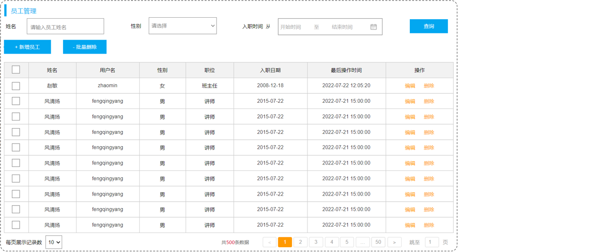

# SpringBoot案例 ⅓

## 1. 准备工作

### 1.1 需求

**部门管理**:


部门管理功能开发包括：

- 查询部门列表
- 删除部门
- 新增部门
- 修改部门

**员工管理**:



员工管理功能开发包括：

- 查询员工列表(分页、条件)
- 删除员工
- 新增员工
- 修改员工

### 1.2 环境搭建


::: info 步骤

1. 准备数据库表(dept、emp)

2. 创建springboot工程，引入对应的起步依赖（web、mybatis、mysql驱动、lombok）

3. 配置文件application.properties中引入mybatis的配置信息，准备对应的实体类

4. 准备对应的Mapper、Service(接口、实现类)、Controller基础结构

:::

**第1步**：准备数据库表

::: details sql表

```sql
-- 部门管理
create table dept(
    id int unsigned primary key auto_increment comment '主键ID',
    name varchar(10) not null unique comment '部门名称',
    create_time datetime not null comment '创建时间',
    update_time datetime not null comment '修改时间'
) comment '部门表';

-- 部门表测试数据
insert into dept (id, name, create_time, update_time) 
values(1,'学工部',now(),now()),
      (2,'教研部',now(),now()),
      (3,'咨询部',now(),now()), 
      (4,'就业部',now(),now()),
      (5,'人事部',now(),now());

-- 员工管理(带约束)
create table emp (
  id int unsigned primary key auto_increment comment 'ID',
  username varchar(20) not null unique comment '用户名',
  password varchar(32) default '123456' comment '密码',
  name varchar(10) not null comment '姓名',
  gender tinyint unsigned not null comment '性别, 说明: 1 男, 2 女',
  image varchar(300) comment '图像',
  job tinyint unsigned comment '职位, 说明: 1 班主任,2 讲师, 3 学工主管, 4 教研主管, 5 咨询师',
  entrydate date comment '入职时间',
  dept_id int unsigned comment '部门ID',
  create_time datetime not null comment '创建时间',
  update_time datetime not null comment '修改时间'
) comment '员工表';

-- 员工表测试数据
INSERT INTO emp
    (id, username, password, name, gender, 
    image, job, entrydate,dept_id,create_time, update_time) 
VALUES
(1,'jinyong','123456','金庸',1,'1.jpg',4,'2000-01-01',2,now(),now()),
(2,'zhangwuji','123456','张无忌',1,'2.jpg',2,'2015-01-01',2,now(),now()),
(3,'yangxiao','123456','杨逍',1,'3.jpg',2,'2008-05-01',2,now(),now()),
(4,'weiyixiao','123456','韦一笑',1,'4.jpg',2,'2007-01-01',2,now(),now()),
(5,'changyuchun','123456','常遇春',1,'5.jpg',2,'2012-12-05',2,now(),now()),
(6,'xiaozhao','123456','小昭',2,'6.jpg',3,'2013-09-05',1,now(),now()),
(7,'jixiaofu','123456','纪晓芙',2,'7.jpg',1,'2005-08-01',1,now(),now()),
(8,'zhouzhiruo','123456','周芷若',2,'8.jpg',1,'2014-11-09',1,now(),now()),
(9,'dingminjun','123456','丁敏君',2,'9.jpg',1,'2011-03-11',1,now(),now()),
(10,'zhaomin','123456','赵敏',2,'10.jpg',1,'2013-09-05',1,now(),now()),
(11,'luzhangke','123456','鹿杖客',1,'11.jpg',5,'2007-02-01',3,now(),now()),
(12,'hebiweng','123456','鹤笔翁',1,'12.jpg',5,'2008-08-18',3,now(),now()),
(13,'fangdongbai','123456','方东白',1,'13.jpg',5,'2012-11-01',3,now(),now()),
(14,'zhangsanfeng','123456','张三丰',1,'14.jpg',2,'2002-08-01',2,now(),now()),
(15,'yulianzhou','123456','俞莲舟',1,'15.jpg',2,'2011-05-01',2,now(),now()),
(16,'songyuanqiao','123456','宋远桥',1,'16.jpg',2,'2007-01-01',2,now(),now()),
(17,'chenyouliang','123456','陈友谅',1,'17.jpg',NULL,'2015-03-21',NULL,now(),now());
```

:::

**第2步**：创建一个SpringBoot工程，选择引入对应的起步依赖（web、mybatis、mysql驱动、lombok） (版本选择2.7.5版本，可以创建完毕之后，在pom.xml文件中更改版本号)


::: details 生成的pom.xml文件：

```xml
<?xml version="1.0" encoding="UTF-8"?>
<project xmlns="http://maven.apache.org/POM/4.0.0" xmlns:xsi="http://www.w3.org/2001/XMLSchema-instance"
         xsi:schemaLocation="http://maven.apache.org/POM/4.0.0 https://maven.apache.org/xsd/maven-4.0.0.xsd">
    <modelVersion>4.0.0</modelVersion>
    <parent>
        <groupId>org.springframework.boot</groupId>
        <artifactId>spring-boot-starter-parent</artifactId>
        <version>2.7.5</version>
        <relativePath/> 
    </parent>
    <groupId>com.itheima</groupId>
    <artifactId>tlias-web-management</artifactId>
    <version>0.0.1-SNAPSHOT</version>
    <name>tlias-web-management</name>
    <description>Demo project for Spring Boot</description>
    <properties>
        <java.version>11</java.version>
    </properties>
    <dependencies>
        <dependency>
            <groupId>org.springframework.boot</groupId>
            <artifactId>spring-boot-starter-web</artifactId>
        </dependency>
        <dependency>
            <groupId>org.mybatis.spring.boot</groupId>
            <artifactId>mybatis-spring-boot-starter</artifactId>
            <version>2.3.0</version>
        </dependency>

        <dependency>
            <groupId>com.mysql</groupId>
            <artifactId>mysql-connector-j</artifactId>
            <scope>runtime</scope>
        </dependency>
        <dependency>
            <groupId>org.projectlombok</groupId>
            <artifactId>lombok</artifactId>
            <optional>true</optional>
        </dependency>
        <dependency>
            <groupId>org.springframework.boot</groupId>
            <artifactId>spring-boot-starter-test</artifactId>
            <scope>test</scope>
        </dependency>
    </dependencies>

    <build>
        <plugins>
            <plugin>
                <groupId>org.springframework.boot</groupId>
                <artifactId>spring-boot-maven-plugin</artifactId>
                <configuration>
                    <excludes>
                        <exclude>
                            <groupId>org.projectlombok</groupId>
                            <artifactId>lombok</artifactId>
                        </exclude>
                    </excludes>
                </configuration>
            </plugin>
        </plugins>
    </build>

</project>
```

:::

创建项目工程目录结构：


**第3步**：配置文件application.properties中引入mybatis的配置信息，准备对应的实体类

- application.properties （直接把之前项目中的复制过来）

```properties
#数据库连接
spring.datasource.driver-class-name=com.mysql.cj.jdbc.Driver
spring.datasource.url=jdbc:mysql://localhost:3306/tlias
spring.datasource.username=root
spring.datasource.password=1234

#开启mybatis的日志输出
mybatis.configuration.log-impl=org.apache.ibatis.logging.stdout.StdOutImpl

#开启数据库表字段 到 实体类属性的驼峰映射
mybatis.configuration.map-underscore-to-camel-case=true
```

- 实体类

```java
/*部门类*/
@Data
@NoArgsConstructor
@AllArgsConstructor
public class Dept {
    private Integer id;
    private String name;
    private LocalDateTime createTime;
    private LocalDateTime updateTime;
}
```

```java
/*员工类*/
@Data
@NoArgsConstructor
@AllArgsConstructor
public class Emp {
    private Integer id;
    private String username;
    private String password;
    private String name;
    private Short gender;
    private String image;
    private Short job;
    private LocalDate entrydate;
    private Integer deptId;
    private LocalDateTime createTime;
    private LocalDateTime updateTime;
}
```

**第4步**：准备对应的Mapper、Service(接口、实现类)、Controller基础结构

数据访问层：

- DeptMapper

```java
package com.itheima.mapper;
import org.apache.ibatis.annotations.Mapper;

@Mapper
public interface DeptMapper {
}
```

- EmpMapper

```java
package com.itheima.mapper;
import org.apache.ibatis.annotations.Mapper;

@Mapper
public interface EmpMapper {
}

```

业务层：

- DeptService

```java
package com.itheima.service;

//部门业务规则
public interface DeptService {
}
```

- DeptServiceImpl

```java
package com.itheima.service.impl;
import lombok.extern.slf4j.Slf4j;
import org.springframework.stereotype.Service;

//部门业务实现类
@Slf4j
@Service
public class DeptServiceImpl implements DeptService {
}
```

- EmpService

```java
package com.itheima.service;

//员工业务规则
public interface EmpService {
}
```

- EmpServiceImpl

```java
package com.itheima.service.impl;
import com.itheima.service.EmpService;
import lombok.extern.slf4j.Slf4j;
import org.springframework.stereotype.Service;

//员工业务实现类
@Slf4j
@Service
public class EmpServiceImpl implements EmpService {

}
```

控制层：

- DeptController

```java
package com.itheima.controller;
import org.springframework.web.bind.annotation.RestController;

//部门管理控制器
@RestController
public class DeptController {
}
```

- EmpController

```java
package com.itheima.controller;
import org.springframework.web.bind.annotation.RestController;

//员工管理控制器
@RestController
public class EmpController {
}
```

项目工程结构：


## 2 开发规范

案例是基于当前最为主流的前后端分离模式进行开发


---

### 2.1 REST

REST（Representational State Transfer），表述性状态转换，它是一种软件架构风格。

**传统URL风格如下**:

```url
http://localhost:8080/user/getById?id=1     GET：查询id为1的用户
http://localhost:8080/user/saveUser         POST：新增用户
http://localhost:8080/user/updateUser       POST：修改用户
http://localhost:8080/user/deleteUser?id=1  GET：删除id为1的用户
```

原始的传统URL定义比较复杂，而且将资源的访问行为对外暴露出来了。

**基于REST风格URL如下：**

```url
http://localhost:8080/users/1  GET：查询id为1的用户
http://localhost:8080/users    POST：新增用户
http://localhost:8080/users    PUT：修改用户
http://localhost:8080/users/1  DELETE：删除id为1的用户
```

总结：通过URL定位要操作的资源，通过HTTP(请求方式)来描述具体的操作。

在REST风格的URL中，通过四种请求方式，来操作数据的增删改查。

- GET ： 查询
- POST ：新增
- PUT ：修改
- DELETE ：删除

### 2.2 统一响应结果

前后端工程在进行交互时，使用统一响应结果 Result。

```java
package com.itheima.pojo;

import lombok.AllArgsConstructor;
import lombok.Data;
import lombok.NoArgsConstructor;

@Data
@NoArgsConstructor
@AllArgsConstructor
public class Result {
    private Integer code;//响应码，1 代表成功; 0 代表失败
    private String msg;  //响应信息 描述字符串
    private Object data; //返回的数据

    //增删改 成功响应
    public static Result success(){
        return new Result(1,"success",null);
    }
    //查询 成功响应
    public static Result success(Object data){
        return new Result(1,"success",data);
    }
    //失败响应
    public static Result error(String msg){
        return new Result(0,msg,null);
    }
}
```

### 2.3 开发流程


1. 查看页面原型明确需求
   - 根据页面原型和需求，进行表结构设计、编写接口文档

2. 阅读接口文档
3. 思路分析
4. 功能接口开发
   - 就是开发后台的业务功能，一个业务功能，我们称为一个接口
5. 功能接口测试
   - 功能开发完毕后，先通过Postman进行功能接口测试，测试通过后，再和前端进行联调测试
6. 前后端联调测试
   - 和前端开发人员开发好的前端工程一起测试
