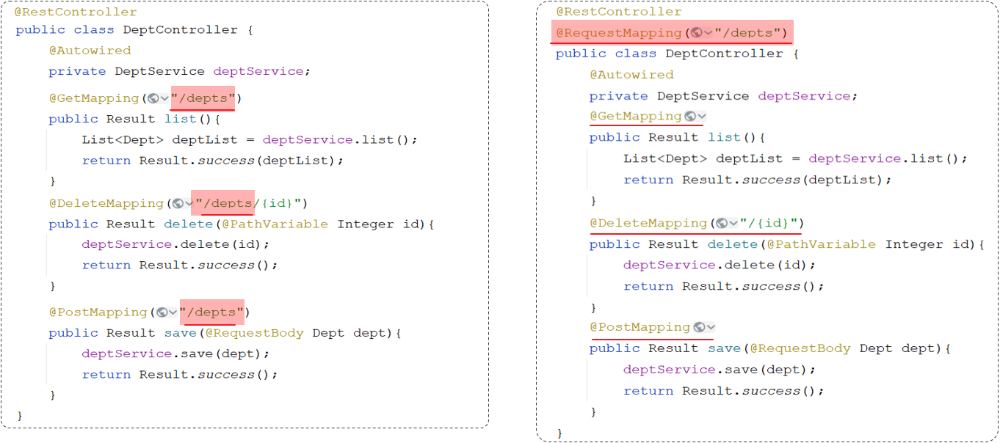
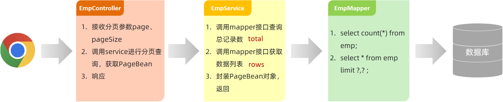

# SpringBoot案例 ⅔

## 1. 部门管理

开发的部门管理功能包含：

1. 查询部门
2. 删除部门
3. 新增部门
4. 更新部门

### 1.1 查询部门

#### 1.1.1 原型和需求


#### 1.1.2 接口文档

**部门列表查询**:

- 基本信息

  ```markdown
  请求路径：/depts
  
  请求方式：GET
  
  接口描述：该接口用于部门列表数据查询
  ```

- 请求参数

  无

- 响应数据

  参数格式：application/json

  参数说明：

  | 参数名         | 类型      | 是否必须 | 备注                           |
  | -------------- | --------- | -------- | ------------------------------ |
  | code           | number    | 必须     | 响应码，1 代表成功，0 代表失败 |
  | msg            | string    | 非必须   | 提示信息                       |
  | data           | object[ ] | 非必须   | 返回的数据                     |
  | \|- id         | number    | 非必须   | id                             |
  | \|- name       | string    | 非必须   | 部门名称                       |
  | \|- createTime | string    | 非必须   | 创建时间                       |
  | \|- updateTime | string    | 非必须   | 修改时间                       |

  响应数据样例：

  ```json
  {
    "code": 1,
    "msg": "success",
    "data": [
      {
        "id": 1,
        "name": "学工部",
        "createTime": "2022-09-01T23:06:29",
        "updateTime": "2022-09-01T23:06:29"
      },
      {
        "id": 2,
        "name": "教研部",
        "createTime": "2022-09-01T23:06:29",
        "updateTime": "2022-09-01T23:06:29"
      }
    ]
  }
  ```

#### 1.1.3 思路分析


#### 1.1.4 功能开发

> 请求路径：/depts
>
> 请求方式：GET
>
> 请求参数：无
>
> 响应数据：json格式

**DeptController**:

```java
@Slf4j
@RestController
public class DeptController {
    @Autowired
    private DeptService deptService;

    //@RequestMapping(value = "/depts" , method = RequestMethod.GET)
    @GetMapping("/depts")
    public Result list(){
        log.info("查询所有部门数据");
        List<Dept> deptList = deptService.list();
        return Result.success(deptList);
    }
}
```

> @Slf4j注解源码：
>
> 

**DeptService**（业务接口）

```java
public interface DeptService {
    /**
     * 查询所有的部门数据
     * @return   存储Dept对象的集合
     */
    List<Dept> list();
}
```

 **DeptServiceImpl**（业务实现类）

```java
@Slf4j
@Service
public class DeptServiceImpl implements DeptService {
    @Autowired
    private DeptMapper deptMapper;
    
    @Override
    public List<Dept> list() {
        List<Dept> deptList = deptMapper.list();
        return deptList;
    }
}    
```

**DeptMapper**:

```java
@Mapper
public interface DeptMapper {
    //查询所有部门数据
    @Select("select id, name, create_time, update_time from dept")
    List<Dept> list();
}
```

#### 1.1.5 功能测试

启动项目，打开postman，发起GET请求，访问 ：[http://localhost:8080/depts](http://localhost:8080/depts)


### 1.2 前后端联调

1、启动[nginx](../../FrontEnd/Vue/vue07.md)


2、打开浏览器，访问：[http://localhost:90]


3、测试：部门管理 - 查询部门列表


### 1.3 删除部门

#### 1.3.1 需求


#### 1.3.2 接口文档

**删除部门**:

- 基本信息

  ```md
  请求路径：/depts/{id}
  
  请求方式：DELETE
  
  接口描述：该接口用于根据ID删除部门数据
  ```

- 请求参数
  参数格式：路径参数

  参数说明：

  | 参数名 | 类型   | 是否必须 | 备注   |
  | ------ | ------ | -------- | ------ |
  | id     | number | 必须     | 部门ID |

  请求参数样例：

  ```md
  /depts/1
  ```

- 响应数据
  参数格式：application/json

  参数说明：

  | 参数名 | 类型   | 是否必须 | 备注                           |
  | ------ | ------ | -------- | ------------------------------ |
  | code   | number | 必须     | 响应码，1 代表成功，0 代表失败 |
  | msg    | string | 非必须   | 提示信息                       |
  | data   | object | 非必须   | 返回的数据                     |

  响应数据样例：

  ```json
  {
      "code":1,
      "msg":"success",
      "data":null
  }
  ```

#### 1.3.3 思路分析


> 接口文档规定：
>
> - 前端请求路径：/depts/{id}
> - 前端请求方式：DELETE
>
> 问题1：怎么在controller中接收请求路径中的路径参数？
>
> ```md
> @PathVariable
> ```
>
> 问题2：如何限定请求方式是delete？
>
> ```md
> @DeleteMapping
> ```

#### 1.3.4 功能开发

> 请求路径：/depts/{id}
>
> 请求方式：DELETE
>
> 请求参数：路径参数 {id}
>
> 响应数据：json格式

**DeptController**:

```java
@Slf4j
@RestController
public class DeptController {
    @Autowired
    private DeptService deptService;

    @DeleteMapping("/depts/{id}")
    public Result delete(@PathVariable Integer id) {
        //日志记录
        log.info("根据id删除部门");
        //调用service层功能
        deptService.delete(id);
        //响应
        return Result.success();
    }
    
    //省略...
}
```

**DeptService**:

```java
public interface DeptService {

    /**
     * 根据id删除部门
     * @param id    部门id
     */
    void delete(Integer id);

    //省略...
}
```

**DeptServiceImpl**:

```java
@Slf4j
@Service
public class DeptServiceImpl implements DeptService {
    @Autowired
    private DeptMapper deptMapper;

    @Override
    public void delete(Integer id) {
        //调用持久层删除功能
        deptMapper.deleteById(id);
    }
    
    //省略...
}
```

**DeptMapper**:

```java
@Mapper
public interface DeptMapper {
    /**
     * 根据id删除部门信息
     * @param id   部门id
     */
    @Delete("delete from dept where id = #{id}")
    void deleteById(Integer id);
   
    //省略...
}
```

#### 1.3.5 功能测试

重新启动项目，使用postman，发起DELETE请求：


#### 1.3.6 前后端联调


### 1.4 新增部门

#### 1.4.1 需求


#### 1.4.2 接口文档

**添加部门**:

- 基本信息

  ```md
  请求路径：/depts
  
  请求方式：POST
  
  接口描述：该接口用于添加部门数据
  ```

- 请求参数

  格式：application/json

  参数说明：

  | 参数名 | 类型   | 是否必须 | 备注     |
  | ------ | ------ | -------- | -------- |
  | name   | string | 必须     | 部门名称 |

  请求参数样例：

  ```json
  {
    "name": "教研部"
  }
  ```

- 响应数据

  参数格式：application/json

  参数说明：

  | 参数名 | 类型   | 是否必须 | 备注                           |
  | ------ | ------ | -------- | ------------------------------ |
  | code   | number | 必须     | 响应码，1 代表成功，0 代表失败 |
  | msg    | string | 非必须   | 提示信息                       |
  | data   | object | 非必须   | 返回的数据                     |

  响应数据样例：

  ```json
  {
      "code":1,
      "msg":"success",
      "data":null
  }
  ```

#### 1.4.3 思路分析


> 接口文档规定：
>
> - 前端请求路径：/depts
> - 前端请求方式：POST
> - 前端请求参数：Json格式：\{ "name": "教研部" \}
>
> 问题1：如何限定请求方式是POST？
>
> ```java
> @PostMapping
> ```
>
> 问题2：怎么在controller中接收json格式的请求参数？
>
> ```java
> @RequestBody  //把前端传递的json数据填充到实体类中
> ```

#### 1.4.4 功能开发

通过查看接口文档：新增部门

> 请求路径：/depts
>
> 请求方式：POST
>
> 请求参数：json格式
>
> 响应数据：json格式

**DeptController**:

```java
@Slf4j
@RestController
public class DeptController {
    @Autowired
    private DeptService deptService;

    @PostMapping("/depts")
    public Result add(@RequestBody Dept dept){
        //记录日志
        log.info("新增部门：{}",dept);
        //调用service层添加功能
        deptService.add(dept);
        //响应
        return Result.success();
    }

    //省略...
}
```

**DeptService**:

```java
public interface DeptService {

    /**
     * 新增部门
     * @param dept  部门对象
     */
    void add(Dept dept);

    //省略...
}

```

**DeptServiceImpl**:

```java
@Slf4j
@Service
public class DeptServiceImpl implements DeptService {
    @Autowired
    private DeptMapper deptMapper;

    @Override
    public void add(Dept dept) {
        //补全部门数据
        dept.setCreateTime(LocalDateTime.now());
        dept.setUpdateTime(LocalDateTime.now());
        //调用持久层增加功能
        deptMapper.inser(dept);
    }

    //省略...
}

```

**DeptMapper**:

```java
@Mapper
public interface DeptMapper {

    @Insert("insert into dept (name, create_time, update_time) values (#{name},#{createTime},#{updateTime})")
    void inser(Dept dept);

    //省略...
}
```

#### 1.4.5 功能测试

重新启动项目，使用postman，发起POST请求：


#### 1.4.6 前后端联调 


#### 1.4.7 请求路径

部门管理的`查询`、`删除`、`新增`功能全部完成了，接下来对controller层的代码进行优化。


> 以上三个方法上的请求路径，存在一个共同点：都是以`/depts`作为开头。

在Spring当中为了简化请求路径的定义，可以把公共的请求路径，直接抽取到类上，在类上加一个注解@RequestMapping，并指定请求路径"/depts"


> 优化前后的对比：
>
> 
> 注意事项：一个完整的请求路径，应该是类上@RequestMapping的value属性 + 方法上的@RequestMapping的value属性

## 2. 员工管理


基于以上原型，可以把员工管理功能分为：

1. 分页查询
2. 带条件的分页查询
3. 删除员工
4. 新增员工
5. 修改员工

### 2.1 分页查询

#### 2.1.1 基础分页

**需求分析**：


要想从数据库中进行分页查询，要使用`LIMIT`关键字  

格式为：limit  开始索引  每页显示的条数

> 查询第1页数据的SQL语句是：
>
> ```sql
> select * from emp limit 0,10;
> ```
>
> 查询第2页数据的SQL语句是：
>
> ```sql
> select * from emp limit 10,10;
> ```
>
> 开始索引的计算公式：开始索引 = (当前页码 - 1)  *  每页显示条数

结论：

1. 前端在请求服务端时，传递的参数
   - 当前页码  page
   - 每页显示条数  pageSize
2. 后端需要响应什么数据给前端
   - 所查询到的数据列表（存储到List 集合中）
   - 总记录数


> 后台给前端返回的数据包含：List集合(数据列表)、total(总记录数)
>
> 而这两部分通常封装到PageBean对象中，并将该对象转换为json格式的数据响应回给浏览器。
>
> ```java
> @Data
> @NoArgsConstructor
> @AllArgsConstructor
> public class PageBean {
>   private Long total; //总记录数
>   private List rows; //当前页数据列表
> }
> ```

**接口文档**：

员工列表查询

- 基本信息

  ```md
  请求路径：/emps
  
  请求方式：GET
  
  接口描述：该接口用于员工列表数据的条件分页查询
  ```

- 请求参数

  参数格式：queryString

  参数说明：

  | 参数名称 | 是否必须 | 示例       | 备注                                       |
  | -------- | -------- | ---------- | ------------------------------------------ |
  | name     | 否       | 张         | 姓名                                       |
  | gender   | 否       | 1          | 性别 , 1 男 , 2 女                         |
  | begin    | 否       | 2010-01-01 | 范围匹配的开始时间(入职日期)               |
  | end      | 否       | 2020-01-01 | 范围匹配的结束时间(入职日期)               |
  | page     | 是       | 1          | 分页查询的页码，如果未指定，默认为1        |
  | pageSize | 是       | 10         | 分页查询的每页记录数，如果未指定，默认为10 |

  请求数据样例：

  ```shell
  /emps?name=张&gender=1&begin=2007-09-01&end=2022-09-01&page=1&pageSize=10
  ```

- 响应数据

  参数格式：application/json

  参数说明：

  | 名称           | 类型      | 是否必须 | 默认值 | 备注                                                         | 其他信息          |
  | -------------- | --------- | -------- | ------ | ------------------------------------------------------------ | ----------------- |
  | code           | number    | 必须     |        | 响应码, 1 成功 , 0 失败                                      |                   |
  | msg            | string    | 非必须   |        | 提示信息                                                     |                   |
  | data           | object    | 必须     |        | 返回的数据                                                   |                   |
  | \|- total      | number    | 必须     |        | 总记录数                                                     |                   |
  | \|- rows       | object [] | 必须     |        | 数据列表                                                     | item 类型: object |
  | \|- id         | number    | 非必须   |        | id                                                           |                   |
  | \|- username   | string    | 非必须   |        | 用户名                                                       |                   |
  | \|- name       | string    | 非必须   |        | 姓名                                                         |                   |
  | \|- password   | string    | 非必须   |        | 密码                                                         |                   |
  | \|- entrydate  | string    | 非必须   |        | 入职日期                                                     |                   |
  | \|- gender     | number    | 非必须   |        | 性别 , 1 男 ; 2 女                                           |                   |
  | \|- image      | string    | 非必须   |        | 图像                                                         |                   |
  | \|- job        | number    | 非必须   |        | 职位, 说明: 1 班主任,2 讲师, 3 学工主管, 4 教研主管, 5 咨询师 |                   |
  | \|- deptId     | number    | 非必须   |        | 部门id                                                       |                   |
  | \|- createTime | string    | 非必须   |        | 创建时间                                                     |                   |
  | \|- updateTime | string    | 非必须   |        | 更新时间                                                     |                   |

  响应数据样例：

  ```json
  {
    "code": 1,
    "msg": "success",
    "data": {
      "total": 2,
      "rows": [
         {
          "id": 1,
          "username": "jinyong",
          "password": "123456",
          "name": "金庸",
          "gender": 1,
          "image": "https://web-framework.oss-cn-hangzhou.aliyuncs.com/2022-09-02-00-27-53B.jpg",
          "job": 2,
          "entrydate": "2015-01-01",
          "deptId": 2,
          "createTime": "2022-09-01T23:06:30",
          "updateTime": "2022-09-02T00:29:04"
        },
        {
          "id": 2,
          "username": "zhangwuji",
          "password": "123456",
          "name": "张无忌",
          "gender": 1,
          "image": "https://web-framework.oss-cn-hangzhou.aliyuncs.com/2022-09-02-00-27-53B.jpg",
          "job": 2,
          "entrydate": "2015-01-01",
          "deptId": 2,
          "createTime": "2022-09-01T23:06:30",
          "updateTime": "2022-09-02T00:29:04"
        }
      ]
    }
  }
  ```

**思路分析**:



分页查询需要的数据，封装在PageBean对象中：


**功能开发**:

> 请求路径：/emps
>
> 请求方式：GET
>
> 请求参数：跟随在请求路径后的参数字符串。  例：/emps?page=1&pageSize=10
>
> 响应数据：json格式

**EmpController**:

```java
import com.itheima.pojo.PageBean;
import com.itheima.pojo.Result;
import com.itheima.service.EmpService;
import lombok.extern.slf4j.Slf4j;
import org.springframework.beans.factory.annotation.Autowired;
import org.springframework.web.bind.annotation.GetMapping;
import org.springframework.web.bind.annotation.RequestMapping;
import org.springframework.web.bind.annotation.RequestParam;
import org.springframework.web.bind.annotation.RestController;

@Slf4j
@RestController
@RequestMapping("/emps")
public class EmpController {

    @Autowired
    private EmpService empService;

    //条件分页查询
    @GetMapping
    public Result page(@RequestParam(defaultValue = "1") Integer page,
                       @RequestParam(defaultValue = "10") Integer pageSize) {
        //记录日志
        log.info("分页查询，参数：{},{}", page, pageSize);
        //调用业务层分页查询功能
        PageBean pageBean = empService.page(page, pageSize);
        //响应
        return Result.success(pageBean);
    }
}
```

> @RequestParam(defaultValue="默认值")   //设置请求参数默认值

**EmpService**:

```java
public interface EmpService {
    /**
     * 条件分页查询
     * @param page 页码
     * @param pageSize 每页展示记录数
     * @return
     */
    PageBean page(Integer page, Integer pageSize);
}
```

**EmpServiceImpl**:

```java
import com.itheima.mapper.EmpMapper;
import com.itheima.pojo.Emp;
import com.itheima.pojo.PageBean;
import com.itheima.service.EmpService;
import lombok.extern.slf4j.Slf4j;
import org.springframework.beans.factory.annotation.Autowired;
import org.springframework.stereotype.Service;
import java.time.LocalDate;
import java.util.List;

@Slf4j
@Service
public class EmpServiceImpl implements EmpService {
    @Autowired
    private EmpMapper empMapper;

    @Override
    public PageBean page(Integer page, Integer pageSize) {
        //1、获取总记录数
        Long count = empMapper.count();

        //2、获取分页查询结果列表
        Integer start = (page - 1) * pageSize; //计算起始索引 , 公式: (页码-1)*页大小
        List<Emp> empList = empMapper.list(start, pageSize);

        //3、封装PageBean对象
        PageBean pageBean = new PageBean(count , empList);
        return pageBean;
    }
}
```

**EmpMapper**:

```java
@Mapper
public interface EmpMapper {
    //获取总记录数
    @Select("select count(*) from emp")
    public Long count();

    //获取当前页的结果列表
    @Select("select * from emp limit #{start}, #{pageSize}")
    public List<Emp> list(Integer start, Integer pageSize);
}
```

**功能测试**:

功能开发完成后，重新启动项目，使用postman，发起POST请求：


**前后端联调**:

打开浏览器，测试后端功能接口：


#### 2.1.2 分页插件

**介绍**:

基础的分页查询功能编写起来比较繁琐


结论：原始方式的分页查询，存在着"步骤固定"、"代码频繁"的问题

解决方案：可以使用一些现成的分页插件完成。对于Mybatis来讲现在最主流的就是PageHelper。

> PageHelper是Mybatis的一款功能强大、方便易用的分页插件，支持任何形式的单标、多表的分页查询。
>
> 官网：[https://pagehelper.github.io/]


> 在执行empMapper.list()方法时，就是执行：select  *  from  emp   语句，怎么能够实现分页操作呢？
>
> 分页插件帮我们完成了以下操作：
>
> 1. 先获取到要执行的SQL语句：select  *  from  emp
> 2. 把SQL语句中的字段列表，变为：count(*)
> 3. 执行SQL语句：select  count(*)  from  emp          //获取到总记录数
> 4. 再对要执行的SQL语句：select  *  from  emp 进行改造，在末尾添加 limit ? , ?
> 5. 执行改造后的SQL语句：select  *  from  emp  limit  ? , ?

**代码实现**:

当使用了PageHelper分页插件进行分页，就无需再Mapper中进行手动分页了。

::: note
在Mapper中只需要进行正常的列表查询即可  

在Service层中，调用Mapper的方法之前设置分页参数  

在调用Mapper方法执行查询之后，解析分页结果，并将结果封装到PageBean对象中返回

:::

1、在pom.xml引入依赖

```xml
<dependency>
    <groupId>com.github.pagehelper</groupId>
    <artifactId>pagehelper-spring-boot-starter</artifactId>
    <version>1.4.2</version>
</dependency>
```

2、EmpMapper

```java
@Mapper
public interface EmpMapper {
    //获取当前页的结果列表
    @Select("select * from emp")
    public List<Emp> page(Integer start, Integer pageSize);
}
```

3、EmpServiceImpl

```java
@Override
public PageBean page(Integer page, Integer pageSize) {
    // 设置分页参数
    PageHelper.startPage(page, pageSize); 
    // 执行分页查询
    List<Emp> empList = empMapper.list(name,gender,begin,end); 
    // 获取分页结果
    Page<Emp> p = (Page<Emp>) empList;   
    //封装PageBean
    PageBean pageBean = new PageBean(p.getTotal(), p.getResult()); 
    return pageBean;
}
```

**测试**:

功能开发完成后，我们重启项目工程，打开postman，发起GET请求，访问 ：[http://localhost:8080/emps?page=1&pageSize=5]


> 后端程序SQL输出：
>
> 

### 2.2 分页查询(带条件)

#### 2.2.1 需求


通过员工管理的页面原型可以看到，员工列表页面的查询，不仅仅需要考虑分页，还需要考虑查询条件。

看到页面原型及需求中描述，搜索栏的搜索条件有三个，分别是：

- 姓名：模糊匹配
- 性别：精确匹配
- 入职日期：范围匹配

```sql
select * 
from emp
where 
  name like concat('%','张','%')   -- 条件1：根据姓名模糊匹配
  and gender = 1                   -- 条件2：根据性别精确匹配
  and entrydate = between '2000-01-01' and '2010-01-01'  -- 条件3：根据入职日期范围匹配
order by update_time desc;
```

#### 2.2.2 思路分析


#### 2.2.3 功能开发

通过查看接口文档：员工列表查询

> 请求路径：/emps
>
> 请求方式：GET
>
> 请求参数：
>
> | 参数名称 | 是否必须 | 示例       | 备注                                       |
> | -------- | -------- | ---------- | ------------------------------------------ |
> | name     | 否       | 张         | 姓名                                       |
> | gender   | 否       | 1          | 性别 , 1 男 , 2 女                         |
> | begin    | 否       | 2010-01-01 | 范围匹配的开始时间(入职日期)               |
> | end      | 否       | 2020-01-01 | 范围匹配的结束时间(入职日期)               |
> | page     | 是       | 1          | 分页查询的页码，如果未指定，默认为1        |
> | pageSize | 是       | 10         | 分页查询的每页记录数，如果未指定，默认为10 |

在原有分页查询的代码基础上进行改造：

**EmpController**:

```java
@Slf4j
@RestController
@RequestMapping("/emps")
public class EmpController {

    @Autowired
    private EmpService empService;

    //条件分页查询
    @GetMapping
    public Result page(@RequestParam(defaultValue = "1") Integer page,
                       @RequestParam(defaultValue = "10") Integer pageSize,
                       String name, Short gender,
                       @DateTimeFormat(pattern = "yyyy-MM-dd") LocalDate begin,
                       @DateTimeFormat(pattern = "yyyy-MM-dd") LocalDate end) {
        //记录日志
        log.info("分页查询，参数：{},{},{},{},{},{}", page, pageSize,name, gender, begin, end);
        //调用业务层分页查询功能
        PageBean pageBean = empService.page(page, pageSize, name, gender, begin, end);
        //响应
        return Result.success(pageBean);
    }
}
```

**EmpService**:

```java
public interface EmpService {
    /**
     * 条件分页查询
     * @param page     页码
     * @param pageSize 每页展示记录数
     * @param name     姓名
     * @param gender   性别
     * @param begin   开始时间
     * @param end     结束时间
     * @return
     */
    PageBean page(Integer page, Integer pageSize, String name, Short gender, LocalDate begin, LocalDate end);
}
```

**EmpServiceImpl**:

```java
@Slf4j
@Service
public class EmpServiceImpl implements EmpService {
    @Autowired
    private EmpMapper empMapper;

    @Override
    public PageBean page(Integer page, Integer pageSize, String name, Short gender, LocalDate begin, LocalDate end) {
        //设置分页参数
        PageHelper.startPage(page, pageSize);
        //执行条件分页查询
        List<Emp> empList = empMapper.list(name, gender, begin, end);
        //获取查询结果
        Page<Emp> p = (Page<Emp>) empList;
        //封装PageBean
        PageBean pageBean = new PageBean(p.getTotal(), p.getResult());
        return pageBean;
    }
}
```

**EmpMapper**:

```java
@Mapper
public interface EmpMapper {
    //获取当前页的结果列表
    public List<Emp> list(String name, Short gender, LocalDate begin, LocalDate end);
}
```

**EmpMapper.xml**:

```xml
<?xml version="1.0" encoding="UTF-8" ?>
<!DOCTYPE mapper
        PUBLIC "-//mybatis.org//DTD Mapper 3.0//EN"
        "http://mybatis.org/dtd/mybatis-3-mapper.dtd">
<mapper namespace="com.itheima.mapper.EmpMapper">

    <!-- 条件分页查询 -->
    <select id="list" resultType="com.itheima.pojo.Emp">
        select * from emp
        <where>
            <if test="name != null and name != ''">
                name like concat('%',#{name},'%')
            </if>
            <if test="gender != null">
                and gender = #{gender}
            </if>
            <if test="begin != null and end != null">
                and entrydate between #{begin} and #{end}
            </if>
        </where>
        order by update_time desc
    </select>
</mapper>
```

#### 2.2.4 功能测试

功能开发完成后，重启项目工程，打开postman，发起GET请求：


> 控制台SQL语句：
>
> 

#### 2.2.5 前后端联调

打开浏览器，测试后端功能接口：


### 2.3 删除员工

#### 2.3.1 需求


当勾选列表前面的复选框，然后点击 "批量删除" 按钮，就可以将这一批次的员工信息删除掉了。也可以只勾选一个复选框，仅删除一个员工信息。

问题：我们需要开发两个功能接口吗？一个删除单个员工，一个删除多个员工

答案：不需要。 只需要开发一个功能接口即可（删除多个员工包含只删除一个员工）

#### 2.3.2 接口文档

**删除员工**:

- 基本信息

  ```md
  请求路径：/emps/{ids}
  
  请求方式：DELETE
  
  接口描述：该接口用于批量删除员工的数据信息
  ```

- 请求参数

  参数格式：路径参数

  参数说明：

  | 参数名 | 类型       | 示例  | 是否必须 | 备注         |
  | ------ | ---------- | ----- | -------- | ------------ |
  | ids    | 数组 array | 1,2,3 | 必须     | 员工的id数组 |

  请求参数样例：

  ```md
  /emps/1,2,3
  ```

- 响应数据

  参数格式：application/json

  参数说明：

  | 参数名 | 类型   | 是否必须 | 备注                           |
  | ------ | ------ | -------- | ------------------------------ |
  | code   | number | 必须     | 响应码，1 代表成功，0 代表失败 |
  | msg    | string | 非必须   | 提示信息                       |
  | data   | object | 非必须   | 返回的数据                     |

  响应数据样例：

  ```json
  {
      "code":1,
      "msg":"success",
      "data":null
  }
  ```

#### 2.3.3 思路分析


> 接口文档规定：
>
> - 前端请求路径：/emps/{ids}
> - 前端请求方式：DELETE
>
> 问题1：怎么在controller中接收请求路径中的路径参数？
>
> ```java
> @PathVariable
> ```
>
> 问题2：如何限定请求方式是delete？
>
> ```java
> @DeleteMapping
> ```
>
> 问题3：在Mapper接口中，执行delete操作的SQL语句时，条件中的id值是不确定的是动态的，怎么实现呢？
>
> ```java
> Mybatis中的动态SQL：foreach
> ```

#### 2.3.4 功能开发

通过查看接口文档：删除员工

> 请求路径：/emps/{ids}
>
> 请求方式：DELETE
>
> 请求参数：路径参数 {ids}
>
> 响应数据：json格式

**EmpController**:

```java
@Slf4j
@RestController
@RequestMapping("/emps")
public class EmpController {

    @Autowired
    private EmpService empService;

    //批量删除
    @DeleteMapping("/{ids}")
    public Result delete(@PathVariable List<Integer> ids){
        empService.delete(ids);
        return Result.success();
    }

    //条件分页查询
    @GetMapping
    public Result page(@RequestParam(defaultValue = "1") Integer page,
                       @RequestParam(defaultValue = "10") Integer pageSize,
                       String name, Short gender,
                       @DateTimeFormat(pattern = "yyyy-MM-dd") LocalDate begin,
                       @DateTimeFormat(pattern = "yyyy-MM-dd") LocalDate end) {
        //记录日志
        log.info("分页查询，参数：{},{},{},{},{},{}", page, pageSize,name, gender, begin, end);
        //调用业务层分页查询功能
        PageBean pageBean = empService.page(page, pageSize, name, gender, begin, end);
        //响应
        return Result.success(pageBean);
    }
}
```

**EmpService**:

```java
public interface EmpService {

    /**
     * 批量删除操作
     * @param ids id集合
     */
    void delete(List<Integer> ids);

    //省略...
}
```

**EmpServiceImpl**:

```java
@Slf4j
@Service
public class EmpServiceImpl implements EmpService {
    @Autowired
    private EmpMapper empMapper;

    @Override
    public void delete(List<Integer> ids) {
        empMapper.delete(ids);
    }

    //省略...
}
```

**EmpMapper**:

```java
@Mapper
public interface EmpMapper {
    //批量删除
    void delete(List<Integer> ids);

    //省略...
}
```

**EmpMapper.xml**:

```xml
<?xml version="1.0" encoding="UTF-8" ?>
<!DOCTYPE mapper
        PUBLIC "-//mybatis.org//DTD Mapper 3.0//EN"
        "http://mybatis.org/dtd/mybatis-3-mapper.dtd">
<mapper namespace="com.itheima.mapper.EmpMapper">

    <!--批量删除员工-->
    <select id="delete">
        delete from emp where id in
        <foreach collection="ids" item="id" open="(" close=")" separator=",">
            #{id}
        </foreach>
    </select>

    <!-- 省略... -->

</mapper>
```

#### 2.3.5 功能测试

功能开发完成后，重启项目工程，打开postman，发起DELETE请求：


> 控制台SQL语句：
>
> 

#### 2.3.6 前后端联调

打开浏览器，测试后端功能接口：


