# SpringBoot案例 ⅟

关于员工管理的功能，还有两个需求:

- 新增员工
- 修改员工

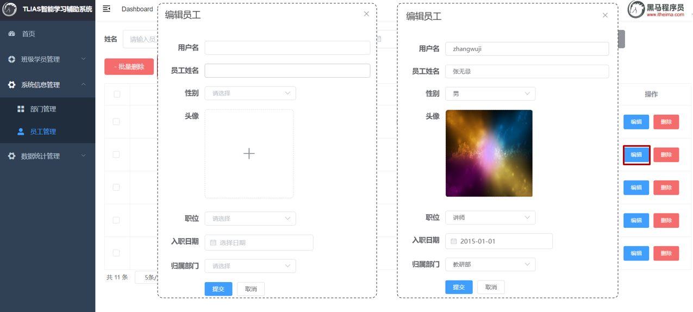

在"新增员工"中，需要添加头像，而头像需要用到"文件上传"技术。

## 1. 新增员工

### 1.1 需求


### 1.2 接口文档

- 基本信息

  ```md
  请求路径：/emps
  
  请求方式：POST
  
  接口描述：该接口用于添加员工的信息
  ```

- 请求参数

  参数格式：application/json

  参数说明：

  | 名称      | 类型   | 是否必须 | 备注                                                         |
  | --------- | ------ | -------- | ------------------------------------------------------------ |
  | username  | string | 必须     | 用户名                                                       |
  | name      | string | 必须     | 姓名                                                         |
  | gender    | number | 必须     | 性别, 说明: 1 男, 2 女                                       |
  | image     | string | 非必须   | 图像                                                         |
  | deptId    | number | 非必须   | 部门id                                                       |
  | entrydate | string | 非必须   | 入职日期                                                     |
  | job       | number | 非必须   | 职位, 说明: 1 班主任,2 讲师, 3 学工主管, 4 教研主管, 5 咨询师 |

  请求数据样例：

  ```json
  {
    "image": "https://web-framework.oss-cn-hangzhou.aliyuncs.com/2022-09-03-07-37-38222.jpg",
    "username": "linpingzhi",
    "name": "林平之",
    "gender": 1,
    "job": 1,
    "entrydate": "2022-09-18",
    "deptId": 1
  }
  ```

- 响应数据

  参数格式：application/json

  参数说明：

  | 参数名 | 类型   | 是否必须 | 备注                           |
  | ------ | ------ | -------- | ------------------------------ |
  | code   | number | 必须     | 响应码，1 代表成功，0 代表失败 |
  | msg    | string | 非必须   | 提示信息                       |
  | data   | object | 非必须   | 返回的数据                     |

  响应数据样例：

  ```json
  {
      "code":1,
      "msg":"success",
      "data":null
  }
  ```

### 1.3 思路分析

新增员工的具体的流程：


> 接口文档规定：
>
> - 请求路径：/emps
> - 请求方式：POST
> - 请求参数：Json格式数据
> - 响应数据：Json格式数据
>
> 问题1：如何限定请求方式是POST？
>
> ```java
> @PostMapping
> ```
>
> 问题2：怎么在controller中接收json格式的请求参数？
>
> ```java
> @RequestBody  //把前端传递的json数据填充到实体类中
> ```

### 1.4 功能开发

**EmpController**:

```java
@Slf4j
@RestController
@RequestMapping("/emps")
public class EmpController {

    @Autowired
    private EmpService empService;

    //新增
    @PostMapping
    public Result save(@RequestBody Emp emp){
        //记录日志
        log.info("新增员工, emp:{}",emp);
        //调用业务层新增功能
        empService.save(emp);
        //响应
        return Result.success();
    }

    //省略...
}
```

**EmpService**:

```java
public interface EmpService {

    /**
     * 保存员工信息
     * @param emp
     */
    void save(Emp emp);
    
    //省略...
}

```

**EmpServiceImpl**:

```java
@Slf4j
@Service
public class EmpServiceImpl implements EmpService {
    @Autowired
    private EmpMapper empMapper;

    @Override
    public void save(Emp emp) {
        //补全数据
        emp.setCreateTime(LocalDateTime.now());
        emp.setUpdateTime(LocalDateTime.now());
        //调用添加方法
        empMapper.insert(emp);
    }

    //省略...
}
```

**EmpMapper**:

```java
@Mapper
public interface EmpMapper {
    //新增员工
    @Insert("insert into emp (username, name, gender, image, job, entrydate, dept_id, create_time, update_time) " +
            "values (#{username}, #{name}, #{gender}, #{image}, #{job}, #{entrydate}, #{deptId}, #{createTime}, #{updateTime});")
    void insert(Emp emp);

    //省略...
}

```

### 1.5 功能测试

代码开发完成后，重启服务器，打开Postman发送 POST 请求，请求路径：  
[http://localhost:8080/emps](http://localhost:8080/emps)

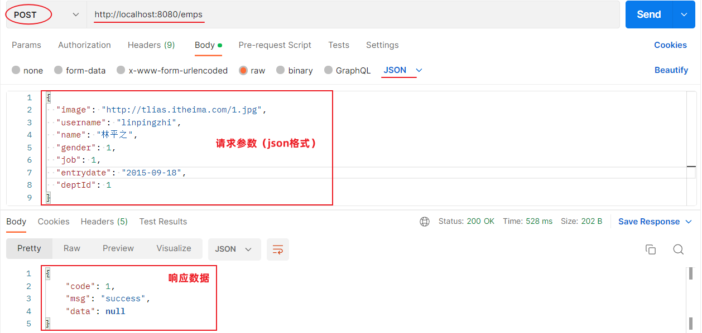

### 1.6 前后端联调

功能测试通过后，我们再进行通过打开浏览器，测试后端功能接口：

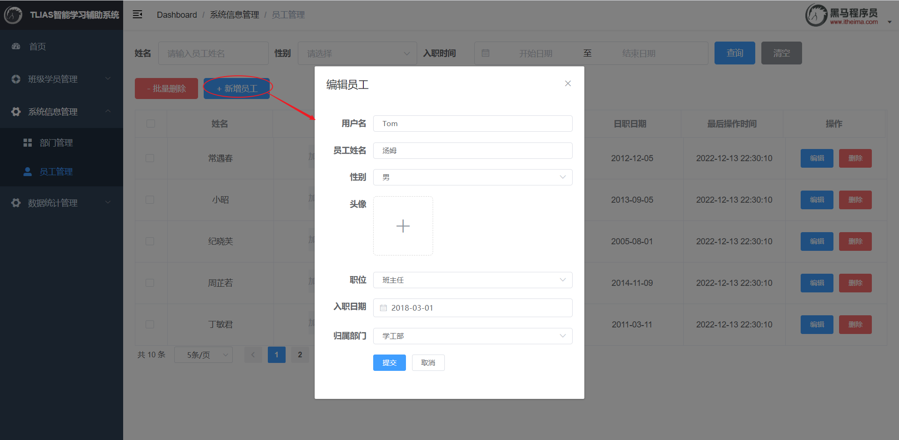


## 2. 文件上传


上述问题，需要我们通过文件上传技术来解决。

### 2.1 简介

文件上传: 指将本地图片、视频、音频等文件上传到服务器，供其他用户浏览或下载的过程。

文件上传在项目中应用非常广泛，我们经常发微博、发微信朋友圈都用到了文件上传功能。


文件上传功能需要涉及到两个部分：

1. 前端程序
2. 服务端程序

前端代码：

```html
<form action="/upload" method="post" enctype="multipart/form-data">
    姓名: <input type="text" name="username"><br>
    年龄: <input type="text" name="age"><br>
    头像: <input type="file" name="image"><br>
    <input type="submit" value="提交">
</form>
```

上传文件的原始form表单，要求表单必须具备以下三点（上传文件页面三要素）：

- 表单必须有file域，用于选择要上传的文件

  > ```html
  > <input type="file" name="image"/>
  > ```

- 表单提交方式必须为POST

  > 通常上传的文件会比较大，所以需要使用 POST 提交方式

- 表单的编码类型 enctype 必须要设置为：multipart/form-data

  > 普通默认的编码格式是不适合传输大型的二进制数据的，所以在文件上传时，表单的编码格式必须设置为 multipart/form-data

文件上传3要素


验证：删除form表单中enctype属性值，会是什么情况？

1. 在IDEA中直接使用浏览器打开upload.html页面

    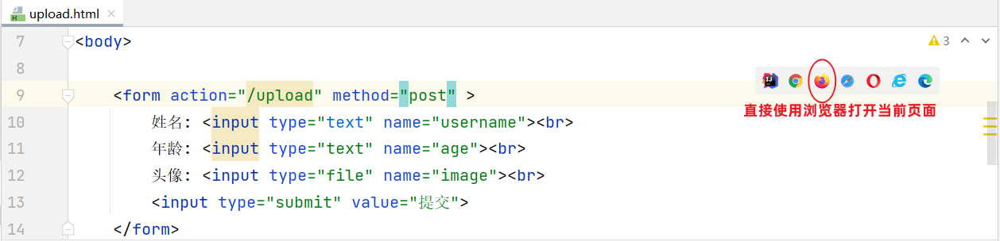

2. 选择要上传的本地文件

    

3. 点击"提交"按钮，进入到开发者模式观察

    

    

设置form表单中enctype属性值为multipart/form-data，会是什么情况？

```html
 <form action="/upload" method="post" enctype="multipart/form-data">
        姓名: <input type="text" name="username"><br>
        年龄: <input type="text" name="age"><br>
        头像: <input type="file" name="image"><br>
        <input type="submit" value="提交">
    </form>
```


知道了前端程序中需要设置上传文件页面三要素，那后端程序又是如何实现的呢？

- 首先在服务端定义一个controller，用来进行文件上传，然后在controller当中定义一个方法来处理`/upload` 请求

- 在定义的方法中接收提交过来的数据 （方法中的形参名和请求参数的名字保持一致）

  - 用户名：String  name
  - 年龄： Integer  age
  - 文件： MultipartFile  image

  > Spring中提供了一个API：MultipartFile，使用这个API就可以来接收到上传的文件

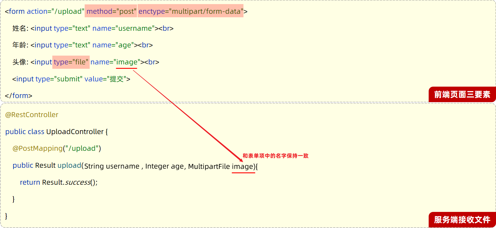

> 问题：如果表单项的名字和方法中形参名不一致，该怎么办？
>
> - ```javascript
>   public Result upload(String username,
>                        Integer age, 
>                        MultipartFile file) //file形参名和请求参数名image不一致
>   ```
>
> 解决：使用@RequestParam注解进行参数绑定
>
> - ```java
>   public Result upload(String username,
>                        Integer age, 
>                        @RequestParam("image") MultipartFile file)
>   ```

**UploadController代码：**

```java
@Slf4j
@RestController
public class UploadController {

    @PostMapping("/upload")
    public Result upload(String username, Integer age, MultipartFile image)  {
        log.info("文件上传：{},{},{}",username,age,image);
        return Result.success();
    }

}
```

> 后端程序编写完成之后，打个断点，以debug方式启动SpringBoot项目


> 打开浏览器输入：[http://localhost:8080/upload.html](http://localhost:8080/upload.html) ， 录入数据并提交

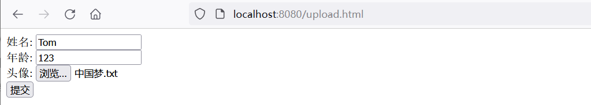

通过后端程序控制台可以看到，上传的文件是存放在一个临时目录

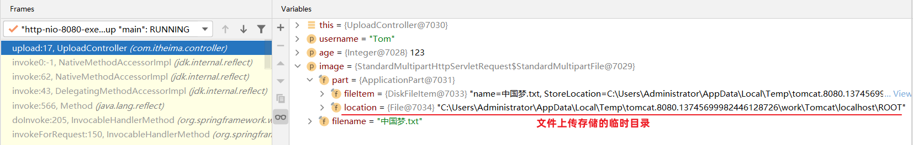

> 打开临时目录可以看到以下内容：


> 表单提交的三项数据(姓名、年龄、文件)，分别存储在不同的临时文件中：


> 当我们程序运行完毕之后，这个临时文件会自动删除。
>
> 所以，我们如果想要实现文件上传，需要将这个临时文件，要转存到我们的磁盘目录中。

### 2.2 本地存储

文件上传时在服务端会产生一个临时文件，请求响应完成之后，这个临时文件被自动删除，并没有进行保存。需要将上传的文件保存在服务器的本地磁盘上。

代码实现：

1. 在服务器本地磁盘上创建images目录，用来存储上传的文件（例：E盘创建images目录）
2. 使用MultipartFile类提供的API方法，把临时文件转存到本地磁盘目录下

> MultipartFile 常见方法：
>
> - String  getOriginalFilename();  //获取原始文件名
> - void  transferTo(File dest);     //将接收的文件转存到磁盘文件中
> - long  getSize();     //获取文件的大小，单位：字节
> - byte[]  getBytes();    //获取文件内容的字节数组
> - InputStream  getInputStream();    //获取接收到的文件内容的输入流

```java
@Slf4j
@RestController
public class UploadController {

    @PostMapping("/upload")
    public Result upload(String username, Integer age, MultipartFile image) throws IOException {
        log.info("文件上传：{},{},{}",username,age,image);

        //获取原始文件名
        String originalFilename = image.getOriginalFilename();

        //将文件存储在服务器的磁盘目录
        image.transferTo(new File("E:/images/"+originalFilename));

        return Result.success();
    }

}
```

利用postman测试：

> 注意：请求参数名和controller方法形参名保持一致

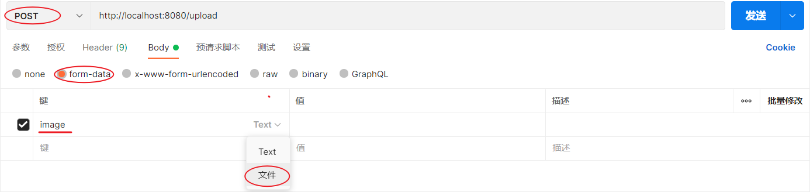


通过postman测试，文件上传是没有问题的。但是当我们再次上传一个名为1.jpg文件时，发现会把之前已经上传成功的文件会被覆盖掉。

解决方案：保证每次上传文件时文件名都唯一的（使用UUID获取随机文件名）

```java
@Slf4j
@RestController
public class UploadController {

    @PostMapping("/upload")
    public Result upload(String username, Integer age, MultipartFile image) throws IOException {
        log.info("文件上传：{},{},{}",username,age,image);

        //获取原始文件名
        String originalFilename = image.getOriginalFilename();

        //构建新的文件名
        String extname = originalFilename.substring(originalFilename.lastIndexOf("."));//文件扩展名
        String newFileName = UUID.randomUUID().toString()+extname;//随机名+文件扩展名

        //将文件存储在服务器的磁盘目录
        image.transferTo(new File("E:/images/"+newFileName));

        return Result.success();
    }

}
```

在解决了文件名唯一性的问题后，再次上传一个较大的文件(超出1M)时发现，后端程序报错：

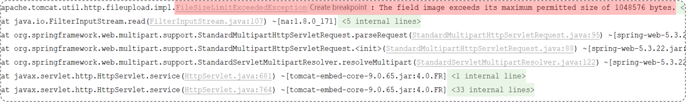

报错原因：在SpringBoot中，文件上传时默认单个文件最大的大小为1M

如果需要上传大文件，可以在application.properties进行如下配置：

```properties
#配置单个文件最大上传大小
spring.servlet.multipart.max-file-size=10MB

#配置单个请求最大上传大小(一次请求可以上传多个文件)
spring.servlet.multipart.max-request-size=100MB
```

本地存储方式存在问题：


::: danger
直接存储在服务器的磁盘目录中，存在以下缺点：

- 不安全：磁盘如果损坏，所有的文件就会丢失

- 容量有限：如果存储大量的图片，磁盘空间有限(磁盘不可能无限制扩容)

- 无法直接访问

:::

::: tip 解决方案

- 自己搭建存储服务器，如：fastDFS 、MinIO

- 使用现成的云服务，如：阿里云，腾讯云，华为云

:::

### 2.3 阿里云OSS

#### 2.3.1 准备

阿里云是阿里巴巴集团旗下全球领先的云计算公司，也是国内最大的云服务提供商 。


> 云服务指的就是通过互联网对外提供的各种各样的服务，比如像：语音服务、短信服务、邮件服务、视频直播服务、文字识别服务、对象存储服务等等。  
>
> 当我们在项目开发时需要用到某个或某些服务，就不需要自己来开发了，可以直接使用阿里云提供好的这些现成服务就可以了。  
>  
> 比如：在项目开发当中，我们要实现一个短信发送的功能，如果我们项目组自己实现，将会非常繁琐，因为你需要和各个运营商进行对接。而此时阿里云完成了和三大运营商对接，并对外提供了一个短信服务。我们项目组只需要调用阿里云提供的短信服务，就可以很方便的来发送短信了。这样就降低了我们项目的开发难度，同时也提高了项目的开发效率。（大白话：别人帮我们实现好了功能，我们只要调用即可）

阿里云对象存储OSS（Object Storage Service），是一款海量、安全、低成本、高可靠的云存储服务。使用OSS，您可以通过网络随时存储和调用包括文本、图片、音频和视频等在内的各种文件。

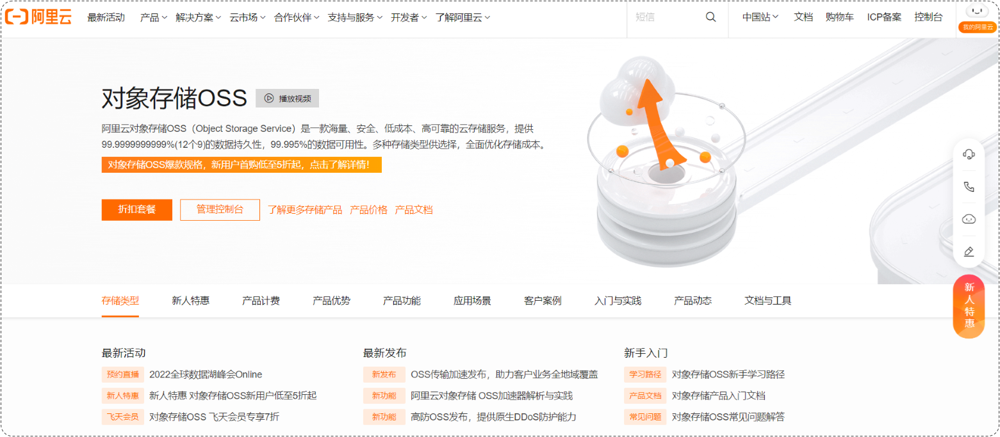

使用了阿里云OSS对象存储服务之后，在项目当中如果涉及到文件上传这样的业务，在前端进行文件上传并请求到服务端时，在服务器本地磁盘当中就不需要再来存储文件了。我们直接将接收到的文件上传到oss，由 oss帮我们存储和管理，同时阿里云的oss存储服务还保障了我们所存储内容的安全可靠。


> SDK：Software Development Kit 的缩写，软件开发工具包，包括辅助软件开发的依赖（jar包）、代码示例等，都可以叫做SDK。
>
> 简单说，sdk中包含了我们使用第三方云服务时所需要的依赖，以及一些示例代码。我们可以参照sdk所提供的示例代码就可以完成入门程序。


> Bucket：存储空间是用户用于存储对象（Object，就是文件）的容器，所有的对象都必须隶属于某个存储空间。

准备工作：

1. 注册阿里云账户（注册完成后需要实名认证）
2. 注册完账号之后，登录阿里云

    

3. 通过控制台找到对象存储OSS服务

    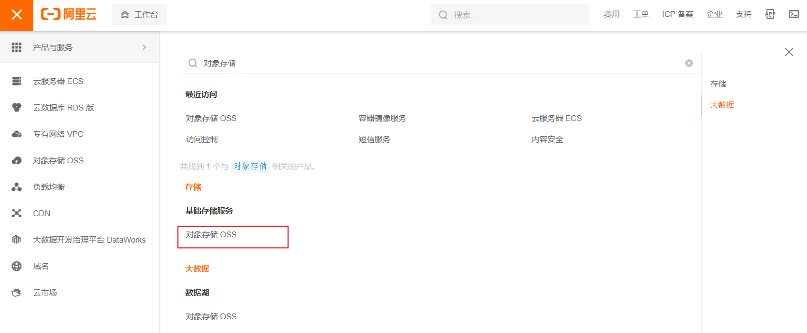

    > 如果是第一次访问，还需要开通对象存储服务OSS

    

    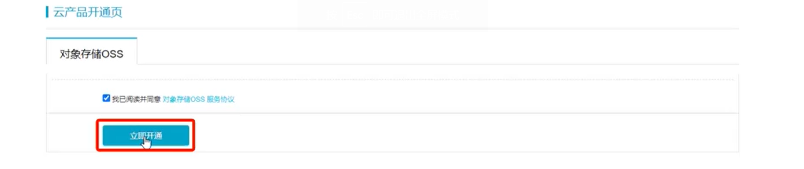

4. 开通OSS服务之后，就可以进入到阿里云对象存储的控制台

    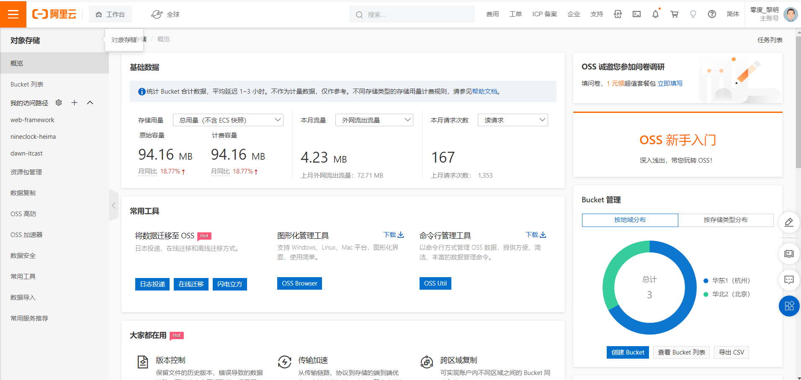

5. 点击左侧的 "Bucket列表"，创建一个Bucket

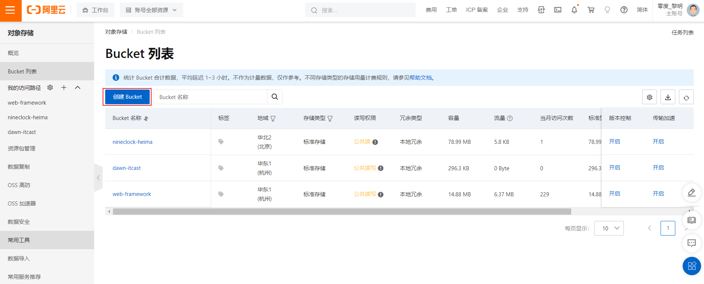

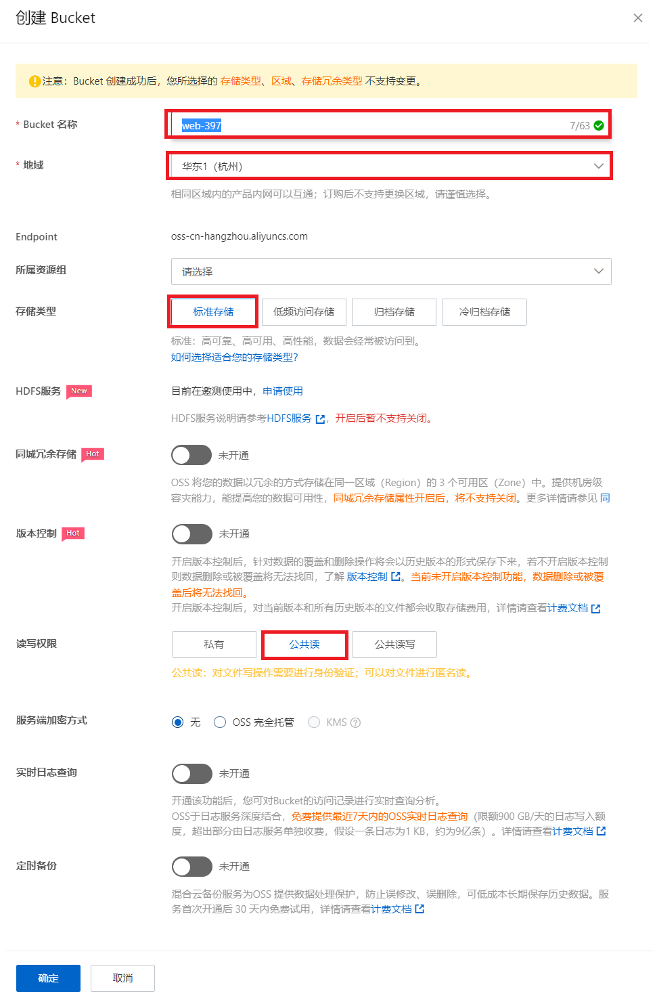

#### 2.3.2 入门

参照官方所提供的sdk示例来编写入门程序。

首先需要打开阿里云OSS的官方文档，在官方文档中找到 SDK 的示例代码：

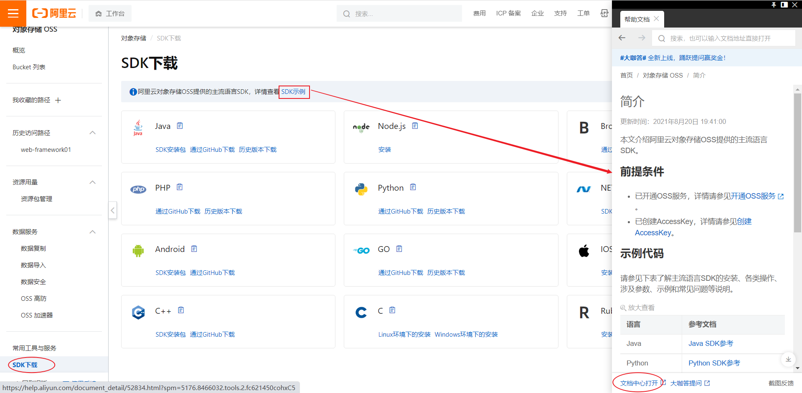

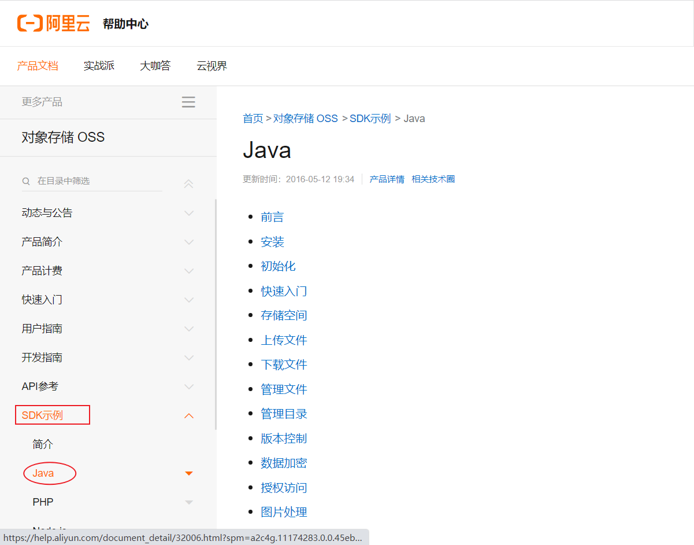

> 如果是在实际开发当中，是需要从前往后仔细的去阅读这一份文档的

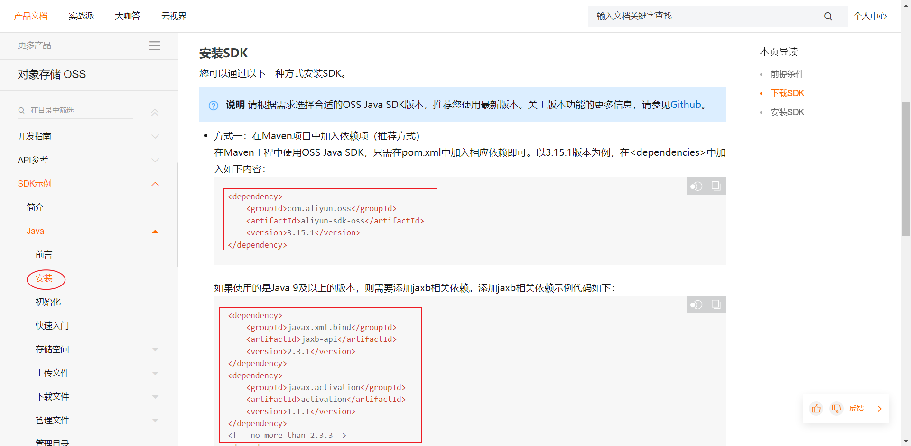

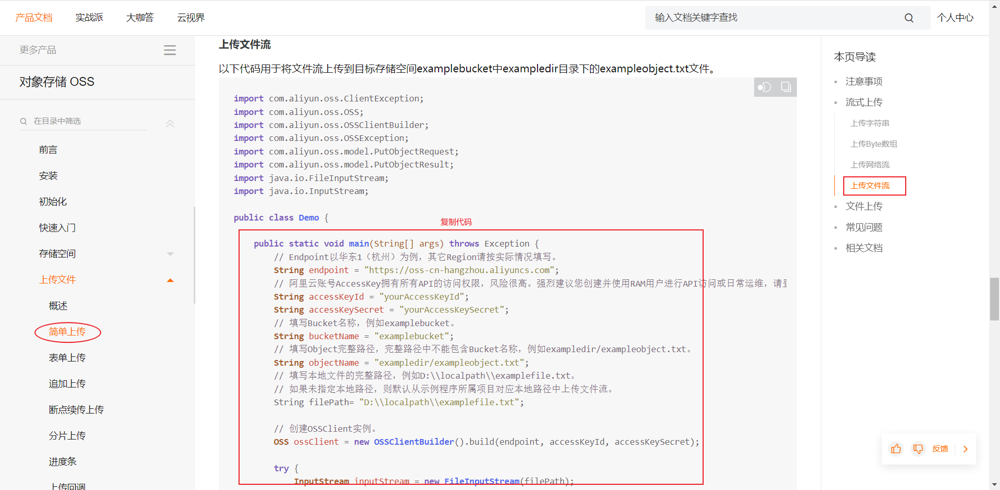

参照官方提供的SDK，改造一下，即可实现文件上传功能：

```java
import com.aliyun.oss.ClientException;
import com.aliyun.oss.OSS;
import com.aliyun.oss.OSSClientBuilder;
import com.aliyun.oss.OSSException;
import com.aliyun.oss.model.PutObjectRequest;
import com.aliyun.oss.model.PutObjectResult;

import java.io.FileInputStream;
import java.io.InputStream;

public class AliOssTest {
    public static void main(String[] args) throws Exception {
        // Endpoint以华东1（杭州）为例，其它Region请按实际情况填写。
        String endpoint = "oss-cn-shanghai.aliyuncs.com";
        
        // 阿里云账号AccessKey拥有所有API的访问权限，风险很高。强烈建议您创建并使用RAM用户进行API访问或日常运维，请登录RAM控制台创建RAM用户。
        String accessKeyId = "LTAI5t9MZK8iq5T2Av5GLDxX";
        String accessKeySecret = "C0IrHzKZGKqU8S7YQcevcotD3Zd5Tc";
        
        // 填写Bucket名称，例如examplebucket。
        String bucketName = "web-framework01";
        // 填写Object完整路径，完整路径中不能包含Bucket名称，例如exampledir/exampleobject.txt。
        String objectName = "1.jpg";
        // 填写本地文件的完整路径，例如D:\\localpath\\examplefile.txt。
        // 如果未指定本地路径，则默认从示例程序所属项目对应本地路径中上传文件流。
        String filePath= "C:\\Users\\Administrator\\Pictures\\1.jpg";

        // 创建OSSClient实例。
        OSS ossClient = new OSSClientBuilder().build(endpoint, accessKeyId, accessKeySecret);

        try {
            InputStream inputStream = new FileInputStream(filePath);
            // 创建PutObjectRequest对象。
            PutObjectRequest putObjectRequest = new PutObjectRequest(bucketName, objectName, inputStream);
            // 设置该属性可以返回response。如果不设置，则返回的response为空。
            putObjectRequest.setProcess("true");
            // 创建PutObject请求。
            PutObjectResult result = ossClient.putObject(putObjectRequest);
            // 如果上传成功，则返回200。
            System.out.println(result.getResponse().getStatusCode());
        } catch (OSSException oe) {
            System.out.println("Caught an OSSException, which means your request made it to OSS, "
                    + "but was rejected with an error response for some reason.");
            System.out.println("Error Message:" + oe.getErrorMessage());
            System.out.println("Error Code:" + oe.getErrorCode());
            System.out.println("Request ID:" + oe.getRequestId());
            System.out.println("Host ID:" + oe.getHostId());
        } catch (ClientException ce) {
            System.out.println("Caught an ClientException, which means the client encountered "
                    + "a serious internal problem while trying to communicate with OSS, "
                    + "such as not being able to access the network.");
            System.out.println("Error Message:" + ce.getMessage());
        } finally {
            if (ossClient != null) {
                ossClient.shutdown();
            }
        }
    }
}

```

> 在以上代码中，需要替换的内容为：
>
> - accessKeyId：阿里云账号AccessKey
> - accessKeySecret：阿里云账号AccessKey对应的秘钥
> - bucketName：Bucket名称
> - objectName：对象名称，在Bucket中存储的对象的名称
> - filePath：文件路径
>
> AccessKey ：
>
> 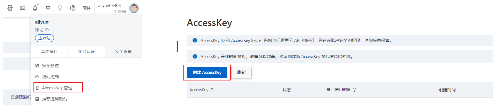

运行以上程序后，会把本地的文件上传到阿里云OSS服务器上：


#### 2.3.3 集成

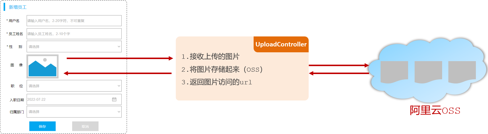

> 在新增员工的时候，上传员工的图像，而之所以需要上传员工的图像，是因为将来我们需要在系统页面当中访问并展示员工的图像。而要想完成这个操作，需要做两件事：
>
> 1. 需要上传员工的图像，并把图像保存起来（存储到阿里云OSS）
> 2. 访问员工图像（通过图像在阿里云OSS的存储地址访问图像）
>    - OSS中的每一个文件都会分配一个访问的url，通过这个url就可以访问到存储在阿里云上的图片。所以需要把url返回给前端，这样前端就可以通过url获取到图像。

参照接口文档来开发文件上传功能：

- 基本信息

  ```md
  请求路径：/upload
  
  请求方式：POST
  
  接口描述：上传图片接口
  ```

- 请求参数

  参数格式：multipart/form-data

  参数说明：

  | 参数名称 | 参数类型 | 是否必须 | 示例 | 备注 |
  | -------- | -------- | -------- | ---- | ---- |
  | image    | file     | 是       |      |      |

- 响应数据

  参数格式：application/json

  参数说明：

  | 参数名 | 类型   | 是否必须 | 备注                           |
  | ------ | ------ | -------- | ------------------------------ |
  | code   | number | 必须     | 响应码，1 代表成功，0 代表失败 |
  | msg    | string | 非必须   | 提示信息                       |
  | data   | object | 非必须   | 返回的数据，上传图片的访问路径 |

  响应数据样例：

  ```json
  {
      "code": 1,
      "msg": "success",
      "data": "https://web-framework.oss-cn-hangzhou.aliyuncs.com/2022-09-02-00-27-0400.jpg"
  }
  ```

引入阿里云OSS上传文件工具类（由官方的示例代码改造而来）

```java
import com.aliyun.oss.OSS;
import com.aliyun.oss.OSSClientBuilder;
import org.springframework.stereotype.Component;
import org.springframework.web.multipart.MultipartFile;

import java.io.IOException;
import java.io.InputStream;
import java.util.UUID;

@Component
public class AliOSSUtils {
    private String endpoint = "https://oss-cn-shanghai.aliyuncs.com";
    private String accessKeyId = "LTAI5t9MZK8iq5T2Av5GLDxX";
    private String accessKeySecret = "C0IrHzKZGKqU8S7YQcevcotD3Zd5Tc";
    private String bucketName = "web-framework01";

    /**
     * 实现上传图片到OSS
     */
    public String upload(MultipartFile multipartFile) throws IOException {
        // 获取上传的文件的输入流
        InputStream inputStream = multipartFile.getInputStream();

        // 避免文件覆盖
        String originalFilename = multipartFile.getOriginalFilename();
        String fileName = UUID.randomUUID().toString() + originalFilename.substring(originalFilename.lastIndexOf("."));

        //上传文件到 OSS
        OSS ossClient = new OSSClientBuilder().build(endpoint, accessKeyId, accessKeySecret);
        ossClient.putObject(bucketName, fileName, inputStream);

        //文件访问路径
        String url = endpoint.split("//")[0] + "//" + bucketName + "." + endpoint.split("//")[1] + "/" + fileName;

        // 关闭ossClient
        ossClient.shutdown();
        return url;// 把上传到oss的路径返回
    }
}
```

修改UploadController代码：

```java
import com.itheima.pojo.Result;
import com.itheima.utils.AliOSSUtils;
import lombok.extern.slf4j.Slf4j;
import org.springframework.beans.factory.annotation.Autowired;
import org.springframework.web.bind.annotation.PostMapping;
import org.springframework.web.bind.annotation.RestController;
import org.springframework.web.multipart.MultipartFile;
import java.io.IOException;

@Slf4j
@RestController
public class UploadController {

    @Autowired
    private AliOSSUtils aliOSSUtils;

    @PostMapping("/upload")
    public Result upload(MultipartFile image) throws IOException {
        //调用阿里云OSS工具类，将上传上来的文件存入阿里云
        String url = aliOSSUtils.upload(image);
        //将图片上传完成后的url返回，用于浏览器回显展示
        return Result.success(url);
    }
    
}
```

使用postman测试：


## 3. 修改员工


在进行修改员工信息的时候，首先要根据员工的ID查询员工的信息用于页面回显展示，然后用户修改员工数据之后，点击保存按钮，就可以将修改的数据提交到服务端，保存到数据库。 

具体操作为：

1. 根据ID查询员工信息
2. 保存修改的员工信息

### 3.1 查询回显

#### 3.1.1 接口文档

根据ID查询员工数据

- 基本信息

  ```md
  请求路径：/emps/{id}
  
  请求方式：GET
  
  接口描述：该接口用于根据主键ID查询员工的信息
  ```

- 请求参数

  参数格式：路径参数

  参数说明：

  | 参数名 | 类型   | 是否必须 | 备注   |
  | ------ | ------ | -------- | ------ |
  | id     | number | 必须     | 员工ID |

  请求参数样例：

  ```md
  /emps/1
  ```

- 响应数据

  参数格式：application/json

  参数说明：

  | 名称           | 类型   | 是否必须 | 默认值 | 备注                                                         |
  | -------------- | ------ | -------- | ------ | ------------------------------------------------------------ |
  | code           | number | 必须     |        | 响应码, 1 成功 , 0 失败                                      |
  | msg            | string | 非必须   |        | 提示信息                                                     |
  | data           | object | 必须     |        | 返回的数据                                                   |
  | \|- id         | number | 非必须   |        | id                                                           |
  | \|- username   | string | 非必须   |        | 用户名                                                       |
  | \|- name       | string | 非必须   |        | 姓名                                                         |
  | \|- password   | string | 非必须   |        | 密码                                                         |
  | \|- entrydate  | string | 非必须   |        | 入职日期                                                     |
  | \|- gender     | number | 非必须   |        | 性别 , 1 男 ; 2 女                                           |
  | \|- image      | string | 非必须   |        | 图像                                                         |
  | \|- job        | number | 非必须   |        | 职位, 说明: 1 班主任,2 讲师, 3 学工主管, 4 教研主管, 5 咨询师 |
  | \|- deptId     | number | 非必须   |        | 部门id                                                       |
  | \|- createTime | string | 非必须   |        | 创建时间                                                     |
  | \|- updateTime | string | 非必须   |        | 更新时间                                                     |

  响应数据样例：

  ```json
  {
    "code": 1,
    "msg": "success",
    "data": {
      "id": 2,
      "username": "zhangwuji",
      "password": "123456",
      "name": "张无忌",
      "gender": 1,
      "image": "https://web-framework.oss-cn-hangzhou.aliyuncs.com/2022-09-02-00-27-53B.jpg",
      "job": 2,
      "entrydate": "2015-01-01",
      "deptId": 2,
      "createTime": "2022-09-01T23:06:30",
      "updateTime": "2022-09-02T00:29:04"
    }
  }
  ```

#### 3.1.2 实现思路


#### 3.1.3 代码实现

- EmpMapper

```java
@Mapper
public interface EmpMapper {

    //根据ID查询员工信息
    @Select("select id, username, password, name, gender, image, job, entrydate, dept_id, create_time, update_time " +
            "from emp " +
            "where id = #{id}")
    public Emp findById(Integer id);

    
    //省略...
}
```

- EmpService

```java
public interface EmpService {

    /**
     * 根据ID查询员工
     * @param id
     * @return
     */
    public Emp getById(Integer id);
    
    //省略...
}
```

- EmpServiceImpl

```java
@Slf4j
@Service
public class EmpServiceImpl implements EmpService {
    @Autowired
    private EmpMapper empMapper;

    @Override
    public Emp getById(Integer id) {
        return empMapper.findById(id);
    }
    
    //省略...
}
```

- EmpController

```java
@Slf4j
@RestController
@RequestMapping("/emps")
public class EmpController {

    @Autowired
    private EmpService empService;

    //根据id查询
    @GetMapping("/{id}")
    public Result getById(@PathVariable Integer id){
        Emp emp = empService.getById(id);
        return Result.success(emp);
    }
    
    //省略...
}
```

#### 3.1.4 postman测试

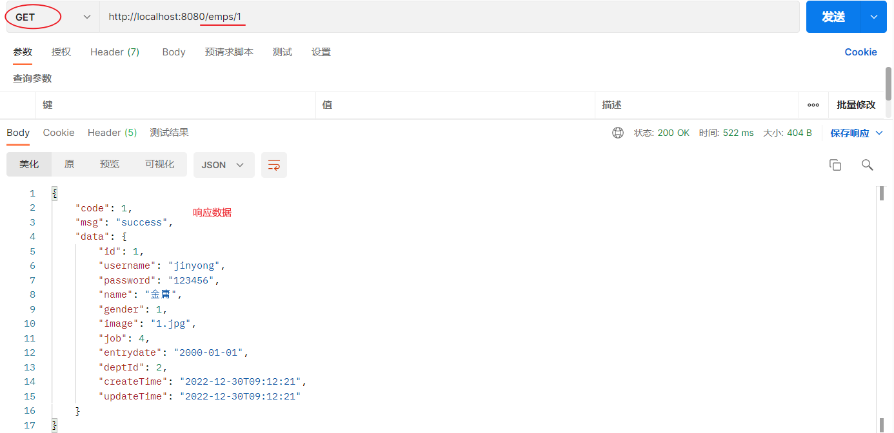

### 3.2 修改员工


> 当用户修改完数据之后，点击保存按钮，就需要将数据提交到服务端，然后服务端需要将修改后的数据更新到数据库中。

#### 3.2.1 接口文档

- 基本信息

  ```md
  请求路径：/emps
  
  请求方式：PUT
  
  接口描述：该接口用于修改员工的数据信息
  ```

- 请求参数

  参数格式：application/json

  参数说明：

  | 名称      | 类型   | 是否必须 | 备注                                                         |
  | --------- | ------ | -------- | ------------------------------------------------------------ |
  | id        | number | 必须     | id                                                           |
  | username  | string | 必须     | 用户名                                                       |
  | name      | string | 必须     | 姓名                                                         |
  | gender    | number | 必须     | 性别, 说明: 1 男, 2 女                                       |
  | image     | string | 非必须   | 图像                                                         |
  | deptId    | number | 非必须   | 部门id                                                       |
  | entrydate | string | 非必须   | 入职日期                                                     |
  | job       | number | 非必须   | 职位, 说明: 1 班主任,2 讲师, 3 学工主管, 4 教研主管, 5 咨询师 |

  请求数据样例：

  ```json
  {
    "id": 1,
    "image": "https://web-framework.oss-cn-hangzhou.aliyuncs.com/2022-09-03-07-37-38222.jpg",
    "username": "linpingzhi",
    "name": "林平之",
    "gender": 1,
    "job": 1,
    "entrydate": "2022-09-18",
    "deptId": 1
  }
  ```

- 响应数据

  参数格式：application/json

  参数说明：

  | 参数名 | 类型   | 是否必须 | 备注                           |
  | ------ | ------ | -------- | ------------------------------ |
  | code   | number | 必须     | 响应码，1 代表成功，0 代表失败 |
  | msg    | string | 非必须   | 提示信息                       |
  | data   | object | 非必须   | 返回的数据                     |

  响应数据样例：

  ```json
  {
      "code":1,
      "msg":"success",
      "data":null
  }
  ```

#### 3.2.2 实现思路

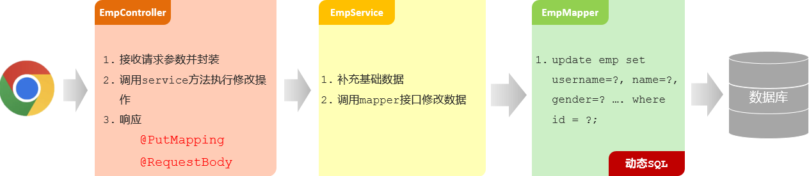

#### 3.2.3 代码实现

- EmpMapper

```java
@Mapper
public interface EmpMapper {
    //修改员工信息
    public void update(Emp emp);
    
    //省略...
}
```

- EmpMapper.xml

```xml
<?xml version="1.0" encoding="UTF-8" ?>
<!DOCTYPE mapper
        PUBLIC "-//mybatis.org//DTD Mapper 3.0//EN"
        "http://mybatis.org/dtd/mybatis-3-mapper.dtd">
<mapper namespace="com.itheima.mapper.EmpMapper">

    <!--更新员工信息-->
    <update id="update">
        update emp
        <set>
            <if test="username != null and username != ''">
                username = #{username},
            </if>
            <if test="password != null and password != ''">
                password = #{password},
            </if>
            <if test="name != null and name != ''">
                name = #{name},
            </if>
            <if test="gender != null">
                gender = #{gender},
            </if>
            <if test="image != null and image != ''">
                image = #{image},
            </if>
            <if test="job != null">
                job = #{job},
            </if>
            <if test="entrydate != null">
                entrydate = #{entrydate},
            </if>
            <if test="deptId != null">
                dept_id = #{deptId},
            </if>
            <if test="updateTime != null">
                update_time = #{updateTime}
            </if>
        </set>
        where id = #{id}
    </update>

    <!-- 省略... -->
   
</mapper>
```

- EmpService

```java
public interface EmpService {
    /**
     * 更新员工
     * @param emp
     */
    public void update(Emp emp);
   
    //省略...
}
```

- EmpServiceImpl

```java
@Slf4j
@Service
public class EmpServiceImpl implements EmpService {
    @Autowired
    private EmpMapper empMapper;

    @Override
    public void update(Emp emp) {
        emp.setUpdateTime(LocalDateTime.now()); //更新修改时间为当前时间
        
        empMapper.update(emp);
    }
    
    //省略...
}
```

- EmpController

```java
@Slf4j
@RestController
@RequestMapping("/emps")
public class EmpController {

    @Autowired
    private EmpService empService;

    //修改员工
    @PutMapping
    public Result update(@RequestBody Emp emp){
        empService.update(emp);
        return Result.success();
    }
    
    //省略...
}
```

#### 3.2.4 postman测试

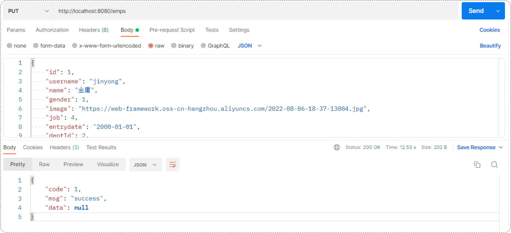

#### 3.2.5 前后端联调测试

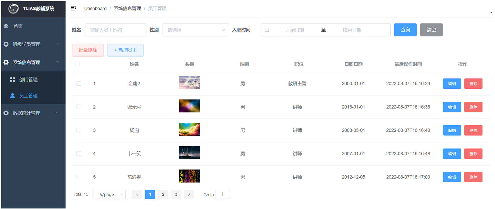

## 4. 配置文件

当前案例中存在的问题以及如何优化解决

### 4.1 参数配置化


之前编写的程序中进行文件上传时，需要调用 AliOSSUtils 工具类，将文件上传到阿里云OSS对象存储服务当中。而在调用工具类进行文件上传时，需要一些参数：

- endpoint       //阿里云OSS域名
- accessKeyID    //用户身份ID
- accessKeySecret   //用户密钥
- bucketName      //存储空间的名字

关于以上的这些阿里云相关配置信息，我们是直接写死在java代码中了(硬编码)，如果我们在做项目时每涉及到一个第三方技术服务，就将其参数硬编码，那么在Java程序中会存在两个问题：

1. 如果这些参数发生变化了，就必须在源程序代码中改动这些参数，然后需要重新进行代码的编译，将Java代码编译成class字节码文件再重新运行程序。（比较繁琐）
2. 如果开发的是一个真实的企业级项目， Java类可能会有很多，如果将这些参数分散的定义在各个Java类当中，如果要修改一个参数值，就需要在众多的Java代码当中来定位到对应的位置，再来修改参数，修改完毕之后再重新编译再运行。（参数配置过于分散， 不方便集中的管理和维护）

为了解决以上分析的问题，可以将参数配置在配置文件中。

```properties
#自定义的阿里云OSS配置信息
aliyun.oss.endpoint=https://oss-cn-hangzhou.aliyuncs.com
aliyun.oss.accessKeyId=LTAI4GCH1vX6DKqJWxd6nEuW
aliyun.oss.accessKeySecret=yBshYweHOpqDuhCArrVHwIiBKpyqSL
aliyun.oss.bucketName=web-tlias
```

在将阿里云OSS配置参数交给properties配置文件来管理之后，AliOSSUtils工具类

```java
@Component
public class AliOSSUtils {
    /*以下4个参数没有指定值（默认值：null）*/
    private String endpoint;
    private String accessKeyId;
    private String accessKeySecret;
    private String bucketName;

    //省略其他代码...
}
```

> 而此时如果直接调用AliOSSUtils类当中的upload方法进行文件上传时，这4项参数全部为null，原因是因为并没有给它赋值。
>
> 此时我们是不是需要将配置文件当中所配置的属性值读取出来，并分别赋值给AliOSSUtils工具类当中的各个属性呢？那应该怎么做呢？

因为application.properties是springboot项目默认的配置文件，所以springboot程序在启动时会默认读取application.properties配置文件，而我们可以使用一个现成的注解：@Value，获取配置文件中的数据。

@Value 注解通常用于外部配置的属性注入，具体用法为： @Value("${配置文件中的key}")

```java
@Component
public class AliOSSUtils {

    @Value("${aliyun.oss.endpoint}")
    private String endpoint;
    
    @Value("${aliyun.oss.accessKeyId}")
    private String accessKeyId;
    
    @Value("${aliyun.oss.accessKeySecret}")
    private String accessKeySecret;
    
    @Value("${aliyun.oss.bucketName}")
    private String bucketName;

    //省略其他代码...
 }   
```


使用postman测试：


### 4.2 yml配置文件

在springboot项目中是支持多种配置方式的，除了支持properties配置文件以外，还支持另外一种类型的配置文件

- application.properties

  ```properties
  server.port=8080
  server.address=127.0.0.1
  ```

- application.yml

  ```yml
  server:
    port: 8080
    address: 127.0.0.1
  ```

- application.yaml

  ```yml
  server:
    port: 8080
    address: 127.0.0.1
  ```

> yml 格式的配置文件，后缀名有两种：
>
> - yml （推荐）
> - yaml

常见配置文件格式对比：


::: tip yml 格式的数据特点

- 容易阅读
- 容易与脚本语言交互
- 以数据为核心，重数据轻格式

:::

yml配置文件的基本语法：

- 大小写敏感
- 数值前边必须有空格，作为分隔符
- 使用缩进表示层级关系，缩进时，不允许使用Tab键，只能用空格（idea中会自动将Tab转换为空格）
- 缩进的空格数目不重要，只要相同层级的元素左侧对齐即可
- `#`表示注释，从这个字符一直到行尾，都会被解析器忽略


::: note yml文件中常见的两类数据格式

1. 定义对象或Map集合
2. 定义数组、list或set集合

:::

对象/ Map集合

```yml
user:
  name: zhangsan
  age: 18
  password: 123456
```

数组 / List / Set集合

```yml
hobby: 
  - java
  - game
  - sport
```

将使用的配置文件，变更为application.yml配置方式：

1. 修改application.properties名字为：`_application.properties`（名字随便更换，只要加载不到即可）
2. 创建新的配置文件： `application.yml`

原有application.properties文件：


新建的application.yml文件：

```yaml
spring:
  datasource:
    driver-class-name: com.mysql.cj.jdbc.Driver
    url: jdbc:mysql://localhost:3306/tlias
    username: root
    password: 1234
  servlet:
    multipart:
      max-file-size: 10MB
      max-request-size: 100MB
      
mybatis:
  configuration:
    log-impl: org.apache.ibatis.logging.stdout.StdOutImpl
    map-underscore-to-camel-case: true

aliyun:
  oss:
    endpoint: https://oss-cn-hangzhou.aliyuncs.com
    accessKeyId: LTAI4GCH1vX6DKqJWxd6nEuW
    accessKeySecret: yBshYweHOpqDuhCArrVHwIiBKpyqSL
    bucketName: web-397
```

### 4.3 @ConfigurationProperties


在application.properties或者application.yml中配置了阿里云OSS的四项参数之后，如果java程序中需要这四项参数数据，直接通过@Value注解来进行注入。如果需要注入的属性较多(例：需要20多个参数数据)，写起来就会比较繁琐。

在Spring中给我们提供了一种简化方式，可以直接将配置文件中配置项的值自动的注入到对象的属性中。

Spring提供的简化方式：

1. 创建一个实现类，且实体类中的属性名和配置文件当中key的名字必须要一致

   > 比如：配置文件当中叫endpoints，实体类当中的属性也得叫endpoints，另外实体类当中的属性还需要提供 getter / setter方法

2. 将实体类交给Spring的IOC容器管理，成为IOC容器当中的bean对象

3. 在实体类上添加`@ConfigurationProperties`注解，并通过prefix属性来指定配置参数项的前缀


实体类：AliOSSProperties

```java
import lombok.Data;
import org.springframework.boot.context.properties.ConfigurationProperties;
import org.springframework.stereotype.Component;

/*阿里云OSS相关配置*/
@Data
@Component
@ConfigurationProperties(prefix = "aliyun.oss")
public class AliOSSProperties {
    //区域
    private String endpoint;
    //身份ID
    private String accessKeyId ;
    //身份密钥
    private String accessKeySecret ;
    //存储空间
    private String bucketName;
}
```

AliOSSUtils工具类：

```java
import com.aliyun.oss.OSS;
import com.aliyun.oss.OSSClientBuilder;
import org.springframework.beans.factory.annotation.Autowired;
import org.springframework.stereotype.Component;
import org.springframework.web.multipart.MultipartFile;
import java.io.IOException;
import java.io.InputStream;
import java.util.UUID;

@Component //当前类对象由Spring创建和管理
public class AliOSSUtils {

    //注入配置参数实体类对象
    @Autowired
    private AliOSSProperties aliOSSProperties;
   
    
    /**
     * 实现上传图片到OSS
     */
    public String upload(MultipartFile multipartFile) throws IOException {
        // 获取上传的文件的输入流
        InputStream inputStream = multipartFile.getInputStream();

        // 避免文件覆盖
        String originalFilename = multipartFile.getOriginalFilename();
        String fileName = UUID.randomUUID().toString() + originalFilename.substring(originalFilename.lastIndexOf("."));

        //上传文件到 OSS
        OSS ossClient = new OSSClientBuilder().build(aliOSSProperties.getEndpoint(),
                aliOSSProperties.getAccessKeyId(), aliOSSProperties.getAccessKeySecret());
        ossClient.putObject(aliOSSProperties.getBucketName(), fileName, inputStream);

        //文件访问路径
        String url =aliOSSProperties.getEndpoint().split("//")[0] + "//" + aliOSSProperties.getBucketName() + "." + aliOSSProperties.getEndpoint().split("//")[1] + "/" + fileName;

        // 关闭ossClient
        ossClient.shutdown();
        return url;// 把上传到oss的路径返回
    }
}

```

添加注解后，会发现idea窗口上面出现一个红色警告：


这个警告提示是提示还需要引入一个依赖：

```maven
<dependency>
    <groupId>org.springframework.boot</groupId>
    <artifactId>spring-boot-configuration-processor</artifactId>
</dependency>
```

在pom.xml文件当中配置了这项依赖之后，重新启动服务，就会看到在properties或者是yml配置文件当中，就会提示阿里云 OSS 相关的配置项。所以这项依赖它的作用就是会自动的识别被`@ConfigurationProperties`注解标识的bean对象。

> 刚才的红色警告，已经变成了一个灰色的提示，提示我们需要重新运行springboot服务

::: note 区分@ConfigurationProperties注解 @Value注解

相同点：都是用来注入外部配置的属性的。

不同点：

- @Value注解只能一个一个的进行外部属性的注入。

- @ConfigurationProperties可以批量的将外部的属性配置注入到bean对象的属性中。

:::
