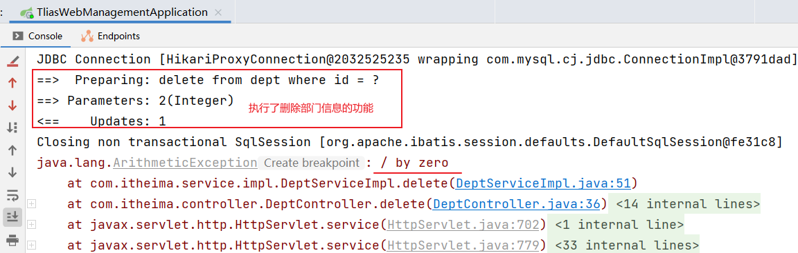
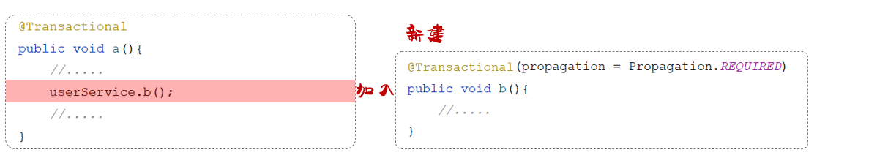
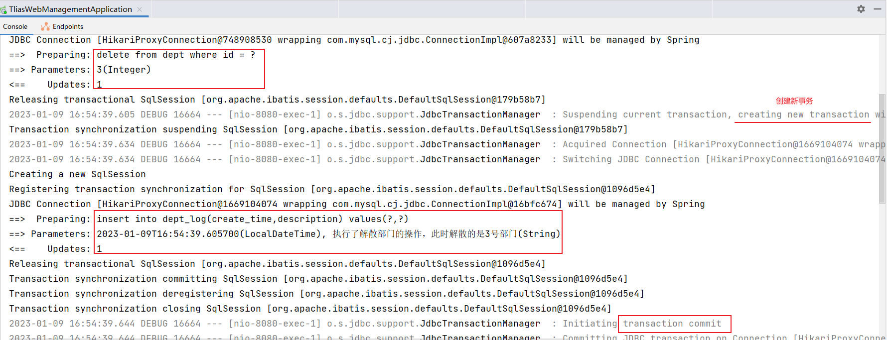
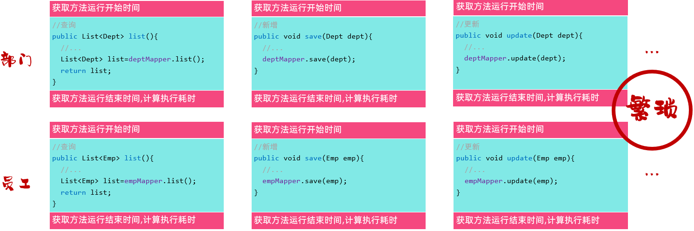
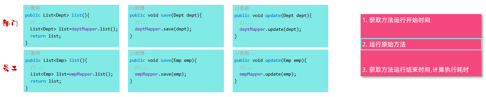
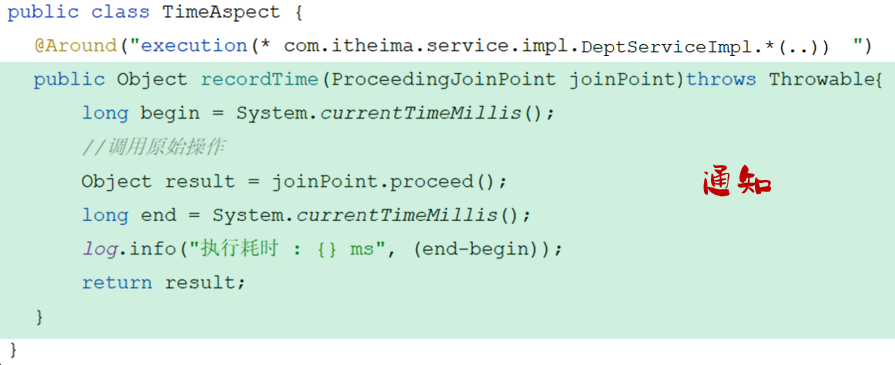

# SpringBoot事务、AOP

## 1. 事务管理

### 1.1 事务回顾

**事务**是一组操作的集合，它是一个不可分割的工作单位。事务会把所有的操作作为一个整体，一起向数据库提交或者是撤销操作请求。所以这组操作要么同时成功，要么同时失败。

::: info 事务的操作

1. 开启事务（一组操作开始前，开启事务）：start transaction / begin ;
2. 提交事务（这组操作全部成功后，提交事务）：commit ;
3. 回滚事务（中间任何一个操作出现异常，回滚事务）：rollback ;

:::

### 1.2 Spring事务管理

#### 1.2.1 案例

需求：当部门解散了不仅需要把部门信息删除了，还需要把该部门下的员工数据也删除了。

步骤：

- 根据ID删除部门数据
- 根据部门ID删除该部门下的员工

代码实现：

1. DeptServiceImpl

    ```java
    @Slf4j
    @Service
    public class DeptServiceImpl implements DeptService {
        @Autowired
        private DeptMapper deptMapper;

        @Autowired
        private EmpMapper empMapper;


        //根据部门id，删除部门信息及部门下的所有员工
        @Override
        public void delete(Integer id){
            //根据部门id删除部门信息
            deptMapper.deleteById(id);

            //删除部门下的所有员工信息
            empMapper.deleteByDeptId(id);   
        }
    }
    ```

2. DeptMapper

    ```java
    @Mapper
    public interface DeptMapper {
        /**
         * 根据id删除部门信息
         * @param id   部门id
         */
        @Delete("delete from dept where id = #{id}")
        void deleteById(Integer id);
    }
    ```

3. EmpMapper

    ```java
    @Mapper
    public interface EmpMapper {

        //根据部门id删除部门下所有员工
        @Delete("delete from emp where dept_id=#{deptId}")
        public int deleteByDeptId(Integer deptId);
        
    }
    ```

重启SpringBoot服务，使用postman测试部门删除：


代码正常情况下，dept表和Em表中的数据已删除


修改DeptServiceImpl类中代码，添加可能出现异常的代码：

```java
@Slf4j
@Service
public class DeptServiceImpl implements DeptService {
    @Autowired
    private DeptMapper deptMapper;

    @Autowired
    private EmpMapper empMapper;


    //根据部门id，删除部门信息及部门下的所有员工
    @Override
    public void delete(Integer id){
        //根据部门id删除部门信息
        deptMapper.deleteById(id);
        
        //模拟：异常发生
        int i = 1/0;

        //删除部门下的所有员工信息
        empMapper.deleteByDeptId(id);   
    }
}
```

重启SpringBoot服务，使用postman测试部门删除：




查看数据库表：

- 删除了2号部门


- 2号部门下的员工数据没有删除


**以上程序出现的问题：即使程序运行抛出了异常，部门依然删除了，但是部门下的员工却没有删除，造成了数据的不一致。**

#### 1.2.2 原因分析

- 先执行根据id删除部门的操作，这步执行完毕，数据库表 dept 中的数据就已经删除了。
- 执行 1/0 操作，抛出异常
- 抛出异常之前，下面所有的代码都不会执行了，根据部门ID删除该部门下的员工，这个操作也不会执行 。

此时，在delete删除业务功能中添加事务


在方法运行之前，开启事务，如果方法成功执行，就提交事务，如果方法执行的过程当中出现异常了，就回滚事务。

#### 1.2.3 Transactional注解

::: info @Transactional作用

在方法执行开始之前开启事务，方法执行完毕之后提交事务。如果这个方法执行的过程当中出现了异常，就会进行事务的回滚操作。

:::

::: info @Transactional注解

一般会在业务层当中来控制事务，因为在业务层当中，一个业务功能可能会包含多个数据访问的操作。  

在业务层来控制事务，可以将多个数据访问操作控制在一个事务范围内。

:::

::: tip @Transactional注解书写位置

方法: 当前方法交给spring进行事务管理

类: 当前类中所有的方法都交由spring进行事务管理

接口: 接口下所有的实现类当中所有的方法都交给spring 进行事务管理

:::

在业务方法delete上加上 @Transactional 来控制事务

```java
@Slf4j
@Service
public class DeptServiceImpl implements DeptService {
    @Autowired
    private DeptMapper deptMapper;

    @Autowired
    private EmpMapper empMapper;

    
    @Override
    @Transactional  //当前方法添加了事务管理
    public void delete(Integer id){
        //根据部门id删除部门信息
        deptMapper.deleteById(id);
        
        //模拟：异常发生
        int i = 1/0;

        //删除部门下的所有员工信息
        empMapper.deleteByDeptId(id);   
    }
}
```

重启SpringBoot服务，使用postman测试：


添加Spring事务管理后，由于服务端程序引发了异常，所以事务进行回滚。


说明：在application.yml配置文件中开启事务管理日志，这样就可以在控制台看到和事务相关的日志信息了

```yaml
#spring事务管理日志
logging:
  level:
    org.springframework.jdbc.support.JdbcTransactionManager: debug
```

### 1.3 事务进阶

@Transactional注解当中的两个常见的属性：

1. 异常回滚的属性：rollbackFor
2. 事务传播行为：propagation

#### 1.3.1 rollbackFor

```java
@Transactional
public void delete(Integer id){
        //根据部门id删除部门信息
        deptMapper.deleteById(id);
        
        //模拟：异常发生
        int i = 1/0;

        //删除部门下的所有员工信息
        empMapper.deleteByDeptId(id);   
}
```

修改业务功能代码，在模拟异常的位置上直接抛出Exception异常（编译时异常）

```java
@Transactional
public void delete(Integer id) throws Exception {
        //根据部门id删除部门信息
        deptMapper.deleteById(id);
        
        //模拟：异常发生
        if(true){
            throw new Exception("出现异常了```");
        }

        //删除部门下的所有员工信息
        empMapper.deleteByDeptId(id);   
}
```

> 说明：在service中向上抛出一个Exception编译时异常之后，由于是controller调用service，所以在controller中要有异常处理代码，此时选择在controller中继续把异常向上抛。
>
> ```java
> @DeleteMapping("/depts/{id}")
> public Result delete(@PathVariable Integer id) throws Exception {
>      //日志记录
>      log.info("根据id删除部门");
>      //调用service层功能
>      deptService.delete(id);
>      //响应
>      return Result.success();
> }
> ```

重新启动服务后测试：

抛出异常之后事务会不会回滚

> 现有表中数据：
>
> 

使用postman测试，删除5号部门


发生了Exception异常，但事务依然提交了


> dept表中数据：
>
> 

结论：默认情况下，只有出现RuntimeException(运行时异常)才会回滚事务。

配置@Transactional注解当中的rollbackFor属性，通过rollbackFor这个属性可以指定出现何种异常类型回滚事务。

```java
@Slf4j
@Service
public class DeptServiceImpl implements DeptService {
    @Autowired
    private DeptMapper deptMapper;

    @Autowired
    private EmpMapper empMapper;

    
    @Override
    @Transactional(rollbackFor=Exception.class)
    public void delete(Integer id){
        //根据部门id删除部门信息
        deptMapper.deleteById(id);
        
        //模拟：异常发生
        int num = id/0;

        //删除部门下的所有员工信息
        empMapper.deleteByDeptId(id);   
    }
}
```

重新启动服务，测试删除部门的操作：


控制台日志：执行了删除3号部门的操作， 因为异常又进行了事务回滚


数据表：3号部门没有删除


> 结论：
>
> - 在Spring的事务管理中，默认只有运行时异常 RuntimeException才会回滚。
> - 如果还需要回滚指定类型的异常，可以通过rollbackFor属性来指定。

#### 1.3.3 propagation

这个属性是用来配置事务的传播行为的。



所谓事务的传播行为，指的就是在A方法运行的时候，首先会开启一个事务，在A方法当中又调用了B方法， B方法自身也具有事务，那么B方法在运行的时候，到底是加入到A方法的事务当中来，还是B方法在运行的时候新建一个事务？这个就涉及到了事务的传播行为。

常见的事务传播行为。

| **属性值**    | **含义**                                                     |
| ------------- | ------------------------------------------------------------ |
| **REQUIRED**      | 【默认值】需要事务，有则加入，无则创建新事务                 |
| **REQUIRES_NEW**  | 需要新事务，无论有无，总是创建新事务                         |
| SUPPORTS      | 支持事务，有则加入，无则在无事务状态中运行                   |
| NOT_SUPPORTED | 不支持事务，在无事务状态下运行,如果当前存在已有事务,则挂起当前事务 |
| MANDATORY     | 必须有事务，否则抛异常                                       |
| NEVER         | 必须没事务，否则抛异常                                       |
| …             |                                                              |

案例:

**需求：** 解散部门时需要记录操作日志

由于解散部门是一个非常重要而且非常危险的操作，所以在业务当中要求每一次执行解散部门的操作都需要留下痕迹，就是要记录操作日志。而且还要求无论是执行成功了还是执行失败了，都需要留下痕迹。

**步骤：**

1. 执行解散部门的业务：先删除部门，再删除部门下的员工（前面已实现）
2. 记录解散部门的日志，到日志表（未实现）

**准备工作：**

1. 创建数据库表 dept_log 日志表：

    ```sql
    create table dept_log(
        id int auto_increment comment '主键ID' primary key,
        create_time datetime null comment '操作时间',
        description varchar(300) null comment '操作描述'
    )comment '部门操作日志表';
    ```

2. 引入资料中提供的实体类：DeptLog

    ```java
    @Data
    @NoArgsConstructor
    @AllArgsConstructor
    public class DeptLog {
        private Integer id;
        private LocalDateTime createTime;
        private String description;
    }
    ```

3. 引入资料中提供的Mapper接口：DeptLogMapper

    ```java
    @Mapper
    public interface DeptLogMapper {

        @Insert("insert into dept_log(create_time,description) values(#{createTime},#{description})")
        void insert(DeptLog log);

    }
    ```

4. 引入资料中提供的业务接口：DeptLogService

    ```java
    public interface DeptLogService {
        void insert(DeptLog deptLog);
    }
    ```

5. 引入资料中提供的业务实现类：DeptLogServiceImpl

    ```java
    @Service
    public class DeptLogServiceImpl implements DeptLogService {

        @Autowired
        private DeptLogMapper deptLogMapper;

        @Transactional //事务传播行为：有事务就加入、没有事务就新建事务
        @Override
        public void insert(DeptLog deptLog) {
            deptLogMapper.insert(deptLog);
        }
    }

    ```

**代码实现:**

业务实现类：DeptServiceImpl

```java
@Slf4j
@Service
//@Transactional //当前业务实现类中的所有的方法，都添加了spring事务管理机制
public class DeptServiceImpl implements DeptService {
    @Autowired
    private DeptMapper deptMapper;
    
    @Autowired
    private EmpMapper empMapper;

    @Autowired
    private DeptLogService deptLogService;


    //根据部门id，删除部门信息及部门下的所有员工
    @Override
    @Log
    @Transactional(rollbackFor = Exception.class) 
    public void delete(Integer id) throws Exception {
        try {
            //根据部门id删除部门信息
            deptMapper.deleteById(id);
            //模拟：异常
            if(true){
                throw new Exception("出现异常了```");
            }
            //删除部门下的所有员工信息
            empMapper.deleteByDeptId(id);
        }finally {
            //不论是否有异常，最终都要执行的代码：记录日志
            DeptLog deptLog = new DeptLog();
            deptLog.setCreateTime(LocalDateTime.now());
            deptLog.setDescription("执行了解散部门的操作，此时解散的是"+id+"号部门");
            //调用其他业务类中的方法
            deptLogService.insert(deptLog);
        }
    }
    
    //省略其他代码...
}
```

**测试:**

重新启动SpringBoot服务，测试删除3号部门

- 执行了删除3号部门操作
- 执行了插入部门日志操作
- 程序发生Exception异常
- 执行事务回滚（删除、插入操作因为在一个事务范围内，两个操作都会被回滚）


然后在dept_log表中没有记录日志数据


**原因分析:**

- 在执行delete操作时开启了一个事务

- 当执行insert操作时，insert设置的事务传播行是默认值REQUIRED，表示有事务就加入，没有则新建事务

- 此时：delete和insert操作使用了同一个事务，同一个事务中的多个操作，要么同时成功，要么同时失败，所以当异常发生时进行事务回滚，就会回滚delete和insert操作


**解决方案：**

在DeptLogServiceImpl类中insert方法上，添加  
@Transactional(propagation = Propagation.REQUIRES_NEW)

> Propagation.REQUIRES_NEW  ：不论是否有事务，都创建新事务  ，运行在一个独立的事务中。

```java
@Service
public class DeptLogServiceImpl implements DeptLogService {

    @Autowired
    private DeptLogMapper deptLogMapper;

    //事务传播行为：不论是否有事务，都新建事务
    @Transactional(propagation = Propagation.REQUIRES_NEW)
    @Override
    public void insert(DeptLog deptLog) {
        deptLogMapper.insert(deptLog);
    }
}
```

重启SpringBoot服务，再次测试删除3号部门：



> - REQUIRED ：大部分情况下都是用该传播行为即可。
>
> - REQUIRES_NEW ：不希望事务之间相互影响时，可以使用该传播行为。  
>   比如：下订单前需要记录日志，不论订单保存成功与否，都需要保证日志记录能够记录成功。

## 2. AOP基础

### 2.1 AOP概述

::: info 什么是AOP？

- Aspect Oriented Programming（面向切面编程、面向方面编程）

- 面向切面编程就是面向特定方法编程。

:::

比如，一个项目中开发了很多的业务功能。


有一些业务功能执行效率比较低，执行耗时较长，需要针对于这些业务方法进行优化


如果在每一个模块下的业务方法中，添加记录开始时间、结束时间、计算执行耗时的代码，就会让程序员的工作变得非常繁琐。



> AOP的作用：在程序运行期间在不修改源代码的基础上对已有方法进行增强（无侵入性: 解耦）



此时，调用部门管理的 list 业务方法时啊，并不会直接执行 list 方法的逻辑，而是会执行定义的 模板方法 ， 然后再模板方法中：

- 记录方法运行开始时间
- 运行原始的业务方法（那此时原始的业务方法，就是 list 方法）
- 记录方法运行结束时间，计算方法执行耗时


其实，AOP面向切面编程和OOP面向对象编程一样，它们都仅仅是一种编程思想，而动态代理技术是这种思想最主流的实现方式。  
Spring的AOP是Spring框架的高级技术，旨在管理bean对象的过程中底层使用动态代理机制，对特定的方法进行编程(功能增强)。

::: tip AOP的优势

1. 减少重复代码
2. 提高开发效率
3. 维护方便

:::

### 2.2 AOP快速入门

**需求：** 统计各个业务层方法执行耗时。

**实现步骤：**

1. 导入依赖：在pom.xml中导入AOP的依赖
2. 编写AOP程序：针对于特定方法根据业务需要进行编程

**pom.xml**:

```xml
<dependency>
    <groupId>org.springframework.boot</groupId>
    <artifactId>spring-boot-starter-aop</artifactId>
</dependency>
```

**AOP程序：TimeAspect**:

```java
@Component
@Aspect //当前类为切面类
@Slf4j
public class TimeAspect {

    @Around("execution(* com.itheima.service.*.*(..))") 
    public Object recordTime(ProceedingJoinPoint pjp) throws Throwable {
        //记录方法执行开始时间
        long begin = System.currentTimeMillis();

        //执行原始方法
        Object result = pjp.proceed();

        //记录方法执行结束时间
        long end = System.currentTimeMillis();

        //计算方法执行耗时
        log.info(pjp.getSignature()+"执行耗时: {}毫秒",end-begin);

        return result;
    }
}
```

重新启动SpringBoot服务测试程序：

- 查询3号部门信息


> 查询所有部门信息（同样执行AOP程序）
>
> 

::: tip AOP的功能

- 记录系统的操作日志
  
- 权限控制
- 事务管理：Spring事务管理，底层其实也是通过AOP来实现的，只要添加@Transactional注解之后，AOP程序自动会在原始方法运行前先来开启事务，在原始方法运行完毕之后提交或回滚事务

:::

::: tip AOP面向切面编程的一些优势

- 代码无侵入：没有修改原始的业务方法，就已经对原始的业务方法进行了功能的增强或者是功能的改变

- 减少了重复代码
- 提高开发效率

- 维护方便
  
:::

### 2.3 AOP核心概念

**1. 连接点：JoinPoint**，可以被AOP控制的方法（暗含方法执行时的相关信息）

例如：入门程序当中所有的业务方法都是可以被aop控制的方法。


**2. 通知：Advice**，指哪些重复的逻辑，也就是共性功能（最终体现为一个方法）

在入门程序中统计各个业务方法的执行耗时，在AOP面向切面编程当中，只需要将这部分重复的代码逻辑抽取出来单独定义。抽取出来的这一部分重复的逻辑，也就是共性的功能。



**3. 切入点：PointCut**，匹配连接点的条件，通知仅会在切入点方法执行时被应用

在通知当中，定义的共性功能到底要应用在哪些方法上？此时就涉及到了切入点pointcut概念。切入点指的是匹配连接点的条件。通知仅会在切入点方法运行时才会被应用。

在aop的开发当中，通常会通过一个切入点表达式来描述切入点。


假如：切入点表达式改为DeptServiceImpl.list()，此时就代表仅仅只有list这一个方法是切入点。只有list()方法在运行的时候才会应用通知。

**4. 切面：Aspect**，描述通知与切入点的对应关系（通知+切入点）

当通知和切入点结合在一起，就形成了一个切面。通过切面就能够描述当前aop程序需要针对于哪个原始方法，在什么时候执行什么样的操作。


切面所在的类，一般称为**切面类**（被@Aspect注解标识的类）

**5. 目标对象：Target**，通知所应用的对象

目标对象指的就是通知所应用的对象，就称之为目标对象。


  通知是如何与目标对象结合在一起，对目标对象当中的方法进行功能增强的。


Spring的AOP底层是基于动态代理技术来实现的，也就是说在程序运行的时候，会自动的基于动态代理技术为目标对象生成一个对应的代理对象。在代理对象当中就会对目标对象当中的原始方法进行功能的增强。

## 3. AOP进阶

### 3.1 通知类型

```java
@Around("execution(* com.itheima.service.*.*(..))")
public Object recordTime(ProceedingJoinPoint pjp) throws Throwable {
    //记录方法执行开始时间
    long begin = System.currentTimeMillis();
    //执行原始方法
    Object result = pjp.proceed();
    //记录方法执行结束时间
    long end = System.currentTimeMillis();
    //计算方法执行耗时
    log.info(pjp.getSignature()+"执行耗时: {}毫秒",end-begin);
    return result;
}
```

> 在通知方法上加上了@Around注解，就代表当前通知是一个环绕通知。

::: tip Spring中AOP的通知类型：

- @Around：环绕通知，此注解标注的通知方法在目标方法前、后都被执行
- @Before：前置通知，此注解标注的通知方法在目标方法前被执行
- @After ：后置通知，此注解标注的通知方法在目标方法后被执行，无论是否有异常都会执行
- @AfterReturning ： 返回后通知，此注解标注的通知方法在目标方法后被执行，有异常不会执行
- @AfterThrowing ： 异常后通知，此注解标注的通知方法发生异常后执行

:::

```java
@Slf4j
@Component
@Aspect
public class MyAspect1 {
    //前置通知
    @Before("execution(* com.itheima.service.*.*(..))")
    public void before(JoinPoint joinPoint){
        log.info("before ...");

    }

    //环绕通知
    @Around("execution(* com.itheima.service.*.*(..))")
    public Object around(ProceedingJoinPoint proceedingJoinPoint) throws Throwable {
        log.info("around before ...");

        //调用目标对象的原始方法执行
        Object result = proceedingJoinPoint.proceed();
        
        //原始方法如果执行时有异常，环绕通知中的后置代码不会在执行了
        
        log.info("around after ...");
        return result;
    }

    //后置通知
    @After("execution(* com.itheima.service.*.*(..))")
    public void after(JoinPoint joinPoint){
        log.info("after ...");
    }

    //返回后通知（程序在正常执行的情况下，会执行的后置通知）
    @AfterReturning("execution(* com.itheima.service.*.*(..))")
    public void afterReturning(JoinPoint joinPoint){
        log.info("afterReturning ...");
    }

    //异常通知（程序在出现异常的情况下，执行的后置通知）
    @AfterThrowing("execution(* com.itheima.service.*.*(..))")
    public void afterThrowing(JoinPoint joinPoint){
        log.info("afterThrowing ...");
    }
}

```

重新启动SpringBoot服务，进行测试：

**1. 没有异常情况下：**

- 使用postman测试查询所有部门数据


- 查看idea中控制台日志输出


> 程序没有发生异常的情况下，@AfterThrowing标识的通知方法不会执行。

**2. 出现异常情况下：**

修改DeptServiceImpl业务实现类中的代码： 添加异常

```java
@Slf4j
@Service
public class DeptServiceImpl implements DeptService {
    @Autowired
    private DeptMapper deptMapper;

    @Override
    public List<Dept> list() {

        List<Dept> deptList = deptMapper.list();

        //模拟异常
        int num = 10/0;

        return deptList;
    }
    
    //省略其他代码...
}
```

重新启动SpringBoot服务，测试发生异常情况下通知的执行：

- 查看idea中控制台日志输出


> 程序发生异常的情况下：
>
> - @AfterReturning标识的通知方法不会执行，@AfterThrowing标识的通知方法执行
>
> - @Around环绕通知中原始方法调用时有异常，通知中的环绕后的代码逻辑也不会在执行了 （因为原始方法调用已经出异常了）

::: warning 使用通知时的注意事项

- @Around环绕通知需要自己调用 ProceedingJoinPoint.proceed() 来让原始方法执行，其他通知不需要考虑目标方法执行
- @Around环绕通知方法的返回值，必须指定为Object，来接收原始方法的返回值，否则原始方法执行完毕，是获取不到返回值的。

:::

```java
//前置通知
@Before("execution(* com.itheima.service.*.*(..))")

//环绕通知
@Around("execution(* com.itheima.service.*.*(..))")
  
//后置通知
@After("execution(* com.itheima.service.*.*(..))")

//返回后通知（程序在正常执行的情况下，会执行的后置通知）
@AfterReturning("execution(* com.itheima.service.*.*(..))")

//异常通知（程序在出现异常的情况下，执行的后置通知）
@AfterThrowing("execution(* com.itheima.service.*.*(..))")
```

怎么来解决这个切入点表达式重复的问题？ 答案就是：**抽取**

Spring提供了@PointCut注解，作用是将公共的切入点表达式抽取出来，需要用到时引用该切入点表达式即可。

```java
@Slf4j
@Component
@Aspect
public class MyAspect1 {

    //切入点方法（公共的切入点表达式）
    @Pointcut("execution(* com.itheima.service.*.*(..))")
    private void pt(){

    }

    //前置通知（引用切入点）
    @Before("pt()")
    public void before(JoinPoint joinPoint){
        log.info("before ...");

    }

    //环绕通知
    @Around("pt()")
    public Object around(ProceedingJoinPoint proceedingJoinPoint) throws Throwable {
        log.info("around before ...");

        //调用目标对象的原始方法执行
        Object result = proceedingJoinPoint.proceed();
        //原始方法在执行时：发生异常
        //后续代码不在执行

        log.info("around after ...");
        return result;
    }

    //后置通知
    @After("pt()")
    public void after(JoinPoint joinPoint){
        log.info("after ...");
    }

    //返回后通知（程序在正常执行的情况下，会执行的后置通知）
    @AfterReturning("pt()")
    public void afterReturning(JoinPoint joinPoint){
        log.info("afterReturning ...");
    }

    //异常通知（程序在出现异常的情况下，执行的后置通知）
    @AfterThrowing("pt()")
    public void afterThrowing(JoinPoint joinPoint){
        log.info("afterThrowing ...");
    }
}
```

需要注意的是：当切入点方法使用private修饰时，仅能在当前切面类中引用该表达式， 当外部其他切面类中也要引用当前类中的切入点表达式，就需要把private改为public  
在引用的时候，具体的语法为：全类名.方法名()

```java
@Slf4j
@Component
@Aspect
public class MyAspect2 {
    //引用MyAspect1切面类中的切入点表达式
    @Before("com.itheima.aspect.MyAspect1.pt()")
    public void before(){
        log.info("MyAspect2 -> before ...");
    }
}
```

### 3.2 通知顺序

定义多个切面类：

```java
@Slf4j
@Component
@Aspect
public class MyAspect2 {
    //前置通知
    @Before("execution(* com.itheima.service.*.*(..))")
    public void before(){
        log.info("MyAspect2 -> before ...");
    }

    //后置通知
    @After("execution(* com.itheima.service.*.*(..))")
    public void after(){
        log.info("MyAspect2 -> after ...");
    }
}

```

```java
@Slf4j
@Component
@Aspect
public class MyAspect3 {
    //前置通知
    @Before("execution(* com.itheima.service.*.*(..))")
    public void before(){
        log.info("MyAspect3 -> before ...");
    }

    //后置通知
    @After("execution(* com.itheima.service.*.*(..))")
    public void after(){
        log.info("MyAspect3 ->  after ...");
    }
}
```

```java
@Slf4j
@Component
@Aspect
public class MyAspect4 {
    //前置通知
    @Before("execution(* com.itheima.service.*.*(..))")
    public void before(){
        log.info("MyAspect4 -> before ...");
    }

    //后置通知
    @After("execution(* com.itheima.service.*.*(..))")
    public void after(){
        log.info("MyAspect4 -> after ...");
    }
}

```

重新启动SpringBoot服务，测试通知的执行顺序：

> 备注：
>
> 1. 把DeptServiceImpl实现类中模拟异常的代码删除或注释掉。
>
> 2. 注释掉其他切面类(把@Aspect注释即可)，仅保留MyAspect2、MyAspect3、MyAspect4 ，这样就可以清晰看到执行的结果，而不被其他切面类干扰。

- 使用postman测试查询所有部门数据


- 查看idea中控制台日志输出


默认按照切面类的类名字母排序：

- 目标方法前的通知方法：字母排名靠前的先执行
- 目标方法后的通知方法：字母排名靠前的后执行

控制通知的执行顺序有两种方式：

1. 修改切面类的类名（繁琐、不便管理）
2. 使用Spring提供的@Order注解

使用@Order注解，控制通知的执行顺序：

```java
@Slf4j
@Component
@Aspect
@Order(2)  //切面类的执行顺序（前置通知：数字越小先执行; 后置通知：数字越小越后执行）
public class MyAspect2 {
    //前置通知
    @Before("execution(* com.itheima.service.*.*(..))")
    public void before(){
        log.info("MyAspect2 -> before ...");
    }

    //后置通知 
    @After("execution(* com.itheima.service.*.*(..))")
    public void after(){
        log.info("MyAspect2 -> after ...");
    }
}
```

```java
@Slf4j
@Component
@Aspect
@Order(3)  //切面类的执行顺序（前置通知：数字越小先执行; 后置通知：数字越小越后执行）
public class MyAspect3 {
    //前置通知
    @Before("execution(* com.itheima.service.*.*(..))")
    public void before(){
        log.info("MyAspect3 -> before ...");
    }

    //后置通知
    @After("execution(* com.itheima.service.*.*(..))")
    public void after(){
        log.info("MyAspect3 ->  after ...");
    }
}
```

```java
@Slf4j
@Component
@Aspect
@Order(1) //切面类的执行顺序（前置通知：数字越小先执行; 后置通知：数字越小越后执行）
public class MyAspect4 {
    //前置通知
    @Before("execution(* com.itheima.service.*.*(..))")
    public void before(){
        log.info("MyAspect4 -> before ...");
    }

    //后置通知
    @After("execution(* com.itheima.service.*.*(..))")
    public void after(){
        log.info("MyAspect4 -> after ...");
    }
}
```

重新启动SpringBoot服务，测试通知执行顺序：


### 3.3 切入点表达式

描述切入点方法的一种表达式

- 作用：主要用来决定项目中的哪些方法需要加入通知

常见形式：

   execution(……)：根据方法的签名来匹配

  

   @annotation(……) ：根据注解匹配

  

#### 3.3.1 execution

execution主要根据方法的返回值、包名、类名、方法名、方法参数等信息来匹配，语法为：

```java
execution(访问修饰符?  返回值  包名.类名.?方法名(方法参数) throws 异常?)
```

其中带`?`的表示可以省略的部分

- 访问修饰符：可省略（比如: public、protected）

- 包名.类名： 可省略

- throws 异常：可省略（注意是方法上声明抛出的异常，不是实际抛出的异常）

示例：

```java
@Before("execution(void com.itheima.service.impl.DeptServiceImpl.delete(java.lang.Integer))")
```

可以使用通配符描述切入点

- `*` ：单个独立的任意符号，可以通配任意返回值、包名、类名、方法名、任意类型的一个参数，也可以通配包、类、方法名的一部分

- `..` ：多个连续的任意符号，可以通配任意层级的包，或任意类型、任意个数的参数

::: tip 切入点表达式的语法规则

1. 方法的访问修饰符可以省略
2. 返回值可以使用`*`号代替（任意返回值类型）
3. 包名可以使用`*`号代替，代表任意包（一层包使用一个`*`）
4. 使用`..`配置包名，标识此包以及此包下的所有子包
5. 类名可以使用`*`号代替，标识任意类
6. 方法名可以使用`*`号代替，表示任意方法
7. 可以使用 `*`  配置参数，一个任意类型的参数
8. 可以使用`..` 配置参数，任意个任意类型的参数

:::

**切入点表达式示例**:

- 省略方法的修饰符号

  ```java
  execution(void com.itheima.service.impl.DeptServiceImpl.delete(java.lang.Integer))
  ```

- 使用`*`代替返回值类型

  ```java
  execution(* com.itheima.service.impl.DeptServiceImpl.delete(java.lang.Integer))
  ```

- 使用`*`代替包名（一层包使用一个`*`）

  ```java
  execution(* com.itheima.*.*.DeptServiceImpl.delete(java.lang.Integer))
  ```

- 使用`..`省略包名

  ```java
  execution(* com..DeptServiceImpl.delete(java.lang.Integer))    
  ```

- 使用`*`代替类名

  ```java
  execution(* com..*.delete(java.lang.Integer))   
  ```

- 使用`*`代替方法名

  ```java
  execution(* com..*.*(java.lang.Integer))   
  ```

- 使用 `*` 代替参数

  ```java
  execution(* com.itheima.service.impl.DeptServiceImpl.delete(*))
  ```
  
- 使用`..`省略参数

  ```java
  execution(* com..*.*(..))
  ```

注意事项：

- 根据业务需要，可以使用 且（&&）、或（||）、非（!） 来组合比较复杂的切入点表达式。

  ```java
  execution(* com.itheima.service.DeptService.list(..)) || execution(* com.itheima.service.DeptService.delete(..))
  ```

切入点表达式的书写建议：

- 所有业务方法名在命名时尽量规范，方便切入点表达式快速匹配。如：查询类方法都是 find 开头，更新类方法都是update开头

  ```java
  //业务类
  @Service
  public class DeptServiceImpl implements DeptService {
      
      public List<Dept> findAllDept() {
         //省略代码...
      }
      
      public Dept findDeptById(Integer id) {
         //省略代码...
      }
      
      public void updateDeptById(Integer id) {
         //省略代码...
      }
      
      public void updateDeptByMoreCondition(Dept dept) {
         //省略代码...
      }
      //其他代码...
  }
  ```

  ```java
  //匹配DeptServiceImpl类中以find开头的方法
  execution(* com.itheima.service.impl.DeptServiceImpl.find*(..))
  ```

- 描述切入点方法通常基于接口描述，而不是直接描述实现类，增强拓展性

  ```java
  execution(* com.itheima.service.DeptService.*(..))
  ```

- 在满足业务需要的前提下，尽量缩小切入点的匹配范围。如：包名匹配尽量不使用 ..，使用 * 匹配单个包

  ```java
  execution(* com.itheima.*.*.DeptServiceImpl.find*(..))
  ```

#### 3.3.2 @annotation

实现步骤：

1. 编写自定义注解

2. 在业务类要做为连接点的方法上添加自定义注解

**自定义注解**：MyLog

```java
@Target(ElementType.METHOD)
@Retention(RetentionPolicy.RUNTIME)
public @interface MyLog {
}
```

**业务类**：DeptServiceImpl

```java
@Slf4j
@Service
public class DeptServiceImpl implements DeptService {
    @Autowired
    private DeptMapper deptMapper;

    @Override
    @MyLog //自定义注解（表示：当前方法属于目标方法）
    public List<Dept> list() {
        List<Dept> deptList = deptMapper.list();
        //模拟异常
        //int num = 10/0;
        return deptList;
    }

    @Override
    @MyLog  //自定义注解（表示：当前方法属于目标方法）
    public void delete(Integer id) {
        //1. 删除部门
        deptMapper.delete(id);
    }


    @Override
    public void save(Dept dept) {
        dept.setCreateTime(LocalDateTime.now());
        dept.setUpdateTime(LocalDateTime.now());
        deptMapper.save(dept);
    }

    @Override
    public Dept getById(Integer id) {
        return deptMapper.getById(id);
    }

    @Override
    public void update(Dept dept) {
        dept.setUpdateTime(LocalDateTime.now());
        deptMapper.update(dept);
    }
}
```

**切面类**:

```java
@Slf4j
@Component
@Aspect
public class MyAspect6 {
    //针对list方法、delete方法进行前置通知和后置通知

    //前置通知
    @Before("@annotation(com.itheima.anno.MyLog)")
    public void before(){
        log.info("MyAspect6 -> before ...");
    }

    //后置通知
    @After("@annotation(com.itheima.anno.MyLog)")
    public void after(){
        log.info("MyAspect6 -> after ...");
    }
}
```

重启SpringBoot服务，测试查询所有部门数据，查看控制台日志：


::: tip

execution切入点表达式

- 根据所指定的方法的描述信息来匹配切入点方法，这种方式也是最为常用的一种方式
- 如果要匹配的切入点方法的方法名不规则，或者有一些比较特殊的需求，通过execution切入点表达式描述比较繁琐

annotation 切入点表达式

- 基于注解的方式来匹配切入点方法。这种方式虽然多一步操作，需要自定义一个注解，但是相对来比较灵活。需要匹配哪个方法，就在方法上加上对应的注解就可以了
:::

### 3.4 连接点

连接点可以简单理解为可以被AOP控制的方法。

在SpringAOP当中，连接点又特指方法的执行。

在Spring中用JoinPoint抽象了连接点，用它可以获得方法执行时的相关信息，如目标类名、方法名、方法参数等。

- 对于@Around通知，获取连接点信息只能使用ProceedingJoinPoint类型

- 对于其他四种通知，获取连接点信息只能使用JoinPoint，它是ProceedingJoinPoint的父类型

示例代码：

```java
@Slf4j
@Component
@Aspect
public class MyAspect7 {

    @Pointcut("@annotation(com.itheima.anno.MyLog)")
    private void pt(){}
   
    //前置通知
    @Before("pt()")
    public void before(JoinPoint joinPoint){
        log.info(joinPoint.getSignature().getName() + " MyAspect7 -> before ...");
    }
    
    //后置通知
    @Before("pt()")
    public void after(JoinPoint joinPoint){
        log.info(joinPoint.getSignature().getName() + " MyAspect7 -> after ...");
    }

    //环绕通知
    @Around("pt()")
    public Object around(ProceedingJoinPoint pjp) throws Throwable {
        //获取目标类名
        String name = pjp.getTarget().getClass().getName();
        log.info("目标类名：{}",name);

        //目标方法名
        String methodName = pjp.getSignature().getName();
        log.info("目标方法名：{}",methodName);

        //获取方法执行时需要的参数
        Object[] args = pjp.getArgs();
        log.info("目标方法参数：{}", Arrays.toString(args));

        //执行原始方法
        Object returnValue = pjp.proceed();

        return returnValue;
    }
}

```

重新启动SpringBoot服务，执行查询部门数据的功能：


## 4. AOP案例

### 4.1 需求

需求：将案例中增、删、改相关接口的操作日志记录到数据库表中

- 就是当访问部门管理和员工管理当中的增、删、改相关功能接口时，需要详细的操作日志，并保存在数据表中，便于后期数据追踪。

操作日志信息包含：

- 操作人、操作时间、执行方法的全类名、执行方法名、方法运行时参数、返回值、方法执行时长

> 所记录的日志信息包括当前接口的操作人是谁操作的，什么时间点操作的，以及访问的是哪个类当中的哪个方法，在访问这个方法的时候传入进来的参数是什么，访问这个方法最终拿到的返回值是什么，以及整个接口方法的运行时长是多长时间。

### 4.2 分析

问题1：项目当中增删改相关的方法是不是有很多？

- 很多

问题2：需要针对每一个功能接口方法进行修改，在每一个功能接口当中都来记录这些操作日志吗？

- 这种做法比较繁琐

以上两个问题的解决方案：可以使用AOP解决(每一个增删改功能接口中要实现的记录操作日志的逻辑代码是相同)。

> 可以把这部分记录操作日志的通用的、重复性的逻辑代码抽取出来定义在一个通知方法当中，通过AOP面向切面编程的方式，在不改动原始功能的基础上来对原始的功能进行增强。目前所增强的功能就是来记录操作日志，所以也可以使用AOP的技术来实现。使用AOP的技术来实现也是最为简单，最为方便的。

问题3：既然要基于AOP面向切面编程的方式来完成的功能，那么要使用 AOP五种通知类型当中的哪种通知类型？

- 答案：环绕通知

> 所记录的操作日志当中包括：操作人、操作时间，访问的是哪个类、哪个方法、方法运行时参数、方法的返回值、方法的运行时长。
>
> 方法返回值，是在原始方法执行后才能获取到的。
>
> 方法的运行时长，需要原始方法运行之前记录开始时间，原始方法运行之后记录结束时间。通过计算获得方法的执行耗时。
>
>
>
> 基于以上的分析确定要使用Around环绕通知。

问题4：最后一个问题，切入点表达式该怎么写？

- 答案：使用annotation来描述表达式

> 要匹配业务接口当中所有的增删改的方法，而增删改方法在命名上没有共同的前缀或后缀。此时如果使用execution切入点表达式也可以，但是会比较繁琐。 当遇到增删改的方法名没有规律时，就可以使用 annotation切入点表达式

### 4.3 步骤

案例的实现步骤其实就两步：

- 准备工作
  1. 引入AOP的起步依赖
  2. 导入数据库表结构，并引入对应的实体类
- 编码实现
  1. 自定义注解@Log
  2. 定义切面类，完成记录操作日志的逻辑

### 4.4 实现

#### 4.4.1 准备工作

1. AOP起步依赖

    ```xml
    <!--AOP起步依赖-->
    <dependency>
        <groupId>org.springframework.boot</groupId>
        <artifactId>spring-boot-starter-aop</artifactId>
    </dependency>
    ```

2. 导入数据库表结构，并引入对应的实体类

数据表

```sql
-- 操作日志表
create table operate_log(
    id int unsigned primary key auto_increment comment 'ID',
    operate_user int unsigned comment '操作人',
    operate_time datetime comment '操作时间',
    class_name varchar(100) comment '操作的类名',
    method_name varchar(100) comment '操作的方法名',
    method_params varchar(1000) comment '方法参数',
    return_value varchar(2000) comment '返回值',
    cost_time bigint comment '方法执行耗时, 单位:ms'
) comment '操作日志表';
```

实体类

```java
//操作日志实体类
@Data
@NoArgsConstructor
@AllArgsConstructor
public class OperateLog {
    private Integer id; //主键ID
    private Integer operateUser; //操作人ID
    private LocalDateTime operateTime; //操作时间
    private String className; //操作类名
    private String methodName; //操作方法名
    private String methodParams; //操作方法参数
    private String returnValue; //操作方法返回值
    private Long costTime; //操作耗时
}
```

Mapper接口

```java
@Mapper
public interface OperateLogMapper {

    //插入日志数据
    @Insert("insert into operate_log (operate_user, operate_time, class_name, method_name, method_params, return_value, cost_time) " +
            "values (#{operateUser}, #{operateTime}, #{className}, #{methodName}, #{methodParams}, #{returnValue}, #{costTime});")
    public void insert(OperateLog log);

}
```

#### 4.4.2 编码实现

- 自定义注解@Log

```java
/**
 * 自定义Log注解
 */
@Target({ElementType.METHOD})
@Documented
@Retention(RetentionPolicy.RUNTIME)
public @interface Log {
}
```

- 修改业务实现类，在增删改业务方法上添加@Log注解

```java
@Slf4j
@Service
public class EmpServiceImpl implements EmpService {
    @Autowired
    private EmpMapper empMapper;

    @Override
    @Log
    public void update(Emp emp) {
        emp.setUpdateTime(LocalDateTime.now()); //更新修改时间为当前时间

        empMapper.update(emp);
    }

    @Override
    @Log
    public void save(Emp emp) {
        //补全数据
        emp.setCreateTime(LocalDateTime.now());
        emp.setUpdateTime(LocalDateTime.now());
        //调用添加方法
        empMapper.insert(emp);
    }

    @Override
    @Log
    public void delete(List<Integer> ids) {
        empMapper.delete(ids);
    }

    //省略其他代码...
}
```

以同样的方式，修改EmpServiceImpl业务类

- 定义切面类，完成记录操作日志的逻辑

```java
@Slf4j
@Component
@Aspect //切面类
public class LogAspect {

    @Autowired
    private HttpServletRequest request;

    @Autowired
    private OperateLogMapper operateLogMapper;

    @Around("@annotation(com.itheima.anno.Log)")
    public Object recordLog(ProceedingJoinPoint joinPoint) throws Throwable {
        //操作人ID - 当前登录员工ID
        //获取请求头中的jwt令牌, 解析令牌
        String jwt = request.getHeader("token");
        Claims claims = JwtUtils.parseJWT(jwt);
        Integer operateUser = (Integer) claims.get("id");

        //操作时间
        LocalDateTime operateTime = LocalDateTime.now();

        //操作类名
        String className = joinPoint.getTarget().getClass().getName();

        //操作方法名
        String methodName = joinPoint.getSignature().getName();

        //操作方法参数
        Object[] args = joinPoint.getArgs();
        String methodParams = Arrays.toString(args);

        long begin = System.currentTimeMillis();
        //调用原始目标方法运行
        Object result = joinPoint.proceed();
        long end = System.currentTimeMillis();

        //方法返回值
        String returnValue = JSONObject.toJSONString(result);

        //操作耗时
        Long costTime = end - begin;


        //记录操作日志
        OperateLog operateLog = new OperateLog(null,operateUser,operateTime,className,methodName,methodParams,returnValue,costTime);
        operateLogMapper.insert(operateLog);

        log.info("AOP记录操作日志: {}" , operateLog);

        return result;
    }

}
```

> 代码实现细节： 获取request对象，从请求头中获取到jwt令牌，解析令牌获取出当前用户的id。

重启SpringBoot服务，测试操作日志记录功能：

- 添加一个新的部门


- 数据表


