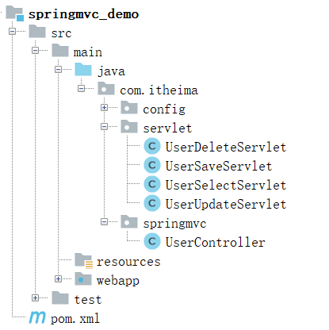
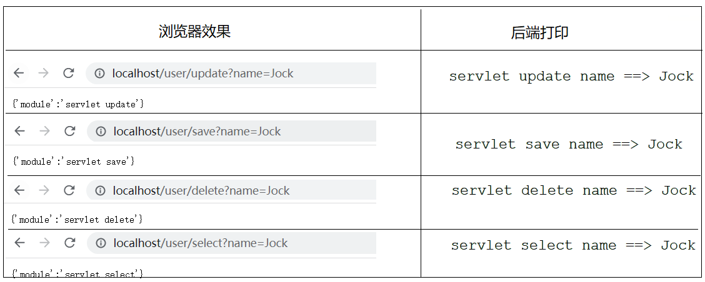
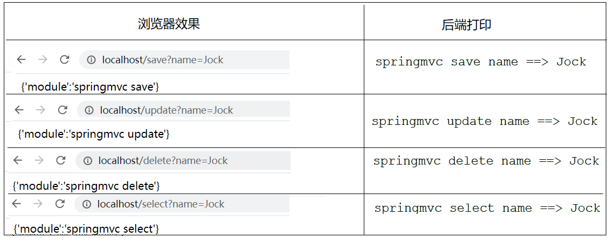
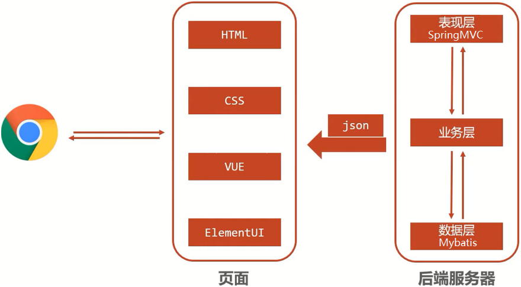

# SpringMVC
<!-- more -->

## 1 SpringMVC简介

SpringMVC隶属于Spring，是Spring技术中的一部分

SpringMVC与Servlet技术功能等同，均属于web层或者说是表现层开发技术

SpringMVC与Servlet相比，开发起来更简单快捷，用更少的代码完成表现层代码的开发

例子:



* UserSaveServlet:使用Servlet开发的用户新增模块

```java
@WebServlet("/user/save")
public class UserSaveServlet extends HttpServlet{

    @Override
    protected void doGet(HttpServletRequest req, HttpServletResponse resp) throws ServletException, IOException {
        //1.接收请求参数
        String name = req.getParameter("name");
        System.out.println("servlet save name ==> " + name);
        //2.生产响应
        resp.setContentType("text/json;charset=utf-8");
        PrintWriter pw = resp.getWriter();
        pw.write("{'module':'servlet save'}");
    }

    @Override
    protected void doPost(HttpServletRequest req, HttpServletResponse resp) throws ServletException, IOException {
        this.doGet(req,resp);
    }
}
```

* UserUpdateServlet:使用Servlet开发的用户修改模块

```java
@WebServlet("/user/update")
public class UserUpdateServlet extends HttpServlet{
    @Override
    protected void doGet(HttpServletRequest req, HttpServletResponse resp) throws ServletException, IOException {
        //1.接收请求参数
        String name = req.getParameter("name");
        System.out.println("servlet update name ==> " + name);
        //2.生产响应
        resp.setContentType("text/json;charset=utf-8");
        PrintWriter pw = resp.getWriter();
        pw.write("{'module':'servlet update'}");
    }

    @Override
    protected void doPost(HttpServletRequest req, HttpServletResponse resp) throws ServletException, IOException {
        this.doGet(req,resp);
    }
}
```

* UserDeleteServlet:使用Servlet开发的用户删除模块

```java
@WebServlet("/user/delete")
public class UserDeleteServlet extends HttpServlet {

    @Override
    protected void doGet(HttpServletRequest req, HttpServletResponse resp) throws ServletException, IOException {
        //1.接收请求参数
        String name = req.getParameter("name");
        System.out.println("servlet delete name ==> " + name);
        //2.生产响应
        resp.setContentType("text/json;charset=utf-8");
        PrintWriter pw = resp.getWriter();
        pw.write("{'module':'servlet delete'}");
    }

    @Override
    protected void doPost(HttpServletRequest req, HttpServletResponse resp) throws ServletException, IOException {
        this.doGet(req,resp);
    }
}
```

* UserDeleteServlet:使用Servlet开发的用户查询模块

```java
@WebServlet("/user/select")
public class UserSelectServlet extends HttpServlet{

    @Override
    protected void doGet(HttpServletRequest req, HttpServletResponse resp) throws ServletException, IOException {
        //1.接收请求参数
        String name = req.getParameter("name");
        System.out.println("servlet select name ==> " + name);
        //2.生产响应
        resp.setContentType("text/json;charset=utf-8");
        PrintWriter pw = resp.getWriter();
        pw.write("{'module':'servlet select'}");
    }

    @Override
    protected void doPost(HttpServletRequest req, HttpServletResponse resp) throws ServletException, IOException {
        this.doGet(req,resp);
    }
}
```

启动项目，测试结果如下:



> 上面就是通过Servlet的方式来实现的用户模块的增删改查功能

springmvc下的`UserController`类

```java
@Controller
public class UserController {

    @RequestMapping("/save")
    @ResponseBody
    public String save(String name){
        System.out.println("springmvc save name ==> " + name);
        return "{'module':'springmvc save'}";
    }

    @RequestMapping("/delete")
    @ResponseBody
    public String delete(String name){
        System.out.println("springmvc delete name ==> " + name);
        return "{'module':'springmvc delete'}";
    }

    @RequestMapping("/update")
    @ResponseBody
    public String update(String name){
        System.out.println("springmvc update name ==> " + name);
        return "{'module':'springmvc update'}";
    }

    @RequestMapping("/select")
    @ResponseBody
    public String select(String name){
        System.out.println("springmvc select name ==> " + name);
        return "{'module':'springmvc select'}";
    }
}
```

启动项目，测试结果如下:



::: tip 

请求与相应：SpringMVC是替换Servlet处于Web的框架，所以其主要的作用就是用来接收前端发过来的请求和数据然后经过处理并将处理的结果响应给前端，所以如何处理请求和响应是SpringMVC中非常重要的一块内容。

REST风格：是一种软件架构风格，可以降低开发的复杂性，提高系统的可伸缩性，在以后开发中非常重要和常用。

SSM整合：是把咱们所学习的SpringMVC+Spring+Mybatis整合在一起来完成业务开发

拦截器：是SpringMVC中的一个小知识点。

:::

## 2 SpringMVC概述



当前WEB程序的工作流程:

### 2.1 三层架构

1. web程序通过浏览器访问前端页面，发送异步请求到后端服务器

2. 后台服务器采用三层架构进行功能开发
     * 表现层负责接收请求和数据然后将数据转交给业务层
     * 业务层负责调用数据层完成数据库表的增删改查，并将结果返给表现层
     * 表现层将数据转换成json格式返回给前端

3. 前端页面将数据进行解析最终展示给用户

### 2.2 表现层与数据层的技术选型

1. 数据层采用Mybatis框架
2. 表现层采用SpringMVC框架，SpringMVC主要负责的内容有:
     * controller如何接收请求和数据
     * 如何将请求和数据转发给业务层
     * 如何将响应数据转换成json发回到前端

::: tip 总结

* SpringMVC是一种基于Java实现MVC模型的轻量级Web框架

* 优点

  * 使用简单、开发便捷(相比于Servlet)
  * 灵活性强
:::
