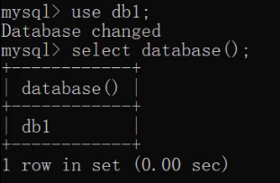

# DDL
<!-- more -->
> Data Definition Language

## 1. 操作数据库

### 1.1 查询所有的数据库

```sql
SHOW DATABASES;
```


### 1.2 创建数据库

```sql
CREATE DATABASE 数据库名称;

CREATE DATABASE IF NOT EXISTS 数据库名称;
```


### 1.3 删除数据库

```sql
DROP DATABASE 数据库名称;

DROP DATABASE IF EXISTS 数据库名称;
```


---

### 1.4 使用数据库

```sql
USE 数据库名称;
```

### 1.5 查看当前使用的数据库

```sql
SELECT DATABASE();
```



## 2. 操作表

对表进行 增（Create）删（Delete）改（Update）查（Retrieve）

### 2.1 查询表

* **查询当前数据库下所有表名称**

```sql
SHOW TABLES;
```


* **查询表结构**

```sql
DESC 表名称;
```


### 2.2 创建表

```sql
CREATE TABLE 表名 (
    字段名1  数据类型1,
    字段名2  数据类型2,
    …
    字段名n  数据类型n
);

```

> 注意：最后一行末尾，不能加逗号

```sql
create table tb_user (
    id int,
    username varchar(20),
    password varchar(32)
);
```


### 2.3 删除表

```sql
DROP TABLE 表名;

DROP TABLE IF EXISTS 表名;
```


### 2.4 修改表

```sql
ALTER TABLE 表名 RENAME TO 新的表名;

-- 将表名student修改为stu
alter table student rename to stu;
```

* **添加一列**

```sql
ALTER TABLE 表名 ADD 列名 数据类型;

-- 给stu表添加一列address，该字段类型是varchar(50)
alter table stu add address varchar(50);
```

* **修改数据类型**

```sql
ALTER TABLE 表名 MODIFY 列名 新数据类型;

-- 将stu表中的address字段的类型改为 char(50)
alter table stu modify address char(50);
```

* **修改列名和数据类型**

```sql
ALTER TABLE 表名 CHANGE 列名 新列名 新数据类型;

-- 将stu表中的address字段名改为 addr，类型改为varchar(50)
alter table stu change address addr varchar(50);
```

* **删除列**

```sql
ALTER TABLE 表名 DROP 列名;

-- 将stu表中的addr字段 删除
alter table stu drop addr;
```
