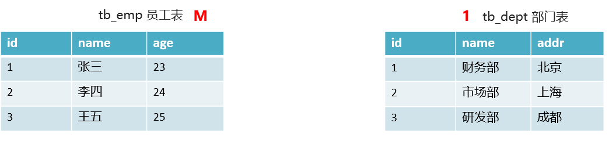
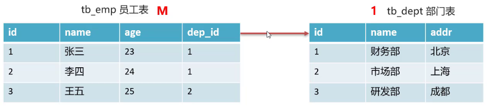
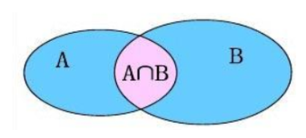
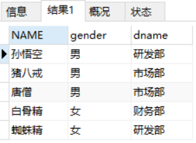

# MySQL高级
<!-- more -->

## 1 约束

在MySQL数据库当中，提供了以下5种约束：

| **约束** | **描述**                                         | **关键字**  |
| -------- | ------------------------------------------------ | ----------- |
| 非空约束 | 限制该字段值不能为null                           | not null    |
| 唯一约束 | 保证字段的所有数据都是唯一、不重复的             | unique      |
| 主键约束 | 主键是一行数据的唯一标识，要求非空且唯一         | primary key |
| 默认约束 | 保存数据时，如果未指定该字段值，则采用默认值     | default     |
| 外键约束 | 让两张表的数据建立连接，保证数据的一致性和完整性 | foreign key |


练习

```sql
-- 员工表
CREATE TABLE emp (
    id INT,  -- 员工id，主键且自增长
    ename VARCHAR(50), -- 员工姓名，非空且唯一
    joindate DATE,  -- 入职日期，非空
    salary DOUBLE(7,2),  -- 工资，非空
    bonus DOUBLE(7,2)  -- 奖金，如果没有将近默认为0
);
```

```sql
DROP TABLE IF EXISTS emp;

-- 员工表
CREATE TABLE emp (
  id INT PRIMARY KEY auto_increment, -- 员工id，主键且自增长
  ename VARCHAR(50) NOT NULL UNIQUE, -- 员工姓名，非空并且唯一
  joindate DATE NOT NULL , -- 入职日期，非空
  salary DOUBLE(7,2) NOT NULL , -- 工资，非空
  bonus DOUBLE(7,2) DEFAULT 0 -- 奖金，如果没有奖金默认为0
);
```

> 注意：默认约束只有在不给值时才会采用默认值。如果给了null，那值就是null值。

### 1.1  外键约束

外键用来让两个表的数据之间建立链接，保证数据的一致性和完整性。

* 添加外键约束

```sql
-- 创建表时添加外键约束
CREATE TABLE 表名(
   列名 数据类型,
   …
   [CONSTRAINT] [外键名称] FOREIGN KEY(外键列名) REFERENCES 主表(主表列名) 
); 
```

```sql
-- 建完表后添加外键约束
ALTER TABLE 表名 
ADD CONSTRAINT 外键名称 
FOREIGN KEY (外键字段名称) REFERENCES 主表名称(主表列名称);
```

* 删除外键约束

```sql
ALTER TABLE 表名 DROP FOREIGN KEY 外键名称;
```

练习

```sql
-- 删除表
DROP TABLE IF EXISTS emp;
DROP TABLE IF EXISTS dept;

-- 部门表
CREATE TABLE dept(
  id int primary key auto_increment,
  dep_name varchar(20),
  addr varchar(20)
);
-- 员工表 
CREATE TABLE emp(
  id int primary key auto_increment,
  name varchar(20),
  age int,
  dep_id int,

  -- 添加外键 dep_id,关联 dept 表的id主键
  CONSTRAINT fk_emp_dept FOREIGN KEY(dep_id) REFERENCES dept(id)
);
```

添加数据

```sql
-- 添加 2 个部门
insert into dept(dep_name,addr) values
('研发部','广州'),('销售部', '深圳');

-- 添加员工,dep_id 表示员工所在的部门
INSERT INTO emp (NAME, age, dep_id) VALUES 
('张三', 20, 1),
('李四', 20, 1),
('王五', 20, 1),
('赵六', 20, 2),
('孙七', 22, 2),
('周八', 18, 2);
```

此时删除 `研发部` 这条数据，会发现无法删除。

删除外键

```sql
alter table emp 
drop FOREIGN key fk_emp_dept;
```

重新添加外键

```sql
alter table emp 
add CONSTRAINT fk_emp_dept FOREIGN key(dep_id) REFERENCES dept(id);
```

## 2 数据库设计

### 2.1  表关系

::: note 一对一

如：用户 和 用户详情  

一对一关系多用于表拆分，将一个实体中经常使用的字段放一张表，不经常使用的字段放另一张表，用于提升查询性能
:::

::: note 一对多
如：部门 和 员工  

一个部门对应多个员工，一个员工对应一个部门。
:::

::: note 多对多

 如：商品 和 订单  

 一个商品对应多个订单，一个订单包含多个商品。
:::

### 2.2  表关系(一对多)

实现方式

**在多的一方建立外键，指向少的一方的主键**

案例



  经过分析发现，员工表属于多的一方，而部门表属于少的一方，此时我们会在员工表中添加一列（dep_id），指向于部门表的主键（id）：



  建表语句如下：

  ```sql
  -- 删除表
  DROP TABLE IF EXISTS tb_emp;
  DROP TABLE IF EXISTS tb_dept;
  
  -- 部门表
  CREATE TABLE tb_dept(
    id int primary key auto_increment,
    dep_name varchar(20),
    addr varchar(20)
  );
  -- 员工表 
  CREATE TABLE tb_emp(
    id int primary key auto_increment,
    name varchar(20),
    age int,
    dep_id int,
    
    -- 添加外键 dep_id,关联 dept 表的id主键
    CONSTRAINT fk_emp_dept FOREIGN KEY(dep_id) REFERENCES tb_dept(id)
  );
  ```

### 2.3  表关系(多对多)

实现方式

**建立第三张中间表，中间表至少包含两个外键，分别关联两方主键**

案例

  以 `订单表` 和 `商品表` 举例：

  

  在中间表中添加订单表的外键和商品表的外键指向两张表的主键：

  

  建表语句如下：

  ```sql
  -- 删除表
  DROP TABLE IF EXISTS tb_order_goods;
  DROP TABLE IF EXISTS tb_order;
  DROP TABLE IF EXISTS tb_goods;
  
  -- 订单表
  CREATE TABLE tb_order(
  	id int primary key auto_increment,
  	payment double(10,2),
  	payment_type TINYINT,
  	status TINYINT
  );
  
  -- 商品表
  CREATE TABLE tb_goods(
  	id int primary key auto_increment,
  	title varchar(100),
  	price double(10,2)
  );
  
  -- 订单商品中间表
  CREATE TABLE tb_order_goods(
  	id int primary key auto_increment,
  	order_id int,
  	goods_id int,
  	count int
  );
  
  -- 建完表后，添加外键
  alter table tb_order_goods 
  add CONSTRAINT fk_order_id FOREIGN key(order_id) REFERENCES tb_order(id);

  alter table tb_order_goods 
  add CONSTRAINT fk_goods_id FOREIGN key(goods_id) REFERENCES tb_goods(id);
  ```

  查看表结构模型图：

  

### 2.4  表关系(一对一)

实现方式

**在任意一方加入外键，关联另一方主键，并且设置外键为唯一(UNIQUE)**

案例

  

  而在真正使用过程中发现 id、photo、nickname、age、gender 字段比较常用，此时就可以将这张表查分成两张表。

  

建表语句如下：

```sql
create table tb_user_desc (
  id int primary key auto_increment,
  city varchar(20),
  edu varchar(10),
  income int,
  status char(2),
  des varchar(100)
);

create table tb_user (
  id int primary key auto_increment,
  photo varchar(100),
  nickname varchar(50),
  age int,
  gender char(1),
  desc_id int unique,
  -- 添加外键
  CONSTRAINT fk_user_desc FOREIGN KEY(desc_id) REFERENCES tb_user_desc(id)
);
```

查看表结构模型图：


## 3 多表查询

```sql
DROP TABLE IF EXISTS emp;
DROP TABLE IF EXISTS dept;

# 创建部门表
  CREATE TABLE dept(
    did INT PRIMARY KEY AUTO_INCREMENT,
    dname VARCHAR(20)
  );

# 创建员工表
CREATE TABLE emp (
  id INT PRIMARY KEY AUTO_INCREMENT,
  NAME VARCHAR(10),
  gender CHAR(1), -- 性别
  salary DOUBLE, -- 工资
  join_date DATE, -- 入职日期
  dep_id INT,
  FOREIGN KEY (dep_id) REFERENCES dept(did) 
  -- 外键，关联部门表(部门表的主键)
);

-- 添加部门数据
INSERT INTO dept (dNAME) 
VALUES ('研发部'),('市场部'),('财务部'),('销售部');

-- 添加员工数据
INSERT INTO emp(NAME,gender,salary,join_date,dep_id) 
VALUES
('孙悟空','男',7200,'2013-02-24',1),
('猪八戒','男',3600,'2010-12-02',2),
('唐僧','男',9000,'2008-08-08',2),
('白骨精','女',5000,'2015-10-07',3),
('蜘蛛精','女',4500,'2011-03-14',1),
('小白龙','男',2500,'2011-02-14',null);	
```

### 3.1  内连接查询

语法

```sql
-- 隐式内连接
SELECT 字段列表 FROM 表1,表2… WHERE 条件;

-- 显示内连接
SELECT 字段列表 FROM 表1 [INNER] JOIN 表2 ON 条件;
```


案例

  * 隐式内连接

    ```sql
    SELECT
      *
    FROM
      emp,
      dept
    WHERE
      emp.dep_id = dept.did;
    ```

    执行上述语句结果如下：

    

  * 查询 emp的 name， gender，dept表的dname

    ```sql
    SELECT
      t1.NAME,
      t1.gender,
      t2.dname
    FROM
      emp t1,
      dept t2
    WHERE
      t1.dep_id = t2.did;
    ```
    

  * 显式内连接

    ```sql
    select * from emp inner join dept on emp.dep_id = dept.did;
    -- 上面语句中的inner可以省略，可以书写为如下语句
    select * from emp join dept on emp.dep_id = dept.did;
    ```

### 3.2  外连接查询

语法

  ```sql
  -- 左外连接
  SELECT 字段列表 FROM 表1 LEFT [OUTER] JOIN 表2 ON 条件;
  
  -- 右外连接
  SELECT 字段列表 FROM 表1 RIGHT [OUTER] JOIN 表2 ON 条件;
  ```

左外连接：相当于查询A表所有数据和交集部分数据  
右外连接：相当于查询B表所有数据和交集部分数据


案例

  * 查询emp表所有数据和对应的部门信息（**左外连接**）

    ```sql
    select * from emp left join dept on emp.dep_id = dept.did;
    ```

    执行语句结果如下：


  * 查询dept表所有数据和对应的员工信息（**右外连接**）

    ```sql
    select * from emp right join dept on emp.dep_id = dept.did;
    ```

    执行语句结果如下：


    要查询出部门表中所有的数据，也可以通过左外连接实现，只需要将两个表的位置进行互换：

    ```sql
    select * from dept left join emp on emp.dep_id = dept.did;
    ```

### 3.3  子查询

**查询中嵌套查询，称嵌套查询为子查询。**

需求：查询工资高于猪八戒的员工信息

  第一步：先查询出来 猪八戒的工资

  ```sql
  select salary 
  from emp 
  where name = '猪八戒'
  ```

   第二步：查询工资高于猪八戒的员工信息

  ```sql
  select * 
  from emp 
  where salary > 3600;
  ```

  第二步中的3600可以通过第一步的sql查询出来，所以将3600用第一步的sql语句进行替换

  ```sql
  select * 
  from emp 
  where salary > (select salary 
                  from emp 
                  where name = '猪八戒');
  ```

::: note 子查询根据查询结果不同，作用不同

子查询语句结果是单行单列，子查询语句作为条件值，使用 =  !=  >  <  等进行条件判断  
子查询语句结果是多行单列，子查询语句作为条件值，使用 in 等关键字进行条件判断  
子查询语句结果是多行多列，子查询语句作为虚拟表  
:::

案例

  * 查询 '财务部' 和 '市场部' 所有的员工信息

    ```sql
    -- 查询 '财务部' 或者 '市场部' 所有的员工的部门did
    select did 
    from dept 
    where dname = '财务部' or dname = '市场部';
    
    select * 
    from emp 
    where dep_id in (select did 
                      from dept 
                      where dname = '财务部' or dname = '市场部');
    ```

  * 查询入职日期是 '2011-11-11' 之后的员工信息和部门信息

    ```sql
    -- 查询入职日期是 '2011-11-11' 之后的员工信息
    select * 
    from emp 
    where join_date > '2011-11-11' ;

    -- 将上面语句的结果作为虚拟表和dept表进行内连接查询
    select * 
    from (select * 
          from emp 
          where join_date > '2011-11-11' ) t1, dept 
    where t1.dep_id = dept.did;
    ```


### 3.4  案例

环境准备：

```sql
DROP TABLE IF EXISTS emp;
DROP TABLE IF EXISTS dept;
DROP TABLE IF EXISTS job;
DROP TABLE IF EXISTS salarygrade;

-- 部门表
CREATE TABLE dept (
  did INT PRIMARY KEY PRIMARY KEY, -- 部门id
  dname VARCHAR(50), -- 部门名称
  loc VARCHAR(50) -- 部门所在地
);

-- 职务表，职务名称，职务描述
CREATE TABLE job (
  id INT PRIMARY KEY,
  jname VARCHAR(20),
  description VARCHAR(50)
);

-- 员工表
CREATE TABLE emp (
  id INT PRIMARY KEY, -- 员工id
  ename VARCHAR(50), -- 员工姓名
  job_id INT, -- 职务id
  mgr INT , -- 上级领导
  joindate DATE, -- 入职日期
  salary DECIMAL(7,2), -- 工资
  bonus DECIMAL(7,2), -- 奖金
  dept_id INT, -- 所在部门编号
  CONSTRAINT emp_jobid_ref_job_id_fk FOREIGN KEY (job_id) REFERENCES job (id),
  CONSTRAINT emp_deptid_ref_dept_id_fk FOREIGN KEY (dept_id) REFERENCES dept (id)
);

-- 工资等级表
CREATE TABLE salarygrade (
  grade INT PRIMARY KEY,   -- 级别
  losalary INT,  -- 最低工资
  hisalary INT -- 最高工资
);

-- 添加4个部门
INSERT INTO dept(did,dname,loc) VALUES 
(10,'教研部','北京'),
(20,'学工部','上海'),
(30,'销售部','广州'),
(40,'财务部','深圳');

-- 添加4个职务
INSERT INTO job (id, jname, description) VALUES
(1, '董事长', '管理整个公司，接单'),
(2, '经理', '管理部门员工'),
(3, '销售员', '向客人推销产品'),
(4, '文员', '使用办公软件');

-- 添加员工
INSERT INTO emp(id,ename,job_id,mgr,joindate,salary,bonus,dept_id) VALUES 
(1001,'孙悟空',4,1004,'2000-12-17','8000.00',NULL,20),
(1002,'卢俊义',3,1006,'2001-02-20','16000.00','3000.00',30),
(1003,'林冲',3,1006,'2001-02-22','12500.00','5000.00',30),
(1004,'唐僧',2,1009,'2001-04-02','29750.00',NULL,20),
(1005,'李逵',4,1006,'2001-09-28','12500.00','14000.00',30),
(1006,'宋江',2,1009,'2001-05-01','28500.00',NULL,30),
(1007,'刘备',2,1009,'2001-09-01','24500.00',NULL,10),
(1008,'猪八戒',4,1004,'2007-04-19','30000.00',NULL,20),
(1009,'罗贯中',1,NULL,'2001-11-17','50000.00',NULL,10),
(1010,'吴用',3,1006,'2001-09-08','15000.00','0.00',30),
(1011,'沙僧',4,1004,'2007-05-23','11000.00',NULL,20),
(1012,'李逵',4,1006,'2001-12-03','9500.00',NULL,30),
(1013,'小白龙',4,1004,'2001-12-03','30000.00',NULL,20),
(1014,'关羽',4,1007,'2002-01-23','13000.00',NULL,10);

-- 添加5个工资等级
INSERT INTO salarygrade(grade,losalary,hisalary) VALUES 
(1,7000,12000),
(2,12010,14000),
(3,14010,20000),
(4,20010,30000),
(5,30010,99990);
```

需求

  1. 查询所有员工信息。查询员工编号，员工姓名，工资，职务名称，职务描述

     ```sql
     /*
      分析：
        1. 员工编号，员工姓名，工资 信息在emp 员工表中
        2. 职务名称，职务描述 信息在 job 职务表中
        3. job 职务表 和 emp 员工表 是 一对多的关系 emp.job_id = job.id
     */
     -- 方式一 ：隐式内连接
     SELECT
      emp.id,
      emp.ename,
      emp.salary,
      job.jname,
      job.description
     FROM
      emp,
      job
     WHERE
      emp.job_id = job.id;
     
     -- 方式二 ：显式内连接
     SELECT
      emp.id,
      emp.ename,
      emp.salary,
      job.jname,
      job.description
     FROM
      emp
     INNER JOIN job ON emp.job_id = job.id;
     ```

  2. 查询员工编号，员工姓名，工资，职务名称，职务描述，部门名称，部门位置

     ```sql
     /*
      分析：
      1. 员工编号，员工姓名，工资 信息在emp 员工表中
      2. 职务名称，职务描述 信息在 job 职务表中
      3. job 职务表 和 emp 员工表 是 一对多的关系 emp.job_id = job.id
      4. 部门名称，部门位置 来自于 部门表 dept
      5. dept 和 emp 一对多关系 dept.id = emp.dept_id
     */
     
     -- 方式一 ：隐式内连接
     SELECT
      emp.id,
      emp.ename,
      emp.salary,
      job.jname,
      job.description,
      dept.dname,
      dept.loc
     FROM
      emp,
      job,
      dept
     WHERE
      emp.job_id = job.id
      and dept.id = emp.dept_id
     ;
     
     -- 方式二 ：显式内连接
     SELECT
      emp.id,
      emp.ename,
      emp.salary,
      job.jname,
      job.description,
      dept.dname,
      dept.loc
     FROM
      emp
     INNER JOIN job ON emp.job_id = job.id
     INNER JOIN dept ON dept.id = emp.dept_id
     ```

  3. 查询员工姓名，工资，工资等级

     ```sql
     /*
      分析：
      1. 员工姓名，工资 信息在emp 员工表中
      2. 工资等级 信息在 salarygrade 工资等级表中
      3. emp.salary >= salarygrade.losalary  
      and emp.salary <= salarygrade.hisalary
     */
     SELECT
      emp.ename,
      emp.salary,
      t2.*
     FROM
      emp,
      salarygrade t2
     WHERE
      emp.salary >= t2.losalary
     AND emp.salary <= t2.hisalary
     ```

  4. 查询员工姓名，工资，职务名称，职务描述，部门名称，部门位置，工资等级

     ```sql
     /*
      分析：
      1. 员工编号，员工姓名，工资 信息在emp 员工表中
      2. 职务名称，职务描述 信息在 job 职务表中
      3. job 职务表 和 emp 员工表 是 一对多的关系 
        emp.job_id  = job.id
      4. 部门名称，部门位置 来自于 部门表 dept
      5. dept 和 emp 一对多关系 dept.id = emp.dept_id
      6. 工资等级 信息在 salarygrade 工资等级表中
      7. emp.salary >= salarygrade.losalary  
        and emp.salary <= salarygrade.hisalary
     */
     SELECT
      emp.id,
      emp.ename,
      emp.salary,
      job.jname,
      job.description,
      dept.dname,
      dept.loc,
      t2.grade
     FROM
      emp
     INNER JOIN job ON emp.job_id = job.id
     INNER JOIN dept ON dept.id = emp.dept_id
     INNER JOIN salarygrade t2 ON emp.salary BETWEEN t2.losalary and t2.hisalary;
     ```

  5. 查询出部门编号、部门名称、部门位置、部门人数

     ```sql
     /*
      分析：
      1. 部门编号、部门名称、部门位置 来自于部门 dept 表
      2. 部门人数: 在emp表中 按照dept_id 进行分组，然后count(*) 统计数量
      3. 使用子查询，让部门表和分组后的表进行内连接
     */
     -- 根据部门id分组查询每一个部门id和员工数
     select dept_id, count(*) from emp group by dept_id;
     
     SELECT
      dept.id,
      dept.dname,
      dept.loc,
      t1.count
     FROM
      dept,
      (
          SELECT
            dept_id,
            count(*) count
          FROM
            emp
          GROUP BY
            dept_id
      ) t1
     WHERE dept.id = t1.dept_id
     ```

## 4 事务

数据库的事务（Transaction）是一种机制、一个操作序列，包含了**一组数据库操作命令**。

事务把所有的命令作为一个整体一起向系统提交或撤销操作请求，即这一组数据库命令**要么同时成功，要么同时失败**。  


**语法**：

* 开启事务

  ```sql
  START TRANSACTION;
  或者  
  BEGIN;
  ```

* 提交事务

  ```sql
  commit;
  ```

* 回滚事务

  ```sql
  rollback;
  ```

环境准备

  ```sql
  DROP TABLE IF EXISTS account;
  
  -- 创建账户表
  CREATE TABLE account(
  	id int PRIMARY KEY auto_increment,
  	name varchar(10),
  	money double(10,2)
  );
  
  -- 添加数据
  INSERT INTO account(name,money) values('张三',1000),('李四',1000);
  ```

添加事务sql如下：

  ```sql
  -- 开启事务
  BEGIN;
  -- 转账操作
  -- 1. 查询李四账户金额是否大于500
  
  -- 2. 李四账户 -500
  UPDATE account set money = money - 500 where name = '李四';
  
  出现异常了...  -- 此处不是注释，在整体执行时后面的sql不执行
  -- 3. 张三账户 +500
  UPDATE account set money = money + 500 where name = '张三';
  
  -- 提交事务
  COMMIT;
  
  -- 回滚事务
  ROLLBACK;
  ```

**事务的四大特征**

* 原子性（Atomicity）: 事务是不可分割的最小操作单位，要么同时成功，要么同时失败

* 一致性（Consistency） :事务完成时，必须使所有的数据都保持一致状态

* 隔离性（Isolation） :多个事务之间，操作的可见性

* 持久性（Durability） :事务一旦提交或回滚，它对数据库中的数据的改变就是永久的

**说明**：

mysql中事务是自动提交的。

查询到的结果是1表示自动提交，结果是0表示手动提交。

```java
SELECT @@autocommit;
```

可以通过下面语句修改提交方式

```sql
set @@autocommit = 0;
```
