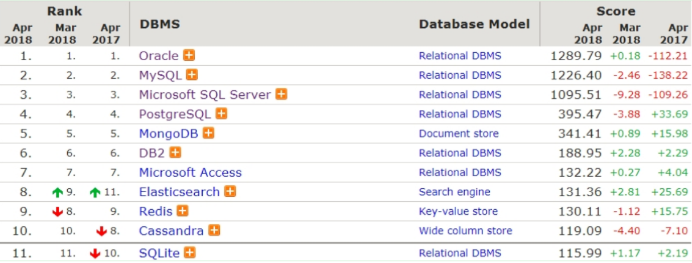

# MySQL基础
<!-- more -->

## 1 数据库相关概念

数据持久化的存储采用的是**文件存储**。

### 1.1 数据库

* DataBase，简称 DB。
* 存储和管理数据的仓库。

### 1.2  数据库管理系统

* DataBase Management System，简称 DBMS
* 管理数据库的大型软件

### 1.3  常见的数据库管理系统

* Oracle：收费的大型数据库
* **MySQL**： 开源免费的中小型数据库。后来 Sun 公司收购了 MySQL，而 Sun 公司又被 Oracle 收购
* SQL Server：MicroSoft 公司收费的中型数据库。C#、.net 等语言常使用
* PostgreSQL：开源免费的中小型数据库
* DB2：IBM 公司的大型收费数据库产品
* SQLite：嵌入式的微型数据库。如：作为 Android 内置数据库
* MariaDB：开源免费中小型的数据库

## 2 MySQL数据模型

### 2.1 关系型数据库

关系型数据库是 建立在关系模型基础上的数据库  

关系型数据库是 由多张能互相连接的 **二维表** 组成的数据库

上图中右边的 `db.frm` 是表文件，`db.MYD` 是数据文件，通过这两个文件就可以查询到数据展示成二维表的效果。

### 2.2 小结

* MySQL 中可以创建多个数据库，每个数据库对应到磁盘上的一个文件夹
* 在每个数据库中可以创建多个表，每张都对应到磁盘上一个 frm 文件
* 每张表可以存储多条数据，数据会被存储到磁盘中  MYD 文件中

## 3 SQL概述

### 3.1 SQL简介

Structured Query Language，简称 SQL，结构化查询语言  
::: note SQL
操作关系型数据库的编程语言  
定义操作所有关系型数据库的统一标准，可以使用SQL操作所有的关系型数据库管理系统  

对于同一个需求，每一种数据库操作的方式可能会存在一些不一样的地方，我们称为“方言”  
:::

### 3.2 SQL分类

SQL语句根据其功能被分为四大类：DDL、DML、DQL、DCL

| **分类** | **全称**                    | **说明**                                               |
| -------- | --------------------------- | ------------------------------------------------------ |
| DDL      | Data Definition  Language   | 数据定义语言，用来定义数据库对象(数据库，表，字段)     |
| DML      | Data Manipulation  Language | 数据操作语言，用来对数据库表中的数据进行增删改         |
| DQL      | Data Query Language         | 数据查询语言，用来查询数据库中表的记录                 |
| DCL      | Data Control  Language      | 数据控制语言，用来创建数据库用户、控制数据库的访问权限 |

  

> 注意： 开发中最常用操作就是 `DML` 和 `DQL`

## 4 数据类型

MySQL中的数据类型有很多，主要分为三类：数值类型、字符串类型、日期时间类型。

### 4.1 数值类型

| 类型        | 大小   | 有符号(SIGNED)范围                                    | 无符号(UNSIGNED)范围                                       |
| ----------- | ------ | ----------------------------------------------------- | ---------------------------------------------------------- |
| TINYINT     | 1byte  | (-128，127)                                           | (0，255)                                                   |
| SMALLINT    | 2bytes | (-32768，32767)                                       | (0，65535)                                                 |
| MEDIUMINT   | 3bytes | (-8388608，8388607)                                   | (0，16777215)                                              |
| INT/INTEGER | 4bytes | (-2147483648，2147483647)                             | (0，4294967295)                                            |
| BIGINT      | 8bytes | (-2^63, 2^63-1)                                       | (0，2^64-1)                                                |
| FLOAT       | 4bytes | (-3.402823466 E+38，3.402823466351 E+38)              | 0 和 (1.175494351  E-38，3.402823466 E+38)                 |
| DOUBLE      | 8bytes | (-1.7976931348623157 E+308，1.7976931348623157 E+308) | 0 和  (2.2250738585072014 E-308，1.7976931348623157 E+308) |
| DECIMAL     |        | 依赖于M(精度)和D(标度)的值                            | 依赖于M(精度)和D(标度)的值                                 |

### 4.2 字符串类型

| 类型       | 大小                  | 描述                         |
| ---------- | --------------------- | ---------------------------- |
| CHAR       | 0-255 bytes           | 定长字符串(需要指定长度)     |
| VARCHAR    | 0-65535 bytes         | 变长字符串(需要指定长度)     |
| TINYBLOB   | 0-255 bytes           | 不超过255个字符的二进制数据  |
| TINYTEXT   | 0-255 bytes           | 短文本字符串                 |
| BLOB       | 0-65 535 bytes        | 二进制形式的长文本数据       |
| TEXT       | 0-65 535 bytes        | 长文本数据                   |
| MEDIUMBLOB | 0-16 777 215 bytes    | 二进制形式的中等长度文本数据 |
| MEDIUMTEXT | 0-16 777 215 bytes    | 中等长度文本数据             |
| LONGBLOB   | 0-4 294 967 295 bytes | 二进制形式的极大文本数据     |
| LONGTEXT   | 0-4 294 967 295 bytes | 极大文本数据                 |

::: note char 与 varchar
char 与 varchar 都可以描述字符串  

char是定长字符串，指定长度多长，就占用多少个字符，和字段值的长度无关  
varchar是变长字符串，指定的长度为最大占用长度。
:::

### 4.3 日期时间类型

| 类型      | 大小 | 范围                                       | 格式                | 描述                     |
| --------- | ---- | ------------------------------------------ | ------------------- | ------------------------ |
| DATE      | 3    | 1000-01-01 至  9999-12-31                  | YYYY-MM-DD          | 日期值                   |
| TIME      | 3    | -838:59:59 至  838:59:59                   | HH:MM:SS            | 时间值或持续时间         |
| YEAR      | 1    | 1901 至 2155                               | YYYY                | 年份值                   |
| DATETIME  | 8    | 1000-01-01 00:00:00 至 9999-12-31 23:59:59 | YYYY-MM-DD HH:MM:SS | 混合日期和时间值         |
| TIMESTAMP | 4    | 1970-01-01 00:00:01 至 2038-01-19 03:14:07 | YYYY-MM-DD HH:MM:SS | 混合日期和时间值，时间戳 |
