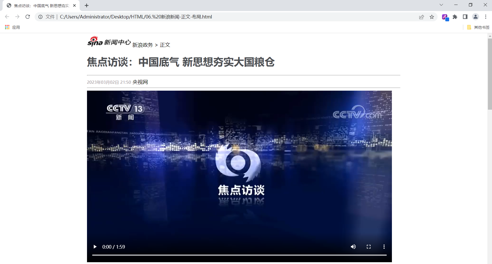

# CSS页面布局
<!-- more -->

## 盒子模型

- 盒子：页面中所有的元素（标签），都可以看做是一个 盒子，由盒子将页面中的元素包含在一个矩形区域内，通过盒子的视角更方便的进行页面布局

- 盒子模型组成：内容区域（content）、内边距区域（padding）、边框区域（border）、外边距区域（margin）


CSS盒子模型，其实和日常生活中的包装盒是非常类似的，就比如：


盒子的大小，其实就包括三个部分： border、padding、content，而**margin外边距是不包括在盒子之内的**。

## 盒子模型代码

```html
<!DOCTYPE html>
<html lang="en">
<head>
    <meta charset="UTF-8">
    <meta http-equiv="X-UA-Compatible" content="IE=edge">
    <meta name="viewport" content="width=device-width, initial-scale=1.0">
    <title>盒子模型</title>
    <style>
        div {
            width: 200px;  /* 宽度 */
            height: 200px;  /* 高度 */
            box-sizing: border-box; /* 指定width height为盒子的高宽 */
            background-color: aquamarine; /* 背景色 */
            
            padding: 20px 20px 20px 20px; /* 内边距, 上 右 下 左 , 边距都一行, 可以简写: padding: 20px;*/ 
            border: 10px solid red; /* 边框, 宽度 线条类型 颜色 */
            margin: 30px 30px 30px 30px; /* 外边距, 上 右 下 左 , 边距都一行, 可以简写: margin: 30px; */
        }
    </style>
</head>

<body>
    
    <div>
        A A A A A A A A A A A A A A A A A A A A A A A A A A A A A A A A A A 
    </div>

</body>
</html>
```

盒子各个组成部分(内容、内边距、边框、外边距)：


我们也可以，通过浏览器的开发者工具，清晰的看到这个盒子，以及每一个部分的大小：


## 布局实现

在实现新闻页面的布局时，我们需要做两部操作：

- 第一步：需要将body中的新闻标题部分、正文部分使用一个 div 布局标签将其包裹起来，方便通过css设置内容占用的宽度，比如：65%。
- 第二步：通过css为该div设置外边距，左右的外边距分别为：17.5%，上下外边距靠边展示即可，为：0%。

代码实现如下：

```html
<!DOCTYPE html>
<html lang="en">
<head>
    <meta charset="UTF-8">
    <meta http-equiv="X-UA-Compatible" content="IE=edge">
    <meta name="viewport" content="width=device-width, initial-scale=1.0">
    <title>焦点访谈：中国底气 新思想夯实大国粮仓</title>
    <style>
        h1 {
            color: #4D4F53;
        }
        
        #time {
            color: #968D92;
            font-size: 13px; /* 设置字体大小 */
        }

        a {
            color: black;
            text-decoration: none; /* 设置文本为一个标准的文本 */
        }

        p {
            text-indent: 35px; /* 设置首行缩进 */
            line-height: 40px; /* 设置行高 */
        }

        #plast {
            text-align: right; /* 对齐方式 */
        }

        #center {
            width: 65%;
            /* margin: 0% 17.5% 0% 17.5% ; */ /* 外边距, 上 右 下 左 */
            margin: 0 auto;
        }
    </style>
</head>
<body>
    
    <div id="center">
        <!-- 标题 -->
         <a href="http://gov.sina.com.cn/" target="_self">新浪政务</a>  > 正文

        <h1>焦点访谈：中国底气 新思想夯实大国粮仓</h1>

        <hr>
        <span id="time">2023年03月02日 21:50</span>
        <span><a href="https://news.cctv.com/2023/03/02/ARTIUCKFf9kE9eXgYE46ugx3230302.shtml" target="_blank">央视网</a></span>
        <hr>

        <!-- 正文 -->
        <!-- 视频 -->
        <video src="video/1.mp4" controls width="950px"></video>

        <!-- 音频 -->
        <!-- <audio src="audio/1.mp3" controls></audio> -->

        <p>
        <strong>央视网消息</strong> （焦点访谈）：党的十八大以来，以习近平同志为核心的党中央始终把解决粮食安全问题作为治国理政的头等大事，重农抓粮一系列政策举措有力有效，我国粮食产量站稳1.3万亿斤台阶，实现谷物基本自给、口粮绝对安全。我们把饭碗牢牢端在自己手中，为保障经济社会发展提供了坚实支撑，为应对各种风险挑战赢得了主动。连续八年1.3万亿斤，这个沉甸甸的数据是如何取得的呢？
        </p>

        <p>
        人勤春来早，春耕农事忙。立春之后，由南到北，我国春耕春管工作陆续展开，春天的田野处处生机盎然。
        </p>

        

        <p>
            今年，我国启动了新一轮千亿斤粮食产能提升行动，这是一个新的起点。2015年以来，我国粮食产量连续8年稳定在1.3万亿斤以上，人均粮食占有量始终稳稳高于国际公认的400公斤粮食安全线。从十年前的约12200亿斤到2022年的约13700亿斤，粮食产量提高了1500亿斤。
        </p>

        

        <p>
            中国式现代化一个重要的中国特色是人口规模巨大的现代化。我们粮食生产的发展，意味着我们要立足国内，解决14亿多人吃饭的问题。仓廪实，天下安。保障粮食安全是一个永恒的课题，任何时候都不能放松。在以习近平同志为核心的党中央坚强领导下，亿万中国人民辛勤耕耘、不懈奋斗，我们就一定能够牢牢守住粮食安全这一“国之大者”，把中国人的饭碗牢牢端在自己手中，夯实中国式现代化基础。
        </p>

        <p id="plast">
            责任编辑：王树淼 SN242
        </p>  
    </div>
</body>
</html>
```

浏览器打开此页面，最终效果如下：


