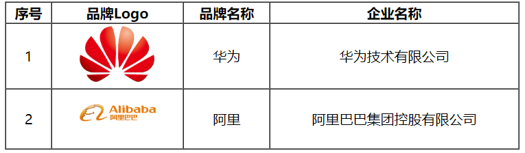

# HTML标签
<!-- more -->

## 表格标签

**标签：**

- &lt;table> : 用于定义整个表格, 可以包裹多个 &lt;tr>， 常用属性如下：
  - border：规定表格边框的宽度
  - width：规定表格的宽度
  - cellspacing: 规定单元之间的空间

- &lt;tr> : 表格的行，可以包裹多个 &lt;td>  
- &lt;td> : 表格单元格(普通)，可以包裹内容 , 如果是表头单元格，可以替换为 &lt;th>  

**演示：**

```html
<!DOCTYPE html>
<html lang="en">
<head>
    <meta charset="UTF-8">
    <meta http-equiv="X-UA-Compatible" content="IE=edge">
    <meta name="viewport" content="width=device-width, initial-scale=1.0">
    <title>HTML-表格</title>
    <style>
        td {
            text-align: center; /* 单元格内容居中展示 */
        }
    </style>
</head>
<body>
    
    <table border="1px" cellspacing="0"  width="600px">
        <tr>
            <th>序号</th>
            <th>品牌Logo</th>
            <th>品牌名称</th>
            <th>企业名称</th>
        </tr>
        <tr>
            <td>1</td>
            <td>  </td>
            <td>华为</td>
            <td>华为技术有限公司</td>
        </tr>
        <tr>
            <td>2</td>
            <td>  </td>
            <td>阿里</td>
            <td>阿里巴巴集团控股有限公司</td>
        </tr>
    </table>

</body>
</html>
```



## 表单标签


- 表单场景: 表单就是在网页中负责数据采集功能的，如：注册、登录的表单。

- 表单标签: &lt;form>
- 表单属性:
  - action: 规定表单提交时，向何处发送表单数据，表单提交的==URL==。
  - method: 规定用于发送表单数据的方式，常见为： ==GET、POST==。
    - GET：表单数据是拼接在url后面的， 如： xxxxxxxxxxx?username=Tom&age=12，url中能携带的表单数据大小是有限制的。
    - POST： 表单数据是在请求体（消息体）中携带的，大小没有限制。

- 表单项标签: 不同类型的input元素、下拉列表、文本域等。
  - input: 定义表单项，通过type属性控制输入形式
  - select: 定义下拉列表
  - textarea: 定义文本域

**演示**:

GET方式提交的表单

```html
<form action="" method="get">
        用户名: <input type="text" name="username">
        年龄: <input type="text" name="age">

        <input type="submit" value="提交">
</form>
```

表单的数据在url后面提交到服务端，格式为：?username=Tom&age=12。


POST方式提交表单

```html
    <form action="" method="post">
        用户名: <input type="text" name="username">
        年龄: <input type="text" name="age">

        <input type="submit" value="提交">
    </form>
```


**注意事项**:

表单中的所有表单项，要想能够正常的采集数据，在提交的时候能提交到服务端，表单项必须指定name属性。 否则，无法提交该表单项。

```html
用户名: <input type="text" name="username">
```

### 表单项

在一个表单中，可以存在很多的表单项，而虽然表单项的形式各式各样，但是表单项的标签其实就只有三个，分别是：

- &lt;input>: 表单项 , 通过type属性控制输入形式。

  | type取值                 | **描述**                             |
  | ------------------------ | ------------------------------------ |
  | text                     | 默认值，定义单行的输入字段           |
  | password                 | 定义密码字段                         |
  | radio                    | 定义单选按钮                         |
  | checkbox                 | 定义复选框                           |
  | file                     | 定义文件上传按钮                     |
  | date/time/datetime-local | 定义日期/时间/日期时间               |
  | number                   | 定义数字输入框                       |
  | email                    | 定义邮件输入框                       |
  | hidden                   | 定义隐藏域                           |
  | submit / reset / button  | 定义提交按钮 / 重置按钮 / 可点击按钮 |

- &lt;select>: 定义下拉列表, &lt;option> 定义列表项

- &lt;textarea>: 文本域

**演示**

```html
<!DOCTYPE html>
<html lang="en">
<head>
    <meta charset="UTF-8">
    <meta http-equiv="X-UA-Compatible" content="IE=edge">
    <meta name="viewport" content="width=device-width, initial-scale=1.0">
    <title>HTML-表单项标签</title>
</head>
<body>

<!-- value: 表单项提交的值 -->
<form action="" method="post">
     姓名: <input type="text" name="name"> <br><br>
     密码: <input type="password" name="password"> <br><br> 
     性别: <input type="radio" name="gender" value="1"> 男
          <label><input type="radio" name="gender" value="2"> 女 </label> <br><br>
     爱好: <label><input type="checkbox" name="hobby" value="java"> java </label>
          <label><input type="checkbox" name="hobby" value="game"> game </label>
          <label><input type="checkbox" name="hobby" value="sing"> sing </label> <br><br>
     图像: <input type="file" name="image">  <br><br>
     生日: <input type="date" name="birthday"> <br><br>
     时间: <input type="time" name="time"> <br><br>
     日期时间: <input type="datetime-local" name="datetime"> <br><br>
     邮箱: <input type="email" name="email"> <br><br>
     年龄: <input type="number" name="age"> <br><br>
     学历: <select name="degree">
               <option value="">----------- 请选择 -----------</option>
               <option value="1">大专</option>
               <option value="2">本科</option>
               <option value="3">硕士</option>
               <option value="4">博士</option>
          </select>  <br><br>
     描述: <textarea name="description" cols="30" rows="10"></textarea>  <br><br>
     <input type="hidden" name="id" value="1">

     <!-- 表单常见按钮 -->
     <input type="button" value="按钮">
     <input type="reset" value="重置"> 
     <input type="submit" value="提交">   
     <br>
</form>

</body>
</html>
```

通过浏览器打开上述的表单项html文件，最终展示出的表单信息如下：


而对于input type="hidden"，是一个隐藏域，在表单中并不会显示出来，但是在提交表单的时候，是会提交到服务端的。


