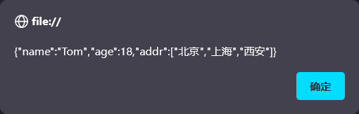

# 基本对象
<!-- more -->

## Array对象

**语法格式**:

Array对象时用来定义数组的。常用语法格式有如下2种：

```html
<script>
    //定义数组
     var arr = new Array(1,2,3,4); //格式1
     var arr = [1,2,3,4]; //格式2
    //获取数组中的值，索引从0开始计数
     console.log(arr[0]);
     console.log(arr[1]);
</script>
```

**特点**：

与java中不一样的是，**JavaScript中数组相当于java中的集合，数组的长度是可以变化的**。而且JavaScript是弱数据类型的语言，所以数组中可以存储任意数据类型的值。

```js
//特点: 长度可变 类型可变
var arr = [1,2,3,4];
arr[10] = 50;

console.log(arr[10]);
console.log(arr[9]);
console.log(arr[8]);
```


```js
//特点: 长度可变 类型可变
var arr = [1,2,3,4];
arr[10] = 50;

arr[9] = "A";
arr[8] = true;

console.log(arr);
```


**属性和方法**:

| 属性   | 描述                         |
| :----- | :--------------------------- |
| length | 设置或返回数组中元素的数量。 |

| 方法  | 描述                                             |
| :-------- | :----------------------------------------------- |
| forEach() | 遍历数组中的每个有值得元素，并调用一次传入的函数 |
| push()    | 将新元素添加到数组的末尾，并返回新的长度         |
| splice()  | 从数组中删除元素                                 |

- **forEach()函数**

  ```js
  //e是形参，接受的是数组遍历时的值
  arr.forEach(function(e){
       console.log(e);
  })
  ```

  在ES6中，引入箭头函数的写法，语法类似 java 中 lambda 表达式

  ```js
  arr.forEach((e) => {
       console.log(e);
  }) 
  ```

  值得注意的是，没有元素的内容是不会输出的，因为forEach只会遍历有值的元素

    

- **push()**

  向数组的末尾添加元素的，

  ```js
  arr.push(7,8,9);
  console.log(arr);
  ```

  

- **splice()**

  用来删除数组中的元素，有2个参数。

  - 参数1：表示从哪个索引位置删除

  - 参数2：表示删除**元素的个数**

  如下代码表示：从索引2的位置开始删，删除2个元素

  ```js
  arr.splice(2,2);
  console.log(arr);
  ```

  

## String对象

**语法格式**:

String对象的创建方式有2种：

```html
<script>
    //创建字符串对象
    //var str = new String("Hello String"); //方式1
    var str = "  Hello String  "; //方式2 

    console.log(str);
</script>
```

**属性和方法**:

| 属性   | 描述           |
| ------ | -------------- |
| length | 字符串的长度。 |

| 方法        | 描述                                     |
| ----------- | ---------------------------------------- |
| charAt()    | 返回在指定位置的字符。                   |
| indexOf()   | 检索字符串。                             |
| trim()      | 去除字符串两边的空格                     |
| substring() | 提取字符串中两个指定的索引号之间的字符。 |

::: details 代码

```html
<!DOCTYPE html>
<html lang="en">
<head>
    <meta charset="UTF-8">
    <meta http-equiv="X-UA-Compatible" content="IE=edge">
    <meta name="viewport" content="width=device-width, initial-scale=1.0">
    <title>JS-对象-String</title>
</head>
<body>
    
</body>
<script>
    //创建字符串对象
    //var str = new String("Hello String");
    var str = "  Hello String    ";

    console.log(str);

    //length
    console.log(str.length);

    //charAt
    console.log(str.charAt(4));

    //indexOf
    console.log(str.indexOf("lo"));

    //trim
    var s = str.trim();
    console.log(s.length);

    //substring(start,end) --- 开始索引, 结束索引 (含头不含尾)
    console.log(s.substring(0,5));

</script>
</html>
```

:::


## JSON对象

**自定义对象**：

```js
var 对象名 = {
    属性名1: 属性值1, 
    属性名2: 属性值2,
    属性名3: 属性值3,
    函数名称: function(形参列表){}
};

```

通过如下语法调用属性：

```js
对象名.属性名
```

通过如下语法调用函数：

```js
对象名.函数名()
```

```html
<script>
    //自定义对象
    var user = {
        name: "Tom",
        age: 10,
        gender: "male",
        eat: function(){
             console.log("用膳~");
         }
    }

    console.log(user.name);
    user.eat();
<script>
```

==**JSON对象**==:

JSON对象：**J**ava**S**cript **O**bject **N**otation  
JavaScript对象标记法，是通过JavaScript标记法书写的文本。其格式如下：

```js
{
    "key":value,
    "key":value,
    "key":value
}
```

其中，**key必须使用引号并且是双引号标记，value可以是任意数据类型。**

::: tip
json这种数据格式的文本应用在企业开发的什么地方呢？  

-- 经常用来作为前后台交互的数据载体
:::

**json字符串和json对象的转换。**

```js
var obj = JSON.parse(jsonstr);
alert(obj.name);
```


通过如下函数将json对象再次转换成json字符串

```js
alert( JSON.stringify(obj) );
```


