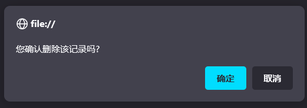
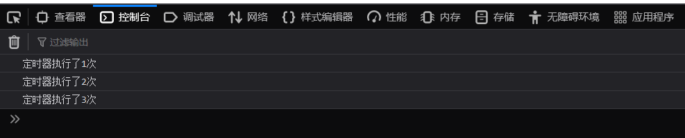

# BOM对象
<!-- more -->

BOM的全称是 Browser Object Model ，浏览器对象模型。  

JavaScript将浏览器的各个组成部分封装成了对象。我们要操作浏览器的部分功能，可以通过操作BOM对象的相关属性或者函数来完成。

BOM中提供了如下5个对象：

| 对象名称  | 描述           |
| :-------- | :------------- |
| ==Window==    | 浏览器窗口对象 |
| Navigator | 浏览器对象     |
| Screen    | 屏幕对象       |
| History   | 历史记录对象   |
| ==Location==  | 地址栏对象    |


## Window对象

window对象提供了获取其他BOM对象的属性：

| 属性      | 描述                  |
| --------- | --------------------- |
| history   | 用于获取history对象   |
| location  | 用于获取location对象  |
| Navigator | 用于获取Navigator对象 |
| Screen    | 用于获取Screen对象    |

window也提供了一些常用的函数，如下表格所示：

| 函数          | 描述                                               |
| ------------- | -------------------------------------------------- |
| alert()       | 显示带有一段消息和一个确认按钮的警告框。           |
| comfirm()     | 显示带有一段消息以及确认按钮和取消按钮的对话框。   |
| setInterval() | 按照指定的周期（以毫秒计）来调用函数或计算表达式。 |
| setTimeout()  | 在指定的毫秒数后调用函数或计算表达式。             |

- **confirm()函数**：弹出确认框，并且提供用户2个按钮，分别是确认和取消。

  ```js
  confirm("您确认删除该记录吗?");
  ```

  

- **setInterval(fn, 毫秒值)**：定时器，用于周期性的执行某个功能，并且是**循环执行**。  

::: note 需要传递2个参数

  fn: 函数，需要周期性执行的功能代码

  毫秒值：间隔时间
:::

  ```js
  //定时器 -- setInterval -- 周期性的执行某一个函数
  var i = 0;
  setInterval(function(){
       i++;
       console.log("定时器执行了"+i+"次");
  },2000);
  ```

  

- **setTimeout(fn, 毫秒值)** ：定时器，只会在一段时间后**执行一次功能**。

  ```js
  //定时器 - setTimeout -- 延迟指定时间执行一次 
  setTimeout(function(){
    alert("JS");
  },3000);
  ```

## Location对象

location是指代浏览器的地址栏对象  
我们常用的是href属性，用于获取或者设置浏览器的地址信息，添加如下代码：

```js
//获取浏览器地址栏信息
alert(location.href);
//设置浏览器地址栏信息
location.href = "https://www.itcast.cn";
```


