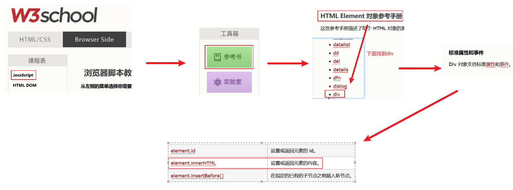
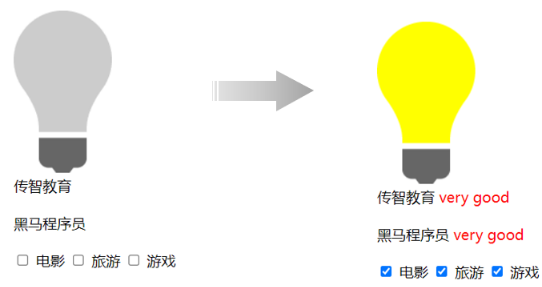

# DOM对象
<!-- more -->

DOM对象，JavaScript中将html的每一个标签都封装成一个对象

## DOM介绍

DOM：Document Object Model 文档对象模型。也就是 JavaScript 将 HTML 文档的各个组成部分封装为对象。

DOM 其实我们并不陌生，之前在学习 XML 就接触过，只不过 XML 文档中的标签需要我们写代码解析，而 HTML 文档是浏览器解析。

**封装的对象分为**:

- Document：整个文档对象
- Element：元素对象
- Attribute：属性对象
- Text：文本对象
- Comment：注释对象

如下图，左边是 HTML 文档内容，右边是 DOM 树


::: note  那么我们学习DOM技术有什么用呢？
主要作用如下：

- 改变 HTML 元素的内容
- 改变 HTML 元素的样式（CSS）
- 对 HTML DOM 事件作出反应
- 添加和删除 HTML 元素

**从而达到动态改变页面效果目的**

:::

## 获取DOM对象

- 如何获取DOM中的元素对象（Element对象 ，也就是标签）
- 如何操作Element对象的属性，也就是标签的属性。

HTML中的 Element 对象可以通过 Document 对象获取，而 Document 对象是通过 window 对象获取的。

| 函数                              | 描述                                     |
| --------------------------------- | ---------------------------------------- |
| document.getElementById()         | 根据id属性值获取，返回单个Element对象    |
| document.getElementsByTagName()   | 根据标签名称获取，返回Element对象数组    |
| document.getElementsByName()      | 根据name属性值获取，返回Element对象数组  |
| document.getElementsByClassName() | 根据class属性值获取，返回Element对象数组 |

```html
<!DOCTYPE html>
<html lang="en">
<head>
    <meta charset="UTF-8">
    <meta http-equiv="X-UA-Compatible" content="IE=edge">
    <meta name="viewport" content="width=device-width, initial-scale=1.0">
    <title>JS-对象-DOM</title>
</head>

<body>
      <br><br>

    <div class="cls">传智教育</div>   <br>
    <div class="cls">黑马程序员</div>  <br>

    <input type="checkbox" name="hobby"> 电影
    <input type="checkbox" name="hobby"> 旅游
    <input type="checkbox" name="hobby"> 游戏
</body>

</html>
```

- document.getElementById()： 根据标签的id属性获取标签对象，id是唯一的，所以获取到是单个标签对象。

  ```html
  <script>
  //1. 获取Element元素
  
  //1.1 获取元素-根据ID获取
   var img = document.getElementById('h1');
   alert(img);
  </script>
  ```

- document.getElementsByTagName() :  根据标签的名字获取标签对象，同名的标签有很多，所以返回值是数组。

  ```js
  //1.2 获取元素-根据标签获取 - div
  var divs = document.getElementsByTagName('div');
  for (let i = 0; i < divs.length; i++) {
       alert(divs[i]);
  }
  ```

- document.getElementsByName() ：根据标签的name的属性值获取标签对象，name属性值可以重复，所以返回值是一个数组。

  ```js
  //1.3 获取元素-根据name属性获取
  var ins = document.getElementsByName('hobby');
  for (let i = 0; i < ins.length; i++) {
      alert(ins[i]);
  }
  ```

  浏览器会有3次如下图所示的弹框：

    

- document.getElementsByClassName() : 根据标签的class属性值获取标签对象，class属性值也可以重复，返回值是数组。

  ```js
  //1.4 获取元素-根据class属性获取
  var divs = document.getElementsByClassName('cls');
  for (let i = 0; i < divs.length; i++) {
       alert(divs[i]);
  }
  ```

  浏览器会弹框2次，都是div标签对象

  

## 操作属性

  那么获取到标签了，我们如何操作标签的属性呢？通过查询文档资料，如下图所示：

  

  得出我们可以通过div标签对象的 **innerHTML** 属性来修改标签的内容。此时我们想把页面中的**传智教育替换成传智教育666**，所以要获取2个div中的第一个，所以可以通过下标0获取数组中的第一个div。

  ```js
  var divs = document.getElementsByClassName('cls');
  var div1 = divs[0];
  
  div1.innerHTML = "传智教育666";
  ```

## 案例

### 需求说明

通过案例来加强对于上述DOM知识的掌握。需求如下3个：

- 点亮灯泡
- 将所有的div标签的标签体内容后面加上：very good
- 使所有的复选框呈现被选中的状态

效果如下所示：



### 完整代码

```html
<!DOCTYPE html>
<html lang="en">
<head>
    <meta charset="UTF-8">
    <meta http-equiv="X-UA-Compatible" content="IE=edge">
    <meta name="viewport" content="width=device-width, initial-scale=1.0">
    <title>JS-对象-DOM-案例</title>
</head>

<body>
      <br><br>

    <div class="cls">传智教育</div>   <br>
    <div class="cls">黑马程序员</div>  <br>

    <input type="checkbox" name="hobby"> 电影
    <input type="checkbox" name="hobby"> 旅游
    <input type="checkbox" name="hobby"> 游戏
</body>

<script>
    //1. 点亮灯泡 : src 属性值
    var img = document.getElementById('h1');
    img.src = "img/on.gif";

    //2. 将所有div标签的内容后面加上: 
    //very good (红色字体) -- <font color='red'></font>
    var divs = document.getElementsByTagName('div');
    for (let i = 0; i < divs.length; i++) {
        const div = divs[i];
        div.innerHTML += "<font color='red'>very good</font>"; 
    }

    //3. 使所有的复选框呈现选中状态
    var ins = document.getElementsByName('hobby');
    for (let i = 0; i < ins.length; i++) {
        const check = ins[i];
        check.checked = true;//选中
    }
</script>
</html>
```
