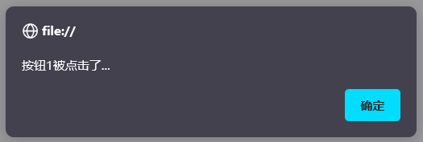

# 事件
<!-- more -->

## 事件介绍

- 事件绑定
- 常用事件

## 事件绑定

JavaScript对于事件的绑定提供了2种方式：

- 方式1：通过 **html标签** 中的事件属性进行绑定

  例如一个按钮，对于按钮可以绑定单机事件，可以借助标签的onclick属性，属性值指向一个函数。

  ```html
  <input type="button" id="btn1" value="事件绑定1" onclick="on()">
  ```

  ```html
  <script>
      function on(){
          alert("按钮1被点击了...");
      }
  </script>
  ```

  

- 方式2：通过 DOM 中 Element 元素的事件属性进行绑定

  html中的标签被加载成element对象，所以我们也可以通过element对象的属性来操作标签的属性。此时我们再次添加一个按钮，代码如下：

  ```html
  <input type="button" id="btn2" value="事件绑定2">
  ```

  我们可以先通过id属性获取按钮对象，然后操作对象的onclick属性来绑定事件，代码如下：

  ```js
  document.getElementById('btn2').onclick = function(){
      alert("按钮2被点击了...");
  }
  ```

  

  **需要注意的是：事件绑定的函数，只有在事件被触发时，函数才会被调用。**

  整体代码如下：

  ```html
  <!DOCTYPE html>
  <html lang="en">
  <head>
      <meta charset="UTF-8">
      <meta http-equiv="X-UA-Compatible" content="IE=edge">
      <meta name="viewport" content="width=device-width, initial-scale=1.0">
      <title>JS-事件-事件绑定</title>
  </head>
  
  <body>
      <input type="button" id="btn1" value="事件绑定1" onclick="on()">
      <input type="button" id="btn2" value="事件绑定2">
  </body>
  
  <script>
      function on(){
          alert("按钮1被点击了...");
      }
  
      document.getElementById('btn2').onclick = function(){
          alert("按钮2被点击了...");
      }
  
  </script>
  </html>
  ```

## 常见事件

| 事件属性名  | 说明                     |
| ----------- | ------------------------ |
| onclick     | 鼠标单击事件             |
| onblur      | 元素失去焦点             |
| onfocus     | 元素获得焦点             |
| onload      | 某个页面或图像被完成加载 |
| onsubmit    | 当表单提交时触发该事件   |
| onmouseover | 鼠标被移到某元素之上     |
| onmouseout  | 鼠标从某元素移开         |

## 案例

### 需求说明

1. 点击 “点亮”按钮 点亮灯泡，点击“熄灭”按钮 熄灭灯泡
2. 输入框鼠标聚焦后，展示小写；鼠标离焦后，展示大写。
3. 点击 “全选”按钮使所有的复选框呈现被选中的状态，点击 “反选”按钮使所有的复选框呈现取消勾选的状态。


### 完整代码

```html
<!DOCTYPE html>
<html lang="en">
<head>
    <meta charset="UTF-8">
    <meta http-equiv="X-UA-Compatible" content="IE=edge">
    <meta name="viewport" content="width=device-width, initial-scale=1.0">
    <title>JS-事件-案例</title>
</head>
<body>

     <br>

    <input type="button" value="点亮" onclick="on()"> 
    <input type="button"  value="熄灭" onclick="off()">
    
    <br> <br>
    <input type="text" id="name" value="ITCAST" onfocus="lower()" onblur="upper()">
    <br> <br>

    <input type="checkbox" name="hobby"> 电影
    <input type="checkbox" name="hobby"> 旅游
    <input type="checkbox" name="hobby"> 游戏
    <br>
    <input type="button" value="全选" onclick="checkAll()"> 
    <input type="button" value="反选" onclick="reverse()">
</body>
<script>
    //1. 点击 "点亮" 按钮, 点亮灯泡; 点击 "熄灭" 按钮, 熄灭灯泡; -- onclick
    function on(){
        //a. 获取img元素对象
        var img = document.getElementById("light");

        //b. 设置src属性
        img.src = "img/on.gif";
    }

    function off(){
        //a. 获取img元素对象
        var img = document.getElementById("light");

        //b. 设置src属性
        img.src = "img/off.gif";
    }

    //2. 输入框聚焦后, 展示小写; 输入框离焦后, 展示大写; -- onfocus , onblur
    function lower(){//小写
        //a. 获取输入框元素对象
        var input = document.getElementById("name");

        //b. 将值转为小写
        input.value = input.value.toLowerCase();
    }

    function upper(){//大写
        //a. 获取输入框元素对象
        var input = document.getElementById("name");

        //b. 将值转为大写
        input.value = input.value.toUpperCase();
    }

    //3. 点击 "全选" 按钮使所有的复选框呈现选中状态 ; 
    //  点击 "反选" 按钮使所有的复选框呈现取消勾选的状态 ; -- onclick
    function checkAll(){
        //a. 获取所有复选框元素对象
        var hobbys = document.getElementsByName("hobby");

        //b. 设置选中状态
        for (let i = 0; i < hobbys.length; i++) {
            const element = hobbys[i];
            element.checked = true;
        }
    }
    
    function reverse(){
        //a. 获取所有复选框元素对象
        var hobbys = document.getElementsByName("hobby");

        //b. 设置未选中状态
        for (let i = 0; i < hobbys.length; i++) {
            const element = hobbys[i];
            element.checked = false;
        }
    }

</script>
</html>
```
