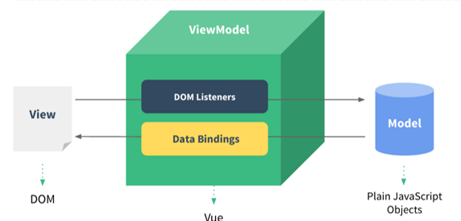

# Vue概述
<!-- more -->

## MVVM模式

**MVVM:  Model-View-ViewModel**:

- Model:  数据模型，指前端通过请求从后台获取的数据
- View:  视图，用于展示数据的页面，可以理解成html+css搭建的页面，但没有数据
- ViewModel:  数据绑定到视图，负责将数据（Model）通过 JavaScript 的 DOM 技术，将数据展示到视图（View）上

**MVVM开发思想的含义：**



::: tip 基于上述的 MVVM 思想
Model部分可以通过Ajax来发起请求从后台获取  
View部分，可以通过一款ElementUI框架来替代HTML+CSS来更加方便的搭建View  
ViewModel部分， vue 前端框架，用来替代JavaScript的DOM操作，让数据展示到视图的代码开发变得更加的简单
:::


Vue.js 的目标是通过尽可能简单的 API 实现**响应的数据绑定**和**组合的视图组件**。

## 示例

1. &lt;script&gt;标签引入vue.js文件

    ```html
    <script src="js/vue.js"></script>
    ```

2. 在js代码区域定义vue对象：

    ```html
    <script>
        //定义Vue对象
        new Vue({
            el: "#app", //vue接管区域
            data:{
                message: "Hello Vue"
            }
        })
    </script>
    ```

    ::: tip 创建vue对象时，几个常用的属性：

    - el:  用来指定哪些标签受 Vue 管理。 该属性取值 `#app` 中的 `app` 是受管理的标签的id属性值
    - data: 用来定义数据模型
    - methods: 用来定义函数。

    :::

3. 在html区域编写视图，其中{{}}是插值表达式，用来将vue对象中定义的model展示到页面上的

    ```html
    <body>
        <div id="app">
            <input type="text" v-model="message">
            {{message}}
        </div>
    </body>
    ```


整体代码如下：

```html
<!DOCTYPE html>
<html lang="en">
<head>
    <meta charset="UTF-8">
    <meta http-equiv="X-UA-Compatible" content="IE=edge">
    <meta name="viewport" content="width=device-width, initial-scale=1.0">
    <title>Vue-快速入门</title>
    <script src="js/vue.js"></script>
</head>
<body>

    <div id="app">
        <input type="text" v-model="message">
        {{message}}
    </div>

</body>
<script>
    //定义Vue对象
    new Vue({
        el: "#app", //vue接管区域
        data:{
            message: "Hello Vue"
        }
    })
</script>
</html>
```