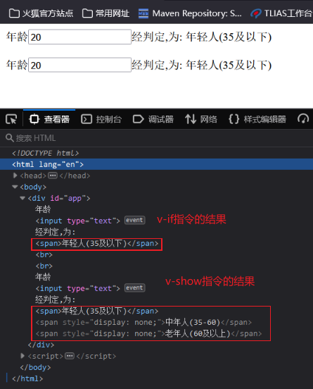
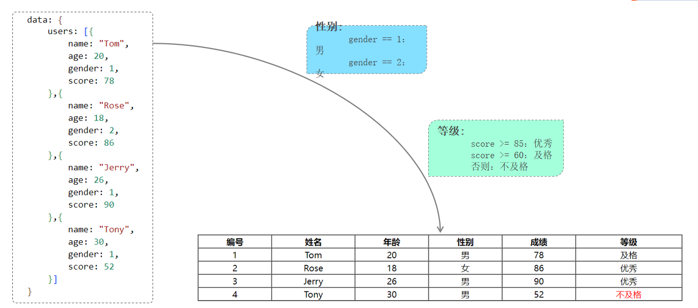

# Vue指令
<!-- more -->

**指令：** HTML 标签上带有 v- 前缀的特殊属性，不同指令具有不同含义。

| **指令**  | **作用**                                            |
| --------- | --------------------------------------------------- |
| v-bind    | 为HTML标签绑定属性值，如设置  href , css样式等      |
| v-model   | 在表单元素上创建双向数据绑定                        |
| v-on      | 为HTML标签绑定事件                                  |
| v-if      | 条件性的渲染某元素，判定为true时渲染,否则不渲染     |
| v-else    |                                                     |
| v-else-if |                                                     |
| v-show    | 根据条件展示某元素，区别在于切换的是display属性的值 |
| v-for     | 列表渲染，遍历容器的元素或者对象的属性              |

## v-bind和v-model

| **指令** | **作用**                                       |
| -------- | ---------------------------------------------- |
| v-bind   | 为HTML标签绑定属性值，如设置  href , css样式等 |
| v-model  | 在表单元素上创建双向数据绑定                   |

### v-bind

为 HTML 标签绑定属性值，如设置  href , css 样式等。  
当 vue 对象中的数据模型发生变化时，标签的属性值会随之发生变化。

```html
<!DOCTYPE html>
<html lang="en">
<head>
    <meta charset="UTF-8">
    <meta http-equiv="X-UA-Compatible" content="IE=edge">
    <meta name="viewport" content="width=device-width, initial-scale=1.0">
    <title>Vue-指令-v-bind</title>
    <script src="js/vue.js"></script>
</head>
<body>
    <div id="app">

        <a >链接1</a>
        <a >链接2</a>

        <input type="text" >

    </div>
</body>
<script>
    //定义Vue对象
    new Vue({
        el: "#app", //vue接管区域
        data:{
            url: "https://www.baidu.com"
        }
    })
</script>
</html>
```

```html
<a v-bind:href="url">链接1</a>
```

v-bind指令可省略，但是 `:` 不能省略

```html
<a :href="url">链接2</a>
```


### v-model

在表单元素上创建双向数据绑定。什么是双向？

- vue 对象的 `data` 属性中的数据变化，视图展示会一起变化
- 视图数据发生变化，vue对象的 `data` 属性中的数据也会随着变化。

**只有表单项标签！所以双向绑定一定是使在表单项标签上的**。

```html
<input type="text" v-model="url">
```


双向绑定的作用：**可以获取表单的数据的值，然后提交给服务器**

::: details 完整代码

```html
<!DOCTYPE html>
<html lang="en">
<head>
    <meta charset="UTF-8">
    <meta http-equiv="X-UA-Compatible" content="IE=edge">
    <meta name="viewport" content="width=device-width, initial-scale=1.0">
    <title>Vue-指令-v-bind</title>
    <script src="js/vue.js"></script>
</head>
<body>
    <div id="app">

        <a v-bind:href="url">链接1</a>
        <a :href="url">链接2</a>

        <input type="text" v-model="url">

    </div>
</body>
<script>
    //定义Vue对象
    new Vue({
        el: "#app", //vue接管区域
        data:{
           url: "https://www.baidu.com"
        }
    })
</script>
</html>
```

:::

## v-on

v-on: 用来给html标签绑定事件的。**需要注意的是如下2点**：

- v-on 语法给标签的事件绑定的函数，必须是 vue 对象中声明的函数

- v-on 语法绑定事件时，事件名相比较 `js` 中的事件名，没有 `on`

js 中，事件绑定demo函数

```html
<input onclick="demo()">
```

vue 中，事件绑定demo函数

```html
<input v-on:click="demo()">
```

```html
<!DOCTYPE html>
<html lang="en">
<head>
    <meta charset="UTF-8">
    <meta http-equiv="X-UA-Compatible" content="IE=edge">
    <meta name="viewport" content="width=device-width, initial-scale=1.0">
    <title>Vue-指令-v-on</title>
    <script src="js/vue.js"></script>
</head>
<body>
    <div id="app">

        <input type="button" value="点我一下">
        <input type="button" value="点我一下">

    </div>
</body>
<script>
    //定义Vue对象
    new Vue({
        el: "#app", //vue接管区域
        data:{
           
        },
        methods: {
           
        }
    })
</script>
</html>
```

```js
 methods: {
        handle: function(){
           alert("你点我了一下...");
        }
}
```

给第一个按钮，通过v-on指令绑定单击事件，代码如下：

```html
 <input type="button" value="点我一下" v-on:click="handle()">
```

v-on也存在简写方式，即 `v-on`: 可以替换成 `@`

```html
<input type="button" value="点我一下" @click="handle()">
```

::: details 完整代码

```html
<!DOCTYPE html>
<html lang="en">
<head>
    <meta charset="UTF-8">
    <meta http-equiv="X-UA-Compatible" content="IE=edge">
    <meta name="viewport" content="width=device-width, initial-scale=1.0">
    <title>Vue-指令-v-on</title>
    <script src="js/vue.js"></script>
</head>
<body>
    <div id="app">

        <input type="button" value="点我一下" v-on:click="handle()">

        <input type="button" value="点我一下" @click="handle()">

    </div>
</body>
<script>
    //定义Vue对象
    new Vue({
        el: "#app", //vue接管区域
        data:{
           
        },
        methods: {
            handle: function(){
                alert("你点我了一下...");
            }
        }
    })
</script>
</html>
```

:::

## v-if和v-show

| 指令      | 描述                                                |
| --------- | --------------------------------------------------- |
| v-if      | 条件性的渲染某元素，判定为true时渲染,否则不渲染     |
| v-if-else |                                                     |
| v-else    |                                                     |
| v-show    | 根据条件展示某元素，区别在于切换的是display属性的值 |

```html
<!DOCTYPE html>
<html lang="en">
<head>
    <meta charset="UTF-8">
    <meta http-equiv="X-UA-Compatible" content="IE=edge">
    <meta name="viewport" content="width=device-width, initial-scale=1.0">
    <title>Vue-指令-v-if与v-show</title>
    <script src="js/vue.js"></script>
</head>
<body>
    <div id="app">
        
        年龄<input type="text" v-model="age">经判定,为:
        <span>年轻人(35及以下)</span>
        <span>中年人(35-60)</span>
        <span>老年人(60及以上)</span>

    </div>
</body>
<script>
    //定义Vue对象
    new Vue({
        el: "#app", //vue接管区域
        data:{
           age: 20
        },
        methods: {
            
        }
    })
</script>
</html>
```

```html
年龄<input type="text" v-model="age">经判定,为:
<span v-if="age <= 35">年轻人(35及以下)</span>
<span v-else-if="age > 35 && age < 60">中年人(35-60)</span>
<span v-else>老年人(60及以上)</span>
```


v-show和v-if的作用效果是一样的，只是原理不一样。

```html
年龄<input type="text" v-model="age">经判定,为:
<span v-show="age <= 35">年轻人(35及以下)</span>
<span v-show="age > 35 && age < 60">中年人(35-60)</span>
<span v-show="age >= 60">老年人(60及以上)</span>
```



::: details 完整代码

```html
<!DOCTYPE html>
<html lang="en">
<head>
    <meta charset="UTF-8">
    <meta http-equiv="X-UA-Compatible" content="IE=edge">
    <meta name="viewport" content="width=device-width, initial-scale=1.0">
    <title>Vue-指令-v-if与v-show</title>
    <script src="js/vue.js"></script>
</head>
<body>
    <div id="app">
        
        年龄<input type="text" v-model="age">经判定,为:
        <span v-if="age <= 35">年轻人(35及以下)</span>
        <span v-else-if="age > 35 && age < 60">中年人(35-60)</span>
        <span v-else>老年人(60及以上)</span>

        <br><br>

        年龄<input type="text" v-model="age">经判定,为:
        <span v-show="age <= 35">年轻人(35及以下)</span>
        <span v-show="age > 35 && age < 60">中年人(35-60)</span>
        <span v-show="age >= 60">老年人(60及以上)</span>

    </div>
</body>
<script>
    //定义Vue对象
    new Vue({
        el: "#app", //vue接管区域
        data:{
           age: 20
        },
        methods: {
            
        }
    })
</script>
</html>
```

:::

## v-for

```html
<标签 v-for="变量名 in 集合模型数据">
    {{变量名}}
</标签>
```

值得注意的是：需要循环那个标签，v-for 指令就写在那个标签上。

有时我们遍历时需要使用索引，那么 v-for 指令遍历的语法格式如下：

```html
<标签 v-for="(变量名,索引变量) in 集合模型数据">
    <!--索引变量是从0开始，所以要表示序号的话，需要手动的加1-->
   {{索引变量 + 1}} {{变量名}}
</标签>
```

```html
<!DOCTYPE html>
<html lang="en">
<head>
    <meta charset="UTF-8">
    <meta http-equiv="X-UA-Compatible" content="IE=edge">
    <meta name="viewport" content="width=device-width, initial-scale=1.0">
    <title>Vue-指令-v-for</title>
    <script src="js/vue.js"></script>
</head>
<body>
    <div id="app">

    </div>
</body>
<script>
    //定义Vue对象
    new Vue({
        el: "#app", //vue接管区域
        data:{
           addrs:["北京", "上海", "西安", "成都", "深圳"]
        },
        methods: {
            
        }
    })
</script>
</html>
```

```html
 <div id="app">
     <div v-for="addr in addrs">{{addr}}</div>
     <hr>
     <div v-for="(addr,index) in addrs">{{index + 1}} : {{addr}}</div>
</div>
```


## 综合案例

需求：



将数据以表格的形式，展示到页面上，其中，性别需要转换成中文男女，等级需要将分数数值转换成对应的等级。

分析：

- 首先我们肯定需要遍历数组的，所以需要使用v-for标签  
- 然后我们每一条数据对应一行，所以v-for需要添加在 tr 标签上  
- 其次我们需要将编号，所以需要使用索引的遍历语法  
- 然后我们要将数据展示到表格的单元格中，所以我们需要使用`{{}}插值表达式 ` 
- 最后，我们需要转换内容，所以我们需要使用v-if指令，进行条件判断和内容的转换

 步骤：

- 使用v-for的带索引方式添加到表格的&lt;tr&gt;标签上
- 使用`{{ }}插值表达式`展示内容到单元格
- 使用索引+1来作为编号
- 使用v-if来判断，改变性别和等级这俩列的值

```html
<!DOCTYPE html>
<html lang="en">
<head>
    <meta charset="UTF-8">
    <meta http-equiv="X-UA-Compatible" content="IE=edge">
    <meta name="viewport" content="width=device-width, initial-scale=1.0">
    <title>Vue-指令-案例</title>
    <script src="js/vue.js"></script>
</head>
<body>
    
    <div id="app">
        
        <table border="1" cellspacing="0" width="60%">
            <tr>
                <th>编号</th>
                <th>姓名</th>
                <th>年龄</th>
                <th>性别</th>
                <th>成绩</th>
                <th>等级</th>
            </tr>
        </table>

    </div>

</body>

<script>
    new Vue({
        el: "#app",
        data: {
            users: [{
                name: "Tom",
                age: 20,
                gender: 1,
                score: 78
            },{
                name: "Rose",
                age: 18,
                gender: 2,
                score: 86
            },{
                name: "Jerry",
                age: 26,
                gender: 1,
                score: 90
            },{
                name: "Tony",
                age: 30,
                gender: 1,
                score: 52
            }]
        },
        methods: {
            
        },
    })
</script>
</html>
```

  然后在&lt;tr&gt;上添加 `v-for` 进行遍历，以及通过 `插值表达式{{ }}` 和 `v-if` 指令来填充内容和改变内容，其代码如下：

```html
 <tr align="center" v-for="(user,index) in users">
     <td>{{index + 1}}</td>
     <td>{{user.name}}</td>
     <td>{{user.age}}</td>
     <td>
         <span v-if="user.gender == 1">男</span>
         <span v-if="user.gender == 2">女</span>
     </td>
     <td>{{user.score}}</td>
     <td>
         <span v-if="user.score >= 85">优秀</span>
         <span v-else-if="user.score >= 60">及格</span>
         <span style="color: red;" v-else>不及格</span>
     </td>
</tr>
```

::: details 完整代码

```html
<!DOCTYPE html>
<html lang="en">
<head>
    <meta charset="UTF-8">
    <meta http-equiv="X-UA-Compatible" content="IE=edge">
    <meta name="viewport" content="width=device-width, initial-scale=1.0">
    <title>Vue-指令-案例</title>
    <script src="js/vue.js"></script>
</head>
<body>
    
    <div id="app">
        
        <table border="1" cellspacing="0" width="60%">
            <tr>
                <th>编号</th>
                <th>姓名</th>
                <th>年龄</th>
                <th>性别</th>
                <th>成绩</th>
                <th>等级</th>
            </tr>

            <tr align="center" v-for="(user,index) in users">
                <td>{{index + 1}}</td>
                <td>{{user.name}}</td>
                <td>{{user.age}}</td>
                <td>
                    <span v-if="user.gender == 1">男</span>
                    <span v-if="user.gender == 2">女</span>
                </td>
                <td>{{user.score}}</td>
                <td>
                    <span v-if="user.score >= 85">优秀</span>
                    <span v-else-if="user.score >= 60">及格</span>
                    <span style="color: red;" v-else>不及格</span>
                </td>
            </tr>
        </table>

    </div>

</body>

<script>
    new Vue({
        el: "#app",
        data: {
            users: [{
                name: "Tom",
                age: 20,
                gender: 1,
                score: 78
            },{
                name: "Rose",
                age: 18,
                gender: 2,
                score: 86
            },{
                name: "Jerry",
                age: 26,
                gender: 1,
                score: 90
            },{
                name: "Tony",
                age: 30,
                gender: 1,
                score: 52
            }]
        },
        methods: {
            
        },
    })
</script>
</html>
```

:::
