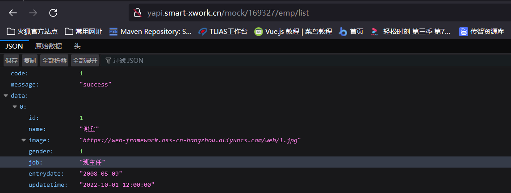
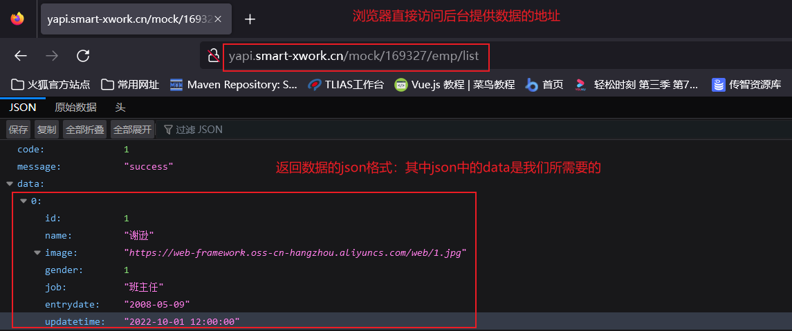

# AJAX
<!-- more -->

Ajax: Asynchronous JavaScript And XML，异步的 JavaScript 和 XML 。  

其作用有如下2点：

- 与服务器进行数据交换：通过Ajax可以给服务器发送请求，并获取服务器响应的数据。
- 异步交互：可以在**不重新加载整个页面**的情况下，与服务器交换数据并**更新部分网页**的技术，如：搜索联想、用户名是否可用的校验等等。

## 同步异步

Ajax 的局部刷新功能是是异步的，与之对应的有同步请求。

- 同步请求：

  

  浏览器页面在发送请求给服务器，在服务器处理请求的过程中，浏览器页面不能做其他的操作。只能等到服务器响应结束后才能，浏览器页面才能继续做其他的操作。

- 异步请求：

  

  浏览器页面发送请求给服务器，在服务器处理请求的过程中，浏览器页面还可以做其他的操作。

## 原生Ajax

Ajax请求是基于客户端发送请求，服务器响应数据的技术。

**服务器端**: [后台服务器地址](http://yapi.smart-xwork.cn/mock/169327/emp/list)



**客户端**:

  第一步：按钮绑定单击事件，点击按钮，发送ajax请求

  ```html
  <!DOCTYPE html>
  <html lang="en">
  <head>
      <meta charset="UTF-8">
      <meta http-equiv="X-UA-Compatible" content="IE=edge">
      <meta name="viewport" content="width=device-width, initial-scale=1.0">
      <title>原生Ajax</title>
  </head>
  <body>
      
      <input type="button" value="获取数据" onclick="getData()">
  
      <div id="div1"></div>
      
  </body>
  <script>
      function getData(){
       
      }
  </script>
  </html>
  ```

  第二步：创建 `XMLHttpRequest` 对象，用于和服务器交换数据，也是原生Ajax请求的核心对象

  ```js
  //1. 创建XMLHttpRequest 
  var xmlHttpRequest  = new XMLHttpRequest();
  ```

  第三步：调用对象的 `open()` 方法设置请求的参数信息，例如请求地址，请求方式。然后调用 `send()` 方法向服务器发送请求

  ```js
  //2. 发送异步请求
  xmlHttpRequest.open('GET','http://yapi.smart-xwork.cn/mock/169327/emp/list');
  xmlHttpRequest.send();//发送请求
  ```

  第四步：通过绑定事件的方式，来获取服务器响应的数据。

  ```js
  //3. 获取服务响应数据
  xmlHttpRequest.onreadystatechange = function(){
      //此处判断 4表示浏览器已经完全接受到Ajax请求得到的响应， 200表示这是一个正确的Http请求，没有错误
      if(xmlHttpRequest.readyState == 4 && xmlHttpRequest.status == 200){
          document.getElementById('div1').innerHTML = xmlHttpRequest.responseText;
      }
  }
  ```

  

  并且通过浏览器的F12抓包，点击网络中的 XHR 请求，可以抓包到我们发送的 Ajax 请求。 XHR 代表的就是异步请求

## Axios

[Axios](https://www.axios-http.cn)是对原生的 AJAX 进行封装，简化书写。

### Axios的基本使用

Axios的使用比较简单，主要分为2步：

1. 引入Axios文件

   ```html
   <script src="js/axios-0.18.0.js"></script>
   ```

2. 使用Axios发送请求，并获取响应结果

   发送 get 请求

   ```js
   axios({
       method:"get",
       url:"http://localhost:8080/ajax-demo1/aJAXDemo1?username=zhangsan"
   }).then(function (resp){
       alert(resp.data);
   })
   ```

   发送 post 请求

    ```js
    axios({
        method:"post",
        url:"http://localhost:8080/ajax-demo1/aJAXDemo1",
        data:"username=zhangsan"
    }).then(function (resp){
        alert(resp.data);
    });
    ```

axios()是用来发送异步请求的，小括号中使用 js 的JSON对象传递请求相关的参数：

- method属性：用来设置请求方式的。取值为 get 或者 post。
- url属性：用来书写请求的资源路径。
- data属性：作为请求体被发送的数据。如果是 post 请求的话，数据需要作为 data 属性的值。

then() 需要传递一个匿名函数。我们将 then()中传递的匿名函数称为 **回调函数**，意思是该匿名函数在发送请求时不会被调用，而是在成功响应后调用的函数。该回调函数中的 resp 参数是对响应的数据进行封装的对象，通过 `resp.data` 可以获取到响应的数据。

### Axios快速入门

**后端实现**

查询所有员工：[http://yapi.smart-xwork.cn/mock/169327/emp/list](http://yapi.smart-xwork.cn/mock/169327/emp/list)

根据员工id删除员工：[http://yapi.smart-xwork.cn/mock/169327/emp/deleteById](http://yapi.smart-xwork.cn/mock/169327/emp/deleteById)

**前端实现**

在html中引入axios所依赖的js文件，并且提供2个按钮，绑定单击事件，分别用于点击时发送ajax请求

```html
<!DOCTYPE html>
<html lang="en">
<head>
    <meta charset="UTF-8">
    <meta http-equiv="X-UA-Compatible" content="IE=edge">
    <meta name="viewport" content="width=device-width, initial-scale=1.0">
    <title>Ajax-Axios</title>
    <script src="js/axios-0.18.0.js"></script>
</head>
<body>
    
    <input type="button" value="获取数据GET" onclick="get()">

    <input type="button" value="删除数据POST" onclick="post()">

</body>
<script>
    function get(){
        //通过axios发送异步请求-get
    }

    function post(){
        //通过axios发送异步请求-post
    }
</script>
</html>
```

get请求代码如下：

```js
//通过axios发送异步请求-get
 axios({
     method: "get",
     url: "http://yapi.smart-xwork.cn/mock/169327/emp/list"
 }).then(result => {
     console.log(result.data);
 })
```

post请求代码如下：

```js
//通过axios发送异步请求-post
 axios({
     method: "post",
     url: "http://yapi.smart-xwork.cn/mock/169327/empdeleteById",
     data: "id=1"
 }).then(result => {
     console.log(result.data);
 })
```

浏览器打开，f12抓包，然后分别点击2个按钮，查看控制台效果如下：


::: details 完整代码

```html
<!DOCTYPE html>
<html lang="en">
<head>
    <meta charset="UTF-8">
    <meta http-equiv="X-UA-Compatible" content="IE=edge">
    <meta name="viewport" content="width=device-width, initial-scale=1.0">
    <title>Ajax-Axios</title>
    <script src="js/axios-0.18.0.js"></script>
</head>
<body>
    
    <input type="button" value="获取数据GET" onclick="get()">

    <input type="button" value="删除数据POST" onclick="post()">

</body>
<script>
    function get(){
        //通过axios发送异步请求-get
        axios({
            method: "get",
            url: "http://yapi.smart-xwork.cn/mock/169327/emp/list"
        }).then(result => {
            console.log(result.data);
        })


    }

    function post(){
       // 通过axios发送异步请求-post
        axios({
            method: "post",
            url: "http://yapi.smart-xwork.cn/mock/169327/emp/deleteById",
            data: "id=1"
        }).then(result => {
            console.log(result.data);
        })

    }
</script>
</html>
```

:::

### 请求方法的别名

Axios还针对不同的请求，提供了别名方式的api

| 方法                               | 描述           |
| ---------------------------------- | -------------- |
| axios.get(url [, config])          | 发送get请求    |
| axios.delete(url [, config])       | 发送delete请求 |
| axios.post(url [, data[, config]]) | 发送post请求   |
| axios.put(url [, data[, config]])  | 发送put请求    |

get请求改写成如下：

```js
axios.get("http://yapi.smart-xwork.cn/mock/169327/emp/list").then(result => {
    console.log(result.data);
})
```

post请求改写成如下：

```js
axios.post("http://yapi.smart-xwork.cn/mock/169327/emp/deleteById","id=1").then(result => {
    console.log(result.data);
})
```

### 案例

需求：基于 Vue 及 Axios 完成数据的动态加载展示


数据地址是：[http://yapi.smart-xwork.cn/mock/169327/emp/list](http://yapi.smart-xwork.cn/mock/169327/emp/list)

步骤：

1. 首先创建文件，提前准备基础代码，包括表格以及vue.js, axios.js文件的引入
2. 需要在vue的mounted钩子函数中发送ajax请求，获取数据
3. 拿到数据，数据需要绑定给vue的 `data` 属性
4. 在 &lt;tr&gt; 标签上通过 v-for 指令遍历数据，展示数据

代码实现：

1. 首先创建文件，提前准备基础代码，包括表格以及vue.js和axios.js文件的引入

    ```html
    <!DOCTYPE html>
    <html lang="en">
    <head>
        <meta charset="UTF-8">
        <meta http-equiv="X-UA-Compatible" content="IE=edge">
        <meta name="viewport" content="width=device-width, initial-scale=1.0">
        <title>Ajax-Axios-案例</title>
        <script src="js/axios-0.18.0.js"></script>
        <script src="js/vue.js"></script>
    </head>
    <body>
        <div id="app">
            <table border="1" cellspacing="0" width="60%">
                <tr>
                    <th>编号</th>
                    <th>姓名</th>
                    <th>图像</th>
                    <th>性别</th>
                    <th>职位</th>
                    <th>入职日期</th>
                    <th>最后操作时间</th>
                </tr>

                <tr align="center" >
                    <td>1</td>
                    <td>Tom</td>
                    <td>
                        
                    </td>
                    <td>
                        <span>男</span>
                      <!-- <span>女</span>-->
                    </td>
                    <td>班主任</td>
                    <td>2009-08-09</td>
                    <td>2009-08-09 12:00:00</td>
                </tr>
            </table>
        </div>
    </body>
    <script>
        new Vue({
          el: "#app",
          data: {
            
          }
        });
    </script>
    </html>
    ```

2. 在 vue 的 mounted 钩子函数，编写Ajax请求，请求数据

     ```js
     mounted () {
         //发送异步请求,加载数据
         axios.get("http://yapi.smart-xwork.cn/mock/169327/emp/list").then(result => {
             
         })
     }
     ```

3. ajax 请求的数据绑定给 vue 的 data 属性，之后才能进行数据绑定到视图；并且浏览器打开后台地址，数据返回格式：

     

     服务器响应的json中的data属性才是我们需要展示的信息，所以我们应该将员工列表信息赋值给vue的data属性，代码如下：

     ```js
      //发送异步请求,加载数据
     axios.get("http://yapi.smart-xwork.cn/mock/169327/emp/list").then(result => {
         this.emps = result.data.data;
     })
     ```

     其中，data中emps变量

     ```js
     data: {
         emps:[]
     },
     ```

4. 在&lt;tr&gt;标签上通过v-for指令遍历数据，展示数据，其中需要注意的是图片的值，需要使用vue的属性绑定，男女的展示需要使用条件判断

     ```html
     <tr align="center" v-for="(emp,index) in emps">
         <td>{{index + 1}}</td>
         <td>{{emp.name}}</td>
         <td>
             
         </td>
         <td>
             <span v-if="emp.gender == 1">男</span>
             <span v-if="emp.gender == 2">女</span>
         </td>
         <td>{{emp.job}}</td>
         <td>{{emp.entrydate}}</td>
         <td>{{emp.updatetime}}</td>
     </tr>
     ```

::: details 完整代码

```html
<!DOCTYPE html>
<html lang="en">
<head>
    <meta charset="UTF-8">
    <meta http-equiv="X-UA-Compatible" content="IE=edge">
    <meta name="viewport" content="width=device-width, initial-scale=1.0">
    <title>Ajax-Axios-案例</title>
    <script src="js/axios-0.18.0.js"></script>
    <script src="js/vue.js"></script>
</head>
<body>
    <div id="app">
        <table border="1" cellspacing="0" width="60%">
            <tr>
                <th>编号</th>
                <th>姓名</th>
                <th>图像</th>
                <th>性别</th>
                <th>职位</th>
                <th>入职日期</th>
                <th>最后操作时间</th>
            </tr>

            <tr align="center" v-for="(emp,index) in emps">
                <td>{{index + 1}}</td>
                <td>{{emp.name}}</td>
                <td>
                    
                </td>
                <td>
                    <span v-if="emp.gender == 1">男</span>
                    <span v-if="emp.gender == 2">女</span>
                </td>
                <td>{{emp.job}}</td>
                <td>{{emp.entrydate}}</td>
                <td>{{emp.updatetime}}</td>
            </tr>
        </table>
    </div>
</body>
<script>
    new Vue({
       el: "#app",
       data: {
         emps:[]
       },
       mounted () {
          //发送异步请求,加载数据
          axios.get("http://yapi.smart-xwork.cn/mock/169327/emp/list").then(result => {
            console.log(result.data);
            this.emps = result.data.data;
          })
       }
    });
</script>
</html>
```

:::
