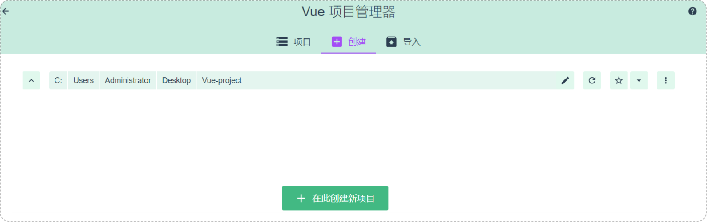
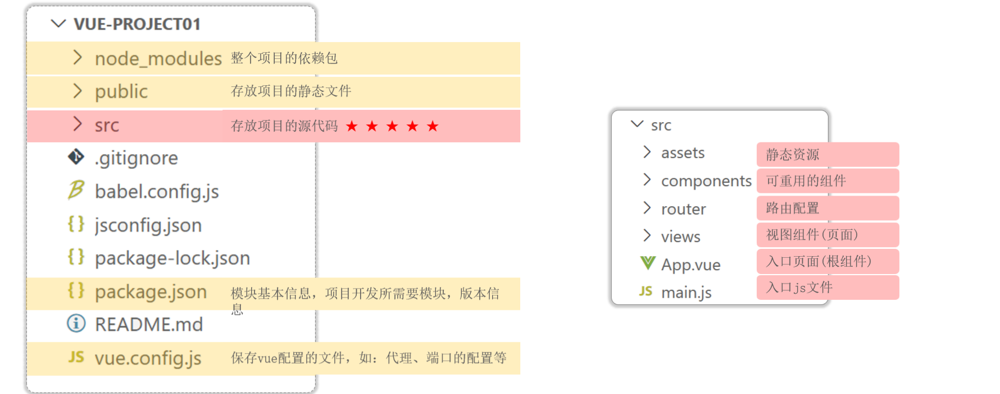

# Vue-cli脚手架
<!-- more -->

## 前后台分离开发介绍


1. 需求分析：首先我们需要阅读需求文档，分析需求，理解需求。
2. 接口定义：查询接口文档中关于需求的接口的定义，包括地址，参数，响应数据类型等等
3. 前后台并行开发：各自按照接口文档进行开发，实现需求
4. 测试：前后台开发完了，各自按照接口文档进行测试
5. 前后端联调测试：前端工程请求后端工程，测试功能

## 前端工程化介绍

- 模块化：将js和css等，做成一个个可复用模块
- 组件化：将UI组件，css样式，js行为封装成一个个的组件，便于管理
- 规范化：提供一套标准的规范的目录接口和编码规范，所有开发人员遵循这套规范
- 自动化：项目的构建，测试，部署全部都是自动完成

## 前端工程化入门

### 1 环境准备

前端工程化是通过vue官方提供的脚手架 `Vue-cli` 来完成的，用于快速的生成一个Vue的项目模板。

::: note Vue-cli主要提供了如下功能

统一的目录结构  
本地调试  
热部署  
单元测试  
集成打包上线  

:::

### 2 Vue项目简介

Vue-cli提供了如下俩种方式创建vue项目:

- 命令行：

``` vue
vue create vue-project01
```

- 图形化界面：
  
 ``` vue
 vue ui
 ```



### 3 vue项目目录结构介绍



平时开发代码就是在**src目录**下

### 4 Vue项目开发流程

- template: 模板部分，主要是HTML代码，用来展示页面主体结构的
- script: js代码区域，主要是通过js代码来控制模板的数据来源和行为的
- style: css样式部分，主要通过css样式控制模板的页面效果


