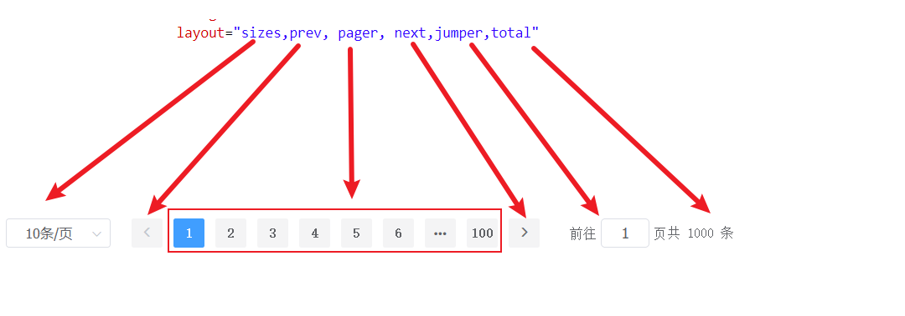
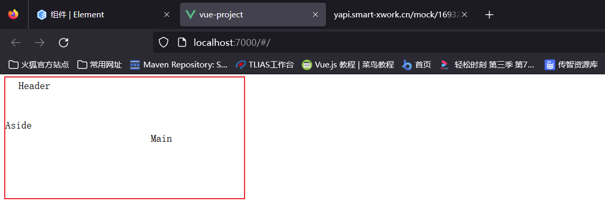
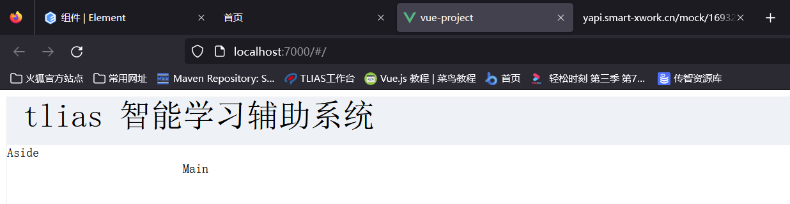
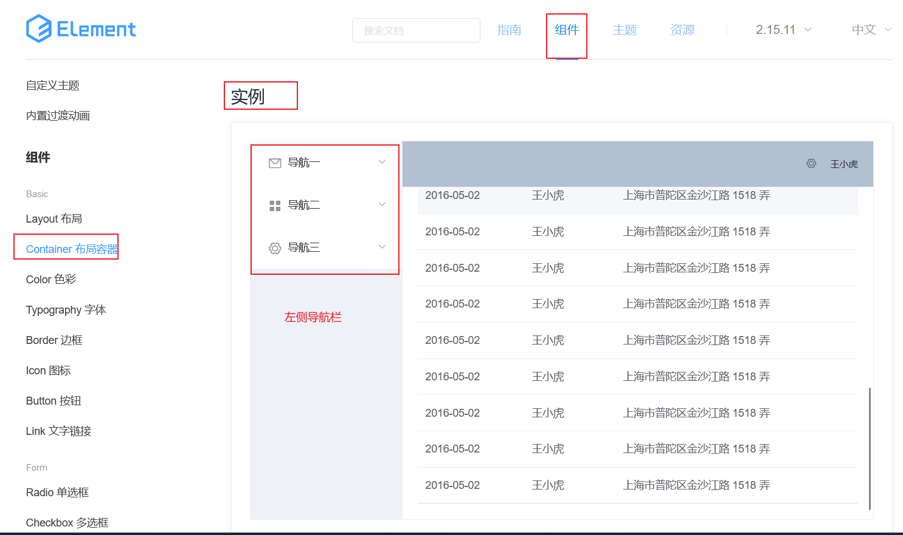
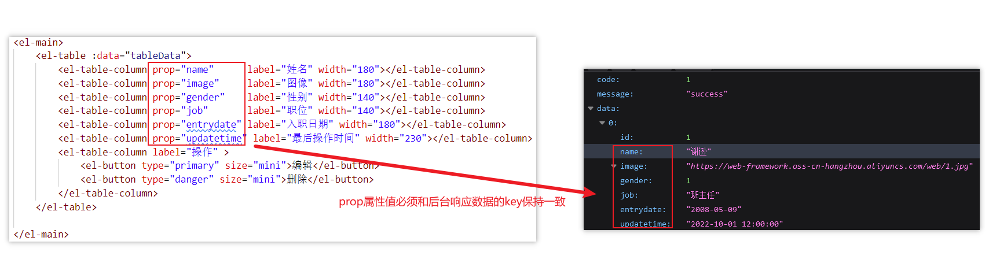

# Element-UI
<!-- more -->

## Element介绍

[Element-UI](https://element.eleme.cn/#/zh-CN)就是一款侧重于 `V` 开发的前端框架，主要用于开发美观的页面。

## 组件属性详解

ElementUI是如何将数据模型绑定到视图的呢？主要通过如下几个属性：

`data`: 定义table组件的数据模型  
`prop`: data中定义的具体的数据模型  
`label`: 定义列的标题  
`width`: 定义列的宽度  


**PS**: Element组件的所有属性都可以在组件页面的最下方找到

### Pagination分页

- layout: 分页工具条的布局，其具体值包含`sizes`, `prev`, `pager`, `next`, `jumper`, `->`, `total`, `slot` 这些值
- total: 数据的总数量

```js
 layout="sizes, prev, pager, next, jumper, total"
```



### 组件事件详解

对于分页组件，除了上述几个属性，还有2个非常重要的事件

- size-change ： pageSize 改变时会触发 每页条数
- current-change ：currentPage 改变时会触发 当前页


此时Panigation组件的template完整代码如下：

```html
<!-- Pagination分页 -->
<el-pagination
               @size-change="handleSizeChange"
               @current-change="handleCurrentChange"
               background
               layout="sizes,prev, pager, next,jumper,total"
               :total="1000">
</el-pagination>
```

此时Panigation组件的script部分完整代码如下：

```html
<script>
export default {
    methods: {
      handleSizeChange(val) {
        console.log(`每页 ${val} 条`);
      },
      handleCurrentChange(val) {
        console.log(`当前页: ${val}`);
      }
    },
     data() {
        return {
          tableData: [{
            date: '2016-05-02',
            name: '王小虎',
            address: '上海市普陀区金沙江路 1518 弄'
          }, {
            date: '2016-05-04',
            name: '王小虎',
            address: '上海市普陀区金沙江路 1517 弄'
          }, {
            date: '2016-05-01',
            name: '王小虎',
            address: '上海市普陀区金沙江路 1519 弄'
          }, {
            date: '2016-05-03',
            name: '王小虎',
            address: '上海市普陀区金沙江路 1516 弄'
          }]
        }
      }
}
</script>
```

f12打开开发者控制台，然后切换当前页码和切换每页显示的数量，呈现如下效果：


## 案例

### 案例需求

1. 制作类似格式的页面

   即上面是标题，左侧栏是导航，右侧是数据展示区域

2. 右侧需要展示搜索表单

3. 右侧表格数据是动态展示的，数据来自于后台


数据Mock地址：[http://yapi.smart-xwork.cn/mock/169327/emp/list](http://yapi.smart-xwork.cn/mock/169327/emp/list)


### 案例分析

先整体，后局部细节。整个页面可以分为3个部分


:::note 主要步骤如下：

1. 创建页面，完成页面的整体布局规划
2. 然后分别针对3个部分进行各自组件的具体实现
3. 针对于右侧核心内容展示区域，需要使用异步加载数据，以表格渲染数据

:::

### 代码实现

#### 1 环境搭建

App.vue完整代码如下：

```html
<template>
  <div id="app">
    <emp-view></emp-view>
  </div>
</template>

<script>
import EmpView  './views/tlias/EmpView.vue'
export default {
  components: {EmpView },
  data(){
    return {
      "message":"hello world"
    }
  }
}
</script>
<style>

</style>
```

#### 2 整体布局


```html
<el-container>
    <el-header>Header</el-header>
    <el-container>
        <el-aside width="200px">Aside</el-aside>
        <el-main>Main</el-main>
    </el-container>
</el-container>
```



```html
<!-- 设置最外层容器高度为700px,在加上一个很细的边框 -->
<el-container style="height: 700px; border: 1px solid #eee">
```

#### 3 顶部标题

修改顶部的文本内容，并且提供背景色的css样式：

```html
<el-header style="font-size:40px;background-color: rgb(238, 241, 246)">
tlias 智能学习辅助系统</el-header>
```



::: details 完整代码

```html
<template>
    <div>
        <!-- 设置最外层容器高度为700px,在加上一个很细的边框 -->
        <el-container style="height: 700px; border: 1px solid #eee">
            <el-header style="font-size:40px;background-color: rgb(238, 241, 246)">tlias 智能学习辅助系统</el-header>
            <el-container>
                <el-aside width="200px">Aside</el-aside>
                <el-main>Main</el-main>
            </el-container>
        </el-container>
    </div>
</template>

<script>
export default {
    
}
</script>

<style>

</style>

```

:::

#### 4 左侧导航栏



```html
<el-menu :default-openeds="['1', '3']">
    <el-submenu index="1">
        <template slot="title"><i class="el-icon-message"></i>导航一</template>

        <el-menu-item index="1-1">选项1</el-menu-item>
        <el-menu-item index="1-2">选项2</el-menu-item>


    </el-submenu>
</el-menu>
```

删减前后对比图：


::: details 完整代码

```html
<template>
    <div>
        <!-- 设置最外层容器高度为700px,在加上一个很细的边框 -->
        <el-container style="height: 700px; border: 1px solid #eee">
            <el-header style="font-size:40px;background-color: rgb(238, 241, 246)">tlias 智能学习辅助系统</el-header>
            <el-container>
                <el-aside width="200px">
                     <el-menu :default-openeds="['1', '3']">
                        <el-submenu index="1">
                            <template slot="title"><i class="el-icon-message"></i>系统信息管理</template>
                          
                            <el-menu-item index="1-1">部门管理</el-menu-item>
                            <el-menu-item index="1-2">员工管理</el-menu-item>
                          
                     
                        </el-submenu>
                     </el-menu>
                </el-aside>
                <el-main>
                  
                </el-main>
            </el-container>
        </el-container>
    </div>
</template>

<script>
export default {
   
}
</script>

<style>

</style>

```

:::

#### 5 右侧核心内容

**表格编写**:

```html
<el-table :data="tableData">
        <el-table-column prop="date" label="日期" width="140">
        </el-table-column>
        <el-table-column prop="name" label="姓名" width="120">
        </el-table-column>
        <el-table-column prop="address" label="地址">
        </el-table-column>
</el-table>
```

```js
  data() {
      return {
        tableData: [
            {
                date: '2016-05-02',
                name: '王小虎',
                address: '上海市普陀区金沙江路 1518 弄'
            }
        ]
      }
```


修改表格，添加列，并且修改列名。

```html
<el-table-column prop="name" label="姓名" width="180"></el-table-column>
<el-table-column prop="image" label="图像" width="180"></el-table-column>
<el-table-column prop="gender" label="性别" width="140"></el-table-column>
<el-table-column prop="job" label="职位" width="140"></el-table-column>
<el-table-column prop="entrydate" label="入职日期" width="180"></el-table-column>
<el-table-column prop="updatetime" label="最后操作时间" width="230"></el-table-column>
<el-table-column label="操作" >
    <el-button type="primary" size="mini">编辑</el-button>
    <el-button type="danger" size="mini">删除</el-button>
</el-table-column>
```

prop属性值的内容并不是乱写的，将来是需要绑定后台的数据的



并且data中之前的数据模型就不可用了，所以需要清空数据，设置为空数组

```js
 data() {
      return {
        tableData: [
           
        ]
      }
    }
```


::: details 完整代码

```html
<template>
    <div>
        <!-- 设置最外层容器高度为700px,在加上一个很细的边框 -->
        <el-container style="height: 700px; border: 1px solid #eee">
            <el-header style="font-size:40px;background-color: rgb(238, 241, 246)">tlias 智能学习辅助系统</el-header>
            <el-container>
                <el-aside width="200px">
                     <el-menu :default-openeds="['1', '3']">
                        <el-submenu index="1">
                            <template slot="title"><i class="el-icon-message"></i>系统信息管理</template>
                          
                            <el-menu-item index="1-1">部门管理</el-menu-item>
                            <el-menu-item index="1-2">员工管理</el-menu-item>
                          
                     
                        </el-submenu>
                     </el-menu>
                </el-aside>
                <el-main>
                    <el-table :data="tableData">
                        <el-table-column prop="name"      label="姓名" width="180"></el-table-column>
                        <el-table-column prop="image"     label="图像" width="180"></el-table-column>
                        <el-table-column prop="gender"    label="性别" width="140"></el-table-column>
                        <el-table-column prop="job"       label="职位" width="140"></el-table-column>
                        <el-table-column prop="entrydate" label="入职日期" width="180"></el-table-column>
                        <el-table-column prop="updatetime" label="最后操作时间" width="230"></el-table-column>
                        <el-table-column label="操作" >
                            <el-button type="primary" size="mini">编辑</el-button>
                            <el-button type="danger" size="mini">删除</el-button>
                        </el-table-column>
                    </el-table>

                </el-main>
            </el-container>
        </el-container>
    </div>
</template>

<script>
export default {
     data() {
      return {
        tableData: [
           
        ]
      }
    }
}
</script>

<style>

</style>

```

:::

**表单编写**:

```html
<!-- 表单 -->
<el-form :inline="true" :model="searchForm" class="demo-form-inline">
    <el-form-item label="姓名">
        <el-input v-model="searchForm.name" placeholder="姓名"></el-input>
    </el-form-item>
    <el-form-item label="性别">
        <el-select v-model="searchForm.gender" placeholder="性别">
            <el-option label="男" value="1"></el-option>
            <el-option label="女" value="2"></el-option>
        </el-select>
    </el-form-item>
    <el-form-item>
        <el-button type="primary" @click="onSubmit">查询</el-button>
    </el-form-item>
</el-form>
```

既然表单使用v-model进行数据的双向绑定了，需要在data中定义searchForm的数据模型，代码如下：

```js
  data() {
      return {
        tableData: [
           
        ],
        searchForm:{
            name:'',
            gender:''
        }
      }
    }
```

而且，表单的提交按钮，绑定了onSubmit函数，所以还需要在methods中定义onSubmit函数

```html
 methods:{
        onSubmit:function(){
            console.log(this.searchForm);
        }
}
```


参考官方代码，然后在我们之前的表单中添加一个日期表单，具体代码如下：

```html
 </el-form-item>
    <el-form-item label="入职日期">
        <el-date-picker
                        v-model="searchForm.entrydate"
                        type="daterange"
                        range-separator="至"
                        start-placeholder="开始日期"
                        end-placeholder="结束日期">
        </el-date-picker>
 </el-form-item>
```

添加了双向绑定，所以我们需要在data的searchForm中定义出来，需要注意的是这个日期包含2个值，所以我们定义为数组，代码如下：

```html
 searchForm:{
            name:'',
            gender:'',
            entrydate:[]
}
```

此时我们打开浏览器，填写表单，并且点击查询按钮，查看浏览器控制台，可以看到表单的内容，效果如下图所示：


::: details 完整代码

```html
<template>
    <div>
        <!-- 设置最外层容器高度为700px,在加上一个很细的边框 -->
        <el-container style="height: 700px; border: 1px solid #eee">
            <el-header style="font-size:40px;background-color: rgb(238, 241, 246)">tlias 智能学习辅助系统</el-header>
            <el-container>
                <el-aside width="200px">
                     <el-menu :default-openeds="['1', '3']">
                        <el-submenu index="1">
                            <template slot="title"><i class="el-icon-message"></i>系统信息管理</template>
                          
                            <el-menu-item index="1-1">部门管理</el-menu-item>
                            <el-menu-item index="1-2">员工管理</el-menu-item>
                          
                     
                        </el-submenu>
                     </el-menu>
                </el-aside>
                <el-main>
                    <!-- 表单 -->
                    <el-form :inline="true" :model="searchForm" class="demo-form-inline">
                        <el-form-item label="姓名">
                            <el-input v-model="searchForm.name" placeholder="姓名"></el-input>
                        </el-form-item>
                        <el-form-item label="性别">
                            <el-select v-model="searchForm.gender" placeholder="性别">
                            <el-option label="男" value="1"></el-option>
                            <el-option label="女" value="2"></el-option>
                            </el-select>
                        </el-form-item>
                          <el-form-item label="入职日期">
                             <el-date-picker
                                v-model="searchForm.entrydate"
                                type="daterange"
                                range-separator="至"
                                start-placeholder="开始日期"
                                end-placeholder="结束日期">
                            </el-date-picker>
                        </el-form-item>
                        <el-form-item>
                            <el-button type="primary" @click="onSubmit">查询</el-button>
                        </el-form-item>
                    </el-form>
                    <!-- 表格 -->
                    <el-table :data="tableData">
                        <el-table-column prop="name"      label="姓名" width="180"></el-table-column>
                        <el-table-column prop="image"     label="图像" width="180"></el-table-column>
                        <el-table-column prop="gender"    label="性别" width="140"></el-table-column>
                        <el-table-column prop="job"       label="职位" width="140"></el-table-column>
                        <el-table-column prop="entrydate" label="入职日期" width="180"></el-table-column>
                        <el-table-column prop="updatetime" label="最后操作时间" width="230"></el-table-column>
                        <el-table-column label="操作" >
                            <el-button type="primary" size="mini">编辑</el-button>
                            <el-button type="danger" size="mini">删除</el-button>
                        </el-table-column>
                    </el-table>

                </el-main>
            </el-container>
        </el-container>
    </div>
</template>

<script>
export default {
     data() {
      return {
        tableData: [
           
        ],
        searchForm:{
            name:'',
            gender:'',
            entrydate:[]
        }
      }
    },
    methods:{
        onSubmit:function(){
            console.log(this.searchForm);
        }
    }
}
</script>

<style>

</style>

```

:::

**分页工具栏**:

```html
 <!-- Pagination分页 -->
<el-pagination
        @size-change="handleSizeChange"
        @current-change="handleCurrentChange"
        background
        layout="sizes,prev, pager, next,jumpertotal"
        :total="1000">
</el-pagination>
```

同时methods中需要声明2个函数，代码如下：

```js
handleSizeChange(val) {
    console.log(`每页 ${val} 条`);
},
handleCurrentChange(val) {
    console.log(`当前页: ${val}`);
}
```


::: details 完整代码

```html
<template>
    <div>
        <!-- 设置最外层容器高度为700px,在加上一个很细的边框 -->
        <el-container style="height: 700px; border: 1px solid #eee">
            <el-header style="font-size:40px;background-color: rgb(238, 241, 246)">tlias 智能学习辅助系统</el-header>
            <el-container>
                <el-aside width="200px">
                     <el-menu :default-openeds="['1', '3']">
                        <el-submenu index="1">
                            <template slot="title"><i class="el-icon-message"></i>系统信息管理</template>
                          
                            <el-menu-item index="1-1">部门管理</el-menu-item>
                            <el-menu-item index="1-2">员工管理</el-menu-item>
                          
                     
                        </el-submenu>
                     </el-menu>
                </el-aside>
                <el-main>
                    <!-- 表单 -->
                    <el-form :inline="true" :model="searchForm" class="demo-form-inline">
                        <el-form-item label="姓名">
                            <el-input v-model="searchForm.name" placeholder="姓名"></el-input>
                        </el-form-item>
                        <el-form-item label="性别">
                            <el-select v-model="searchForm.gender" placeholder="性别">
                            <el-option label="男" value="1"></el-option>
                            <el-option label="女" value="2"></el-option>
                            </el-select>
                        </el-form-item>
                          <el-form-item label="入职日期">
                             <el-date-picker
                                v-model="searchForm.entrydate"
                                type="daterange"
                                range-separator="至"
                                start-placeholder="开始日期"
                                end-placeholder="结束日期">
                            </el-date-picker>
                        </el-form-item>
                        <el-form-item>
                            <el-button type="primary" @click="onSubmit">查询</el-button>
                        </el-form-item>
                    </el-form>
                    <!-- 表格 -->
                    <el-table :data="tableData">
                        <el-table-column prop="name"      label="姓名" width="180"></el-table-column>
                        <el-table-column prop="image"     label="图像" width="180"></el-table-column>
                        <el-table-column prop="gender"    label="性别" width="140"></el-table-column>
                        <el-table-column prop="job"       label="职位" width="140"></el-table-column>
                        <el-table-column prop="entrydate" label="入职日期" width="180"></el-table-column>
                        <el-table-column prop="updatetime" label="最后操作时间" width="230"></el-table-column>
                        <el-table-column label="操作" >
                            <el-button type="primary" size="mini">编辑</el-button>
                            <el-button type="danger" size="mini">删除</el-button>
                        </el-table-column>
                    </el-table>

                    <!-- Pagination分页 -->
                    <el-pagination
                        @size-change="handleSizeChange"
                        @current-change="handleCurrentChange"
                        background
                        layout="sizes,prev, pager, next,jumper,total"
                        :total="1000">
                    </el-pagination>
                </el-main>
            </el-container>
        </el-container>
    </div>
</template>

<script>
export default {
     data() {
      return {
        tableData: [
           
        ],
        searchForm:{
            name:'',
            gender:'',
            entrydate:[]
        }
      }
    },
    methods:{
        onSubmit:function(){
            console.log(this.searchForm);
        },
        handleSizeChange(val) {
            console.log(`每页 ${val} 条`);
        },
        handleCurrentChange(val) {
            console.log(`当前页: ${val}`);
        }
    }
}
</script>

<style>

</style>

```

:::

#### 6 异步数据加载

数据的mock地址[http://yapi.smart-xwork.cn/mock/169327/emp/list](http://yapi.smart-xwork.cn/mock/169327/emp/list)

最后要做的就是异步加载数据，需要使用axios发送ajax请求。

::: note 在vue项目中，对于axios的使用

1. 安装axios: npm install axios
2. 需要使用axios时，导入axios:  import axios  'axios'

:::


然后**重启项目**，在EmpView.vue组件页面，通过import命令导入axios，代码如下：

```html
import axios  'axios';
```

时候发送axios请求呢？页面加载完成，自动加载，mounted钩子函数，并且需要将得到的员工数据要展示到表格，数据需要赋值给数据模型tableData

```js
 mounted(){
        axios.get("http://yapi.smart-xwork.cn/mock/169327/emp/list")
        .then(resp=>{
            this.tableData=resp.data.data; //响应数据赋值给数据模型
        });
    }
```


很明显，性别和图片的内容显示不正确，需要修复。

**性别内容展示修复**：


仔细对比效果和功能实现代码，发现其中涉及2个非常重要的点：

- &lt;template&gt; : 用于自定义列的内容
  - slot-scope: 通过属性的row获取当前行的数据

```html
 <el-table-column prop="gender"    label="性别" width="140">
     <template slot-scope="scope">
        {{scope.row.gender==1?"男":"女"}}
     </template>
 </el-table-column>
```


**图片内容展示修复**：

图片内容的修复和上述一致，需要借助&lt;template&gt;标签自定义列的内容，直接借助&lt;img&gt;标签即可，并且需要设置图片的宽度和高度

```html
<el-table-column prop="image"     label="图像" width="180">
    <template slot-scope="scope">
        
    </template>
</el-table-column>
```


::: details 完整代码

```html
<template>
    <div>
        <!-- 设置最外层容器高度为700px,在加上一个很细的边框 -->
        <el-container style="height: 700px; border: 1px solid #eee">
            <el-header style="font-size:40px;background-color: rgb(238, 241, 246)">tlias 智能学习辅助系统</el-header>
            <el-container>
                <el-aside width="230px"  style="border: 1px solid #eee">
                     <el-menu :default-openeds="['1', '3']">
                        <el-submenu index="1">
                            <template slot="title"><i class="el-icon-message"></i>系统信息管理</template>
                          
                            <el-menu-item index="1-1">部门管理</el-menu-item>
                            <el-menu-item index="1-2">员工管理</el-menu-item>
                          
                     
                        </el-submenu>
                     </el-menu>
                </el-aside>
                <el-main>
                    <!-- 表单 -->
                    <el-form :inline="true" :model="searchForm" class="demo-form-inline">
                        <el-form-item label="姓名">
                            <el-input v-model="searchForm.name" placeholder="姓名"></el-input>
                        </el-form-item>
                        <el-form-item label="性别">
                            <el-select v-model="searchForm.gender" placeholder="性别">
                            <el-option label="男" value="1"></el-option>
                            <el-option label="女" value="2"></el-option>
                            </el-select>
                        </el-form-item>
                          <el-form-item label="入职日期">
                             <el-date-picker
                                v-model="searchForm.entrydate"
                                type="daterange"
                                range-separator="至"
                                start-placeholder="开始日期"
                                end-placeholder="结束日期">
                            </el-date-picker>
                        </el-form-item>
                        <el-form-item>
                            <el-button type="primary" @click="onSubmit">查询</el-button>
                        </el-form-item>
                    </el-form>
                    <!-- 表格 -->
                    <el-table :data="tableData">
                        <el-table-column prop="name"      label="姓名" width="180"></el-table-column>
                        <el-table-column prop="image"     label="图像" width="180">
                            <template slot-scope="scope">
                                
                            </template>
                        </el-table-column>
                        <el-table-column prop="gender"    label="性别" width="140">
                            <template slot-scope="scope">
                                {{scope.row.gender==1?"男":"女"}}
                            </template>
                        </el-table-column>
                        <el-table-column prop="job"       label="职位" width="140"></el-table-column>
                        <el-table-column prop="entrydate" label="入职日期" width="180"></el-table-column>
                        <el-table-column prop="updatetime" label="最后操作时间" width="230"></el-table-column>
                        <el-table-column label="操作" >
                            <el-button type="primary" size="mini">编辑</el-button>
                            <el-button type="danger" size="mini">删除</el-button>
                        </el-table-column>
                    </el-table>

                    <!-- Pagination分页 -->
                    <el-pagination
                        @size-change="handleSizeChange"
                        @current-change="handleCurrentChange"
                        background
                        layout="sizes,prev, pager, next,jumper,total"
                        :total="1000">
                    </el-pagination>
                </el-main>
            </el-container>
        </el-container>
    </div>
</template>

<script>
import axios  'axios'
export default {
     data() {
      return {
        tableData: [
           
        ],
        searchForm:{
            name:'',
            gender:'',
            entrydate:[]
        }
      }
    },
    methods:{
        onSubmit:function(){
            console.log(this.searchForm);
        },
        handleSizeChange(val) {
            console.log(`每页 ${val} 条`);
        },
        handleCurrentChange(val) {
            console.log(`当前页: ${val}`);
        }
    },
    mounted(){
        axios.get("http://yapi.smart-xwork.cn/mock/169327/emp/list")
        .then(resp=>{
            this.tableData=resp.data.data;
        });
    }
}
</script>

<style>

</style>

```

:::
