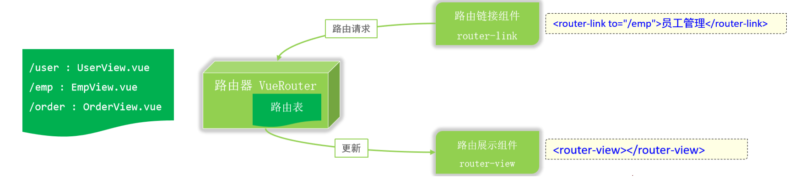

# Vue路由
<!-- more -->

## 路由介绍

此时基于案例中的功能，实现点击侧边栏的部门管理，显示部门管理的信息，点击员工管理，显示员工管理的信息，这就需要vue的路由功能了。


**前端路由**：URL中的hash(#号之后的内容）与组件之间的对应关系


当我们点击左侧导航栏时，浏览器的地址栏会发生变化，路由自动更新显示与url所对应的vue组件。

::: note vue官方提供了路由插件Vue Router

VueRouter：路由器类，根据路由请求在路由视图中动态渲染选中的组件  
&lt;router-link&gt;：请求链接组件，浏览器会解析成&lt;a&gt;  
&lt;router-view&gt;：动态视图组件，用来渲染展示与路由路径对应的组件  

:::

**工作原理**：



首先VueRouter根据我们配置的url的hash片段和路由的组件关系去维护一张路由表

然后页面提供一个&lt;router-link&gt;组件，用户点击，发出路由请求

接着VueRouter根据路由请求，在路由表中找到对应的vue组件

最后VueRouter会切换&lt;router-view&gt;中的组件，从而进行视图的更新

## 路由入门

```html
npm install vue-router@3.5.1
```

在**src/router/index.js**文件中定义路由表

```js
import Vue  'vue'
import VueRouter  'vue-router'

Vue.use(VueRouter)

const routes = [
  {
    path: '/emp',  //地址hash
    name: 'emp',
    component:  () => import('../views/tlias/EmpView.vue')  //对应的vue组件
  },
  {
    path: '/dept',
    name: 'dept',
    component: () => import('../views/tlias/DeptView.vue')
  },
  // 值得注意的是：默认的路由路径是 /
  {
    path: '/',
    redirect:'/emp' //表示重定向到/emp即可
  },
]

const router = new VueRouter({
  routes
})

export default router

```

路由基本信息配置好了，路由表已经被加载，此时还缺少2个东西，就是&lt;router-link&gt;和&lt;router-view&gt;，所以我们需要修改2个页面（ EmpView.vue 和 DeptView.vue ）

```html
<el-menu-item index="1-1">
    <router-link to="/dept">部门管理</router-link>
</el-menu-item>
<el-menu-item index="1-2">
    <router-link to="/emp">员工管理</router-link>
</el-menu-item>
```

还需要在内容展示区域即App.vue中定义route-view

```html
<template>
  <div id="app">
    <!-- {{message}} -->
    <!-- <element-view></element-view> -->
    <!-- <emp-view></emp-view> -->
    <router-view></router-view>
  </div>
</template>

<script>
// import EmpView  './views/tlias/EmpView.vue'
// import ElementView  './views/Element/ElementView.vue'
export default {
  components: { },
  data(){
    return {
      "message":"hello world"
    }
  }
}
</script>
<style>

</style>

```

