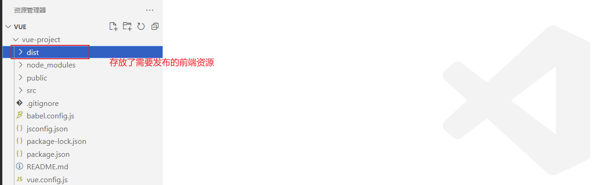
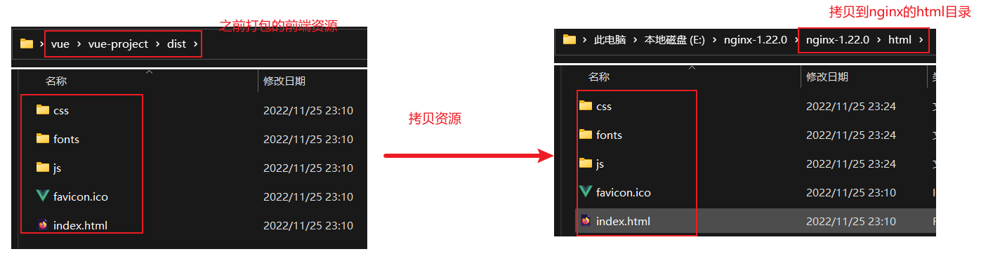
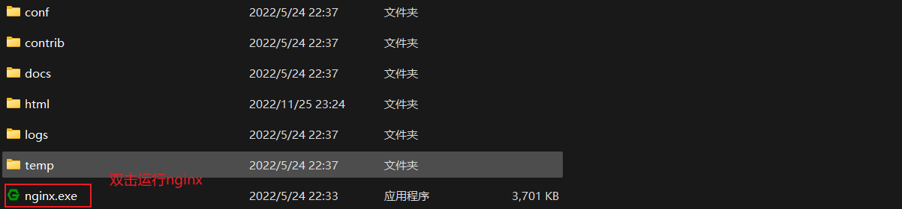
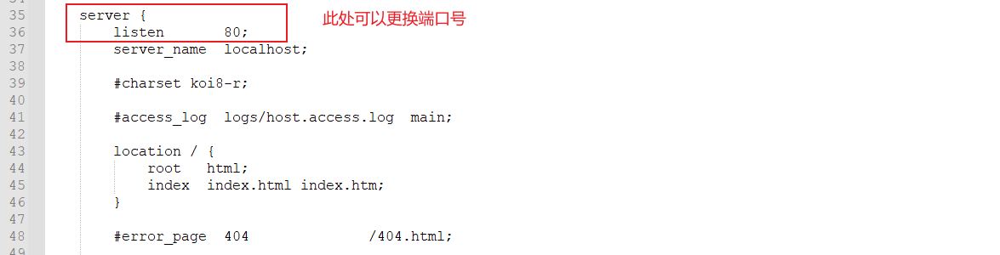

# 打包部署
<!-- more -->

如何发布呢？主要分为2步：

1. 前端工程打包
2. 通过nginx服务器发布前端工程

## 前端工程打包

然后会在工程目录下生成一个dist目录，用于存放需要发布的前端资源

## 部署前端工程

### nginx介绍

Nginx是一款轻量级的Web服务器/反向代理服务器及电子邮件（IMAP/POP3）代理服务器。  
其特点是占有内存少，并发能力强，在各大型互联网公司都有非常广泛的使用。

nginx的解压目录以及目录结构说明：

**很明显，如果要发布，直接将资源放入到html目录中。**

### 部署

将之前打包的前端工程dist目录下得内容拷贝到nginx的html目录下

nginx.exe文件来启动nginx

nginx服务器的端口号是80，

PS: 如果80端口被占用，可以通过**conf/nginx.conf**配置文件来修改端口号

