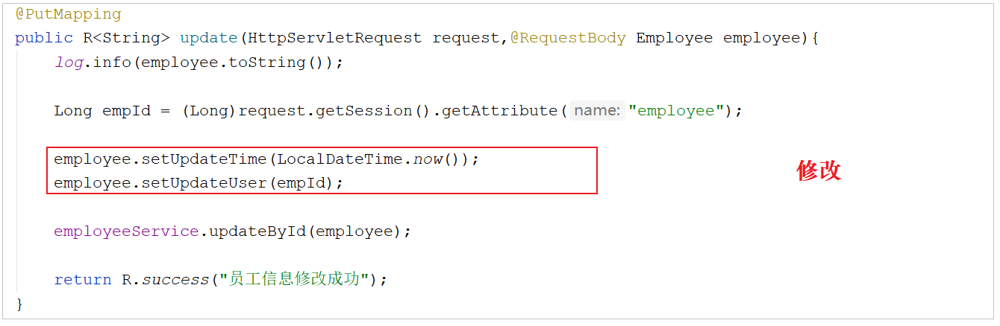
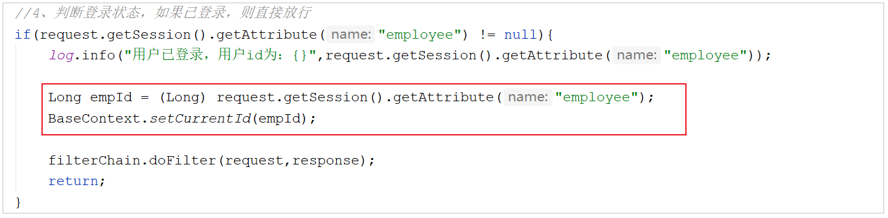
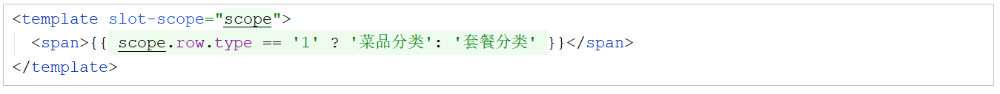

# 瑞吉外卖基础-Day03

## 1. 公共字段自动填充

### 1.1 问题分析

公共字段，也就是很多表中都会有这些字段


> 1. 在新增数据时，将createTime、updateTime 设置为当前时间，createUser、updateUser设置为当前登录用户ID
> 1. 在更新数据时，将updateTime 设置为当前时间，updateUser设置为当前登录用户ID

目前项目中处理这些字段都是在每一个业务方法中进行赋值操作




能不能对于这些公共字段在某个地方统一处理，来简化开发呢？

> 答案是可以的，Mybatis Plus有提供的公共字段自动填充功能

### 1.2 基本功能实现

#### 1.2.1 思路分析

Mybatis Plus公共字段自动填充，也就是在插入或者更新的时候为指定字段赋予指定的值，使用它的好处就是可以统一对这些字段进行处理，避免了重复代码

| 字段名     | 赋值时机                    | 说明           |
| ---------- | --------------------------- | -------------- |
| createTime | 插入(INSERT)                | 当前时间       |
| updateTime | 插入(INSERT) ，更新(UPDATE) | 当前时间       |
| createUser | 插入(INSERT)                | 当前登录用户ID |
| updateUser | 插入(INSERT) ，更新(UPDATE) | 当前登录用户ID |

> 实现步骤：
>
> 1. 在实体类的属性上加入@TableField注解，指定自动填充的策略
>
> 2. 按照框架要求编写元数据对象处理器，在此类中统一为公共字段赋值，此类需要实现MetaObjectHandler接口

#### 1.2.2 代码实现

1.**实体类的属性上加入@TableField注解，指定自动填充的策略**


> FieldFill.INSERT: 插入时填充该属性值
>
> FieldFill.INSERT_UPDATE: 插入/更新时填充该属性值

2.**按照框架要求编写元数据对象处理器，在此类中统一为公共字段赋值，此类需要实现MetaObjectHandler接口**

所属包: com.itheima.reggie.common

```java
import com.baomidou.mybatisplus.core.handlers.MetaObjectHandler;
import lombok.extern.slf4j.Slf4j;
import org.apache.ibatis.reflection.MetaObject;
import org.springframework.stereotype.Component;
import java.time.LocalDateTime;

/**
 * 自定义元数据对象处理器
 */
@Component
@Slf4j
public class MyMetaObjecthandler implements MetaObjectHandler {
    /**
     * 插入操作，自动填充
     * @param metaObject
     */
    @Override
    public void insertFill(MetaObject metaObject) {
        log.info("公共字段自动填充[insert]...");
        log.info(metaObject.toString());
        
        metaObject.setValue("createTime",LocalDateTime.now());
        metaObject.setValue("updateTime",LocalDateTime.now());
        metaObject.setValue("createUser",new Long(1));
        metaObject.setValue("updateUser",new Long(1));
    }

    /**
     * 更新操作，自动填充
     * @param metaObject
     */
    @Override
    public void updateFill(MetaObject metaObject) {
        log.info("公共字段自动填充[update]...");
        log.info(metaObject.toString());

        metaObject.setValue("updateTime",LocalDateTime.now());
        metaObject.setValue("updateUser",new Long(1));
    }
}
```

#### 1.2.3 功能测试

将之前在新增和修改方法中手动赋值的代码删除或注释掉  


启动项目，在员工管理模块中，测试增加/更新员工信息功能，然后通过`debug`或者`直接查询数据库数据变更的形式`，看看是否能够完成自动填充  

### 1.3 功能完善

#### 1.3.1 思路分析

自动填充createUser和updateUser时设置的用户id是固定值，现在需要改成动态获取当前登录用户的id  

大家可能想到，用户登录成功后  将用户id存入了HttpSession中，从HttpSession中获取不就行了？


> 注意，MyMetaObjectHandler类中是不能直接获得HttpSession对象的

当  在修改员工信息时，业务的执行流程


客户端发送的每次http请求，对应的在服务端都会分配一个新的线程来处理，在处理过程中涉及到下面类中的方法都属于相同的一个线程：

> 1. LoginCheckFilter的 doFilter 方法
>
> 2. EmployeeController的 update 方法
>
> 3. MyMetaObjectHandler的 updateFill 方法

可以在上述类的方法中加入如下代码(获取当前线程ID，并输出)

```java
long id = Thread.currentThread().getId();
log.info("线程id为：{}",id);
```


经过上述分析，发现可以使用JDK提供的一个类，来解决此问题，它是JDK中提供的`ThreadLocal`

#### 1.3.2 ThreadLocal

ThreadLocal并不是一个Thread，而是Thread的局部变量  
>当使用ThreadLocal维护变量时，ThreadLocal为每个使用该变量的线程提供独立的变量副本，所以每一个线程都可以独立地改变自己的副本，而不会影响其它线程所对应的副本  
>
>ThreadLocal为每个线程提供单独一份存储空间，具有线程隔离的效果，只有在线程内才能获取到对应的值，线程外则不能访问当前线程对应的值  

::: tip ThreadLocal常用方法

1. public void set(T value) : 设置当前线程的线程局部变量的值

1. public T get() : 返回当前线程所对应的线程局部变量的值

1. public void remove() : 删除当前线程所对应的线程局部变量的值

:::

可以在LoginCheckFilter的doFilter方法中获取当前登录用户id，并调用ThreadLocal的set方法来设置当前线程的线程局部变量的值（用户id），然后在MyMetaObjectHandler的updateFill方法中调用ThreadLocal的get方法来获得当前线程所对应的线程局部变量的值（用户id）   如果在后续的操作中，  需要在Controller / Service中要使用当前登录用户的ID，可以直接从ThreadLocal直接获取  

#### 1.3.3 操作步骤

实现步骤：

1. 编写BaseContext工具类，基于ThreadLocal封装的工具类
2. 在LoginCheckFilter的doFilter方法中调用BaseContext来设置当前登录用户的id
3. 在MyMetaObjectHandler的方法中调用BaseContext获取登录用户的id

#### 1.3.4 代码实现

1.**BaseContext工具类**

所属包: com.itheima.reggie.common

```java
/**
 * 基于ThreadLocal封装工具类，用户保存和获取当前登录用户id
 */
public class BaseContext {
    private static ThreadLocal<Long> threadLocal = new ThreadLocal<>();
    /**
     * 设置值
     * @param id
     */
    public static void setCurrentId(Long id){
        threadLocal.set(id);
    }
    /**
     * 获取值
     * @return
     */
    public static Long getCurrentId(){
        return threadLocal.get();
    }
}
```

2.**LoginCheckFilter中存放当前登录用户到ThreadLocal**

在doFilter方法中，判定用户是否登录，如果用户登录，在放行之前，获取HttpSession中的登录用户信息，调用BaseContext的setCurrentId方法将当前登录用户ID存入ThreadLocal  

```java
Long empId = (Long) request.getSession().getAttribute("employee");
BaseContext.setCurrentId(empId);
```



3.**MyMetaObjectHandler中从ThreadLocal中获取**

将之前在代码中固定的当前登录用户1， 修改为动态调用BaseContext中的getCurrentId方法获取当前登录用户ID


#### 1.3.5 功能测试

重启项目，在员工管理模块中，测试增加/更新员工信息功能，直接查询数据库数据变更，查看这些公共字段数据是否能够完成自动填充，并且看看填充的create_user 及 update_user字段值是不是本地登录用户的ID  

## 2. 新增分类

### 2.1 需求分析

后台系统中可以管理分类信息，分类包括两种类型，分别是 **菜品分类** 和 **套餐分类**  
在后台系统中添加菜品时需要选择一个菜品分类，当  在后台系统中添加一个套餐时需要选择一个套餐分类，在移动端也会按照菜品分类和套餐分类来展示对应的菜品和套餐  


在分类管理中，新增分类时，可以选择新增菜品分类(川菜、湘菜、粤菜...)，也可以选择新增套餐分类(营养早餐、超值午餐...)   在添加套餐的时候，输入的排序字段，控制的是移动端套餐列表的展示顺序  


### 2.2 数据模型

新增分类，其实就是将新增窗口录入的分类数据，插入到category表


添加的套餐名称，是唯一的，不能够重复的


### 2.3 前端页面分析

在开发代码之前，需要梳理一下整个程序的执行过程：

> 1. 在页面(backend/page/category/list.html)的新增分类表单中填写数据，点击 "确定" 发送ajax请求，将新增分类窗口输入的数据以json形式提交到服务端
>
> 2. 服务端Controller接收页面提交的数据并调用Service将数据进行保存
>
> 3. Service调用Mapper操作数据库，保存数据

可以看到新增菜品分类和新增套餐分类请求的服务端地址和提交的json数据结构相同，所以服务端只需要提供一个方法统一处理即可


| 请求     | 说明                                           |
| -------- | ---------------------------------------------- |
| 请求方式 | POST                                           |
| 请求路径 | /category                                      |
| 请求参数 | json格式 - \{"name":"川菜", "type":"1", "sort":2\} |

### 2.4 代码实现

::: tip 代码实现的具体步骤如下

- 实体类Category

- Mapper接口CategoryMapper

- 业务层接口CategoryService

- 业务层实现类CategoryServiceImpl

- 控制层CategoryController

:::

1.**实体类Category**

所属包: com.itheima.reggie.entity

```java
import com.baomidou.mybatisplus.annotation.FieldFill;
import com.baomidou.mybatisplus.annotation.TableField;
import lombok.Data;
import java.io.Serializable;
import java.time.LocalDateTime;

/**
 * 分类
 */
@Data
public class Category implements Serializable {

    private static final long serialVersionUID = 1L;

    private Long id;

    //类型 1 菜品分类 2 套餐分类
    private Integer type;

    //分类名称
    private String name;

    //顺序
    private Integer sort;

    //创建时间
    @TableField(fill = FieldFill.INSERT)
    private LocalDateTime createTime;

    //更新时间
    @TableField(fill = FieldFill.INSERT_UPDATE)
    private LocalDateTime updateTime;
    
    //创建人
    @TableField(fill = FieldFill.INSERT)
    private Long createUser;
    
    //修改人
    @TableField(fill = FieldFill.INSERT_UPDATE)
    private Long updateUser;
}
```

2.**Mapper接口CategoryMapper**

所属包: com.itheima.reggie.mapper

```java
import com.baomidou.mybatisplus.core.mapper.BaseMapper;
import com.itheima.reggie.entity.Category;
import org.apache.ibatis.annotations.Mapper;

@Mapper
public interface CategoryMapper extends BaseMapper<Category> {
}
```

3.**业务层接口CategoryService**

所属包: com.itheima.reggie.service

```java
import com.baomidou.mybatisplus.extension.service.IService;
import com.itheima.reggie.entity.Category;

public interface CategoryService extends IService<Category> {
}
```

4.**业务层实现类CategoryServiceImpl**

所属包: com.itheima.reggie.service.impl

```java
import com.baomidou.mybatisplus.extension.service.impl.ServiceImpl;
import com.itheima.reggie.entity.Category;
import com.itheima.reggie.mapper.CategoryMapper;
import com.itheima.reggie.service.CategoryService;
import org.springframework.stereotype.Service;

@Service
public class CategoryServiceImpl extends ServiceImpl<CategoryMapper,Category> implements CategoryService{
}
```

5.**控制层CategoryController**

```java
import com.itheima.reggie.common.R;
import com.itheima.reggie.entity.Category;
import com.itheima.reggie.service.CategoryService;
import lombok.extern.slf4j.Slf4j;
import org.springframework.beans.factory.annotation.Autowired;
import org.springframework.web.bind.annotation.*;

/**
 * 分类管理
 */
@RestController
@RequestMapping("/category")
@Slf4j
public class CategoryController {
    @Autowired
    private CategoryService categoryService;

    /**
     * 新增分类
     * @param category
     * @return
     */
    @PostMapping
    public R<String> save(@RequestBody Category category){
        log.info("category:{}",category);
        categoryService.save(category);
        return R.success("新增分类成功");
    }
}    
```

### 2.5 功能测试

进入管理系统访问分类管理，然后进行新增分类测试，需要将所有情况都覆盖全

1. 输入的分类名称不存在
2. 输入已存在的分类名称
3. 新增菜品分类
4. 新增套餐分类

## 3. 分类信息分页查询

### 3.1 需求分析

一般的系统中都会以分页的方式来展示列表数据  


### 3.2 前端页面分析

在开发代码之前，需要梳理一下整个程序的执行过程：

> 1. 页面发送ajax请求，将分页查询参数(page、pageSize)提交到服务端
>
> 2. 服务端Controller接收页面提交的数据并调用Service查询数据
>
> 3. Service调用Mapper操作数据库，查询分页数据
>
> 4. Controller将查询到的分页数据响应给页面
>
> 5. 页面接收到分页数据并通过ElementUI的Table组件展示到页面上

页面加载时，就会触发Vue声明周期的钩子方法，然后执行分页查询，发送异步请求到服务端


页面中使用的是ElementUI提供的分页组件进行分页条的展示


通过浏览器，也可以抓取到分页查询的请求信息


| 请求     | 说明                |
| -------- | ------------------- |
| 请求方式 | GET                 |
| 请求路径 | /category/page      |
| 请求参数 | ?page=1&pageSize=10 |

### 3.3 代码实现

```java
/**
 * 分页查询
 * @param page
 * @param pageSize
 * @return
 */
@GetMapping("/page")
public R<Page> page(int page,int pageSize){
    //分页构造器
    Page<Category> pageInfo = new Page<>(page,pageSize);
    //条件构造器
    LambdaQueryWrapper<Category> queryWrapper = new LambdaQueryWrapper<>();
    //添加排序条件，根据sort进行排序
    queryWrapper.orderByAsc(Category::getSort);

    //分页查询
    categoryService.page(pageInfo,queryWrapper);
    return R.success(pageInfo);
}
```

### 3.4 功能测试

点击分类管理，查询分类列表是否可以正常展示，测试过程中可以使用浏览器的监控工具查看页面和服务端的数据交互细节  

测试完毕后，会发现查询数据库返回的类型为 1 或者 2，但是实际展示到页面上的却是 "菜品分类" 或 "套餐分类"，这一块是在前端页面中进行处理的，处理代码如下




## 4. 删除分类

### 4.1 需求分析

在分类管理列表页面，可以对某个分类进行删除操作  
需要注意的是当分类关联了菜品或者套餐时，此分类不允许删除  


### 4.2 前端页面分析

在前端页面中，点击 "删除" 按钮，就会触发定义的方法，然后往服务端发送异步请求，并传递参数id，执行删除分类操作  


删除操作的具体执行流程如下

> 1. 点击删除，页面发送ajax请求，将参数(id)提交到服务端
>
> 2. 服务端Controller接收页面提交的数据并调用Service删除数据
>
> 3. Service调用Mapper操作数据库


| 请求     | 说明                    |
| -------- | ----------------------- |
| 请求方式 | DELETE                  |
| 请求路径 | /category               |
| 请求参数 | ?id=1395291114922618881 |

### 4.3 代码实现

在CategoryController中增加根据ID删除的方法，在方法中接收页面传递参数id，然后执行删除操作  

```java
/**
 * 根据id删除分类
 * @param id
 * @return
 */
@DeleteMapping
public R<String> delete(Long id){
    log.info("删除分类，id为：{}",id);
    categoryService.removeById(id);
    return R.success("分类信息删除成功");
}
```

### 4.4 功能测试

重启项目，可以通过debug断点调试进行测试，同时结合浏览器监控工具查看请求和响应的具体数据  

### 4.5 功能完善

#### 4.5.1 思路分析

上述测试中，看到分类数据是可以正常删除的，但是并没有检查删除的分类是否关联了菜品或者套餐，所以需要进行功能完善，完善后的逻辑为

- 根据当前分类的ID，查询该分类下是否存在菜品，如果存在，则提示错误信息
- 根据当前分类的ID，查询该分类下是否存在套餐，如果存在，则提示错误信息
- 执行正常的删除分类操作

那么在这里又涉及到后面要用到的两张表结构 dish(菜品表) 和 setmeal(套餐表) 具体的表结构


#### 4.5.2 准备工作

1.**准备菜品(Dish)及套餐(Setmeal)实体类(课程资料中直接拷贝)**

所属包: com.itheima.reggie.entity

```java
import com.baomidou.mybatisplus.annotation.FieldFill;
import com.baomidou.mybatisplus.annotation.TableField;
import lombok.Data;
import java.io.Serializable;
import java.math.BigDecimal;
import java.time.LocalDateTime;

/**
 菜品
 */
@Data
public class Dish implements Serializable {
    private static final long serialVersionUID = 1L;

    private Long id;

    //菜品名称
    private String name;

    //菜品分类id
    private Long categoryId;

    //菜品价格
    private BigDecimal price;

    //商品码
    private String code;

    //图片
    private String image;

    //描述信息
    private String description;

    //0 停售 1 起售
    private Integer status;

    //顺序
    private Integer sort;

    @TableField(fill = FieldFill.INSERT)
    private LocalDateTime createTime;

    @TableField(fill = FieldFill.INSERT_UPDATE)
    private LocalDateTime updateTime;

    @TableField(fill = FieldFill.INSERT)
    private Long createUser;

    @TableField(fill = FieldFill.INSERT_UPDATE)
    private Long updateUser;
}
```

```java
import com.baomidou.mybatisplus.annotation.FieldFill;
import com.baomidou.mybatisplus.annotation.TableField;
import lombok.Data;
import java.io.Serializable;
import java.math.BigDecimal;
import java.time.LocalDateTime;

/**
 * 套餐
 */
@Data
public class Setmeal implements Serializable {
    private static final long serialVersionUID = 1L;

    private Long id;

    //分类id
    private Long categoryId;

    //套餐名称
    private String name;

    //套餐价格
    private BigDecimal price;

    //状态 0:停用 1:启用
    private Integer status;

    //编码
    private String code;

    //描述信息
    private String description;

    //图片
    private String image;

    @TableField(fill = FieldFill.INSERT)
    private LocalDateTime createTime;

    @TableField(fill = FieldFill.INSERT_UPDATE)
    private LocalDateTime updateTime;

    @TableField(fill = FieldFill.INSERT)
    private Long createUser;

    @TableField(fill = FieldFill.INSERT_UPDATE)
    private Long updateUser;
}
```

2.**Mapper接口DishMapper和SetmealMapper**

所属包: com.itheima.reggie.mapper

```java
import com.baomidou.mybatisplus.core.mapper.BaseMapper;
import com.itheima.reggie.entity.Dish;
import org.apache.ibatis.annotations.Mapper;

@Mapper
public interface DishMapper extends BaseMapper<Dish> {
}
```

```java
import com.baomidou.mybatisplus.core.mapper.BaseMapper;
import com.itheima.reggie.entity.Setmeal;
import org.apache.ibatis.annotations.Mapper;

@Mapper
public interface SetmealMapper extends BaseMapper<Setmeal> {
}
```

3.**Service接口DishService和SetmealService**

所属包: com.itheima.reggie.service

```java
import com.baomidou.mybatisplus.extension.service.IService;
import com.itheima.reggie.entity.Dish;

public interface DishService extends IService<Dish> {
}
```

```java
import com.baomidou.mybatisplus.extension.service.IService;
import com.itheima.reggie.entity.Setmeal;

public interface SetmealService extends IService<Setmeal> {
}
```

4.**Service实现类DishServiceImpl和SetmealServiceImpl**

```java
import com.baomidou.mybatisplus.extension.service.impl.ServiceImpl;
import com.itheima.reggie.entity.Dish;
import com.itheima.reggie.mapper.DishMapper;
import com.itheima.reggie.service.DishService;
import lombok.extern.slf4j.Slf4j;
import org.springframework.stereotype.Service;

@Service
@Slf4j
public class DishServiceImpl extends ServiceImpl<DishMapper,Dish> implements DishService {
}
```

```java
import com.baomidou.mybatisplus.extension.service.impl.ServiceImpl;
import com.itheima.reggie.entity.Setmeal;
import com.itheima.reggie.mapper.SetmealMapper;
import com.itheima.reggie.service.SetmealService;
import lombok.extern.slf4j.Slf4j;
import org.springframework.stereotype.Service;

@Service
@Slf4j
public class SetmealServiceImpl extends ServiceImpl<SetmealMapper,Setmeal> implements SetmealService {
}
```

#### 4.5.3 代码实现

1.**创建自定义异常**

在业务逻辑操作过程中，如果遇到一些业务参数、操作异常的情况下，直接抛出此异常  

所在包: com.itheima.reggie.common

```java
/**
 * 自定义业务异常类
 */
public class CustomException extends RuntimeException {
    public CustomException(String message){
        super(message);
    }
}
```

2.**在CategoryService中扩展remove方法**

```java
public interface CategoryService extends IService<Category> {
    //根据ID删除分类
    public void remove(Long id);
}
```

3.**在CategoryServiceImpl中实现remove方法**

```java
@Autowired
private DishService dishService;
@Autowired
private SetmealService setmealService;

/**
 * 根据id删除分类，删除之前需要进行判断
 * @param id
 */
@Override
public void remove(Long id) {
    //添加查询条件，根据分类id进行查询菜品数据
    LambdaQueryWrapper<Dish> dishLambdaQueryWrapper = new LambdaQueryWrapper<>();
    dishLambdaQueryWrapper.eq(Dish::getCategoryId,id);
    int count1 = dishService.count(dishLambdaQueryWrapper);
    //如果已经关联，抛出一个业务异常
    if(count1 > 0){
        throw new CustomException("当前分类下关联了菜品，不能删除");//已经关联菜品，抛出一个业务异常
    }

    //查询当前分类是否关联了套餐，如果已经关联，抛出一个业务异常
    LambdaQueryWrapper<Setmeal> setmealLambdaQueryWrapper = new LambdaQueryWrapper<>();
    setmealLambdaQueryWrapper.eq(Setmeal::getCategoryId,id);
    int count2 = setmealService.count(setmealLambdaQueryWrapper);
    if(count2 > 0){
        throw new CustomException("当前分类下关联了套餐，不能删除");//已经关联套餐，抛出一个业务异常
    }

    //正常删除分类
    super.removeById(id);
}
```

那么在上述的业务逻辑中，当分类下关联的有菜品或者套餐时，在业务代码中抛出了自定义异常，并且在异常中封装了错误提示信息，那这个错误提示信息如何提示给页面呢？

异常抛出之后，会被异常处理器捕获，只需要在异常处理器中捕获这一类的异常，然后给页面返回对应的提示信息即可  

4.**在GlobalExceptionHandler中处理自定义异常**

在全局异常处理器中增加方法，用于捕获自定义的异常 CustomException

```java
/**
 * 异常处理方法
 * @return
 */
@ExceptionHandler(CustomException.class)
public R<String> exceptionHandler(CustomException ex){
    log.error(ex.getMessage());
    return R.error(ex.getMessage());
}
```

5.**改造CategoryController的delete方法**

注释掉原有的代码，在delete方法中直接调用categoryService中  自定义的remove方法  

```java
/**
* 根据id删除分类
* @param id
* @return
*/
@DeleteMapping
public R<String> delete(Long id){
    log.info("删除分类，id为：{}",id);

    //categoryService.removeById(id);
    categoryService.remove(id);

    return R.success("分类信息删除成功");
}
```

#### 4.5.4 功能测试

进入管理系统访问分类管理，然后进行删除分类的测试，需要将所有情况都覆盖全

1. 新增一个分类，然后再直接删除，检查是否可以正常删除成功  (新增的分类时没有关联菜品和套餐的)

2. 在数据库表(dish/setmeal)中，找到一个与菜品或套餐关联的分类，然后在页面中执行删除操作，检查是否可以正常的提示出对应的错误信息  


## 5. 修改分类

### 5.1 需求分析

在分类管理列表页面点击修改按钮，弹出修改窗口，在修改窗口会显分类信息并进行修改，最后点击确定按钮完成修改操作


### 5.2 前端页面分析

修改功能还没有实现，但是当点击 "修改" 按钮的时候，并没有开发根据ID查询数据，进行页面回显的功能，但是页面的分类数据确实回显回来了


那么回显这一步的操作前端已经实现，就只需要开发一个方法，修改操作的方法即可


| 请求     | 说明                                                   |
| -------- | ------------------------------------------------------ |
| 请求方式 | PUT                                                    |
| 请求路径 | /category                                              |
| 请求参数 | \{id: "1399923597874081794",name: "超值午餐",sort: 0\} |

### 5.3 代码实现

创建服务端的CategoryController方法update方法  

```java
/**
 * 根据id修改分类信息
 * @param category
 * @return
 */
@PutMapping
public R<String> update(@RequestBody Category category){
    log.info("修改分类信息：{}",category);
    categoryService.updateById(category);
    return R.success("修改分类信息成功");
}
```

### 5.4 功能测试

按照前面分析的操作流程进行测试，查看数据是否正常修改即可  
