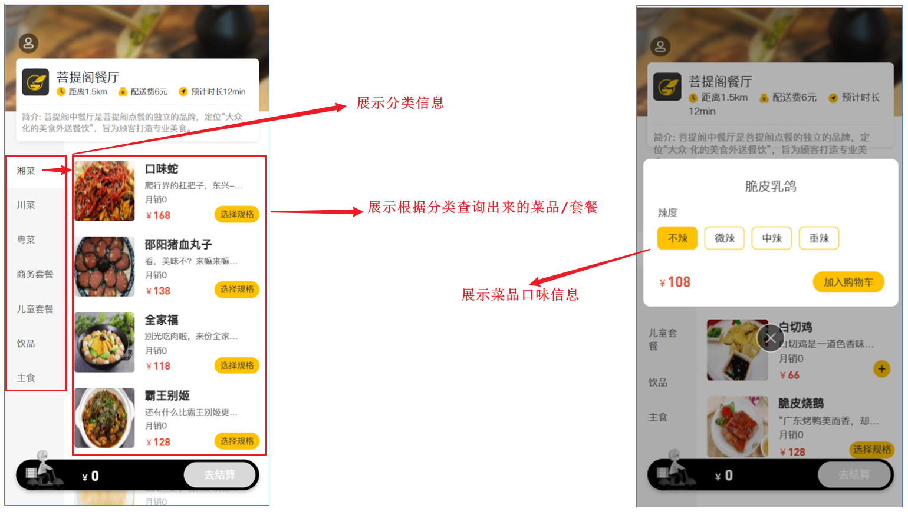
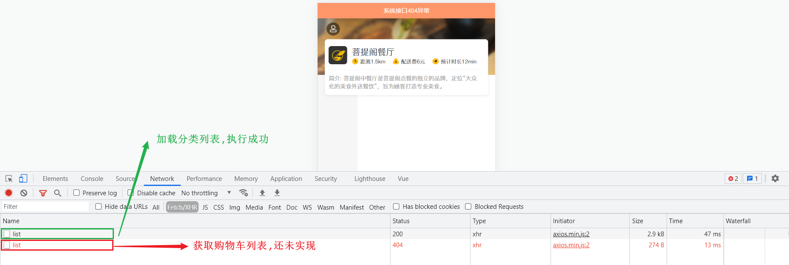
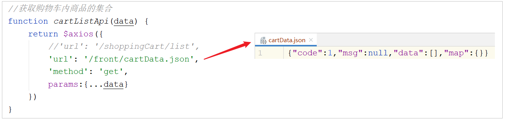
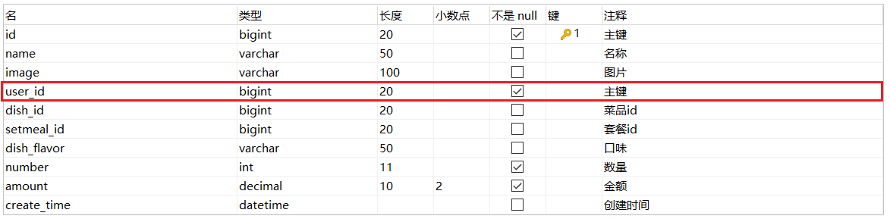
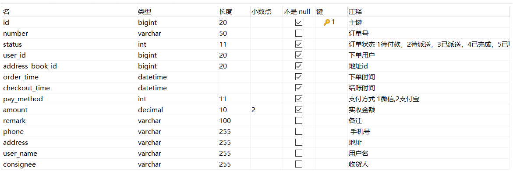
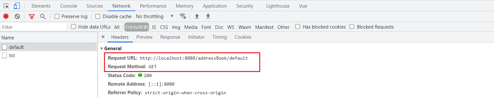
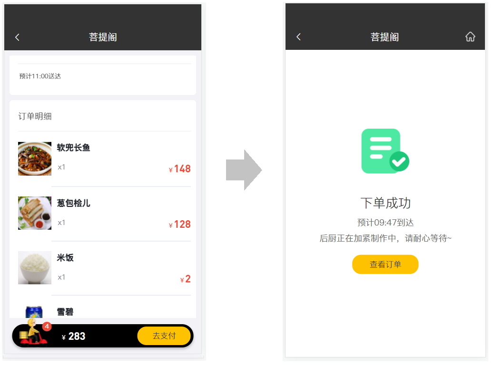

# 瑞吉外卖基础-Day06

## 1. 用户地址簿功能

### 1.1 需求分析

地址簿：指的是移动端消费者用户的地址信息，用户登录成功后可以维护自己的地址信息，同一个用户可以有多个地址信息，但是只能有一个**默认地址**  


对于地址簿管理，需要实现以下几个功能：

- 新增地址
- 地址列表查询
- 设置默认地址
- 编辑地址
- 删除地址

### 1.2 数据模型

用户的地址信息会存储在address_book表


这里面有一个字段is_default，实际上在设置默认地址时，只需要更新这个字段就可以了  

### 1.3 导入功能代码

> 对于这一类的单表的增删改查，已经写过很多了，基本的开发思路都是一样的

1.**实体类 AddressBook（直接从课程资料中导入即可）**

所属包: com.itheima.reggie.entity

```java
import com.baomidou.mybatisplus.annotation.FieldFill;
import com.baomidou.mybatisplus.annotation.TableField;
import lombok.Data;
import java.io.Serializable;
import java.time.LocalDateTime;
/**
 * 地址簿
 */
@Data
public class AddressBook implements Serializable {
    private static final long serialVersionUID = 1L;

    private Long id;

    //用户id
    private Long userId;

    //收货人
    private String consignee;

    //手机号
    private String phone;

    //性别 0 女 1 男
    private String sex;

    //省级区划编号
    private String provinceCode;

    //省级名称
    private String provinceName;

    //市级区划编号
    private String cityCode;

    //市级名称
    private String cityName;

    //区级区划编号
    private String districtCode;

    //区级名称
    private String districtName;

    //详细地址
    private String detail;

    //标签
    private String label;
    
    //是否默认 0 否 1是
    private Integer isDefault;
    
    //创建时间
    @TableField(fill = FieldFill.INSERT)
    private LocalDateTime createTime;

    //更新时间
    @TableField(fill = FieldFill.INSERT_UPDATE)
    private LocalDateTime updateTime;

    //创建人
    @TableField(fill = FieldFill.INSERT)
    private Long createUser;

    //修改人
    @TableField(fill = FieldFill.INSERT_UPDATE)
    private Long updateUser;

    //是否删除
    private Integer isDeleted;
}
```

2.**Mapper接口 AddressBookMapper（直接从课程资料中导入即可）**

所属包: com.itheima.reggie.mapper

```java
import com.baomidou.mybatisplus.core.mapper.BaseMapper;
import com.itheima.reggie.entity.AddressBook;
import org.apache.ibatis.annotations.Mapper;
import org.apache.ibatis.annotations.Select;
import java.util.List;

@Mapper
public interface AddressBookMapper extends BaseMapper<AddressBook> {
}
```

3.**业务层接口 AddressBookService（直接从课程资料中导入即可）**

所属包: com.itheima.reggie.service

```java
import com.baomidou.mybatisplus.extension.service.IService;
import com.itheima.reggie.entity.AddressBook;

public interface AddressBookService extends IService<AddressBook> {
}
```

4.**业务层实现类 AddressBookServiceImpl（直接从课程资料中导入即可）**

所属包: com.itheima.reggie.service.impl

```java
import com.baomidou.mybatisplus.extension.service.impl.ServiceImpl;
import com.itheima.reggie.entity.AddressBook;
import com.itheima.reggie.mapper.AddressBookMapper;
import com.itheima.reggie.service.AddressBookService;
import org.springframework.stereotype.Service;

@Service
public class AddressBookServiceImpl extends ServiceImpl<AddressBookMapper, AddressBook> implements AddressBookService {
}
```

5.**控制层 AddressBookController（直接从课程资料中导入即可）**

所属包: com.itheima.reggie.controller

controller主要开发的功能:

A. 新增地址逻辑说明：

- 需要记录当前是哪个用户的地址(关联当前登录用户)

B. 设置默认地址

- 每个用户可以有很多地址，但是默认地址只能有一个 ；

- 先将该用户所有地址的is_default更新为0， 然后将当前的设置的默认地址的is_default设置为1

C. 根据ID查询地址

D. 查询默认地址

- 根据当前登录用户ID 以及 is_default进行查询，查询当前登录用户is_default为1的地址信息

E. 查询指定用户的全部地址

- 根据当前登录用户ID，查询所有的地址列表

代码实现如下：

```java
import com.baomidou.mybatisplus.core.conditions.query.LambdaQueryWrapper;
import com.baomidou.mybatisplus.core.conditions.update.LambdaUpdateWrapper;
import com.itheima.reggie.common.BaseContext;
import com.itheima.reggie.common.R;
import com.itheima.reggie.entity.AddressBook;
import com.itheima.reggie.service.AddressBookService;
import lombok.extern.slf4j.Slf4j;
import org.springframework.beans.factory.annotation.Autowired;
import org.springframework.web.bind.annotation.*;
import java.util.List;

/**
 * 地址簿管理
 */
@Slf4j
@RestController
@RequestMapping("/addressBook")
public class AddressBookController {
    @Autowired
    private AddressBookService addressBookService;

    /**
     * 新增
     */
    @PostMapping
    public R<AddressBook> save(@RequestBody AddressBook addressBook) {
        addressBook.setUserId(BaseContext.getCurrentId());
        log.info("addressBook:{}", addressBook);
        addressBookService.save(addressBook);
        return R.success(addressBook);
    }

    /**
     * 设置默认地址
     */
    @PutMapping("default")
    public R<AddressBook> setDefault(@RequestBody AddressBook addressBook) {
        log.info("addressBook:{}", addressBook);
        LambdaUpdateWrapper<AddressBook> wrapper = new LambdaUpdateWrapper<>();
        wrapper.eq(AddressBook::getUserId, BaseContext.getCurrentId());
        wrapper.set(AddressBook::getIsDefault, 0);
        //SQL:update address_book set is_default = 0 where user_id = ?
        addressBookService.update(wrapper);

        addressBook.setIsDefault(1);
        //SQL:update address_book set is_default = 1 where id = ?
        addressBookService.updateById(addressBook);
        return R.success(addressBook);
    }

    /**
     * 根据id查询地址
     */
    @GetMapping("/{id}")
    public R get(@PathVariable Long id) {
        AddressBook addressBook = addressBookService.getById(id);
        if (addressBook != null) {
            return R.success(addressBook);
        } else {
            return R.error("没有找到该对象");
        }
    }

    /**
     * 查询默认地址
     */
    @GetMapping("default")
    public R<AddressBook> getDefault() {
        LambdaQueryWrapper<AddressBook> queryWrapper = new LambdaQueryWrapper<>();
        queryWrapper.eq(AddressBook::getUserId, BaseContext.getCurrentId());
        queryWrapper.eq(AddressBook::getIsDefault, 1);

        //SQL:select * from address_book where user_id = ? and is_default = 1
        AddressBook addressBook = addressBookService.getOne(queryWrapper);

        if (null == addressBook) {
            return R.error("没有找到该对象");
        } else {
            return R.success(addressBook);
        }
    }

    /**
     * 查询指定用户的全部地址
     */
    @GetMapping("/list")
    public R<List<AddressBook>> list(AddressBook addressBook) {
        addressBook.setUserId(BaseContext.getCurrentId());
        log.info("addressBook:{}", addressBook);

        //条件构造器
        LambdaQueryWrapper<AddressBook> queryWrapper = new LambdaQueryWrapper<>();
        queryWrapper.eq(null != addressBook.getUserId(), AddressBook::getUserId, addressBook.getUserId());
        queryWrapper.orderByDesc(AddressBook::getUpdateTime);

        //SQL:select * from address_book where user_id = ? order by update_time desc
        return R.success(addressBookService.list(queryWrapper));
    }
}
```

### 1.4 功能测试

代码导入进来，并且去阅读了一下地址管理各个功能的逻辑实现，接下来，就可以启动项目，进行一个测试  测试过程中，通过debug断点调试观察服务端程序的执行过程，在浏览器中使用调试工具查看页面和服务端的交互过程和请求响应数据  

1.**新增**

填写表单数据，点击保存地址，查看网络请求  


测试完毕之后，检查数据库中的数据，是否正常插入  


2.**列表查询**

当新增地址完成后，页面会再次发送一个请求，来查询该用户的所有地址列表，在界面进行展示  


3.**设置默认**

在地址列表页面中，勾选 "设为默认地址" ，此时会发送PUT请求，来设置默认地址  


测试完毕后，再次查看数据库表中的数据：


## 2. 菜品展示

### 2.1 需求分析

用户登录成功后跳转到系统首页，在首页需要根据分类来展示菜品和套餐  

如果菜品设置了口味信息，需要展示 按钮，否则显示 按钮  



### 2.2 前端页面分析

在开发代码之前，需要梳理一下前端页面和服务端的交互过程：

1.**页面(front/index.html)发送ajax请求，获取分类数据（菜品分类和套餐分类）**


该功能在之前的业务开发中，都已经实现了  
通过请求响应的数据，也可以看到数据是可以正确获取到的  



注意：首页加载时，不仅发送请求获取分类列表，还发送了一次ajax请求用于加载购物车数据，而这两次请求必须全部成功，页面才可以正常渲染，而当前购物车列表查询功能还未实现(报404)，所以列表目前并未渲染  
此处可以将这次请求的地址暂时修改一下，从静态json文件获取数据，等后续开发购物车功能时再修改回来



修改之后，再次测试：  


目前该部分的功能已经调通，左侧的分类菜单，和右侧的菜品信息都可以看到，后续只需要将购物车列表的数据改成调用服务端接口查询即可  

2.**页面发送ajax请求，获取第一个分类下的菜品或者套餐**


A. 根据分类ID查询套餐列表：


B. 根据分类ID查询菜品列表：


异步请求，查询分类对应的菜品列表，功能已经实现了，但是之前查询的只是菜品的基本信息，不包含菜品的口味信息  
所以在前端界面中，看不到选择菜品分类的信息  


经过上述的分析，可以看到，服务端主要提供两个方法， 分别用来：

A. 根据分类ID查询菜品列表(包含菜品口味列表)， 具体请求信息如下:

| 请求     | 说明                                     |
| -------- | ---------------------------------------- |
| 请求方式 | GET                                      |
| 请求路径 | /dish/list                               |
| 请求参数 | ?categoryId=1397844263642378242&status=1 |

该功能在服务端已经实现，需要修改此方法，在原有方法的基础上增加查询菜品的口味信息  

B. 根据分类ID查询套餐列表， 具体请求信息如下:

| 请求     | 说明                                     |
| -------- | ---------------------------------------- |
| 请求方式 | GET                                      |
| 请求路径 | /setmeal/list                            |
| 请求参数 | ?categoryId=1397844263642378242&status=1 |

该功能在服务端并未实现  

### 2.3 代码开发

#### 2.3.1 查询菜品方法修改

由于之前实现的根据分类查询菜品列表，仅仅查询了菜品的基本信息，未查询菜品口味信息，而移动端用户在点餐时，是需要选择口味信息的，所以需要对之前的代码实现进行完善，那么如何完善呢？

需要修改DishController的list方法，原来此方法的返回值类型为：R\<List\<Dish>>  为了满足移动端对数据的要求(菜品基本信息和菜品对应的口味信息)，现在需要将方法的返回值类型改为：R\<List\<DishDto>> ，因为在DishDto中封装了菜品对应的口味信息：


**代码逻辑:**

A. 根据分类ID查询，查询目前正在启售的菜品列表 (已实现)

B. 遍历菜品列表，并查询菜品的分类信息及菜品的口味列表

C. 组装数据DishDto，并返回

**代码实现：**

```java
@GetMapping("/list")
    public R<List<DishDto>> list(Dish dish){
        //构造查询条件
        LambdaQueryWrapper<Dish> queryWrapper = new LambdaQueryWrapper<>();
        queryWrapper.eq(dish.getCategoryId() != null ,Dish::getCategoryId,dish.getCategoryId());
        //添加条件，查询状态为1（起售状态）的菜品
        queryWrapper.eq(Dish::getStatus,1);
        //添加排序条件
        queryWrapper.orderByAsc(Dish::getSort).orderByDesc(Dish::getUpdateTime);

        List<Dish> list = dishService.list(queryWrapper);

        List<DishDto> dishDtoList = list.stream().map((item) -> {
            DishDto dishDto = new DishDto();
            BeanUtils.copyProperties(item,dishDto);

            Long categoryId = item.getCategoryId();//分类id
            //根据id查询分类对象
            Category category = categoryService.getById(categoryId);
            if(category != null){
                String categoryName = category.getName();
                dishDto.setCategoryName(categoryName);
            }

            //当前菜品的id
            Long dishId = item.getId();
            LambdaQueryWrapper<DishFlavor> lambdaQueryWrapper = new LambdaQueryWrapper<>();
            lambdaQueryWrapper.eq(DishFlavor::getDishId,dishId);
            //SQL:select * from dish_flavor where dish_id = ?
            List<DishFlavor> dishFlavorList = dishFlavorService.list(lambdaQueryWrapper);
            dishDto.setFlavors(dishFlavorList);
            
            return dishDto;
        }).collect(Collectors.toList());

        return R.success(dishDtoList);
    }
```

#### 2.3.2 根据分类ID查询套餐

在SetmealController中创建list方法，根据条件查询套餐数据  

```java
/**
 * 根据条件查询套餐数据
 * @param setmeal
 * @return
 */
@GetMapping("/list")
public R<List<Setmeal>> list(Setmeal setmeal){
    LambdaQueryWrapper<Setmeal> queryWrapper = new LambdaQueryWrapper<>();
    queryWrapper.eq(setmeal.getCategoryId() != null,Setmeal::getCategoryId,setmeal.getCategoryId());
    queryWrapper.eq(setmeal.getStatus() != null,Setmeal::getStatus,setmeal.getStatus());
    queryWrapper.orderByDesc(Setmeal::getUpdateTime);

    List<Setmeal> list = setmealService.list(queryWrapper);
    return R.success(list);
}
```

### 2.4 功能测试

把菜品展示的功能代码完善完成之后，重新启动服务，来测试一个菜品展示的功能  
测试过程中可以使用浏览器的监控工具查看页面和服务端的数据交互细节  


点击分类，根据分类查询菜品列表/套餐列表:


## 3. 购物车

### 3.1 需求分析

移动端用户可以将菜品或者套餐添加到购物车  
对于菜品来说，如果设置了口味信息，则需要选择规格后才能加入购物车；对于套餐来说，可以直接点击将当前套餐加入购物车  
在购物车中可以修改菜品和套餐的数量，也可以清空购物车  


这里面需要实现的功能包括:

1. 添加购物车

2. 查询购物车

3. 清空购物车

### 3.2 数据模型

用户的购物车数据，也是需要保存在数据库中的，购物车对应的数据表为shopping_cart表，具体表结构如下：



说明：

- 购物车数据是关联用户的，在表结构中，需要记录，每一个用户的购物车数据是哪些
- 菜品列表展示出来的既有套餐，又有菜品，如果APP端选择的是套餐，就保存套餐ID(setmeal_id)，如果APP端选择的是菜品，就保存菜品ID(dish_id)
- 对同一个菜品/套餐，如果选择多份不需要添加多条记录，增加数量number即可

**最终shopping_cart表中存储的数据示例:**


### 3.3 前端页面分析

在开发代码之前，需要梳理一下购物车操作时前端页面和服务端的交互过程：

1. 点击 "加入购物车" 或者 "+" 按钮，页面发送ajax请求，请求服务端，将菜品或者套餐添加到购物车

    

    

2. 点击购物车图标，页面发送ajax请求，请求服务端查询购物车中的菜品和套餐

    此时，就需要将查询购物车的代码放开，不用再加载静态的json数据了  

    

    

3. 点击清空购物车按钮，页面发送ajax请求，请求服务端来执行清空购物车操作


经过上述的分析，可以看到，对于购物车的功能，主要需要开发以下几个功能，具体的请求信息如下：

1.**加入购物车**

| 请求     | 说明              |
| -------- | ----------------- |
| 请求方式 | POST              |
| 请求路径 | /shoppingCart/add |
| 请求参数 | json格式          |

```json
菜品数据: 
{"amount":118,"dishFlavor":"不要蒜,微辣","dishId":"1397851099502260226","name":"全家福","image":"a53a4e6a-3b83-4044-87f9-9d49b30a8fdc.jpg"}

套餐数据: 
{"amount":38,"setmealId":"1423329486060957698","name":"营养超值工作餐","image":"9cd7a80a-da54-4f46-bf33-af3576514cec.jpg"}
```

2.**查询购物车列表**

| 请求     | 说明               |
| -------- | ------------------ |
| 请求方式 | GET                |
| 请求路径 | /shoppingCart/list |

3.**清空购物车功能**

| 请求     | 说明                |
| -------- | ------------------- |
| 请求方式 | DELETE              |
| 请求路径 | /shoppingCart/clean |

### 3.4 准备工作

分析完毕购物车的业务需求和实现思路之后，在开发业务功能前，先将需要用到的类和接口基本结构创建好：

1.**实体类 ShoppingCart（直接从课程资料中导入即可）**

所属包: com.itheima.reggie.entity

```java
import lombok.Data;
import java.io.Serializable;
import java.math.BigDecimal;
import java.time.LocalDateTime;

/**
 * 购物车
 */
@Data
public class ShoppingCart implements Serializable {
    private static final long serialVersionUID = 1L;

    private Long id;

    //名称
    private String name;

    //用户id
    private Long userId;

    //菜品id
    private Long dishId;

    //套餐id
    private Long setmealId;

    //口味
    private String dishFlavor;

    //数量
    private Integer number;

    //金额
    private BigDecimal amount;

    //图片
    private String image;

    private LocalDateTime createTime;
}
```

2.**Mapper接口 ShoppingCartMapper**

所属包: com.itheima.reggie.mapper

```java
import com.baomidou.mybatisplus.core.mapper.BaseMapper;
import com.itheima.reggie.entity.ShoppingCart;
import org.apache.ibatis.annotations.Mapper;

@Mapper
public interface ShoppingCartMapper extends BaseMapper<ShoppingCart> {
}
```

3.**业务层接口 ShoppingCartService**

所属包: com.itheima.reggie.service

```java
import com.baomidou.mybatisplus.extension.service.IService;
import com.itheima.reggie.entity.ShoppingCart;

public interface ShoppingCartService extends IService<ShoppingCart> {
}
```

4.**业务层实现类 ShoppingCartServiceImpl**

所属包: com.itheima.reggie.service.impl

```java
import com.baomidou.mybatisplus.extension.service.impl.ServiceImpl;
import com.itheima.reggie.entity.ShoppingCart;
import com.itheima.reggie.mapper.ShoppingCartMapper;
import com.itheima.reggie.service.ShoppingCartService;
import org.springframework.stereotype.Service;

@Service
public class ShoppingCartServiceImpl extends ServiceImpl<ShoppingCartMapper, ShoppingCart> implements ShoppingCartService {
}
```

5.**控制层 ShoppingCartController**

所属包: com.itheima.reggie.controller

```java
import com.itheima.reggie.service.ShoppingCartService;
import lombok.extern.slf4j.Slf4j;
import org.springframework.beans.factory.annotation.Autowired;
import org.springframework.web.bind.annotation.*;

/**
 * 购物车
 */
@Slf4j
@RestController
@RequestMapping("/shoppingCart")
public class ShoppingCartController {
    @Autowired
    private ShoppingCartService shoppingCartService;
 
 }   
```

### 3.5 代码开发

#### 3.5.1 添加购物车

在ShoppingCartController中创建add方法，来完成添加购物车的逻辑实现，具体的逻辑如下：

A. 获取当前登录用户，为购物车对象赋值

B. 根据当前登录用户ID 及 本次添加的菜品ID/套餐ID，查询购物车数据是否存在

C. 如果已经存在，就在原来数量基础上加1

D. 如果不存在，则添加到购物车，数量默认就是1

代码实现如下：

```java
/**
* 添加购物车
* @param shoppingCart
* @return
*/
@PostMapping("/add")
public R<ShoppingCart> add(@RequestBody ShoppingCart shoppingCart){
    log.info("购物车数据:{}",shoppingCart);

    //设置用户id，指定当前是哪个用户的购物车数据
    Long currentId = BaseContext.getCurrentId();
    shoppingCart.setUserId(currentId);

    Long dishId = shoppingCart.getDishId();

    LambdaQueryWrapper<ShoppingCart> queryWrapper = new LambdaQueryWrapper<>();
    queryWrapper.eq(ShoppingCart::getUserId,currentId);

    if(dishId != null){
        //添加到购物车的是菜品
        queryWrapper.eq(ShoppingCart::getDishId,dishId);
    }else{
        //添加到购物车的是套餐
        queryWrapper.eq(ShoppingCart::getSetmealId,shoppingCart.getSetmealId());
    }

    //查询当前菜品或者套餐是否在购物车中
    //SQL:select * from shopping_cart where user_id = ? and dish_id/setmeal_id = ?
    ShoppingCart cartServiceOne = shoppingCartService.getOne(queryWrapper);

    if(cartServiceOne != null){
        //如果已经存在，就在原来数量基础上加一
        Integer number = cartServiceOne.getNumber();
        cartServiceOne.setNumber(number + 1);
        shoppingCartService.updateById(cartServiceOne);
    }else{
        //如果不存在，则添加到购物车，数量默认就是一
        shoppingCart.setNumber(1);
        shoppingCart.setCreateTime(LocalDateTime.now());
        shoppingCartService.save(shoppingCart);
        cartServiceOne = shoppingCart;
    }
    return R.success(cartServiceOne);
}
```

#### 3.5.2 查询购物车

在ShoppingCartController中创建list方法，根据当前登录用户ID查询购物车列表，并对查询的结果进行创建时间的倒序排序  

代码实现如下

```java
/**
* 查看购物车
* @return
*/
@GetMapping("/list")
public R<List<ShoppingCart>> list(){
    log.info("查看购物车...");

    LambdaQueryWrapper<ShoppingCart> queryWrapper = new LambdaQueryWrapper<>();
    queryWrapper.eq(ShoppingCart::getUserId,BaseContext.getCurrentId());
    queryWrapper.orderByAsc(ShoppingCart::getCreateTime);

    List<ShoppingCart> list = shoppingCartService.list(queryWrapper);

    return R.success(list);
}
```

#### 3.5.3 清空购物车

在ShoppingCartController中创建clean方法，在方法中获取当前登录用户，根据登录用户ID，删除购物车数据  

代码实现如下：

```java
/**
* 清空购物车
* @return
*/
@DeleteMapping("/clean")
public R<String> clean(){
    //SQL:delete from shopping_cart where user_id = ?
    LambdaQueryWrapper<ShoppingCart> queryWrapper = new LambdaQueryWrapper<>();
    queryWrapper.eq(ShoppingCart::getUserId,BaseContext.getCurrentId());

    shoppingCartService.remove(queryWrapper);
    return R.success("清空购物车成功");
}
```

### 3.6 功能测试

按照前面分析的操作流程进行测试，测试功能以及数据库中的数据是否是否正常  

1.**添加购物车**

当添加的是菜品信息，而这个用户的购物车中当前并没有这个菜品时，添加一条数据，数量为1  


检查数据库数据，由于是菜品保存的是dish_id  


这时在页面上，可以继续点击+号，在购物车中增加该菜品，此时，应该是对现有的购物车菜品数量加1，而不应该插入新的记录  


检查数据库数据：


如果添加的是套餐，该套餐在当前用户的购物车中并不存在，则添加一条数据，数量为1  


检查数据库数据：


2.**查看购物车**

点击页面下面的购物车边栏，查看购物车数据列表是否正常展示  


3.**清空购物车**

在购物车列表展示页中点击"清空"， 查看购物车是否被清空  


并检查数据库中的数据，可以看到数据已经被删除  

## 4. 下单

### 4.1 需求分析

移动端用户将菜品或者套餐加入购物车后，可以点击购物车中的 "去结算" 按钮，页面跳转到订单确认页面，点击 "去支付" 按钮则完成下单操作  


这里，需要说明一下，这里并不会去开发支付功能，因为不论是支付宝的支付，还是微信支付，都是需要企业资质的，而大家在测试的时候，是没有办法提供企业资质的，所以这一部分支付功能就不去实现了  

### 4.2 数据模型

用户下单业务对应的数据表为orders表和order_detail表(一对多关系,一个订单关联多个订单明细)：

| 表名         | 含义       | 说明                                                         |
| ------------ | ---------- | ------------------------------------------------------------ |
| orders       | 订单表     | 主要存储订单的基本信息(如: 订单号、状态、金额、支付方式、下单用户、收件地址等) |
| order_detail | 订单明细表 | 主要存储订单详情信息(如: 该订单关联的套餐及菜品的信息)       |

具体的表结构如下:

A.**orders 订单表**

  

B.**order_detail**


数据示例:


用户提交订单时，需要往订单表orders中插入一条记录，并且需要往order_detail中插入一条或多条记录  

### 4.3 前端页面分析

在开发代码之前，需要梳理一下用户下单操作时前端页面和服务端的交互过程：

1.**在购物车中点击**

按钮，页面跳转到订单确认页面**


页面跳转前端已经完成，无需操作  

2.**在订单确认页面，发送ajax请求，请求服务端获取当前登录用户的默认地址**



该功能在用户地址簿管理功能开发时，已经实现(导入)，无需操作  

3.**在订单确认页面，发送ajax请求，请求服务端获取当前登录用户的购物车数据**


该功能已经实现，无需操作  

**4. 在订单确认页面点击

按钮，发送ajax请求，请求服务端完成下单操作**


经过上述的分析，看到前三步的功能都已经实现了，主要需要实现最后一步的下单功能，该功能具体的请求信息如下：

| 请求     | 说明                                                         |
| -------- | ------------------------------------------------------------ |
| 请求方式 | POST                                                         |
| 请求路径 | /order/submit                                                |
| 请求参数 | \{"remark":"老板,记得带一次性筷子","payMethod":1,"addressBookId":"1425792459560005634"\} |

### 4.4 准备工作

在开发业务功能前，先将需要用到的类和接口基本结构创建好：

1.**实体类 Orders、OrderDetail（直接从课程资料中导入即可）**

所属包: com.itheima.reggie.entity

```java
import lombok.Data;
import java.io.Serializable;
import java.math.BigDecimal;
import java.time.LocalDateTime;

/**
 * 订单
 */
@Data
public class Orders implements Serializable {
    private static final long serialVersionUID = 1L;

    private Long id;
    //订单号
    private String number;
    //订单状态 1待付款，2待派送，3已派送，4已完成，5已取消
    private Integer status;

    //下单用户id
    private Long userId;

    //地址id
    private Long addressBookId;

    //下单时间
    private LocalDateTime orderTime;

    //结账时间
    private LocalDateTime checkoutTime;

    //支付方式 1微信，2支付宝
    private Integer payMethod;

    //实收金额
    private BigDecimal amount;

    //备注
    private String remark;

    //用户名
    private String userName;

    //手机号
    private String phone;

    //地址
    private String address;

    //收货人
    private String consignee;
}
```

```java
import lombok.Data;
import java.io.Serializable;
import java.math.BigDecimal;

/**
 * 订单明细
 */
@Data
public class OrderDetail implements Serializable {
    private static final long serialVersionUID = 1L;

    private Long id;

    //名称
    private String name;

    //订单id
    private Long orderId;

    //菜品id
    private Long dishId;

    //套餐id
    private Long setmealId;

    //口味
    private String dishFlavor;

    //数量
    private Integer number;

    //金额
    private BigDecimal amount;

    //图片
    private String image;
}
```

2.**Mapper接口 OrderMapper、OrderDetailMapper**

所属包: com.itheima.reggie.mapper

```java
import com.baomidou.mybatisplus.core.mapper.BaseMapper;
import com.itheima.reggie.entity.Orders;
import org.apache.ibatis.annotations.Mapper;

@Mapper
public interface OrderMapper extends BaseMapper<Orders> {
}
```

```java
import com.baomidou.mybatisplus.core.mapper.BaseMapper;
import com.itheima.reggie.entity.OrderDetail;
import org.apache.ibatis.annotations.Mapper;

@Mapper
public interface OrderDetailMapper extends BaseMapper<OrderDetail> {
}
```

3.**业务层接口 OrderService、OrderDetailService**

所属包: com.itheima.reggie.service

```java
import com.baomidou.mybatisplus.extension.service.IService;
import com.itheima.reggie.entity.Orders;

public interface OrderService extends IService<Orders> {
}
```

```java
import com.baomidou.mybatisplus.extension.service.IService;
import com.itheima.reggie.entity.OrderDetail;

public interface OrderDetailService extends IService<OrderDetail> {
}
```

4.**业务层实现类 OrderServiceImpl、OrderDetailServiceImpl**

所属包: com.itheima.reggie.service.impl

```java
import com.baomidou.mybatisplus.extension.service.impl.ServiceImpl;
import com.itheima.reggie.entity.*;
import com.itheima.reggie.mapper.OrderMapper;
import com.itheima.reggie.service.*;
import lombok.extern.slf4j.Slf4j;
import org.springframework.stereotype.Service;

@Service
@Slf4j
public class OrderServiceImpl extends ServiceImpl<OrderMapper, Orders> implements OrderService {
}
```

```java
import com.baomidou.mybatisplus.extension.service.impl.ServiceImpl;
import com.itheima.reggie.entity.OrderDetail;
import com.itheima.reggie.mapper.OrderDetailMapper;
import com.itheima.reggie.service.OrderDetailService;
import org.springframework.stereotype.Service;

@Service
public class OrderDetailServiceImpl extends ServiceImpl<OrderDetailMapper, OrderDetail> implements OrderDetailService {
}
```

5.**控制层 OrderController、OrderDetailController**

所属包: com.itheima.reggie.controller

```java
import com.itheima.reggie.service.OrderService;
import lombok.extern.slf4j.Slf4j;
import org.springframework.beans.factory.annotation.Autowired;
import org.springframework.web.bind.annotation.RequestMapping;
import org.springframework.web.bind.annotation.RestController;

/**
 * 订单
 */
@Slf4j
@RestController
@RequestMapping("/order")
public class OrderController {
    @Autowired
    private OrderService orderService;
}
```

```java
import com.itheima.reggie.service.OrderDetailService;
import lombok.extern.slf4j.Slf4j;
import org.springframework.beans.factory.annotation.Autowired;
import org.springframework.web.bind.annotation.*;

/**
 * 订单明细
 */
@Slf4j
@RestController
@RequestMapping("/orderDetail")
public class OrderDetailController {

    @Autowired
    private OrderDetailService orderDetailService;
}
```

### 4.5 代码开发

在OrderController中创建submit方法，处理用户下单的逻辑 ：

```java
/**
 * 用户下单
 * @param orders
 * @return
 */
@PostMapping("/submit")
public R<String> submit(@RequestBody Orders orders){
    log.info("订单数据：{}",orders);
    orderService.submit(orders);
    return R.success("下单成功");
}
```

由于下单的逻辑相对复杂，可以在OrderService中定义submit方法，来处理下单的具体逻辑：

```java
/**
* 用户下单
* @param orders
*/
public void submit(Orders orders);
```

然后在OrderServiceImpl中完成下单功能的具体实现，下单功能的具体逻辑如下：

A. 获得当前用户id， 查询当前用户的购物车数据

B. 根据当前登录用户id， 查询用户数据

C. 根据地址ID， 查询地址数据

D. 组装订单明细数据， 批量保存订单明细

E. 组装订单数据， 批量保存订单数据

F. 删除当前用户的购物车列表数据

具体代码实现如下:

```java
@Autowired
private ShoppingCartService shoppingCartService;

@Autowired
private UserService userService;

@Autowired
private AddressBookService addressBookService;

@Autowired
private OrderDetailService orderDetailService;

/**
* 用户下单
* @param orders
*/
@Transactional
public void submit(Orders orders) {
    //获得当前用户id
    Long userId = BaseContext.getCurrentId();

    //查询当前用户的购物车数据
    LambdaQueryWrapper<ShoppingCart> wrapper = new LambdaQueryWrapper<>();
    wrapper.eq(ShoppingCart::getUserId,userId);
    List<ShoppingCart> shoppingCarts = shoppingCartService.list(wrapper);

    if(shoppingCarts == null || shoppingCarts.size() == 0){
        throw new CustomException("购物车为空，不能下单");
    }

    //查询用户数据
    User user = userService.getById(userId);

    //查询地址数据
    Long addressBookId = orders.getAddressBookId();
    AddressBook addressBook = addressBookService.getById(addressBookId);
    if(addressBook == null){
        throw new CustomException("用户地址信息有误，不能下单");
    }

    long orderId = IdWorker.getId();//订单号

    AtomicInteger amount = new AtomicInteger(0);

    //组装订单明细信息
    List<OrderDetail> orderDetails = shoppingCarts.stream().map((item) -> {
        OrderDetail orderDetail = new OrderDetail();
        orderDetail.setOrderId(orderId);
        orderDetail.setNumber(item.getNumber());
        orderDetail.setDishFlavor(item.getDishFlavor());
        orderDetail.setDishId(item.getDishId());
        orderDetail.setSetmealId(item.getSetmealId());
        orderDetail.setName(item.getName());
        orderDetail.setImage(item.getImage());
        orderDetail.setAmount(item.getAmount());
        amount.addAndGet(item.getAmount().multiply(new BigDecimal(item.getNumber())).intValue());
        return orderDetail;
    }).collect(Collectors.toList());

    //组装订单数据
    orders.setId(orderId);
    orders.setOrderTime(LocalDateTime.now());
    orders.setCheckoutTime(LocalDateTime.now());
    orders.setStatus(2);
    orders.setAmount(new BigDecimal(amount.get()));//总金额
    orders.setUserId(userId);
    orders.setNumber(String.valueOf(orderId));
    orders.setUserName(user.getName());
    orders.setConsignee(addressBook.getConsignee());
    orders.setPhone(addressBook.getPhone());
    orders.setAddress((addressBook.getProvinceName() == null ? "" : addressBook.getProvinceName())
        + (addressBook.getCityName() == null ? "" : addressBook.getCityName())
        + (addressBook.getDistrictName() == null ? "" : addressBook.getDistrictName())
        + (addressBook.getDetail() == null ? "" : addressBook.getDetail()));
    //向订单表插入数据，一条数据
    this.save(orders);

    //向订单明细表插入数据，多条数据
    orderDetailService.saveBatch(orderDetails);

    //清空购物车数据
    shoppingCartService.remove(wrapper);
}
```

> 备注:
>
> ​上述逻辑处理中，计算购物车商品的总金额时，为保证每一次执行的累加计算是一个原子操作，这里用到了JDK中提供的一个原子类 AtomicInteger

### 4.6 功能测试

代码编写完成，重新启动服务，按照前面分析的操作流程进行测试，查看数据是否正常即可  在测试过程中，可以通过debug的形式来跟踪代码的正常执行  



**检查数据库数据**:

订单表插入一条记录：


订单明细表插入四条记录()：


同时，购物车的数据被删除：

  
