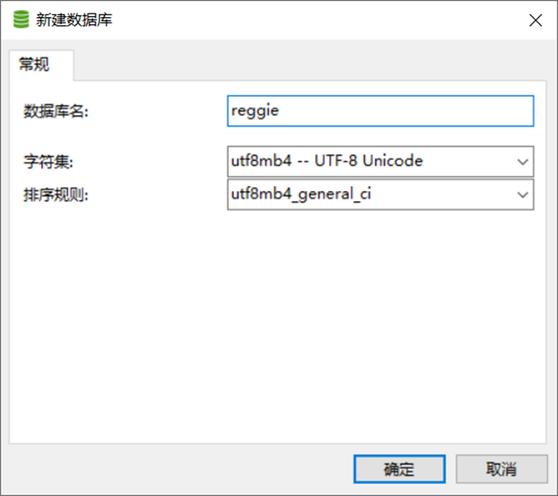
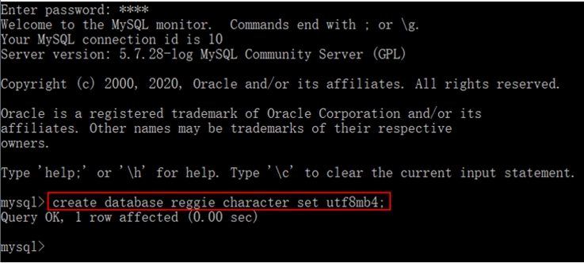
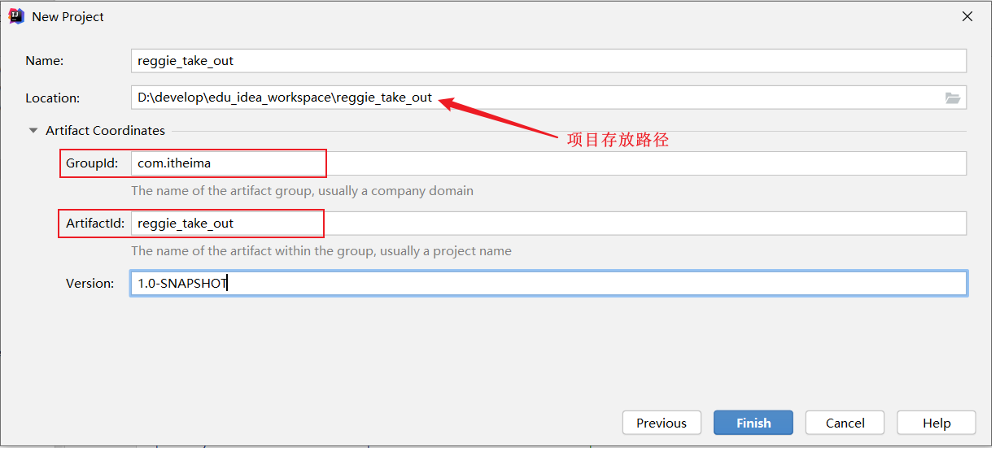
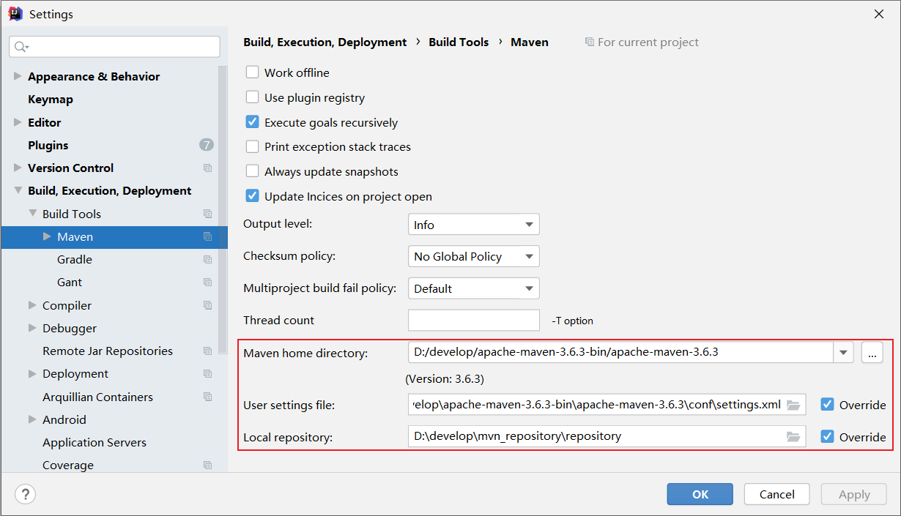
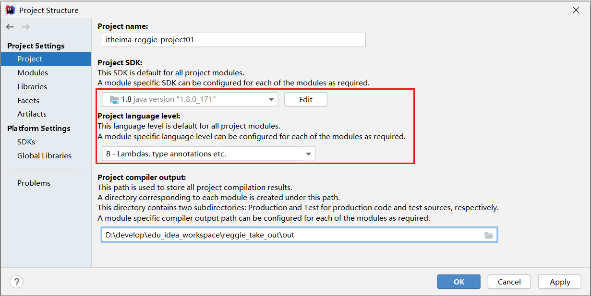
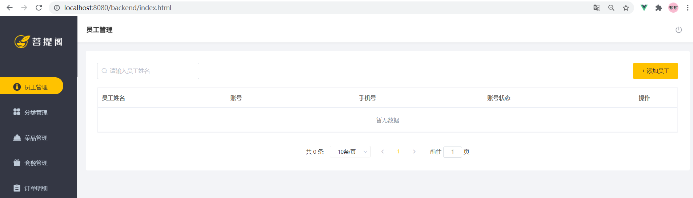
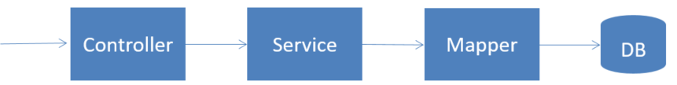

# 瑞吉外卖基础-Day01

## 1. 开发环境搭建

### 1.1 数据库环境搭建

#### 1.1.1 创建数据库

通过以下两种方式中的任意一种，创建项目的数据库:

1.**图形界面**



> 注意: 本项目数据库的字符串，选择 utf8mb4

2.**命令行**



#### 1.1.2 数据库表导入

直接将 `db_reggie.sql` 导入到数据库中:

1.**图形界面**


2.**命令行**


#### 1.1.3 数据库表介绍

| **序号** | **表名**      | **说明**         |
| -------- | ------------- | ---------------- |
| 1        | employee      | 员工表           |
| 2        | category      | 菜品和套餐分类表 |
| 3        | dish          | 菜品表           |
| 4        | setmeal       | 套餐表           |
| 5        | setmeal_dish  | 套餐菜品关系表   |
| 6        | dish_flavor   | 菜品口味关系表   |
| 7        | user          | 用户表（C端）    |
| 8        | address_book  | 地址簿表         |
| 9        | shopping_cart | 购物车表         |
| 10       | orders        | 订单表           |
| 11       | order_detail  | 订单明细表       |

### 1.2 Maven项目搭建

#### 1.2.1 创建maven项目

1. **在idea中创建maven project，项目名称 reggie_take_out**

    
2. **检查项目编码**

    

3. **检查maven配置**

    

4. **检查JDK版本**

    

#### 1.2.2 搭建基础环境

1.在pom.xml中导入依赖

::: details

```xml
<properties>
    <java.version>1.8</java.version>
</properties>

<parent>
    <groupId>org.springframework.boot</groupId>
    <artifactId>spring-boot-starter-parent</artifactId>
    <version>2.4.5</version>
    <relativePath/> <!-- lookup parent from repository -->
</parent>

<dependencies>
    <dependency>
        <groupId>org.springframework.boot</groupId>
        <artifactId>spring-boot-starter</artifactId>
    </dependency>
    <dependency>
        <groupId>org.springframework.boot</groupId>
        <artifactId>spring-boot-starter-test</artifactId>
        <scope>test</scope>
    </dependency>
    <dependency>
        <groupId>org.springframework.boot</groupId>
        <artifactId>spring-boot-starter-web</artifactId>
        <scope>compile</scope>
    </dependency>
    <dependency>
        <groupId>com.baomidou</groupId>
        <artifactId>mybatis-plus-boot-starter</artifactId>
        <version>3.4.2</version>
    </dependency>
    <dependency>
        <groupId>org.projectlombok</groupId>
        <artifactId>lombok</artifactId>
        <version>1.18.20</version>
    </dependency>
    <dependency>
        <groupId>com.alibaba</groupId>
        <artifactId>fastjson</artifactId>
        <version>1.2.76</version>
    </dependency>
    <dependency>
        <groupId>commons-lang</groupId>
        <artifactId>commons-lang</artifactId>
        <version>2.6</version>
    </dependency>
    <dependency>
        <groupId>mysql</groupId>
        <artifactId>mysql-connector-java</artifactId>
        <scope>runtime</scope>
    </dependency>
    <dependency>
        <groupId>com.alibaba</groupId>
        <artifactId>druid-spring-boot-starter</artifactId>
        <version>1.1.23</version>
    </dependency>
</dependencies>

<build>
    <plugins>
        <plugin>
            <groupId>org.springframework.boot</groupId>
            <artifactId>spring-boot-maven-plugin</artifactId>
            <version>2.4.5</version>
        </plugin>
    </plugins>
</build>
```

:::

2.在工程的resources目录下创建application.yml文件,并引入配置

::: details

```yml
server:
  port: 8080
spring:
  application:
    #应用名称 ，可选
    name: reggie_take_out
  datasource:
    druid:
      driver-class-name: com.mysql.cj.jdbc.Driver
      url: jdbc:mysql://localhost:3306/reggie?serverTimezone=Asia/Shanghai&useUnicode=true&characterEncoding=utf-8&zeroDateTimeBehavior=convertToNull&useSSL=false&allowPublicKeyRetrieval=true
      username: root
      password: root
mybatis-plus:
  configuration:
    #在映射实体或者属性时，将数据库中表名和字段名中的下划线去掉，按照驼峰命名法映射 address_book ---> AddressBook
    map-underscore-to-camel-case: true
    #日志输出
    log-impl: org.apache.ibatis.logging.stdout.StdOutImpl
  global-config:
    db-config:
      id-type: ASSIGN_ID
```

:::

3.创建包 com.itheima.reggie，并编写启动类

```java
import lombok.extern.slf4j.Slf4j;
import org.springframework.boot.SpringApplication;
import org.springframework.boot.autoconfigure.SpringBootApplication;

@Slf4j
@SpringBootApplication
public class ReggieApplication {
    public static void main(String[] args) {
        SpringApplication.run(ReggieApplication.class,args);
        log.info("项目启动成功...");
    }
}
```

> @Slf4j : 是lombok中提供的注解，通过slf4j记录日志  

#### 1.2.3 前端静态资源导入

1.**导入静态资源**

将 资料/前端资源 两个目录中的静态资源文件，导入到项目的resources目录下


2.**创建配置类WebMvcConfig，设置静态资源映射**

默认静态资源的存放目录为: "classpath:/resources/"，"classpath:/static/"，"classpath:/public/",而在项目中静态资源存放在 backend，front 目录中，这个时候要想访问到静态资源，就需要设置**静态资源映射**  

```java
import lombok.extern.slf4j.Slf4j;
import org.springframework.context.annotation.Configuration;
import org.springframework.web.servlet.config.annotation.ResourceHandlerRegistry;
import org.springframework.web.servlet.config.annotation.WebMvcConfigurationSupport;

@Slf4j
@Configuration
public class WebMvcConfig extends WebMvcConfigurationSupport {
    /**
     * 设置静态资源映射
     * @param registry
     */
    @Override
    protected void addResourceHandlers(ResourceHandlerRegistry registry) {
        log.info("开始进行静态资源映射...");
        registry.addResourceHandler("/backend/**").addResourceLocations("classpath:/backend/");
        registry.addResourceHandler("/front/**").addResourceLocations("classpath:/front/");
    }
}
```

3.**访问测试**

[http://localhost:8080/backend/index.html](http://localhost:8080/backend/index.html)



## 2. 后台系统登录功能

### 2.1 需求分析

1.**页面原型展示**


2.**登录页面成品展示**

登录页面存放目录 `/resources/backend/page/login/login.html`


3.**查看登录请求**

通过浏览器调试工具（F12），可以发现，点击登录按钮时，页面会发送请求  
请求地址为 [http://localhost:8080/employee/login](http://localhost:8080/employee/login)  
并提交参数 username 和 password  
请求参数为 json 格式数据 \{"username":"admin","password":"123456"\}  


> 此时报404，因为后台系统还没有响应此请求的处理器
> 

4.**数据模型(employee表)**


5.**前端页面分析**


当点击 "登录" 按钮，会触发Vue中定义的 handleLogin 方法


发送登录的异步请求之后， 获取到响应结果，在响应结果中至少包含三个属性: code、data、msg  

用户登录成功之后，服务端会返回用户信息，而前端是将这些用户信息，存储在客户端的 localStorage 中了  

```js
localStorage.setItem('userInfo',JSON.stringify(res.data))
```

### 2.2 代码开发

#### 2.2.1 基础准备工作

首先在工程下创建包结构


1.**创建实体类Employee**

该实体类主要用于员工表 employee 进行映射  

所属包: com.itheima.reggie.entity

```java
import com.baomidou.mybatisplus.annotation.FieldFill;
import com.baomidou.mybatisplus.annotation.TableField;
import lombok.Data;
import java.io.Serializable;
import java.time.LocalDateTime;

@Data
public class Employee implements Serializable {
    private static final long serialVersionUID = 1L;

    private Long id;

    private String username;

    private String name;

    private String password;

    private String phone;

    private String sex;

    private String idNumber; //驼峰命名法 ---> 映射的字段名为 id_number

    private Integer status;

    private LocalDateTime createTime;

    private LocalDateTime updateTime;

    @TableField(fill = FieldFill.INSERT)
    private Long createUser;

    @TableField(fill = FieldFill.INSERT_UPDATE)
    private Long updateUser;
}
```

2.**定义Mapper接口**

在MybatisPlus中，自定义的Mapper接口，需要继承自 BaseMapper  

所属包: com.itheima.reggie.mapper

```java
@Mapper
public interface EmployeeMapper extends BaseMapper<Employee>{
}
```

3.**Service接口**

本项目的Service接口，在定义时需要继承自MybatisPlus提供的Service层接口 IService，这样就可以直接调用父接口的方法直接执行业务操作，简化业务层代码实现  

所属包: com.itheima.reggie.service

```java
public interface EmployeeService extends IService<Employee> {
}
```

4.**Service实现类**

所属包: com.itheima.reggie.service.impl

```java
import com.baomidou.mybatisplus.extension.service.impl.ServiceImpl;
import com.itheima.reggie.entity.Employee;
import com.itheima.reggie.mapper.EmployeeMapper;
import com.itheima.reggie.service.EmployeeService;
import org.springframework.stereotype.Service;

@Service
public class EmployeeServiceImpl extends ServiceImpl<EmployeeMapper,Employee> implements EmployeeService{
}
```

5.**Controller基础代码**

所属包: com.itheima.reggie.controller

```java
import lombok.extern.slf4j.Slf4j;
import org.springframework.beans.factory.annotation.Autowired;
import org.springframework.web.bind.annotation.RequestMapping;
import org.springframework.web.bind.annotation.RestController;

@Slf4j
@RestController
@RequestMapping("/employee")
public class EmployeeController {

    @Autowired
    private EmployeeService employeeService;

}    
```

6.**导入通用结果类R**

此类是一个通用结果类，服务端响应的所有结果最终都会包装成此种类型返回给前端页面  

所属包: com.itheima.reggie.common

```java
import lombok.Data;
import java.util.HashMap;
import java.util.Map;

/**
 * 通用返回结果，服务端响应的数据最终都会封装成此对象
 * @param <T>
 */
@Data
public class R<T> {
    private Integer code; //编码：1成功，0和其它数字为失败
    private String msg; //错误信息
    private T data; //数据
    private Map map = new HashMap(); //动态数据

    public static <T> R<T> success(T object) {
        R<T> r = new R<T>();
        r.data = object;
        r.code = 1;
        return r;
    }
    public static <T> R<T> error(String msg) {
        R r = new R();
        r.msg = msg;
        r.code = 0;
        return r;
    }
    public R<T> add(String key, Object value) {
        this.map.put(key, value);
        return this;
    }
}
```

> A. 如果业务执行结果为成功，构建R对象时，只需要调用 success 方法; 如果需要返回数据传递 object 参数，如果无需返回，可以直接传递null  
>
> B. 如果业务执行结果为失败，构建R对象时，只需要调用error 方法，传递错误提示信息即可  

#### 2.2.2 登录逻辑分析


::: tip 处理逻辑如下

1. 将页面提交的密码password进行md5加密处理，得到加密后的字符串

1. 根据页面提交的用户名username查询数据库中员工数据信息

1. 如果没有查询到，则返回登录失败结果

1. 密码比对，如果不一致，则返回登录失败结果

1. 查看员工状态，如果为已禁用状态，则返回员工已禁用结果

1. 登录成功，将员工id存入Session，并返回登录成功结果

:::

#### 2.2.3 代码实现

**技术点说明:** :

A. 前端发起的请求为post请求，所以服务端需要使用注解 @PostMapping

B. 由于前端传递的请求参数为json格式的数据，这里使用Employee对象接收，但是将json格式数据封装到实体类中，在形参前需要加注解@RequestBody

```java
/**
 * 员工登录
 * @param request
 * @param employee
 * @return
 */
@PostMapping("/login")
public R<Employee> login(HttpServletRequest request,@RequestBody Employee employee){

    //1、将页面提交的密码password进行md5加密处理
    String password = employee.getPassword();
    password = DigestUtils.md5DigestAsHex(password.getBytes());

    //2、根据页面提交的用户名username查询数据库
    LambdaQueryWrapper<Employee> queryWrapper = new LambdaQueryWrapper<>();
    queryWrapper.eq(Employee::getUsername,employee.getUsername());
    Employee emp = employeeService.getOne(queryWrapper);

    //3、如果没有查询到则返回登录失败结果
    if(emp == null){
        return R.error("登录失败");
    }

    //4、密码比对，如果不一致则返回登录失败结果
    if(!emp.getPassword().equals(password)){
        return R.error("登录失败");
    }

    //5、查看员工状态，如果为已禁用状态，则返回员工已禁用结果
    if(emp.getStatus() == 0){
        return R.error("账号已禁用");
    }

    //6、登录成功，将员工id存入Session并返回登录成功结果
    request.getSession().setAttribute("employee",emp.getId());
    return R.success(emp);
}
```

### 2.3 功能测试

启动项目，访问url: [http://localhost:8080/backend/page/login/login.html](http://localhost:8080/backend/page/login/login.html)

在测试过程中，可以通过debug断点调试的方式来跟踪程序的执行过程，并且可以查看程序运行时各个对象的具体赋值情况  而且需要注意，在测试过程中，需要将所有的情况都覆盖到  

1.**问题说明**

进行debug端点调试时，前端可能会出现如下问题: 前 端页面的控制台报出错误-超时;


2.**解决方案**

前端进行异步请求时，默认超时10000ms ，可以将该值调大一些  


> **由于修改了JS文件，需要手动清理一下浏览器缓存，避免缓存影响，JS不能及时生效**

## 3. 后台系统退出功能

### 3.1 需求分析

在后台管理系统中，管理员或者员工，登录进入系统之后，页面跳转到后台系统首页面(backend/index.html)，此时会在系统的右上角显示当前登录用户的姓名  

如果员工需要退出系统，直接点击右侧的退出按钮即可退出系统，退出系统后页面应跳转回登录页面  

1.**退出页面展示**


2.**前端页面分析**


点击  将会调用一个js方法logout，在logout的方法中执行如下逻辑:


A. 发起post请求，调用服务端接口 /employee/logout 执行退出操作 ;

B. 删除客户端 localStorage 中存储的用户登录信息，跳转至登录页面 ;

### 3.2 代码实现

需要在Controller中创建对应的处理方法 ，接收页面发送的POST请求 /employee/logout ，具体的处理逻辑：

A. 清理Session中的用户id

B. 返回结果

```java
/**
* 员工退出
* @param request
* @return
*/
@PostMapping("/logout")
public R<String> logout(HttpServletRequest request){
    //清理Session中保存的当前登录员工的id
    request.getSession().removeAttribute("employee");
    return R.success("退出成功");
}
```

### 3.3 功能测试

1. 重启服务，访问登录界面 [http://localhost:8080/backend/page/login/login.html](http://localhost:8080/backend/page/login/login.html) ;

2. 登录完成之后，进入到系统首页 backend/index.html，点击右上角  按钮 执行退出操作，完成后看看是否可以跳转到登录页面 ，并检查localStorage  


