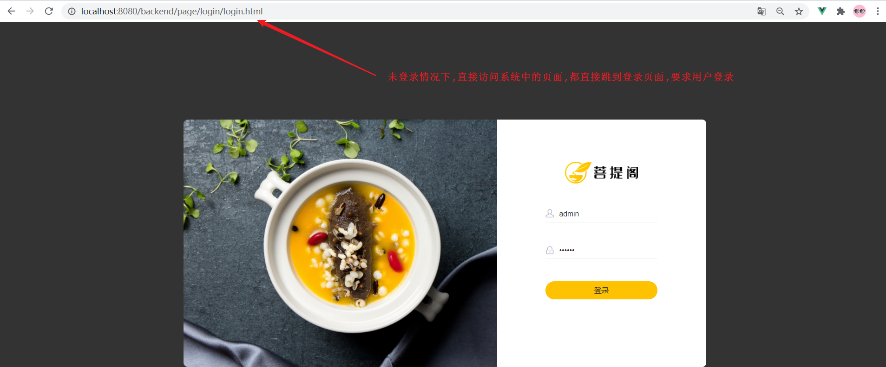
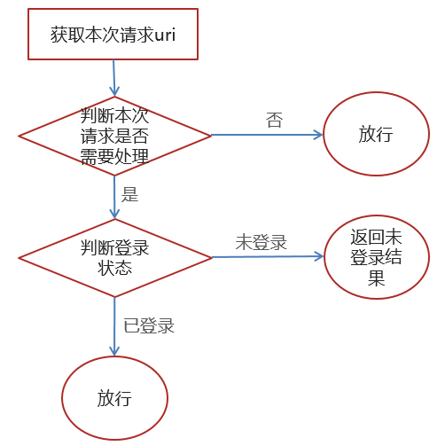
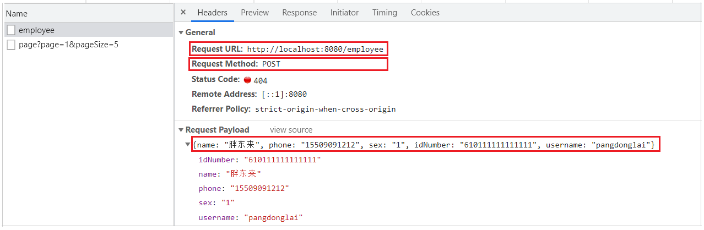
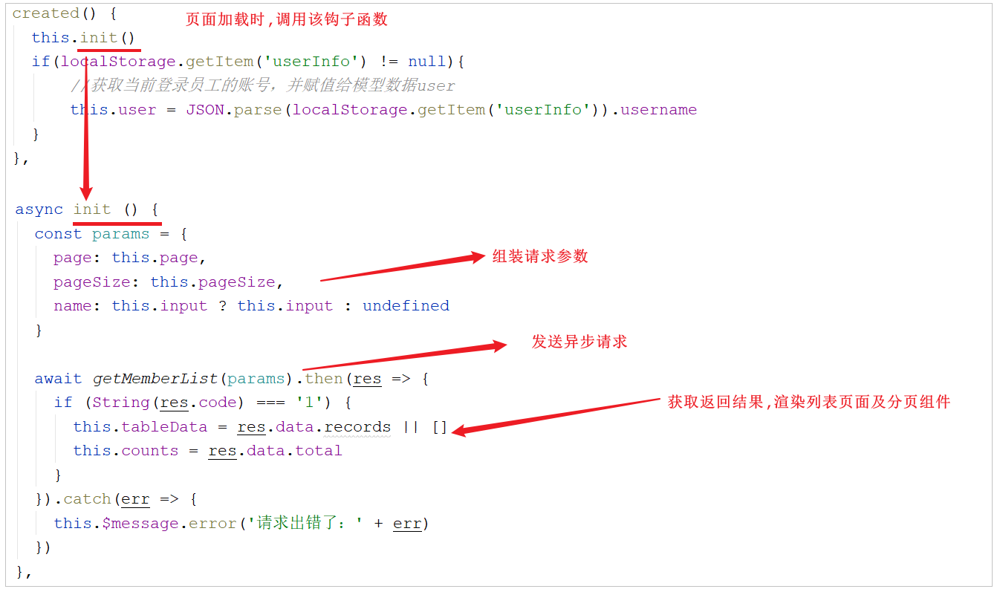
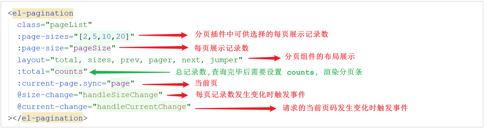
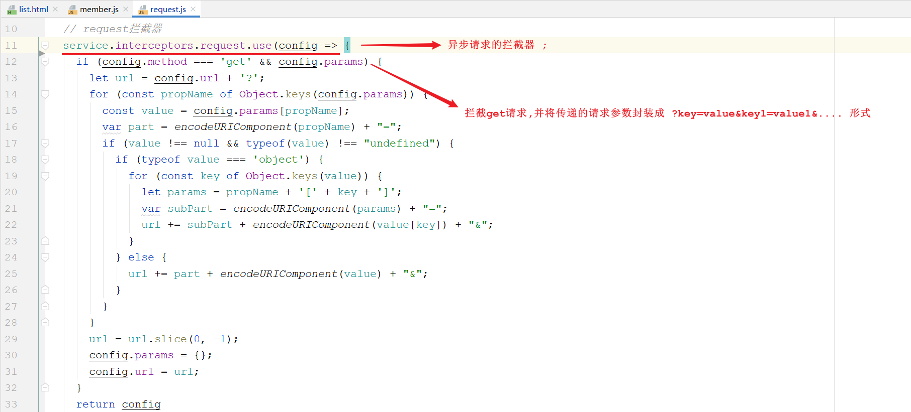
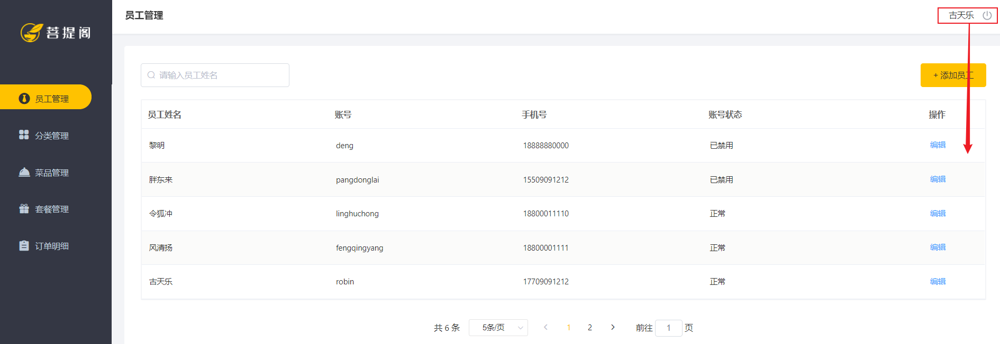
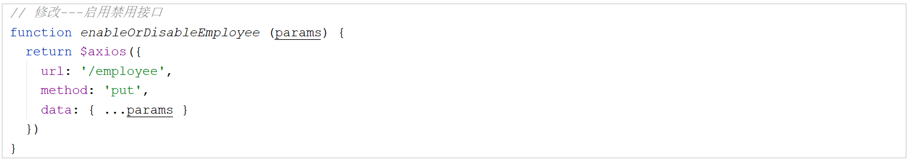
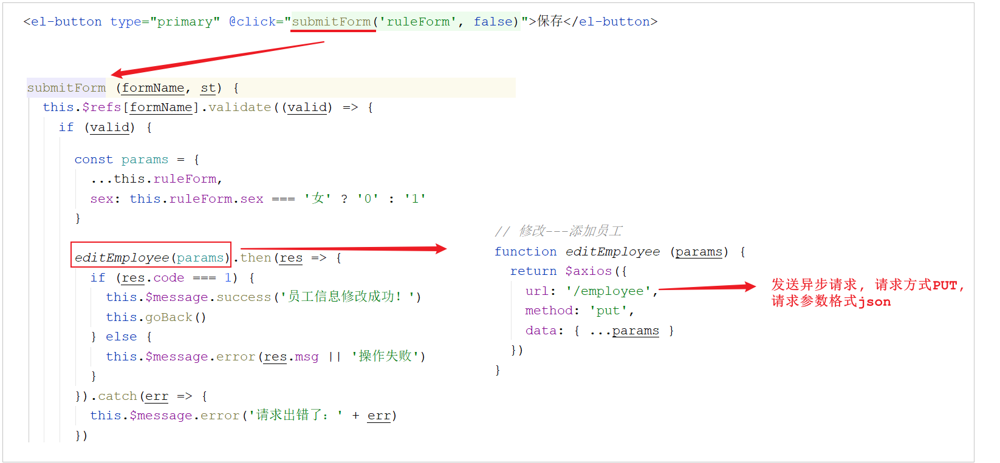

# 瑞吉外卖基础-Day02

## 1. 完善登录功能

### 1.1 问题分析

**1. 目前现状**：

用户如果不登录，直接访问系统首页面，照样可以正常访问  


**2. 理想效果**：

上述这种设计并不合理，只有登录成功后才可以访问系统中的页面，如果没有登录，访问系统中的任何界面都直接跳转到登录页面  



**具体应该怎么实现呢？**

可以使用过滤器、拦截器来实现，在过滤器、拦截器中拦截前端发起的请求，判断用户是否已经完成登录，如果没有登录则返回提示信息，跳转到登录页面  

### 1.2 思路分析



**过滤器具体的处理逻辑如下：**

1. 获取本次请求的URI

1. 判断本次请求，是否需要登录，才可以访问

1. 如果不需要，则直接放行

1. 判断登录状态，如果已登录，则直接放行

1. 如果未登录，则返回未登录结果

如果未登录，需要给前端返回什么样的结果呢?


### 1.3 代码实现

**1. 定义登录校验过滤器**:

自定义一个过滤器 LoginCheckFilter 并实现 Filter 接口，在doFilter方法中完成校验的逻辑

所属包: com.itheima.reggie.filter

```java
import com.alibaba.fastjson.JSON;
import com.itheima.reggie.common.R;
import lombok.extern.slf4j.Slf4j;
import org.springframework.util.AntPathMatcher;

import javax.servlet.*;
import javax.servlet.annotation.WebFilter;
import javax.servlet.http.HttpServletRequest;
import javax.servlet.http.HttpServletResponse;
import java.io.IOException;

/**
 * 检查用户是否已经完成登录
 */
@WebFilter(filterName = "loginCheckFilter",urlPatterns = "/*")
@Slf4j
public class LoginCheckFilter implements Filter{
    //路径匹配器，支持通配符
    public static final AntPathMatcher PATH_MATCHER = new AntPathMatcher();

    @Override
    public void doFilter(ServletRequest servletRequest, ServletResponse servletResponse, FilterChain filterChain) throws IOException, ServletException {
        HttpServletRequest request = (HttpServletRequest) servletRequest;
        HttpServletResponse response = (HttpServletResponse) servletResponse;

        //1、获取本次请求的URI
        String requestURI = request.getRequestURI();// /backend/index.html

        log.info("拦截到请求：{}",requestURI);

        //定义不需要处理的请求路径
        String[] urls = new String[]{
                "/employee/login",
                "/employee/logout",
                "/backend/**",
                "/front/**"
        };

        //2、判断本次请求是否需要处理
        boolean check = check(urls, requestURI);

        //3、如果不需要处理，则直接放行
        if(check){
            log.info("本次请求{}不需要处理",requestURI);
            filterChain.doFilter(request,response);
            return;
        }

        //4、判断登录状态，如果已登录，则直接放行
        if(request.getSession().getAttribute("employee") != null){
            log.info("用户已登录，用户id为：{}",request.getSession().getAttribute("employee"));
            filterChain.doFilter(request,response);
            return;
        }

        log.info("用户未登录");
        //5、如果未登录则返回未登录结果，通过输出流方式向客户端页面响应数据
        response.getWriter().write(JSON.toJSONString(R.error("NOTLOGIN")));
        return;

    }

    /**
     * 路径匹配，检查本次请求是否需要放行
     * @param urls
     * @param requestURI
     * @return
     */
    public boolean check(String[] urls,String requestURI){
        for (String url : urls) {
            boolean match = PATH_MATCHER.match(url, requestURI);
            if(match){
                return true;
            }
        }
        return false;
    }
}
```

> AntPathMatcher 拓展:
>
> **介绍:** Spring中提供的路径匹配器 ;
>
> **通配符规则:**
>
> | 符号 | 含义                   |
> | ---- | ---------------------- |
> | ?    | 匹配一个字符           |
> | *    | 匹配0个或多个字符      |
> | **   | 匹配0个或多个目录/字符 |

**2. 开启组件扫描**:

需要在引导类上，加上Servlet组件扫描的注解，来扫描过滤器配置的@WebFilter注解，扫描上之后，过滤器在运行时就生效了  

```java
@Slf4j
@SpringBootApplication
@ServletComponentScan
public class ReggieApplication {
    public static void main(String[] args) {
        SpringApplication.run(ReggieApplication.class,args);
        log.info("项目启动成功...");
    }
}
```

> @ServletComponentScan 的作用:
> ​在SpringBoot项目中，在引导类/配置类上加了该注解后，会自动扫描项目中(当前包及其子包下)的@WebServlet ，@WebFilter ，@WebListener 注解，自动注册Servlet的相关组件

### 1.4 功能测试

代码编写完毕之后，重启工程，在浏览器地址栏直接输入系统管理后台首页，看看是否可以跳转到登录页面即可，也可以通过debug的形式来跟踪一下代码执行的过程  


对于前端的代码，也可以进行debug调试  

F12打开浏览器的调试工具，找到前面提到的request.js，在request.js的响应拦截器位置打上断点  


## 2. 新增员工

### 2.1 需求分析

后台系统中可以管理员工信息，通过新增员工来添加后台系统用户  点击[添加员工]按钮跳转到新增页面，如下：


当填写完表单信息，点击"保存"按钮后，会提交该表单的数据到服务端，在服务端中需要接受数据，然后将数据保存至数据库中  

### 2.2 数据模型

新增员工，其实就是将新增页面录入的员工数据插入到employee表  employee表中的status字段已经设置了默认值1，表示状态正常  


需要注意，employee表中对username字段加入了唯一约束，因为username是员工的登录账号，必须是唯一的  


### 2.3 程序执行流程

在开发代码之前，需要结合着前端页面发起的请求，梳理一下整个程序的执行过程：



A. 点击"保存"按钮，页面发送ajax请求，将新增员工页面中输入的数据以json的形式提交到服务端，请求方式POST，请求路径 /employee

B. 服务端Controller接收页面提交的数据并调用Service将数据进行保存

C. Service调用Mapper操作数据库，保存数据

### 2.4 代码实现

在EmployeeController中增加save方法，用于保存用户员工信息  

A. 在新增员工时，按钮页面原型中的需求描述，需要给员工设置初始默认密码 123456，并对密码进行MD5加密  

B. 在组装员工信息时，还需要封装创建时间、修改时间，创建人、修改人信息(从session中获取当前登录用户)  

``` java
/**
 * 新增员工
 * @param employee
 * @return
 */
@PostMapping
public R<String> save(HttpServletRequest request,@RequestBody Employee employee){
    log.info("新增员工，员工信息：{}",employee.toString());

    //设置初始密码123456，需要进行md5加密处理
    employee.setPassword(DigestUtils.md5DigestAsHex("123456".getBytes()));

    employee.setCreateTime(LocalDateTime.now());
    employee.setUpdateTime(LocalDateTime.now());

    //获得当前登录用户的id
    Long empId = (Long) request.getSession().getAttribute("employee");

    employee.setCreateUser(empId);
    employee.setUpdateUser(empId);

    employeeService.save(employee);
    return R.success("新增员工成功");
}
```

### 2.5 功能测试

代码编写完毕之后，需要将工程重启，完毕之后直接访问管理系统首页，点击 "员工管理" 页面中的 "添加员工" 按钮，输入员工基本信息，然后点击 "保存" 进行数据保存，保存完毕后，检查数据库中是否录入员工数据  

当在测试中，添加用户时，输入了一个已存在的用户名时，前端界面出现错误提示信息：


而此时，服务端已经报错了，报错信息如下：


出现上述的错误，主要就是因为在 employee 表结构中，针对于username字段，建立了唯一索引，添加重复的username数据时，违背该约束，就会报错  但是此时前端提示的信息并不具体，用户并不知道是因为什么原因造成的该异常，需要给用户提示详细的错误信息  

### 2.6 全局异常处理

#### 2.6.1 思路分析

要想解决上述测试中存在的问题，需要对程序中可能出现的异常进行捕获，通常有两种处理方式：

1. **在Controller方法中加入 try...catch 进行异常捕获**

    

    如果采用这种方式，虽然可以解决，但是存在弊端，需要在保存其他业务数据时，也需要在Controller方法中加上try...catch进行处理，代码冗余，不通用  

2. **使用异常处理器进行全局异常捕获**

    采用这种方式来实现，只需要在项目中定义一个通用的全局异常处理器，就可以解决本项目的所有异常  

#### 2.6.2 全局异常处理器

在项目中自定义一个全局异常处理器，在异常处理器上加上注解 @ControllerAdvice，可以通过属性annotations指定拦截哪一类的Controller方法   并在异常处理器的方法上加上注解 @ExceptionHandler 来指定拦截的是那一类型的异常  

> 异常处理方法逻辑:
>
> - 指定捕获的异常类型为 SQLIntegrityConstraintViolationException
> - 解析异常的提示信息，获取出是那个值违背了唯一约束
> - 组装错误信息并返回


所属包: com.itheima.reggie.common

```java
import lombok.extern.slf4j.Slf4j;
import org.springframework.stereotype.Controller;
import org.springframework.web.bind.annotation.ControllerAdvice;
import org.springframework.web.bind.annotation.ExceptionHandler;
import org.springframework.web.bind.annotation.ResponseBody;
import org.springframework.web.bind.annotation.RestController;
import java.sql.SQLIntegrityConstraintViolationException;

/**
 * 全局异常处理
 */
@ControllerAdvice(annotations = {RestController.class, Controller.class})
@ResponseBody
@Slf4j
public class  GlobalExceptionHandler {

    /**
     * 异常处理方法
     * @return
     */
    @ExceptionHandler(SQLIntegrityConstraintViolationException.class)
    public R<String> exceptionHandler(SQLIntegrityConstraintViolationException ex){
        log.error(ex.getMessage());
        if(ex.getMessage().contains("Duplicate entry")){
            String[] split = ex.getMessage().split(" ");
            String msg = split[2] + "已存在";
            return R.error(msg);
        }
        return R.error("未知错误");
    }
}
```

> 注解说明:
>
> ​上述的全局异常处理器上使用了的两个注解 @ControllerAdvice ，@ResponseBody ，他们的作用分别为:
>
> ​@ControllerAdvice : 指定拦截那些类型的控制器;
>
> ​@ResponseBody: 将方法的返回值 R 对象转换为json格式的数据，响应给页面;
>
> ​上述使用的两个注解，也可以合并成为一个注解 @RestControllerAdvice
>

#### 2.6.3 测试

输入一个已存在的用户名时，前端界面出现如下错误提示信息：


## 3. 员工分页查询

### 3.1 需求分析

分页查询页面中，除了分页条件以外，还有一个查询条件 "员工姓名"  


- 请求参数

  - 搜索条件： 员工姓名(模糊查询)

  - 分页条件： 每页展示条数 ，页码

- 响应数据

  - 总记录数

  - 结果列表

### 3.2 程序执行流程

#### 3.2.1 页面流程分析

A. 点击菜单，打开员工管理页面时，执行查询：


B. 搜索栏输入员工姓名，回车，执行查询:


1. 页面发送ajax请求，将分页查询参数(page、pageSize、name)提交到服务端

2. 服务端Controller接收页面提交的数据，并组装条件调用Service查询数据

3. Service调用Mapper操作数据库，查询分页数据

4. Controller将查询到的分页数据，响应给前端页面

5. 页面接收到分页数据，并通过ElementUI的Table组件展示到页面上

#### 3.2.2 前端代码介绍

1. 访问员工列表页面`/member/list.html`时，会触发Vuejs中的钩子方法，在页面初始化时调用created方法

    

    从上述的前端代码中可以看到，执行完分页查询，需要给前端返回的信息中需要包含两项 : `records`中封装结果列表，`total`中封装总记录数  

    而在组装请求参数时，page、pageSize 都是前端分页插件渲染时的参数

    

2. 在getMemberList方法中，通过axios发起异步请求

    

    axios发起的异步请求会被声明在 request.js 中的request拦截器拦截，在其中对get请求进行进一步的封装处理

    

**最终发送给服务端的请求为**:  
GET请求，请求链接 /employee/page?page=1&pageSize=10&name=xxx

### 3.3 代码实现

#### 3.3.1 分页插件配置

MybatisPlus要实现分页功能，就需要用到MybatisPlus中提供的分页插件，要使用分页插件，就要在配置类中声明分页插件的bean对象  

所属包: com.itheima.reggie.config

```java
import com.baomidou.mybatisplus.extension.plugins.MybatisPlusInterceptor;
import com.baomidou.mybatisplus.extension.plugins.inner.PaginationInnerInterceptor;
import org.springframework.context.annotation.Bean;
import org.springframework.context.annotation.Configuration;

/**
 * 配置MP的分页插件
 */
@Configuration
public class MybatisPlusConfig {

    @Bean
    public MybatisPlusInterceptor mybatisPlusInterceptor(){
        MybatisPlusInterceptor mybatisPlusInterceptor = new MybatisPlusInterceptor();
        mybatisPlusInterceptor.addInnerInterceptor(new PaginationInnerInterceptor());
        return mybatisPlusInterceptor;
    }
}
```

#### 3.3.2 分页查询实现

分页查询具体的请求信息如下:

| 请求     | 说明                   |
| -------- | ---------------------- |
| 请求方式 | GET                    |
| 请求路径 | /employee/page         |
| 请求参数 | page ，pageSize ，name |

那么查询完毕后需要给前端返回什么样的结果呢?

::: tip 查询返回的结果数据data中应该封装两项信息，分别为  

records 封装分页列表数据  
total 封装符合条件的总记录数  

在定义controller方法的返回值类型R时，可以直接将 MybatisPlus 分页查询的结果 Page 直接封装返回，因为Page中的属性如下:

:::


具体的逻辑如下:

A. 构造分页条件

B. 构建搜索条件 - name进行模糊匹配

C. 构建排序条件 - 更新时间倒序排序

D. 执行查询

E. 组装结果并返回

具体的代码实现如下:

```java
/**
 * 员工信息分页查询
 * @param page 当前查询页码
 * @param pageSize 每页展示记录数
 * @param name 员工姓名 - 可选参数
 * @return
 */
@GetMapping("/page")
public R<Page> page(int page,int pageSize,String name){
    log.info("page = {},pageSize = {},name = {}" ,page,pageSize,name);
    //构造分页构造器
    Page pageInfo = new Page(page,pageSize);

    //构造条件构造器
    LambdaQueryWrapper<Employee> queryWrapper = new LambdaQueryWrapper();
    //添加过滤条件
    queryWrapper.like(StringUtils.isNotEmpty(name),Employee::getName,name);
    //添加排序条件
    queryWrapper.orderByDesc(Employee::getUpdateTime);

    //执行查询
    employeeService.page(pageInfo,queryWrapper);
    return R.success(pageInfo);
}
```

### 3.4 功能测试

进行测试时，可以使用浏览器的监控工具查看页面和服务端的数据交互细节，并借助于debug的形式，根据服务端参数接收及逻辑执行情况  


测试过程中可以发现，对于员工状态字段（status）服务端返回的是状态码（1或者0），但是页面上显示的则是“正常”或者“已禁用”，这是因为页面中在展示数据时进行了处理  


## 4. 启用/禁用员工账号

### 4.1 需求分析

1. 在员工管理列表页面，可以对某个员工账号进行启用或者禁用操作  
1. 账号禁用的员工不能登录系统，启用后的员工可以正常登录  
1. 如果某个员工账号状态为正常，则按钮显示为 "禁用"，如果员工账号状态为已禁用，则按钮显示为"启用"  

> 需要注意，只有管理员（admin用户）可以对其他普通用户进行启用、禁用操作  

**A. admin 管理员登录**:


**B. 普通用户登录**:



### 4.2 程序执行流程

#### 4.2.1 页面按钮动态展示

页面中是怎么做到只有管理员admin能够看到启用、禁用按钮的？

1. 在列表页面(list.html)加载时，触发钩子函数created，在钩子函数中，会从localStorage中获取到用户登录信息，然后获取到用户名

    

2. 在页面中，通过Vue指令v-if进行判断，如果登录用户为admin将展示`启用/禁用`按钮，否则不展示

    

#### 4.2.2 执行流程分析

1. 当管理员admin点击 "启用" 或 "禁用" 按钮时，调用方法statusHandle

    

    > scope.row : 获取到的是这一行的数据信息 ;

2. statusHandle方法中进行二次确认，然后发起ajax请求，传递id、status参数

    

    

    最终发起异步请求，请求服务端，请求信息如下：

    | 请求     | 说明                    |
    | -------- | ----------------------- |
    | 请求方式 | PUT                     |
    | 请求路径 | /employee               |
    | 请求参数 | \{"id":xxx，"status":xxx\} |

    > **\{\.\.\.params}** : 三点是ES6中出现的扩展运算符  作用是遍历当前使用的对象能够访问到的所有属性，并将属性放入当前对象中  

### 4.3 代码实现

梳理一下整个程序的执行过程：

1. 页面发送ajax请求，将参数(id、status)提交到服务端

2. 服务端Controller接收页面提交的数据并调用Service更新数据

3. Service调用Mapper操作数据库

启用、禁用员工账号，本质上就是一个更新操作，也就是对status状态字段进行操作  在Controller中创建update方法，此方法是一个通用的修改员工信息的方法  

```java
/**
 * 根据id修改员工信息
 * @param employee
 * @return
 */
@PutMapping
public R<String> update(HttpServletRequest request,@RequestBody Employee employee){
    log.info(employee.toString());

    Long empId = (Long)request.getSession().getAttribute("employee");

    employee.setUpdateTime(LocalDateTime.now());
    employee.setUpdateUser(empId);
    employeeService.updateById(employee);

    return R.success("员工信息修改成功");
}
```

### 4.4 功能测试


测试过程中没有报错，但是功能并没有实现，查看数据库中的数据也没有变化，但是从控制台输出的日志，可以看出确实没有更新成功  


而在的数据库表结构中，并不存在该ID，数据库中风清扬对应的ID为 1420038345634918401


### 4.5 代码修复

#### 4.5.1 原因分析


通过观察控制台输出的SQL发现页面传递过来的员工id的值和数据库中的id值不一致，这是怎么回事呢？

在分页查询时，服务端会将返回的R对象进行json序列化，转换为json格式的数据，而员工的ID是一个Long类型的数据，而且是一个长度为 19 位的长整型数据，该数据返回给前端是没有问题的  


**那么具体的问题出现在哪儿呢？**

问题实际上，就出现在前端JS中，js在对长度较长的长整型数据进行处理时，会损失精度，从而导致提交的id和数据库中的id不一致   这里，也可以做一个简单的测试，代码如下：

```html
<!DOCTYPE html>
<html lang="en">
<head>
    <meta charset="UTF-8">
    <title>Title</title>
    <script>
        alert(1420038345634918401);
    </script>
</head>
<body>
</body>
</html>
```

#### 4.5.2 解决方案

要想解决这个问题，也很简单，只需要让js处理的ID数据类型为字符串类型即可，这样就不会损失精度了。同样，也可以做一个测试：

```html
<!DOCTYPE html>
<html lang="en">
<head>
    <meta charset="UTF-8">
    <title>Title</title>
    <script>
        alert("1420038345634918401");
    </script>
</head>
<body>
</body>
</html>
```

那么在的业务中，只需要让分页查询返回的json格式数据库中，long类型的属性，不直接转换为数字类型，转换为字符串类型就可以解决这个问题了 ，最终返回的结果为 :


#### 4.5.3 代码修复

由于在SpringMVC中，将Controller方法返回值转换为json对象，是通过jackson来实现的，涉及到SpringMVC中的一个消息转换器MappingJackson2HttpMessageConverter，所以要解决这个问题，就需要对该消息转换器的功能进行拓展  

**具体实现步骤：**

1. 提供对象转换器JacksonObjectMapper，基于Jackson进行Java对象到json数据的转换（直接复制到项目中使用）

2. 在WebMvcConfig配置类中扩展Spring mvc的消息转换器，在此消息转换器中使用提供的对象转换器进行Java对象到json数据的转换

**1. 引入JacksonObjectMapper**:

```java
import com.fasterxml.jackson.databind.DeserializationFeature;
import com.fasterxml.jackson.databind.ObjectMapper;
import com.fasterxml.jackson.databind.module.SimpleModule;
import com.fasterxml.jackson.databind.ser.std.ToStringSerializer;
import com.fasterxml.jackson.datatype.jsr310.deser.LocalDateDeserializer;
import com.fasterxml.jackson.datatype.jsr310.deser.LocalDateTimeDeserializer;
import com.fasterxml.jackson.datatype.jsr310.deser.LocalTimeDeserializer;
import com.fasterxml.jackson.datatype.jsr310.ser.LocalDateSerializer;
import com.fasterxml.jackson.datatype.jsr310.ser.LocalDateTimeSerializer;
import com.fasterxml.jackson.datatype.jsr310.ser.LocalTimeSerializer;
import java.math.BigInteger;
import java.time.LocalDate;
import java.time.LocalDateTime;
import java.time.LocalTime;
import java.time.format.DateTimeFormatter;
import static com.fasterxml.jackson.databind.DeserializationFeature.FAIL_ON_UNKNOWN_PROPERTIES;

/**
 * 对象映射器:基于jackson将Java对象转为json，或者将json转为Java对象
 * 将JSON解析为Java对象的过程称为 [从JSON反序列化Java对象]
 * 从Java对象生成JSON的过程称为 [序列化Java对象到JSON]
 */
public class JacksonObjectMapper extends ObjectMapper {
    public static final String DEFAULT_DATE_FORMAT = "yyyy-MM-dd";
    public static final String DEFAULT_DATE_TIME_FORMAT = "yyyy-MM-dd HH:mm:ss";
    public static final String DEFAULT_TIME_FORMAT = "HH:mm:ss";
    public JacksonObjectMapper() {
        super();
        //收到未知属性时不报异常
        this.configure(FAIL_ON_UNKNOWN_PROPERTIES, false);
        //反序列化时，属性不存在的兼容处理
        this.getDeserializationConfig().withoutFeatures(DeserializationFeature.FAIL_ON_UNKNOWN_PROPERTIES);

        SimpleModule simpleModule = new SimpleModule()
                .addDeserializer(LocalDateTime.class, new LocalDateTimeDeserializer(DateTimeFormatter.ofPattern(DEFAULT_DATE_TIME_FORMAT)))
                .addDeserializer(LocalDate.class, new LocalDateDeserializer(DateTimeFormatter.ofPattern(DEFAULT_DATE_FORMAT)))
                .addDeserializer(LocalTime.class, new LocalTimeDeserializer(DateTimeFormatter.ofPattern(DEFAULT_TIME_FORMAT)))

                .addSerializer(BigInteger.class, ToStringSerializer.instance)
                .addSerializer(Long.class, ToStringSerializer.instance)

                .addSerializer(LocalDateTime.class, new LocalDateTimeSerializer(DateTimeFormatter.ofPattern(DEFAULT_DATE_TIME_FORMAT)))
                .addSerializer(LocalDate.class, new LocalDateSerializer(DateTimeFormatter.ofPattern(DEFAULT_DATE_FORMAT)))
                .addSerializer(LocalTime.class, new LocalTimeSerializer(DateTimeFormatter.ofPattern(DEFAULT_TIME_FORMAT)));
        //注册功能模块 例如，可以添加自定义序列化器和反序列化器
        this.registerModule(simpleModule);
    }
}
```

该自定义的对象转换器，主要指定了，在进行json数据序列化及反序列化时，LocalDateTime、LocalDate、LocalTime的处理方式，以及BigInteger及Long类型数据，直接转换为字符串  

**2. 在WebMvcConfig中重写方法extendMessageConverters**:

```java
/**
 * 扩展mvc框架的消息转换器
 * @param converters
 */
@Override
protected void extendMessageConverters(List<HttpMessageConverter<?>> converters) {
    log.info("扩展消息转换器...");
    //创建消息转换器对象
    MappingJackson2HttpMessageConverter messageConverter = new MappingJackson2HttpMessageConverter();
    //设置对象转换器，底层使用Jackson将Java对象转为json
    messageConverter.setObjectMapper(new JacksonObjectMapper());
    //将上面的消息转换器对象追加到mvc框架的转换器集合中
    converters.add(0,messageConverter);
}
```

## 5. 编辑员工信息

### 5.1 需求分析


需要实现两个方法:

A. 根据ID查询，用于页面数据回显

B. 保存修改

### 5.2 程序执行流程

1. 点击编辑按钮时，页面跳转到add.html，并在url中携带参数[员工id]

    

2. 在add.html页面获取url中的参数[员工id]

3. 发送ajax请求，请求服务端，同时提交员工id参数

4. 服务端接收请求，根据员工id查询员工信息，将员工信息以json形式响应给页面

    

5. 页面接收服务端响应的json数据，通过VUE的数据绑定进行员工信息回显

6. 点击保存按钮，发送ajax请求，将页面中的员工信息以json方式提交给服务端

7. 服务端接收员工信息，并进行处理，完成后给页面响应

8. 页面接收到服务端响应信息后进行相应处理



> 注意：add.html页面为公共页面，新增员工和编辑员工都是在此页面操作

### 5.3 代码实现

#### 5.3.1 根据ID查询

经过上述的分析，在根据ID查询员工信息时，请求信息如下:

| 请求     | 说明           |
| -------- | -------------- |
| 请求方式 | GET            |
| 请求路径 | /employee/{id} |

**代码实现**:

在EmployeeController中增加方法，根据ID查询员工信息  

```java
/**
 * 根据id查询员工信息
 * @param id
 * @return
 */
@GetMapping("/{id}")
public R<Employee> getById(@PathVariable Long id){
    log.info("根据id查询员工信息...");
    Employee employee = employeeService.getById(id);
    if(employee != null){
        return R.success(employee);
    }
    return R.error("没有查询到对应员工信息");
}
```

#### 5.3.2 修改员工

经过上述的分析，在修改员工信息时，请求信息如下:

| 请求     | 说明                   |
| -------- | ---------------------- |
| 请求方式 | PUT                    |
| 请求路径 | /employee              |
| 请求参数 | {.......} json格式数据 |

**代码实现:**

在EmployeeController中增加方法，根据ID更新员工信息  

```java
/**
 * 根据id修改员工信息
 * @param employee
 * @return
 */
@PutMapping
public R<String> update(HttpServletRequest request,@RequestBody Employee employee){
    log.info(employee.toString());

    Long empId = (Long)request.getSession().getAttribute("employee");

    employee.setUpdateTime(LocalDateTime.now());
    employee.setUpdateUser(empId);
    employeeService.updateById(employee);

    return R.success("员工信息修改成功");
}
```

### 5.4 功能测试

代码编写完毕之后，需要将工程重启   然后访问前端页面，按照前面分析的操作流程进行测试，查看数据是否正常修改即可  
