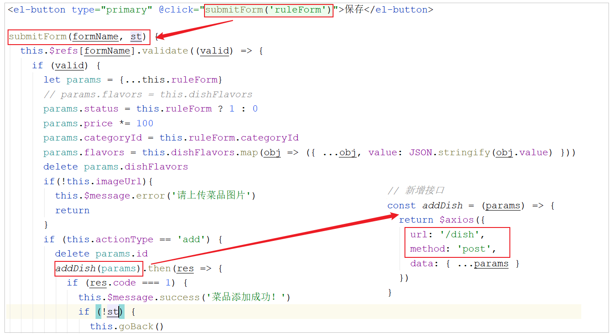
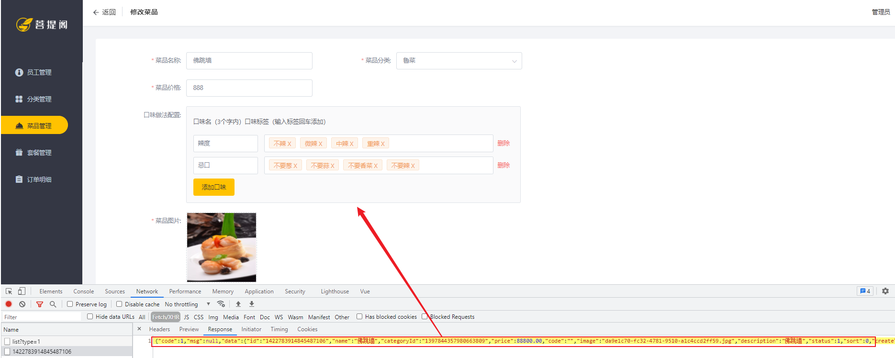

# 瑞吉外卖基础-Day04

## 1. 文件上传下载

### 1.1 上传介绍

#### 1.1.1 概述

文件上传，也称为upload，是指将本地图片、视频、音频等文件上传到服务器上，可以供其他用户浏览或下载的过程


文件上传时，对页面的form表单有如下要求：

| 表单属性 | 取值                | 说明                      |
| -------- | ------------------- | ------------------------- |
| method   | post                | 必须选择post方式提交      |
| enctype  | multipart/form-data | 采用multipart格式上传文件 |
| type     | file                | 使用input的file控件上传   |

#### 1.1.2 前端介绍

1. **简单html页面表单**

    ```html
    <form method="post" action="/common/upload" enctype="multipart/form-data">
        <input name="myFile" type="file"  />
        <input type="submit" value="提交" /> 
    </form>
    ```

2. **ElementUI中提供的upload上传组件**

    目前一些前端组件库也提供了相应的上传组件，但是底层原理还是基于form表单的文件上传

    

#### 1.1.3 服务端介绍

服务端要接收客户端页面上传的文件，通常都会使用Apache的两个组件：

- commons-fileupload
- commons-io

而Spring框架在spring-web包中对文件上传进行了封装，大大简化了服务端代码，只需要在Controller的方法中声明一个MultipartFile类型的参数即可接收上传的文件

```java
/**
 * 文件上传
 * @param file
 * @return
 */
@PostMapping("/upload")
public R<String> upload(MultipartFile file){
    System.out.println(file);
    return R.success(fileName);
}
```

### 1.2 下载介绍

文件下载，也称为download，是指将文件从服务器传输到本地计算机的过程  
通过浏览器进行文件下载，通常有两种表现形式

1. **以附件形式下载，弹出保存对话框，将文件保存到指定磁盘目录**

    

2. **直接在浏览器中打开**

    今天所需要实现的菜品展示，表现形式为在浏览器中直接打开

      

    通过浏览器进行文件下载，本质上就是服务端将文件以流的形式写回浏览器的过程

### 1.3 上传代码实现

#### 1.3.1 前端代码

作为服务端工程师，主要关注服务端代码实现  对于前端页面，可以使用ElementUI提供的上传组件  可以直接使用资料中提供的上传页面，位置：资料/文件上传下载页面/upload.html，将其拷贝到项目的目录(resources/backend/page/demo\)下，启动项目，访问上传页面

[http://localhost:8080/backend/page/demo/upload.html](http://localhost:8080/backend/page/demo/upload.html)


在上述的浏览器抓取的网络请求中，上传文件的调用url，在哪里配置的呢，需要去看一下前端上传组件


虽然上述是ElementUI封装的代码，但是实际上最终还通过file域上传文件，如果未指定上传文件的参数名，默认为file


#### 1.3.2 服务端实现

1. **application.yml**

    需要在application.yml中定义文件存储路径

    ```yml
    reggie:
    path: D:\img\
    ```

2. **CommonController**

编写文件上传的方法，通过MultipartFile类型的参数即可接收上传的文件，方法形参的名称需要与页面的file域的name属性一致  

所在包: com.itheima.reggie.controller

::: tip 上传逻辑

1. 获取文件的原始文件名，通过原始文件名获取文件后缀

2. 通过UUID重新声明文件名，文件名称重复造成文件覆盖

3. 创建文件存放目录

4. 将上传的临时文件转存到指定位置

:::

代码实现:

```java
import com.itheima.reggie.common.R;
import lombok.extern.slf4j.Slf4j;
import org.springframework.beans.factory.annotation.Value;
import org.springframework.web.bind.annotation.*;
import org.springframework.web.multipart.MultipartFile;
import java.io.File;
import java.util.UUID;

/**
 * 文件上传和下载
 */
@RestController
@RequestMapping("/common")
@Slf4j
public class CommonController {
    @Value("${reggie.path}")
    private String basePath;
    /**
     * 文件上传
     * @param file
     * @return
     */
    @PostMapping("/upload")
    public R<String> upload(MultipartFile file){
        //file是一个临时文件，需要转存到指定位置，否则本次请求完成后临时文件会删除
        log.info(file.toString());

        //原始文件名
        String originalFilename = file.getOriginalFilename();//abc.jpg
        String suffix = originalFilename.substring(originalFilename.lastIndexOf("."));

        //使用UUID重新生成文件名，防止文件名称重复造成文件覆盖
        String fileName = UUID.randomUUID().toString() + suffix;//dfsdfdfd.jpg

        //创建一个目录对象
        File dir = new File(basePath);
        //判断当前目录是否存在
        if(!dir.exists()){
            //目录不存在，需要创建
            dir.mkdirs();
        }

        try {
            //将临时文件转存到指定位置
            file.transferTo(new File(basePath + fileName));
        } catch (IOException e) {
            e.printStackTrace();
        }
        return R.success(fileName);
    }
}    
```

#### 1.3.3 测试

访问上传页面 [http://localhost:8080/backend/page/demo/upload.html](http://localhost:8080/backend/page/demo/upload.html)，然后点击上传图片，选择图片上传时，会发现图片并不能正常的上传，而且在浏览器中可以抓取到响应的数据，从图中可以判断出需要登录才可以操作


这样的话，就要求在测试时，每一次都需要先登录，登录完成后在进行图片上传的测试，为了简化的测试，可以在 LoginCheckFilter 的doFilter方法中，在不需要处理的请求路径的数组中再加入请求路径 /common/**


在测试文件上传时，可以通过debug的形式来跟踪上传的整个过程，验证一下临时文件是否存在，以及上传完成之后，临时文件是否会自动删除


### 1.4 下载代码实现

#### 1.4.1 前端代码

文件下载，前端页面可以使用\标签展示下载的图片

```html
</img>
```

通过\标签如何展示图片数据呢


在文件上传成功后，在 handleAvatarSuccess 方法中获取文件上传成功之后返回的数据(文件名)，然后调用 /common/download?name=xxx 进行文件的下载  
想让上传的照片能够在页面展示出来，需要在服务端将文件以流的形式写回浏览器

#### 1.4.2 服务端代码

在 CommonController 中定义方法download，并接收页面传递的参数name，然后读取图片文件的数据，然后以流的形式写回浏览器  

::: tip 具体逻辑

1. 定义输入流，通过输入流读取文件内容

2. 通过response对象，获取到输出流

3. 通过response对象设置响应数据格式(image/jpeg)

4. 通过输入流读取文件数据，然后通过上述的输出流写回浏览器

5. 关闭资源

:::

代码实现:

```java
/**
 * 文件下载
 * @param name
 * @param response
 */
@GetMapping("/download")
public void download(String name,HttpServletResponse response){
    try {
        //输入流，通过输入流读取文件内容
        FileInputStream fileInputStream = new FileInputStream(new File(basePath + name));

        //输出流，通过输出流将文件写回浏览器
        ServletOutputStream outputStream = response.getOutputStream();

        response.setContentType("image/jpeg");

        int len = 0;
        byte[] bytes = new byte[1024];
        while ((len = fileInputStream.read(bytes)) != -1){
            outputStream.write(bytes,0,len);
            outputStream.flush();
        }

        //关闭资源
        outputStream.close();
        fileInputStream.close();
    } catch (Exception e) {
        e.printStackTrace();
    }
}
```

#### 1.4.3 测试

访问页面 [http://localhost:8080/backend/page/demo/upload.html](http://localhost:8080/backend/page/demo/upload.html) ，点击上传图片 ，选择图片进行上传，上传完毕之后，查看图片是否可以展示出来  


通过F12查询页面发起的请求及响应的数据：


## 2. 菜品新增

### 2.1 需求分析

后台系统中可以管理菜品信息，通过新增功能来添加一个新的菜品，在添加菜品时需要选择当前菜品所属的菜品分类，并且需要上传菜品图片，在移动端会按照菜品分类来展示对应的菜品信息


### 2.2 数据模型


新增菜品，其实就是将新增页面录入的菜品信息插入到dish表，如果添加了口味做法，还需要向dish_flavor表插入数据。所以在新增菜品时，涉及到两个表：

| 表结构      | 说明       |
| ----------- | ---------- |
| dish        | 菜品表     |
| dish_flavor | 菜品口味表 |

1. **菜品表:dish**

    

2. **菜品口味表:dish_flavor**

    

### 2.3 准备工作

在开发业务功能前，先将需要用到的类和接口基本结构创建好

1.**实体类 DishFlavor**

所属包: com.itheima.reggie.entity

```java
import com.baomidou.mybatisplus.annotation.FieldFill;
import com.baomidou.mybatisplus.annotation.TableField;
import lombok.Data;
import java.io.Serializable;
import java.time.LocalDateTime;
/**
菜品口味
 */
@Data
public class DishFlavor implements Serializable {

    private static final long serialVersionUID = 1L;

    private Long id;
    //菜品id
    private Long dishId;

    //口味名称
    private String name;

    //口味数据list
    private String value;

    @TableField(fill = FieldFill.INSERT)
    private LocalDateTime createTime;

    @TableField(fill = FieldFill.INSERT_UPDATE)
    private LocalDateTime updateTime;

    @TableField(fill = FieldFill.INSERT)
    private Long createUser;

    @TableField(fill = FieldFill.INSERT_UPDATE)
    private Long updateUser;

    //是否删除
    private Integer isDeleted;
}
```

2.**Mapper接口DishFlavorMapper**

所属包: com.itheima.reggie.mapper

```java
import com.baomidou.mybatisplus.core.mapper.BaseMapper;
import com.itheima.reggie.entity.DishFlavor;
import org.apache.ibatis.annotations.Mapper;

@Mapper
public interface DishFlavorMapper extends BaseMapper<DishFlavor> {
}
```

3.**业务层接口 DishFlavorService**

所属包: com.itheima.reggie.service

```java
import com.baomidou.mybatisplus.extension.service.IService;
import com.itheima.reggie.entity.DishFlavor;

public interface DishFlavorService extends IService<DishFlavor> {
}
```

4.**业务层实现类 DishFlavorServiceImpl**

所属包: com.itheima.reggie.service.impl

```java
import com.baomidou.mybatisplus.extension.service.impl.ServiceImpl;
import com.itheima.reggie.entity.DishFlavor;
import com.itheima.reggie.mapper.DishFlavorMapper;
import com.itheima.reggie.service.DishFlavorService;
import org.springframework.stereotype.Service;

@Service
public class DishFlavorServiceImpl extends ServiceImpl<DishFlavorMapper,DishFlavor> implements DishFlavorService {
}
```

5.**控制层 DishController**

菜品及菜品口味的相关操作，统一使用这一个controller即可  

所属包： com.itheima.reggie.controller

```java
import com.itheima.reggie.service.DishFlavorService;
import com.itheima.reggie.service.DishService;
import lombok.extern.slf4j.Slf4j;
import org.springframework.beans.factory.annotation.Autowired;
import org.springframework.web.bind.annotation.*;
/**
 * 菜品管理
 */
@RestController
@RequestMapping("/dish")
@Slf4j
public class DishController {
    @Autowired
    private DishService dishService;

    @Autowired
    private DishFlavorService dishFlavorService;
}    
```

### 2.4 前端页面分析

接下来实现新增菜品功能，在开发代码之前，需要梳理一下新增菜品时前端页面和服务端的交互过程  

1.点击新建菜品按钮，访问页面(backend/page/food/add.html)，页面加载时发送ajax请求，请求服务端获取菜品分类数据并展示到下拉框中


2.页面发送请求进行图片上传，请求服务端将图片保存到服务器(上传功能已实现)

3.页面发送请求进行图片下载，将上传的图片进行回显(下载功能已实现)


4.点击保存按钮，发送ajax请求，将菜品相关数据以json形式提交到服务端

页面代码:



浏览器抓取请求:


开发新增菜品功能，其实就是在服务端编写代码去处理前端页面发送的这4次请求(上传、下载已实现)即可  
经过上述的分析，还需要在服务端实现两块功能

A. 菜品分类数据列表查询

| 请求     | 说明           |
| -------- | -------------- |
| 请求方式 | GET            |
| 请求路径 | /category/list |
| 请求参数 | ?type=1        |

B. 保存菜品信息

| 请求     | 说明     |
| -------- | -------- |
| 请求方式 | POST     |
| 请求路径 | /dish    |
| 请求参数 | json格式 |

### 2.5 代码实现

#### 2.5.1 菜品分类查询

在CategoryController中增加方法实现菜品分类查询，根据分类进行查询，并对查询的结果按照sort排序字段进行升序排序，如果sort相同，再按照修改时间倒序排序  

```java
/**
* 根据条件查询分类数据
* @param category
* @return
*/
@GetMapping("/list")
public R<List<Category>> list(Category category){
    //条件构造器
    LambdaQueryWrapper<Category> queryWrapper = new LambdaQueryWrapper<>();
    //添加条件
    queryWrapper.eq(category.getType() != null,Category::getType,category.getType());
    //添加排序条件
    queryWrapper.orderByAsc(Category::getSort).orderByDesc(Category::getUpdateTime);

    List<Category> list = categoryService.list(queryWrapper);
    return R.success(list);
}
```

代码编写完毕之后，可以打开新增菜品页面，查看响应的数据，及页面下拉列表的渲染情况：


#### 2.5.3 保存菜品信息

在上述的分析中，可以看到在保存菜品时，页面传递过来的是json格式数据

```json
{
    "name":"佛跳墙",
    "price":88800,
    "code":"",
    "image":"da9e1c70-fc32-4781-9510-a1c4ccd2ff59.jpg",
    "description":"佛跳墙",
    "status":1,
    "categoryId":"1397844357980663809",
    "flavors":[
        {
            "name":"辣度",
            "value":"[\"不辣\",\"微辣\",\"中辣\",\"重辣\"]",
            "showOption":false
        },
        {
            "name":"忌口",
            "value":"[\"不要葱\",\"不要蒜\",\"不要香菜\",\"不要辣\"]",
            "showOption":false
        }
    ]
}
```

在服务端应该如何来封装前端传递的数据呢，如果使用菜品类Dish来封装，只能封装菜品的基本属性，flavors属性是无法封装的

这个时候，需要自定义一个实体类，然后继承自Dish，并对Dish的属性进行拓展，增加 flavors 集合属性(内部封装DishFlavor)

1.**导入 DishDto 实体类**

封装页面传递的请求参数  

所属包: com.itheima.reggie.dto

```java
import com.itheima.reggie.entity.Dish;
import com.itheima.reggie.entity.DishFlavor;
import lombok.Data;
import java.util.ArrayList;
import java.util.List;

@Data
public class DishDto extends Dish {
    private List<DishFlavor> flavors = new ArrayList<>();

    private String categoryName;

    private Integer copies;
}
```

> 拓展：在做项目时，经常会涉及到各种类型的实体模型  基本包含以下几种

| 实体模型 | 描述                                                         |
| -------- | ------------------------------------------------------------ |
| DTO      | Data Transfer Object(数据传输对象)，一般用于展示层与服务层之间的数据传输   |
| Entity   | 最常用实体类，基本和数据表一一对应，一个实体类对应一张表     |
| VO       | Value Object(值对象)，主要用于封装前端页面展示的数据对象，用一个VO对象来封装整个页面展示所需要的对象数据 |
| PO       | Persistant Object(持久层对象)，是ORM(Objevt Relational Mapping)框架中Entity，PO属性和数据库中表的字段形成一一对应关系 |

2.**DishController定义方法新增菜品**

在该Controller的方法中，不仅需要保存菜品的基本信息，还需要保存菜品的口味信息，需要操作两张表，所以需要在DishService接口中定义接口方法，在这个方法中需要保存上述的两部分数据  

```java
/**
 * 新增菜品
 * @param dishDto
 * @return
 */
@PostMapping
public R<String> save(@RequestBody DishDto dishDto){
    log.info(dishDto.toString());

    dishService.saveWithFlavor(dishDto);

    return R.success("新增菜品成功");
}
```

3.**DishService中增加方法saveWithFlavor**

```java
//新增菜品，同时插入菜品对应的口味数据，需要操作两张表：dish、dish_flavor
public void saveWithFlavor(DishDto dishDto);
```

4.**DishServiceImpl中实现方法saveWithFlavor**

页面传递的菜品口味信息，仅仅包含name 和 value属性，缺少一个非常重要的属性dishId， 所以在保存完菜品的基本信息后，需要获取到菜品ID，然后为菜品口味对象属性dishId赋值  

::: tip 具体逻辑

1. 保存菜品基本信息

1. 获取保存的菜品ID

1. 获取菜品口味列表，遍历列表，为菜品口味对象属性dishId赋值

1. 批量保存菜品口味列表

:::

代码实现:

```java
@Autowired
private DishFlavorService dishFlavorService;
/**
* 新增菜品，同时保存对应的口味数据
* @param dishDto
*/
@Transactional
public void saveWithFlavor(DishDto dishDto) {
    //保存菜品的基本信息到菜品表dish
    this.save(dishDto);

    Long dishId = dishDto.getId();//菜品id
    //菜品口味
    List<DishFlavor> flavors = dishDto.getFlavors();
    flavors = flavors.stream().map((item) -> {
        item.setDishId(dishId);
        return item;
    }).collect(Collectors.toList());

    //保存菜品口味数据到菜品口味表dish_flavor
    dishFlavorService.saveBatch(flavors);
}
```

> 说明:
>
> ​由于在 saveWithFlavor 方法中，进行了两次数据库的保存操作，操作了两张表，那么为了保证数据的一致性，需要在方法上加上注解 @Transactional来控制事务  

5.**在引导类上加注解 @EnableTransactionManagement**

Service层方法上加的注解@Transactional要想生效，需要在引导类上加上注解 @EnableTransactionManagement， 开启对事务的支持  

```java
@Slf4j
@SpringBootApplication
@ServletComponentScan
@EnableTransactionManagement //开启对事物管理的支持
public class ReggieApplication {
    public static void main(String[] args) {
        SpringApplication.run(ReggieApplication.class,args);
        log.info("项目启动成功...");
    }
}
```

### 2.6 功能测试

进行菜品的新增测试，在测试时，可以通过debug断点跟踪的形式，查看传输的数据，及数据的封装  


debug跟踪数据的封装情况:


测试完毕后，可以检查一下数据库中的数据保存情况


## 3. 菜品分页查询

### 3.1 需求分析


在菜品列表展示时，除了菜品的基本信息(名称、售价、售卖状态、更新时间)外，还有两个字段略微特殊  

第一个是图片字段 ，从数据库查询出来的仅仅是图片的名字，图片要想在表格中回显展示出来，就需要下载这个图片  
第二个是菜品分类，这里展示的是分类名称，而不是分类ID，此时就需要根据菜品的分类ID，去分类表中查询分类信息，然后在页面展示  

### 3.2 前端页面分析

在开发代码之前，需要梳理一下菜品分页查询时前端页面和服务端的交互过程

1. 访问页面(backend/page/food/list.html)时，发送ajax请求，将分页查询参数(page、pageSize、name)提交到服务端，获取分页数据
2. 页面发送请求，请求服务端进行图片下载，用于页面图片展示


开发菜品信息分页查询功能，其实就是在服务端编写代码去处理前端页面发送的这2次请求即可，而前端发起的请求中，图片文件下载回显的代码，已经实现了  
所以，只需要开发分页查询的功能即可

| 请求     | 说明                         |
| -------- | ---------------------------- |
| 请求方式 | GET                          |
| 请求路径 | /dish/page                   |
| 请求参数 | ?page=1&pageSize=10&name=xxx |

### 3.3 代码实现

#### 3.3.1 分析

在 DishController 中开发方法，来完成菜品的条件分页查询，在分页查询时还需要给页面返回分类的名称，而分类的名称前端在接收的时候是通过 categoryName 属性获取的，那么对应的服务端也应该封装到 categoryName 属性中  

```html
<el-table-column prop="categoryName" label="菜品分类"></el-table-column>
```

而在的实体类 Dish 中，仅仅包含 categoryId， 不包含 categoryName，那么应该如何封装查询的数据呢？ 其实，这里可以返回DishDto对象，在该对象中可以拓展一个属性 categoryName，来封装菜品分类名称  

```java
@Data
public class DishDto extends Dish {
    private List<DishFlavor> flavors = new ArrayList<>();
    private String categoryName; //菜品分类名称
    private Integer copies;
}
```

具体逻辑为：

1. 构造分页条件对象

2. 构建查询及排序条件

3. 执行分页条件查询

4. 遍历分页查询列表数据，根据分类ID查询分类信息，从而获取该菜品的分类名称

5. 封装数据并返回

#### 3.3.2 实现

分析了具体的实现思路之后，接下来就来完成具体的代码实现  

```java
/**
 * 菜品信息分页查询
 * @param page
 * @param pageSize
 * @param name
 * @return
 */
@GetMapping("/page")
public R<Page> page(int page,int pageSize,String name){
    //构造分页构造器对象
    Page<Dish> pageInfo = new Page<>(page,pageSize);
    Page<DishDto> dishDtoPage = new Page<>();

    //条件构造器
    LambdaQueryWrapper<Dish> queryWrapper = new LambdaQueryWrapper<>();
    //添加过滤条件
    queryWrapper.like(name != null,Dish::getName,name);
    //添加排序条件
    queryWrapper.orderByDesc(Dish::getUpdateTime);

    //执行分页查询
    dishService.page(pageInfo,queryWrapper);

    //对象拷贝
    BeanUtils.copyProperties(pageInfo,dishDtoPage,"records");
    List<Dish> records = pageInfo.getRecords();
    List<DishDto> list = records.stream().map((item) -> {
        
        DishDto dishDto = new DishDto();
        BeanUtils.copyProperties(item,dishDto);
        Long categoryId = item.getCategoryId();//分类id
        //根据id查询分类对象
        Category category = categoryService.getById(categoryId);
        
        if(category != null){
            String categoryName = category.getName();
            dishDto.setCategoryName(categoryName);
        }
        return dishDto;
    }).collect(Collectors.toList());
    dishDtoPage.setRecords(list);
    
    return R.success(dishDtoPage);
}
```

> 数据库查询菜品信息时，获取到的分页查询结果 Page 的泛型为 Dish，而最终需要给前端页面返回的类型为 DishDto，所以这个时候就要进行转换，基本属性可以直接通过属性拷贝的形式对Page中的属性进行复制，而对于结果列表 records属性，是需要进行特殊处理的(需要封装菜品分类名称);

### 3.4 功能测试

代码编写完毕之后，重新启动服务，访问项目，可以通过debug端点的形式跟踪，整个分页查询过程中，数据的转换和封装  

在测试的过程中，发现有一些菜品图片并没有展示出来，如下：


这是因为在导入sql脚本时，导入了一部分菜品的数据，而菜品的图片在的磁盘目录中并不存在，所以才会出现图片展示不出来的情况，而后续自己添加的菜品信息是没有问题的  

## 4. 菜品修改

### 4.1 需求分析

在菜品管理列表页面点击修改按钮，跳转到修改菜品页面，在修改页面回显菜品相关信息并进行修改，最后点击确定按钮完成修改操作  


### 4.2 前端页面分析

在开发代码之前，需要梳理一下修改菜品时前端页面（add.html）和服务端的交互过程：

1. 点击菜品列表的中的修改按钮，携带菜品id跳转至add.html

    

2. 进入add.html，页面发送ajax请求，请求服务端获取分类数据，用于菜品分类下拉框中数据展示(**已实现**)

3. add.html获取id，发送ajax请求，请求服务端，根据id查询当前菜品信息，用于菜品信息回显

    

4. 页面发送请求，请求服务端进行图片下载，用于页图片回显(**已实现**)

    

5. 点击保存按钮，页面发送ajax请求，将修改后的菜品相关数据以json形式提交到服务端


经过上述的分析，发现，菜品分类下拉框的展示、图片的下载回显功能都已经实现了  只需要在这里实现两个功能即可，分别是：

1.**根据ID查询菜品及菜品口味信息**

具体请求信息如下：

| 请求     | 说明       |
| -------- | ---------- |
| 请求方式 | GET        |
| 请求路径 | /dish/{id} |

2.**修改菜品及菜品口味信息**

具体请求信息如下：

| 请求     | 说明         |
| -------- | ------------ |
| 请求方式 | PUT          |
| 请求路径 | /dish        |
| 请求参数 | json格式数据 |

具体的json格式数据，可以通过浏览器抓取：

```json
{
    "id":"1422783914845487106",
    "name":"佛跳墙",
    "categoryId":"1397844357980663809",
    "price":88800,
    "code":"",
    "image":"da9e1c70-fc32-4781-9510-a1c4ccd2ff59.jpg",
    "description":"佛跳墙",
    "status":1,
    "sort":0,
    "createTime":"2021-08-04 12:58:14",
    "createUser":"1412578435737350122",
    "updateUser":"1412578435737350122",
    "flavors":[
        {
            "id":"1422783914883235842",
            "dishId":"1422783914845487106",
            "name":"辣度",
            "value":"[\"不辣\",\"微辣\",\"中辣\",\"重辣\"]",
            "createTime":"2021-08-04 12:58:14",
            "updateTime":"2021-08-04 12:58:14",
            "createUser":"1412578435737350122",
            "updateUser":"1412578435737350122",
            "isDeleted":0,
            "showOption":false
        },
        {
            "id":"1422783914895818754",
            "dishId":"1422783914845487106",
            "name":"忌口",
            "value":"[\"不要葱\",\"不要蒜\",\"不要香菜\",\"不要辣\"]",
            "createTime":"2021-08-04 12:58:14",
            "updateTime":"2021-08-04 12:58:14",
            "createUser":"1412578435737350122",
            "updateUser":"1412578435737350122",
            "isDeleted":0,
            "showOption":false
        }
    ]
}
```

### 4.3 功能实现

#### 4.3.1 根据ID查询菜品信息

##### 4.3.1.1 代码实现

页面发送ajax请求，请求服务端，根据id查询当前菜品信息和对应的口味信息，用于修改页面中菜品信息回显  

1.在DishService接口中扩展getByIdWithFlavor方法

```java
//根据id查询菜品信息和对应的口味信息
public DishDto getByIdWithFlavor(Long id);
```

2.在DishService实现类中实现此方法

具体逻辑为:

A. 根据ID查询菜品的基本信息

B. 根据菜品的ID查询菜品口味列表数据

C. 组装数据并返回

代码实现:

```java
/**
* 根据id查询菜品信息和对应的口味信息
* @param id
* @return
*/
public DishDto getByIdWithFlavor(Long id) {
    //查询菜品基本信息，从dish表查询
    Dish dish = this.getById(id);

    DishDto dishDto = new DishDto();
    BeanUtils.copyProperties(dish,dishDto);

    //查询当前菜品对应的口味信息，从dish_flavor表查询
    LambdaQueryWrapper<DishFlavor> queryWrapper = new LambdaQueryWrapper<>();
    queryWrapper.eq(DishFlavor::getDishId,dish.getId());
    List<DishFlavor> flavors = dishFlavorService.list(queryWrapper);
    dishDto.setFlavors(flavors);

    return dishDto;
}
```

3.在DishController中创建get方法

```java
/**
* 根据id查询菜品信息和对应的口味信息
* @param id
* @return
*/
@GetMapping("/{id}")
public R<DishDto> get(@PathVariable Long id){
    DishDto dishDto = dishService.getByIdWithFlavor(id);
    return R.success(dishDto);
}

```

> @PathVariable : 该注解可以用来提取url路径中传递的请求参数  

##### 4.3.1.2 功能测试

编写完代码后，重启服务进行测试，点击列表的修改按钮，查询数据回显情况  



#### 4.3.2 修改菜品信息

##### 4.3.2.1 代码实现

点击保存按钮，页面发送ajax请求，将修改后的菜品相关数据以json形式提交到服务端  在修改菜品信息时需要注意，除了要更新dish菜品表，还需要更新dish_flavor菜品口味表  

1.在DishService接口中扩展方法updateWithFlavor

```java
//更新菜品信息，同时更新对应的口味信息
public void updateWithFlavor(DishDto dishDto);
```

2.在DishServiceImpl中实现方法updateWithFlavor

在该方法中，既需要更新dish菜品基本信息表，还需要更新dish_flavor菜品口味表  而页面再操作时，关于菜品的口味，有修改，有新增，也有可能删除，应该如何更新菜品口味信息呢，其实，无论菜品口味信息如何变化，只需要保持一个原则： 先删除，后添加  

```java
@Override
@Transactional
public void updateWithFlavor(DishDto dishDto) {
    //更新dish表基本信息
    this.updateById(dishDto);

    //清理当前菜品对应口味数据---dish_flavor表的delete操作
    LambdaQueryWrapper<DishFlavor> queryWrapper = new LambdaQueryWrapper();
    queryWrapper.eq(DishFlavor::getDishId,dishDto.getId());

    dishFlavorService.remove(queryWrapper);

    //添加当前提交过来的口味数据---dish_flavor表的insert操作
    List<DishFlavor> flavors = dishDto.getFlavors();

    flavors = flavors.stream().map((item) -> {
        item.setDishId(dishDto.getId());
        return item;
    }).collect(Collectors.toList());

    dishFlavorService.saveBatch(flavors);
}
```

3.在DishController中创建update方法

```java
/**
* 修改菜品
* @param dishDto
* @return
*/
@PutMapping
public R<String> update(@RequestBody DishDto dishDto){
    log.info(dishDto.toString());
    dishService.updateWithFlavor(dishDto);
    return R.success("修改菜品成功");
}
```

##### 4.3.2.2 功能测试

代码编写完成之后，重启服务，然后按照前面分析的操作流程进行测试，查看数据是否正常修改即可  
